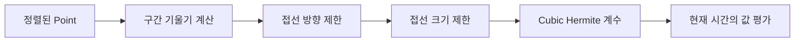

Automation은 시간에 따라 Volume이나 Pan 같은 Parameter 값을 바꾸는 기능이다. 화면에는 점과 선으로 보이지만 엔진에서는 세 문제가 동시에 발생한다.

1. 현재 재생 시간의 값을 빠르게 찾아야 한다.
2. 서로 다른 보간 방식으로 Point 사이 값을 계산해야 한다.
3. 사용자가 재생 중 Parameter를 움직일 때 기존 곡선과 새 입력의 우선순위를 정해야 한다.

처음에는 `time`과 `value` 배열만 있으면 충분해 보였다. 하지만 Point 편집, TOUCH와 LATCH 같은 Write mode, 촘촘하게 기록된 Point 정리까지 추가하자 단순 배열은 상태 모델이 됐다.

이 글에서 **Automation Point**는 특정 시간의 Parameter 값, **Write Pass**는 재생 중 사용자 입력을 곡선에 기록하는 구간을 뜻한다.

## [sort1] 1. 왜 Point를 항상 시간순으로 유지했는가

재생 중에는 현재 시간의 왼쪽 Point와 오른쪽 Point를 찾아야 한다. Point가 정렬돼 있지 않으면 매 조회마다 전체 목록을 정렬하거나 모두 검사해야 한다.

그래서 추가와 시간 변경 시점에 정렬 비용을 지불했다.

```ts
interface AutomationPoint {
  id: string;
  time: number;
  value: number;
  interpolation: InterpolationType;
}

function insertSorted(points: AutomationPoint[], point: AutomationPoint): void {
  const index = points.findIndex(candidate => candidate.time > point.time);

  if (index === -1) {
    points.push(point);
    return;
  }

  points.splice(index, 0, point);
}
```

이 선택은 편집보다 조회가 더 자주 실행된다는 전제에 맞는다. 재생 중 `getValueAt()`은 반복되지만 Point 추가·이동은 사용자 편집 시점에만 발생한다.

Point의 시간이 바뀌면 배열에서 제거한 뒤 새 위치에 다시 삽입한다. 값만 바뀌면 정렬 순서가 달라지지 않으므로 제자리에서 갱신한다.

## [sort1] 2. 보간 방식은 시작 Point의 정책으로 두었다

두 Point 사이 값은 시작 Point의 `interpolation`이 결정한다.

| 방식        | 계산 의미                                           |
| ----------- | --------------------------------------------------- |
| Hold        | 다음 Point 전까지 이전 값을 유지한다.               |
| Linear      | 시간 비율에 따라 일정하게 변한다.                   |
| Exponential | 양수 구간에서는 비율을 기하급수적으로 변화시킨다.   |
| Logarithmic | 초반 변화가 크고 후반 변화가 작다.                  |
| Curved      | 주변 Point까지 고려한 제한된 cubic 곡선을 사용한다. |

기본 보간은 두 Point만 있으면 계산할 수 있다.

```ts
function interpolateLinear(start: AutomationPoint, end: AutomationPoint, time: number): number {
  const ratio = (time - start.time) / (end.time - start.time);
  return start.value + ratio * (end.value - start.value);
}
```

Exponential 보간은 값이 0이거나 부호가 다를 때 단순한 기하 보간을 사용할 수 없다. 현재 구현은 두 값이 모두 충분히 큰 양수일 때만 기하 보간을 사용하고, 나머지는 완만하게 시작하는 2차 곡선으로 대체한다.

이 fallback은 수학적 오류를 피하지만 Parameter의 의미에 따라 적절하지 않을 수 있다. Gain, Frequency, Bipolar Pan은 같은 보간 정책을 공유하기 어렵다. 장기적으로는 Parameter descriptor가 허용 범위와 보간 정책을 함께 제공하는 편이 더 정확하다.

## [sort1] 3. 자연스러운 곡선보다 값의 범위를 지키는 곡선이 중요했다

일반 cubic spline은 Point를 부드럽게 통과하지만, Point 사이에서 최솟값보다 작거나 최댓값보다 큰 overshoot가 생길 수 있다. Volume이 의도보다 커지거나 0~1 범위의 Parameter가 범위를 벗어나면 단순한 시각 문제가 아니다.

Cubic Hermite의 보간식, 연속성 조건과 접선 제한 원리는 [Cubic Hermite Spline이란? 값과 접선으로 만드는 3차 보간](/posts/cubic-hermite-spline-interpolation)에서 먼저 설명한다.

Curved 보간은 인접 구간의 기울기를 계산한 뒤 부호와 크기를 제한한다.

```text
1. 구간 기울기 delta 계산
2. 인접 기울기의 부호가 다르면 접선 기울기를 0으로 제한
3. 같은 방향이면 harmonic mean으로 접선 계산
4. 접선 비율이 제한 범위를 벗어나면 다시 축소
5. cubic Hermite 계수로 변환
```



핵심은 “가장 부드러운 곡선”보다 “Point가 표현한 증가·감소 방향을 뒤집지 않는 곡선”을 선택한 것이다.

## [sort1] 4. 순차 조회에는 Segment Cache를 사용했다

Point가 정렬돼 있으므로 현재 시간이 속한 구간은 이진 탐색으로 찾을 수 있다. 하지만 재생 시간은 대부분 앞으로 조금씩 이동한다. 같은 두 Point 사이를 여러 번 조회할 가능성이 높다.

현재 구간의 왼쪽·오른쪽 index를 cache하면 같은 구간에서는 이진 탐색도 생략할 수 있다.

```ts
interface LookupCache {
  left: number;
  leftIndex: number;
  rightIndex: number;
}

function isCacheHit(cache: LookupCache, points: AutomationPoint[], time: number): boolean {
  return time >= cache.left && time < points[cache.rightIndex].time;
}
```

Point를 추가·이동·삭제하면 index와 구간이 달라진다. 이때 lookup cache와 spline coefficient를 함께 무효화해야 한다.

> “Cache의 정확성은 빠른 조회보다 무효화 조건을 먼저 정의하는 데서 시작한다.”

현재 구현은 Point 변경 메서드에서 cache를 무효화한다. 다만 외부에 반환한 Point 객체가 직접 변경되면 이 경로를 우회할 수 있다. `ReadonlyArray`는 배열 조작을 막지만 내부 객체의 변경까지 막는 deep readonly는 아니다. Point를 불변 객체로 반환하거나 모든 변경을 method로 제한하는 방식이 더 안전하다.

## [sort1] 5. Write Mode는 입력 우선순위 정책이었다

Automation Mode는 단순한 enum이 아니라 “현재 값을 어디에서 가져올 것인가”를 결정한다.

| Mode  | 곡선 재생                   | 사용자 입력 기록              |
| ----- | --------------------------- | ----------------------------- |
| READ  | 항상 사용                   | 기록하지 않음                 |
| WRITE | 사용하지 않음               | 항상 기록                     |
| TOUCH | 손을 떼면 곡선으로 복귀     | 만지는 동안 기록              |
| LATCH | 손을 뗀 뒤 마지막 값을 유지 | 일반적으로 재생 종료까지 기록 |
| OFF   | 사용하지 않음               | 기록하지 않음                 |

현재 코드는 TOUCH와 LATCH 모두 `touching`이 `true`일 때만 Write를 활성화하고, `stopTouch()`에서 Write Pass를 종료한다. 따라서 표의 일반적인 LATCH 의미와 현재 구현은 일치하지 않는다.

정확한 LATCH에는 별도 상태가 필요하다.

```ts
type WriteState =
  { type: 'idle' } | { type: 'touching'; startedAt: number } | { type: 'latched'; startedAt: number; value: number };
```

손을 뗐다는 입력과 재생이 끝났다는 입력을 구분해야 `latched` 상태를 유지할 수 있다. 이 차이를 enum 이름만으로 해결할 수는 없다.

## [sort1] 6. Guard Point와 Point Thinning을 함께 고려했다

재생 중 knob를 움직이면 짧은 시간에도 많은 Point가 생긴다. 모두 보존하면 조회와 편집 비용이 커지고, 화면에는 거의 같은 곡선이 촘촘한 점으로 표현된다.

Point Thinning은 인접한 세 Point가 만드는 삼각형 면적을 계산한다. 중간 Point의 면적이 threshold보다 작으면 곡선에 기여하는 정도가 작다고 보고 제거한다. 첫 Point와 마지막 Point는 항상 보존한다.

```ts
function triangleArea(a: AutomationPoint, b: AutomationPoint, c: AutomationPoint): number {
  return Math.abs((a.time * (b.value - c.value) + b.time * (c.value - a.value) + c.time * (a.value - b.value)) / 2);
}
```

하지만 Write 구간 안의 Point만 정리하면 구간 밖 곡선까지 달라질 수 있다. 그래서 Write 경계 직전·직후의 기존 값을 Guard Point로 추가해 바깥 구간의 형태를 보존한다.

이 구조에도 tradeoff가 있다. 시간과 값의 단위 비율이 달라지면 같은 면적 threshold의 의미도 바뀐다. 0~~1 Volume과 20~~20,000Hz Frequency에 같은 threshold를 쓰면 thinning 강도가 달라진다. Parameter 범위를 정규화한 뒤 면적을 계산하는 방식이 필요하다.

## [sort1] 7. 현재 검증 범위와 필요한 테스트

Automation List는 Processor와 AudioEngine의 parameter binding 경로에 연결돼 있다. 그러나 자동 테스트는 없다. 다음 동작을 검증하기 전에는 완전한 Automation 동작을 주장할 수 없다.

- Point 추가·이동 후 시간순 정렬 유지
- Hold·Linear·Exponential·Logarithmic 경계값
- Curved 구간에서 두 Point의 값 범위를 벗어나지 않는지
- Point 변경 후 lookup cache와 spline cache가 무효화되는지
- TOUCH가 손을 뗀 뒤 기존 곡선으로 돌아오는지
- LATCH가 재생 종료까지 마지막 값을 유지하는지
- thinning 전후 최대 오차가 허용 범위 안인지

특히 곡선 테스트는 “모양이 자연스럽다”가 아니라 불변 조건으로 작성해야 한다.

```ts
expect(value).toBeGreaterThanOrEqual(Math.min(start.value, end.value));
expect(value).toBeLessThanOrEqual(Math.max(start.value, end.value));
```

## [sort1] 8. Automation은 수학과 상태 머신의 경계였다

Automation 구현에서 보간 공식만 보면 절반만 보는 셈이다. 실제 동작은 Point 편집, cache 무효화, transport 시간, 사용자 touch 상태가 함께 결정한다.

현재 구조는 정렬된 Point, 제한된 곡선, Write Pass, thinning의 기반을 갖췄다. 하지만 LATCH 의미와 Parameter별 정규화 정책은 아직 닫히지 않았다.

> “시간에 따른 값을 계산하는 문제와, 누가 그 값을 소유하는지 결정하는 문제는 분리해서 설계해야 한다.”

다음 단계는 TOUCH와 LATCH를 명시적 상태로 분리하고, 곡선 범위와 cache 무효화를 자동 테스트로 고정하는 것이다.

## 참고

**내부 글·표준 자료**

- [Cubic Hermite Spline이란? 값과 접선으로 만드는 3차 보간](/posts/cubic-hermite-spline-interpolation)
- [Web Audio API 1.1, AudioParam automation](https://www.w3.org/TR/webaudio-1.1/)
- [F. N. Fritsch and R. E. Carlson, Monotone Piecewise Cubic Interpolation](https://doi.org/10.1137/0717021)

**한국어 블로그**

- [믹싱 오토메이션 완전 가이드](https://studionol.co.kr/ko/stories/mix-automation1)

**해외 블로그**

- [Creative Mix Automation In Your DAW](https://www.soundonsound.com/techniques/creative-mix-automation-your-daw)
