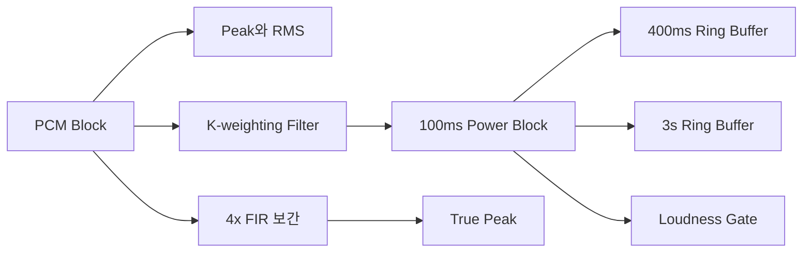

오디오 Meter를 처음 만들 때는 각 block에서 절댓값이 가장 큰 sample을 찾으면 된다고 생각하기 쉽다. 하지만 sample peak가 같아도 사람이 느끼는 loudness는 다를 수 있고, 저장된 sample 사이를 복원하는 과정에서 더 큰 inter-sample peak가 생길 수도 있다.

그래서 하나의 숫자를 계산하는 함수가 아니라, 이전 block의 상태를 유지하는 Meter DSP가 필요했다. 여기서 DSP는 Digital Signal Processing, 즉 PCM sample을 수치적으로 처리하는 로직을 뜻한다.

이번 구현은 Sample Peak, RMS, IEC 계열 응답, VU, K-metering, LUFS 계열 값, True Peak를 하나의 class에서 계산한다. 다만 현재 주 오디오 실행 경로에는 연결되지 않았고 표준 적합성 테스트도 없다. 이 글은 “완성된 표준 Meter”가 아니라 구현 구조와 검증 과정에서 확인한 한계를 다룬다.

## [sort1] 1. 왜 Meter마다 상태가 달라야 했는가

Sample Peak는 현재 block만 보면 계산할 수 있다.

```ts
function measureSamplePeak(samples: Float32Array): number {
  let peak = 0;

  for (const sample of samples) {
    peak = Math.max(peak, Math.abs(sample));
  }

  return peak === 0 ? -Infinity : 20 * Math.log10(peak);
}
```

하지만 다음 Meter는 과거 입력이 필요하다.

| Meter               | 필요한 상태                        |
| ------------------- | ---------------------------------- |
| Peak Hold           | 이전 최고값과 유지 시간            |
| VU                  | 약 300ms 동안 누적된 에너지        |
| Momentary Loudness  | 최근 400ms의 가중 power            |
| Short-term Loudness | 최근 3초의 가중 power              |
| Integrated Loudness | 측정 시작 이후 gate를 통과한 block |
| True Peak           | FIR filter 길이만큼의 이전 sample  |

따라서 `process(block)`이 값을 바로 반환하는 대신 내부 상태를 갱신하고, UI는 별도의 `getReading()`으로 값을 읽는 구조를 선택했다.



## [sort1] 2. K-weighting을 두 단계 Biquad로 처리했다

Loudness 계산에서는 모든 주파수를 같은 비중으로 더하지 않는다. 구현은 high-shelf와 high-pass 두 단계 Biquad filter로 K-weighting을 구성한다.

Biquad는 현재 입력뿐 아니라 이전 입력과 출력도 사용한다.

```ts
interface BiquadState {
  x1: number;
  x2: number;
  y1: number;
  y2: number;
}

function processBiquad(coefficients: BiquadCoefficients, state: BiquadState, input: number): number {
  const output =
    coefficients.b0 * input +
    coefficients.b1 * state.x1 +
    coefficients.b2 * state.x2 -
    coefficients.a1 * state.y1 -
    coefficients.a2 * state.y2;

  state.x2 = state.x1;
  state.x1 = input;
  state.y2 = state.y1;
  state.y1 = output;

  return output;
}
```

채널마다 filter 상태를 따로 보관해야 한다. 왼쪽 채널의 이전 출력이 오른쪽 채널 계산에 섞이면 채널 간 간섭이 생기기 때문이다. Sample rate가 바뀌면 filter coefficient도 다시 계산해야 한다.

## [sort1] 3. 100ms Block을 공통 단위로 사용했다

Momentary 400ms와 Short-term 3초를 매 sample마다 전체 합산하면 같은 값을 반복해서 더하게 된다. 구현은 K-weighting 이후 power를 100ms 단위로 모은다.

- 400ms window: 100ms block 4개
- 3초 window: 100ms block 30개

각 window는 고정 크기 ring buffer로 관리한다. 새 block을 덮어쓰고 write index만 이동하므로 과거 배열을 매번 복사하지 않는다.

```ts
writeIndex = (writeIndex + 1) % windowLength;
filled = Math.min(filled + 1, windowLength);
```

Integrated Loudness는 저장한 block loudness에 두 단계 gate를 적용한다.

1. `-70 LUFS`보다 작은 block을 제외한다.
2. 남은 block의 평균보다 `10 LU` 작은 상대 threshold를 만든다.
3. 상대 threshold도 통과한 block만 다시 평균낸다.

현재 코드는 이 계산식을 구현하지만 표준 reference signal과 결과를 비교한 테스트는 없다. “표준식을 참고했다”와 “표준 적합성이 검증됐다”는 다른 주장이다.

## [sort1] 4. True Peak는 Sample 사이를 확인해야 했다

Sample Peak는 저장된 sample만 검사한다. True Peak 계산은 sample 사이의 복원 파형을 근사해야 한다.

구현은 12 tap씩 4개 phase를 가진 polyphase FIR filter를 사용한다. 입력 sample 하나마다 네 phase를 평가해 4배 oversampling 위치의 최댓값을 갱신한다.

```ts
for (let phase = 0; phase < 4; phase++) {
  const taps = firPhases[phase];
  let interpolated = 0;

  for (let tap = 0; tap < taps.length; tap++) {
    interpolated += history[tap] * taps[tap];
  }

  truePeak = Math.max(truePeak, Math.abs(interpolated));
}
```

이 계산은 일반 Sample Peak보다 연산량이 크다. 따라서 모든 Meter mode에서 항상 실행하지 않고 True Peak와 LUFS mode에서만 실행한다.

## [sort1] 5. 다채널 Block 경계에서 순서 문제가 생겼다

가장 까다로운 부분은 수식보다 다채널 block 동기화였다. 현재 구현은 채널을 하나씩 처리한다.

```text
processBlock
├─ channel 0 process
└─ channel 1 process
```

100ms sample counter는 channel 0에서만 증가하고, 100ms block commit은 마지막 채널에서만 실행한다. 같은 100ms 구간에 들어온 모든 채널 power를 함께 commit하려는 의도다.

하지만 입력 block이 100ms 경계에 정확히 맞지 않으면 문제가 생길 수 있다. 예를 들어 48kHz에서 100ms는 4,800 sample이다. 누적값이 4,736일 때 128 sample block이 들어오면 channel 0은 먼저 64 sample을 처리해 counter를 4,800으로 만든다. 아직 64 sample이 남았지만 commit은 마지막 채널에서만 가능하다.

```text
spaceInBlock = 0
toProcess = 0
remaining = 64
```

이 상태에서는 `remaining`이 줄지 않는 반복이 가능하다. 이는 실제 hang을 실행으로 재현한 결과가 아니라 현재 loop 조건을 따라간 정적 분석 결과다. 그래도 128 sample처럼 4,800의 약수가 아닌 block 크기를 지원하려면 반드시 고쳐야 하는 경계 조건이다.

## [sort1] 6. 채널별 처리보다 Frame 범위별 처리가 안전하다

해결 방향은 100ms 경계를 `processBlock`에서 한 번만 계산하는 것이다.

```ts
function processLoudnessBlock(channels: Float32Array[], blockSize: number): void {
  let offset = 0;

  while (offset < blockSize) {
    const writableSamples = Math.min(blockSize - offset, samplesUntilBoundary);

    for (let channel = 0; channel < channels.length; channel++) {
      accumulateChannelPower(channels[channel], channel, offset, writableSamples);
    }

    offset += writableSamples;
    samplesUntilBoundary -= writableSamples;

    if (samplesUntilBoundary === 0) {
      commitLoudnessBlock();
      samplesUntilBoundary = samplesPer100ms;
    }
  }
}
```

이 구조에서는 같은 Frame 범위를 모든 채널에 먼저 적용한 뒤 한 번만 commit한다. 채널 처리 순서에 따라 공통 counter가 달라지지 않는다.

또 다른 선택지는 채널마다 독립 counter를 두고 마지막에 동일한 시간 구간끼리 결합하는 것이다. 하지만 채널 누락이나 서로 다른 block 길이를 허용할지까지 정책이 늘어난다. 현재 입력 계약이 모든 채널에 같은 block 크기를 요구한다면 Frame 범위 중심 반복이 더 단순하다.

## [sort1] 7. 어떤 테스트가 있어야 완료라고 말할 수 있는가

현재 `MeterDSP`를 직접 검증하는 자동 테스트는 없고 주 오디오 실행 경로에서도 생성되지 않는다. 최소 검증은 다음과 같다.

- 무음 입력이 `-Infinity`를 반환하는지
- 1kHz sine의 RMS와 peak가 예상 오차 범위에 들어오는지
- 128, 256, 480 sample block이 100ms 경계를 통과하는지
- mono, stereo, 5.1에서 channel weight가 분리되는지
- block을 한 번에 넣은 결과와 여러 조각으로 넣은 결과가 같은지
- 알려진 loudness reference 파일과 Integrated Loudness가 허용 오차 안에서 일치하는지
- sample 사이 peak를 가진 fixture에서 True Peak가 Sample Peak보다 크게 측정되는지

특히 다음 불변 조건이 중요하다.

> “동일한 PCM은 block 분할 방법이 달라도 같은 측정 결과를 만들어야 한다.”

## [sort1] 8. DSP에서는 수식과 실행 모델을 함께 검증해야 했다

K-weighting coefficient, loudness gate, FIR tap을 구현하는 일은 분명 어렵다. 하지만 실제 block 처리에서는 수식이 맞아도 counter와 채널 순서가 틀리면 결과를 만들지 못한다.

이번 구현을 보며 얻은 결론은 단순하다.

> “DSP의 정확성은 계산식뿐 아니라 block 경계와 상태 갱신 순서까지 포함한다.”

다음 단계는 채널별 loop를 Frame 범위 중심 loop로 바꾸고 reference fixture를 추가하는 것이다. 그 검증이 끝난 뒤에야 이 모듈을 오디오 실행 경로에 연결할 수 있다.

## 참고

**표준·공식 자료**

- [ITU-R BS.1770-5, Algorithms to measure audio programme loudness and true-peak audio level](https://www.itu.int/rec/R-REC-BS.1770-5-202311-I)
- [EBU R 128, Loudness normalisation and permitted maximum level of audio signals](https://tech.ebu.ch/publications/r128)

**한국어 블로그**

- [[음향] True Peak와 Inter-sample Peak](https://miing95.tistory.com/46)

**해외 블로그**

- [pyloudnorm: ITU-R BS.1770 알고리즘 구현](https://www.christiansteinmetz.com/projects-blog/pyloudnorm)
