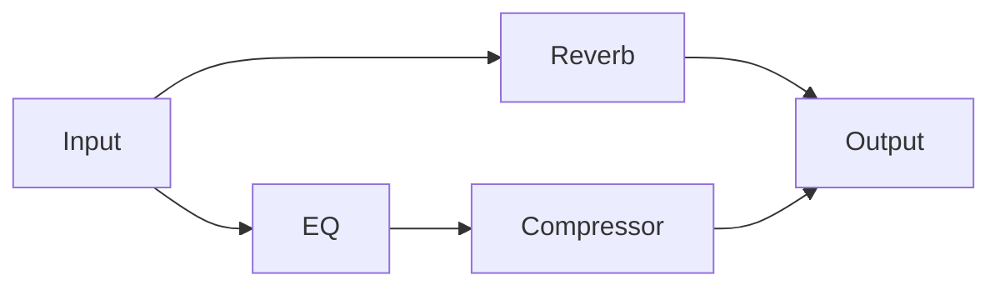

EQ 다음 Compressor, 그다음 Output처럼 Audio Processing을 일렬로만 연결한다면 배열 하나로 충분하다. 실제 Mixer에는 Send, Bus, Sidechain, 여러 Track의 합류가 있다. 하나의 Processor가 여러 입력을 기다리거나, 같은 입력이 여러 경로로 나뉠 수 있다.

이 구조에서 필요한 것은 “몇 번째 Processor인가”가 아니라 “어떤 Processor가 먼저 끝나야 하는가”다. 그래서 실행 순서를 Directed Acyclic Graph(DAG), 즉 방향은 있지만 Cycle은 허용하지 않는 Graph로 모델링했다.

DAG의 방향성·비순환 조건과 위상 정렬의 기본 원리는 [DAG란? 의존 관계에서 실행 순서 구하기](/posts/directed-acyclic-graph-topological-sort)에서 먼저 설명한다.

현재 `ProcessingGraph`는 Node와 의존성, 위상 정렬, Cycle 탐지, 병렬 실행 후보 Group을 계산하는 독립 utility다. 실제 AudioEngine이 이 Graph를 실행하는 경로는 확인되지 않는다. 이 글은 Graph 알고리즘 구현과 통합 전에 남은 계약을 설명한다.

## [sort1] 1. 왜 배열로는 분기와 합류를 표현하기 어려웠는가

다음 Signal Flow를 생각해 보자.

```text
Input
├─ EQ → Compressor ─┐
└─ Reverb Send ─────┴→ Output
```

배열로 표현하려면 한 Processor 뒤에 무엇이 실행되는지와 Output이 무엇을 기다리는지를 별도 규칙으로 관리해야 한다. Graph에서는 Node와 Edge가 그 관계를 직접 표현한다.



현재 API에서 `addEdge(from, to)`는 일반적인 signal 방향과 다르게 **from이 to에 의존한다**는 뜻이다.

```ts
graph.addEdge('eq', 'input');
graph.addEdge('compressor', 'eq');
graph.addEdge('output', 'compressor');
```

따라서 실제 실행 순서는 `input → eq → compressor → output`이다. 이 Edge 의미를 명시하지 않으면 호출자가 반대 방향으로 연결하기 쉽다. `addDependency(nodeId, dependencyId)`처럼 이름에 의미를 포함하는 방식이 더 안전할 수 있다.

## [sort1] 2. Node와 구조 계산을 분리했다

Graph Node에는 고유 ID와 선택적인 `process()`만 있다.

```ts
interface GraphNode {
  id: string;
  process?(): void;
}
```

Graph 자체는 `process()`를 호출하지 않는다. 실행 순서를 반환할 뿐이다.

```ts
const order = graph.topologicalSort();

for (const node of order) {
  node.process?.();
}
```

이 분리는 Graph 알고리즘을 Audio API 없이 검증할 수 있게 한다. 반면 실제 Audio 처리에는 Buffer 전달, Channel 수, Sample Rate, Latency, 실패 처리 계약이 더 필요하다. 구조가 독립적이라는 사실과 Audio Graph가 통합됐다는 사실은 구분해야 한다.

## [sort1] 3. Kahn 알고리즘으로 실행 순서를 만들었다

위상 정렬은 모든 의존 Node가 먼저 나오도록 Node를 나열한다. 구현은 Kahn 알고리즘을 사용한다.

1. 각 Node가 가진 dependency 수를 in-degree로 계산한다.
2. in-degree가 0인 Node를 queue에 넣는다.
3. Node를 하나 꺼내 결과에 추가한다.
4. 이 Node에 의존하는 Node의 in-degree를 줄인다.
5. in-degree가 0이 된 Node를 queue에 추가한다.

```ts
function topologicalSort(nodes: string[], dependencies: Map<string, Set<string>>): string[] {
  const inDegree = new Map(nodes.map(node => [node, dependencies.get(node)?.size ?? 0]));
  const queue = nodes.filter(node => inDegree.get(node) === 0).sort();
  const sorted: string[] = [];

  while (queue.length > 0) {
    const node = queue.shift();
    if (node == null) {
      break;
    }

    sorted.push(node);

    for (const dependent of findDependents(node, dependencies)) {
      const nextDegree = (inDegree.get(dependent) ?? 1) - 1;
      inDegree.set(dependent, nextDegree);

      if (nextDegree === 0) {
        queue.push(dependent);
        queue.sort();
      }
    }
  }

  if (sorted.length !== nodes.length) {
    throw new Error('Processing graph contains a cycle');
  }

  return sorted;
}
```

Queue를 ID 오름차순으로 정렬해 가능한 실행 순서가 여러 개여도 결과가 결정적으로 나오게 했다. 이 결정성은 snapshot test와 로그 비교를 단순하게 만든다. 다만 매 반복마다 queue를 정렬하므로 매우 큰 Graph에서는 priority queue를 검토할 수 있다. 현재 프로젝트에 실제 Node 규모 측정값은 없다.

## [sort1] 4. 정렬되지 않은 Node 수로 Cycle을 판별했다

DAG에는 적어도 하나의 in-degree 0 Node가 있어야 한다. Cycle 안의 Node는 서로의 in-degree를 줄여 줄 시작점이 없다.

Kahn 알고리즘 종료 뒤 결과 수가 전체 Node 수보다 작다면 Cycle이 존재한다.

```ts
if (sorted.length !== nodeCount) {
  throw new Error('ProcessingGraph contains a cycle');
}
```

별도의 `detectCycles()`도 제공한다. 이 함수는 iterative DFS와 세 가지 색을 사용한다.

| 색    | 의미                  |
| ----- | --------------------- |
| WHITE | 아직 방문하지 않음    |
| GRAY  | 현재 탐색 경로에 있음 |
| BLACK | 탐색을 완료함         |

GRAY Node에서 다시 GRAY dependency를 만나면 현재 경로로 돌아가는 Back Edge이므로 Cycle이다. 재귀 대신 명시적인 stack과 backtrack marker를 사용해 Graph 깊이가 JavaScript call stack에 직접 의존하지 않게 했다.

## [sort1] 5. 같은 단계의 Node를 병렬 후보로 묶었다

위상 정렬은 하나의 순서를 반환한다. 그러나 서로 의존하지 않는 Node는 같은 단계에서 실행할 수 있다.

```text
Level 0: Input A, Input B
Level 1: EQ A, EQ B
Level 2: Mix Bus
Level 3: Output
```

`getParallelGroups()`는 현재 in-degree가 0인 Node 전체를 한 Group으로 만들고, Group이 끝난 뒤 다음 Level을 계산한다.

```ts
while (currentLevel.length > 0) {
  groups.push(currentLevel);
  currentLevel = findNextZeroInDegreeNodes(currentLevel);
}
```

여기서 “병렬”은 Graph 의존성만 보면 같은 단계라는 뜻이다. 다음 조건까지 보장하지는 않는다.

- 두 Processor가 같은 mutable Buffer를 쓰지 않는가
- Audio Backend가 실제 병렬 실행을 지원하는가
- Plugin이 thread-safe한가
- Group 실행 후 결과를 어떤 순서로 합치는가

따라서 정확한 이름은 **병렬 실행 가능성 후보 Group**이다. Graph Edge가 모든 공유 자원 의존성을 표현한다는 전제가 있어야 실제 병렬 실행이 안전하다.

## [sort1] 6. Node 삭제에서는 양방향 Edge 정리가 필요했다

한 Node를 삭제하면 두 관계를 모두 제거해야 한다.

1. 삭제된 Node가 의존하던 Edge
2. 다른 Node가 삭제된 Node에 의존하던 Edge

```ts
function removeNode(nodeId: string): void {
  nodes.delete(nodeId);
  dependencies.delete(nodeId);

  for (const nodeDependencies of dependencies.values()) {
    nodeDependencies.delete(nodeId);
  }
}
```

두 번째 정리를 빠뜨리면 존재하지 않는 Node를 dependency로 가진 Ghost Edge가 남는다. 이후 위상 정렬에서 in-degree는 줄지 않지만 queue에 넣을 실제 Node도 없어 Cycle처럼 보일 수 있다.

## [sort1] 7. 실행 Graph가 되려면 무엇이 더 필요한가

현재 `ProcessingGraph`는 공개 API로 export되지만 AudioEngine, OfflineExporter, Command Handler에서 생성되는 참조는 확인되지 않았다. 자동 테스트도 없다.

구조 utility로서 필요한 테스트는 다음과 같다.

- 선형 Chain의 실행 순서
- 분기·합류 Graph의 순서
- 가능한 순서가 여러 개일 때 결정적 결과
- Self Cycle과 여러 Node Cycle
- Node 삭제 후 incoming·outgoing Edge 정리
- 독립 Node의 Parallel Group
- 존재하지 않는 Node를 연결할 때의 정책

실제 Audio Graph로 통합하려면 다음 계약이 추가돼야 한다.

- Node별 input·output Buffer
- Channel layout과 Sample Rate
- Processor latency와 compensation
- Tail과 bypass 처리
- 실행 중 Graph 변경 정책
- 실패한 Node가 전체 Graph에 미치는 영향

특히 Audio callback 도중 Graph를 직접 변경하면 현재 block의 실행 순서와 다음 block의 실행 순서가 달라질 수 있다. 변경 요청을 다음 안전 지점에 적용하는 snapshot 또는 queued update 정책이 필요하다.

## [sort1] 8. Graph 알고리즘은 실행 정책의 시작점이었다

DAG를 도입하면 분기와 합류를 명확히 표현하고, Cycle을 실행 전에 거부할 수 있다. 하지만 위상 정렬 결과만으로 실제 Audio Graph가 완성되지는 않는다.

> “Graph는 의존성을 표현하지만 Buffer 소유권과 실행 안전성까지 자동으로 보장하지 않는다.”

현재 구현은 구조 계산을 독립시킨 기반이다. 다음 단계는 단위 테스트로 Graph 불변 조건을 고정하고, Buffer와 latency 계약을 가진 실행 Node로 확장하는 것이다.

## 참고

**내부 글·표준 자료**

- [DAG란? 의존 관계에서 실행 순서 구하기](/posts/directed-acyclic-graph-topological-sort)
- [A. B. Kahn, Topological sorting of large networks](https://doi.org/10.1145/368996.369025)
- [Web Audio API 1.1](https://www.w3.org/TR/webaudio-1.1/)

**한국어 블로그**

- [방향 비순환 그래프(DAG, Directed Acyclic Graph)](https://jackpot53.tistory.com/84)

**해외 블로그**

- [Topological Sort of Directed Acyclic Graph](https://www.baeldung.com/cs/dag-topological-sort)
