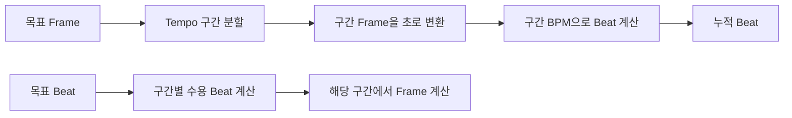

DAW의 시간은 하나가 아니다. 오디오 파일과 재생 장치는 Frame으로 움직이지만, 사용자는 17,280,000 Frame보다 13마디 2박을 더 쉽게 이해한다. 문제는 Tempo가 바뀌는 순간 두 좌표의 비율도 달라진다는 점이다.

처음에는 `beats * 60 / bpm * sampleRate` 공식이면 충분해 보였다. 이 공식은 Tempo가 하나일 때만 맞는다. 타임라인 중간에서 120 BPM이 90 BPM으로 바뀌면 목표 지점까지 지나온 각 Tempo 구간을 따로 계산해야 한다.

이 글에서 **Frame**은 채널별 PCM sample의 시간 위치, **Beat**는 4분음표를 기준으로 누적한 음악적 위치, **BBT**는 Bar·Beat·Tick 표기를 뜻한다. 구현은 1 Beat를 1,920 Tick으로 표현한다.

## [sort1] 1. 왜 고정 BPM 공식만으로는 부족했는가

48kHz 프로젝트에서 120 BPM의 한 Beat는 24,000 Frame이다.

```text
1 beat = 60 / 120 seconds
frames = 0.5 * 48,000
       = 24,000 frames
```

하지만 4 Beat 뒤 Tempo가 60 BPM으로 바뀐다면 6번째 Beat의 위치는 다음 두 구간의 합이다.

```text
앞 4 beat: 4 * 24,000 = 96,000 frames
뒤 2 beat: 2 * 48,000 = 96,000 frames
합계:                     192,000 frames
```

현재 Tempo만 가져와 전체 Beat에 곱하면 과거 구간까지 새 Tempo로 계산하게 된다. 화면의 Grid, MIDI Note, 음악 시간 기반 Region이 서로 다른 위치를 가리킬 수 있다.

> “가변 Tempo에서 시간 변환은 단일 공식이 아니라 구간 적분 문제다.”

## [sort1] 2. Tempo와 박자표를 별도 이벤트로 저장했다

Tempo는 Beat가 얼마나 빠르게 흐르는지를 결정한다. 박자표는 한 마디를 어떻게 나누는지 결정한다. 둘은 같은 Frame에서 함께 바뀔 수도 있지만 반드시 같이 바뀌지는 않는다.

그래서 두 이벤트 목록을 분리했다.

```ts
interface TempoEvent {
  frame: number;
  bpm: number;
}

interface MeterEvent {
  frame: number;
  beatsPerBar: number;
  beatValue: number;
}
```

각 목록은 Frame 오름차순을 유지한다. 특정 Frame에서 활성 이벤트를 찾을 때는 `frame <= target`을 만족하는 마지막 위치를 이진 탐색한다.

```ts
function findSegmentIndex<T extends { frame: number }>(events: T[], target: number): number {
  let low = 0;
  let high = events.length - 1;
  let result = -1;

  while (low <= high) {
    const middle = (low + high) >>> 1;

    if (events[middle].frame <= target) {
      result = middle;
      low = middle + 1;
    } else {
      high = middle - 1;
    }
  }

  return result;
}
```

이진 탐색은 현재 구간 조회를 줄인다. 다만 Frame을 Beat로 바꾸는 과정에서는 목표 위치까지의 Tempo 구간을 누적해야 한다. 조회 비용과 누적 변환 비용은 같은 문제가 아니다.

## [sort1] 3. Frame에서 Beat로 갈 때 구간을 누적했다

각 Tempo 구간에서 지나온 Frame을 초로 바꾸고, 그 구간의 BPM을 적용한다.

```ts
function framesToBeats(targetFrame: number, sampleRate: number, events: TempoEvent[]): number {
  let remainingFrames = targetFrame;
  let totalBeats = 0;

  for (let index = 0; index < events.length && remainingFrames > 0; index++) {
    const nextFrame = events[index + 1]?.frame ?? Infinity;
    const segmentLength = nextFrame - events[index].frame;
    const segmentFrames = Math.min(remainingFrames, segmentLength);
    const segmentSeconds = segmentFrames / sampleRate;

    totalBeats += segmentSeconds * (events[index].bpm / 60);
    remainingFrames -= segmentFrames;
  }

  return totalBeats;
}
```

역변환도 같은 순서로 진행한다. 이번에는 각 구간이 수용할 수 있는 Beat를 먼저 계산하고, 남은 Beat가 들어가는 구간에서 Frame으로 바꾼다.



이 방식의 핵심은 Tempo 변경 이전 구간을 새 Tempo로 다시 계산하지 않는 것이다. 같은 음악적 위치를 Frame으로 다시 찾을 수 있는 기반도 여기서 나온다.

## [sort1] 4. BBT는 Tempo만으로 계산할 수 없었다

Beat 누적값을 구한 뒤에는 박자표 구간을 따라 Bar를 계산한다. 4/4에서는 한 마디가 4개의 4분음표 Beat이고, 6/8에서는 한 마디가 3개의 4분음표 길이에 해당한다.

```ts
const quarterBeatsPerBar = beatsPerBar * (4 / beatValue);
```

박자표가 바뀌는 Frame을 먼저 절대 Beat로 변환하면 각 Meter 구간의 시작점을 같은 좌표계에서 비교할 수 있다. 이후 완성된 마디 수와 현재 마디 안의 위치를 나눠 BBT를 만든다.

여기에는 정책 결정이 필요하다. 박자표 변경점이 마디 중간에 들어오면 이전 마디를 닫을지, 불완전한 마디를 다음 구간에 이어갈지 정해야 한다. 현재 구현은 각 구간에서 완성된 마디를 중심으로 계산한다.

또한 현재 BBT 계산은 4분음표 단위 Beat를 사용하면서 `beat` 번호에도 같은 단위를 적용한다. 따라서 6/8처럼 분모가 4가 아닌 박자표의 Beat 표기는 추가 검증이 필요하다. 이 부분은 구현됐다는 사실과 정확성이 검증됐다는 사실을 구분해야 한다.

## [sort1] 5. 같은 좌표 변환을 Grid와 Swing에 재사용했다

Grid는 화면에 선을 그리는 기능처럼 보이지만 실제로는 시간 좌표 변환의 소비자다.

1. 시작 Frame을 절대 Beat로 바꾼다.
2. subdivision에 맞는 첫 Beat를 찾는다.
3. 각 Beat를 다시 Frame으로 바꾼다.
4. 현재 박자표에 따라 다음 간격을 계산한다.

Swing은 짝수 번째 Grid는 유지하고 홀수 번째 Grid를 다음 On-beat 방향으로 이동한다.

```ts
const ratio = 0.5 + clampedSwing * 0.5;
const swungFrame = Math.round(previousFrame + ratio * intervalFrames);
```

좌표 변환을 공통 경로로 두면 Tempo가 바뀌어도 Grid와 snap이 같은 기준을 사용할 수 있다. 반대로 변환 규칙이 잘못되면 여러 편집 기능이 동시에 어긋난다. 그래서 이 모듈은 기능 수보다 불변 조건 검증이 중요하다.

## [sort1] 6. 아직 무엇이 검증되지 않았는가

현재 `TempoMap`은 `Session`이 생성하고 Tempo 편집 명령과 Session 저장·복원 경로에서 사용한다. 타입 검사와 전체 빌드는 통과하지만 `TempoMap` 자체 자동 테스트는 없다.

최소한 다음 왕복 조건을 테스트해야 한다.

```ts
import { describe, expect, it } from 'vitest';

describe('TempoMap round trip', () => {
  it('여러 Tempo 구간을 통과해도 Frame을 복원한다', () => {
    const tempoMap = new TempoMap(48_000);
    tempoMap.addTempoChange(96_000, 90);

    const sourceFrame = 192_000;
    const beats = tempoMap.framesToBeatsAbsolute(sourceFrame);
    const restoredFrame = tempoMap.beatsToFramesAbsolute(beats);

    expect(restoredFrame).toBe(sourceFrame);
  });
});
```

추가로 필요한 검증은 다음과 같다.

- Tempo 변경 Frame의 직전·정확한 위치·직후
- 여러 Meter 변경을 통과하는 BBT 왕복
- 3/4, 6/8, 12/8의 Beat 번호 정책
- Grid 종료 경계와 Swing 최댓값
- 긴 Timeline에서 누적 반올림 오차

이 테스트가 통과하기 전에는 “모든 박자표를 정확히 지원한다”고 말할 수 없다.

## [sort1] 7. 시간축의 핵심은 좌표보다 정책이었다

가변 Tempo를 구현하면서 가장 어려웠던 부분은 공식을 코드로 옮기는 일이 아니었다. Frame, Beat, BBT가 서로 무엇을 의미하는지 고정하고, 박자표 변경처럼 하나의 정답이 없는 경계에서 정책을 선택하는 일이 더 어려웠다.

> “시간 좌표가 많아질수록 변환 함수보다 불변 조건을 먼저 정의해야 한다.”

현재 구조는 Tempo 구간 누적과 공통 좌표 변환의 기반을 제공한다. 다음 단계는 4분음표가 아닌 박자표의 BBT 정책을 명확히 하고, 왕복 테스트로 그 정책을 고정하는 것이다.
