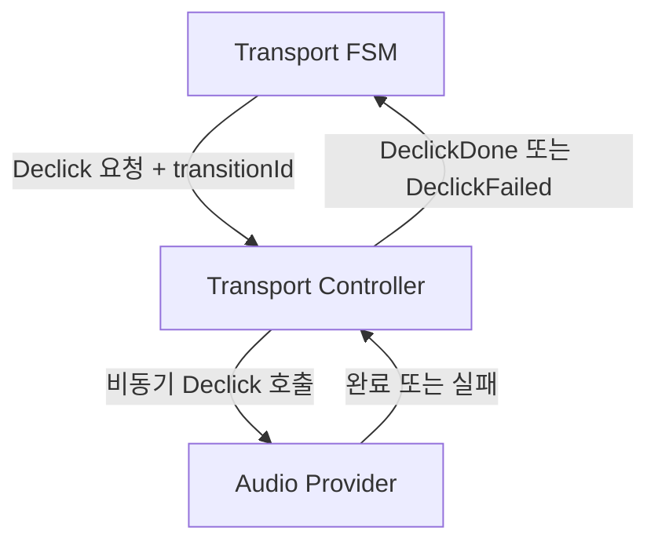

처음 재생 기능을 만들 때는 `isPlaying` 하나면 충분해 보였다. 재생하면 `true`, 정지하면 `false`로 바꾸면 된다.

```ts
let isPlaying = false;
```

하지만 DAW의 Transport에는 재생과 정지 사이의 전환이 있다. 클릭 노이즈를 줄이기 위한 Declick, 새로운 위치로 이동하는 Locate, 재생 방향 전환은 즉시 끝나지 않는다. 이 과정에서 새 입력까지 들어오면 `isPlaying`은 현재 무엇을 기다리는지 설명하지 못한다.

그래서 재생 여부가 아니라 **현재 진행 중인 전환**을 유한 상태 머신(Finite State Machine, FSM)으로 표현했다. 비동기 `AudioProvider` 호출은 `TransportController`로 분리하고, `transitionId`와 타임아웃으로 늦거나 끝나지 않는 완료 결과를 처리했다.

> “재생 상태에서 중요한 것은 소리가 나는가만이 아니라, 지금 어떤 전환을 진행하고 있는가였다.”

## [sort1] 1. 왜 `isPlaying`만으로는 부족했는가

`isPlaying`은 결과적인 재생 여부만 나타낸다. 다음 질문에는 답할 수 없다.

- 정지를 위해 Declick 중인가
- Locate 전에 현재 재생을 정리하는 중인가
- 새로운 재생 위치가 적용되기를 기다리는가
- 전환 중 들어온 입력을 지금 처리해도 되는가

예를 들어 재생 중 Locate를 요청하면 내부 동작은 한 번의 값 변경으로 끝나지 않는다.

```text
재생 중
  → Declick
  → 재생 위치 변경
  → 재생 재개 또는 정지 유지
```

두 개의 boolean을 조합하는 방식도 검토할 수 있다.

```ts
let isPlaying = true;
let isDeclicking = true;
```

그러나 이 구조는 `isPlaying === false && isDeclicking === true`가 정지를 위한 Declick인지, Locate를 위한 Declick인지 구분하지 못한다. boolean을 더 추가하면 실제로 허용하지 않아야 할 조합도 함께 늘어난다.

FSM은 가능한 상태와 상태 사이의 전이를 명시한다. 현재 상태에서 허용하지 않은 Event를 거부할 수 있다는 점이 boolean 조합과 달랐다.

## [sort1] 2. 동작과 방향을 별도 상태로 분리했다

Transport 상태를 동작(Motion)과 방향(Direction)으로 나눴다.

```ts
export enum MotionState {
  STOPPED = 'STOPPED',
  ROLLING = 'ROLLING',
  DECLICK_TO_STOP = 'DECLICK_TO_STOP',
  DECLICK_TO_LOCATE = 'DECLICK_TO_LOCATE',
  WAITING_FOR_LOCATE = 'WAITING_FOR_LOCATE',
}

export enum DirectionState {
  FORWARDS = 'FORWARDS',
  BACKWARDS = 'BACKWARDS',
  REVERSING = 'REVERSING',
}
```

`MotionState`는 재생·정지·Locate 전환 단계를 나타낸다. `DirectionState`는 재생 방향과 방향 전환을 나타낸다. 두 상태의 수명이 다르기 때문에 하나의 큰 enum으로 합치지 않았다.

상태를 나누는 것만으로 모든 조합이 유효해지는 것은 아니다. 예를 들어 `STOPPED + REVERSING`을 허용할지는 별도의 전이 규칙으로 제한해야 한다. 분리의 목적은 상태 수를 줄이는 것이 아니라, 동작과 방향의 변경 규칙을 각각 관리하는 데 있다.

## [sort1] 3. 전환 중 입력은 FIFO 대기열에 보관했다

Declick 도중 새 재생·정지·Locate Event를 즉시 처리하면, 진행 중인 전환과 새 전환이 같은 상태를 변경할 수 있다. 그래서 Declick 완료 Event만 즉시 처리하고 사용자 입력은 FIFO(First In, First Out) 대기열에 보관했다.

```ts
public enqueue(event: TransportEvent): void {
  if (!this.isDeclicking()) {
    this.processEvent(event);
    return;
  }

  if (event.type === 'DeclickDone' || event.type === 'DeclickFailed') {
    this.processEvent(event);
    return;
  }

  this.deferredEvents.push(event);
}
```

Declick 전환이 끝나면 보관한 Event를 입력 순서대로 다시 처리한다. 이 방식은 **queued sequential execution**, 즉 대기열을 사용한 순차 처리다. 실행 중인 Backend 작업을 취소하거나 여러 요청을 하나로 합치는 방식은 아니다.

FIFO가 항상 사용자 의도와 일치하는 것도 아니다. 짧은 시간에 Locate가 여러 번 들어오면 모든 중간 위치를 방문하기보다 마지막 위치만 적용하는 편이 나을 수 있다. 이 경우에는 Queue에 넣기 전에 같은 종류의 Event를 병합하는 별도 정책이 필요하다.

## [sort1] 4. 비동기 실행은 `TransportController`로 분리했다

FSM은 상태 전이를 결정해야 하지만 실제 Declick은 비동기 `AudioProvider`에서 실행된다. `AudioProvider` 호출까지 FSM이 맡으면 순수한 전이 규칙과 I/O 실패 처리가 한 클래스에 섞인다.

이 경계를 다음과 같이 나눴다.



- `TransportFSM`: 허용할 Event와 다음 상태 결정
- `TransportController`: 비동기 호출, 타임아웃, 실패 복구 담당
- `AudioProvider`: 실제 Declick과 강제 무음 처리 담당

Callback 자체가 문제인 것은 아니다. 다만 Backend에 전달한 Callback이 FSM을 직접 참조하면, 전환 식별과 실패 정책이 Backend 호출 지점마다 흩어진다.

```ts
audioProvider.declick(() => {
  transportFSM.enqueue({ type: 'DeclickDone' });
});
```

Controller를 사이에 두면 FSM은 `AudioProvider` 인터페이스를 알 필요가 없다. `AudioProvider`도 FSM 상태를 알지 못한다. 두 구성 요소는 요청과 결과 Event의 계약으로만 연결된다.

## [sort1] 5. `transitionId`로 낡은 완료 결과를 거부했다

비동기 작업은 요청 순서와 완료 순서가 다를 수 있다. 이전 Declick이 늦게 완료됐을 때 그 결과를 현재 전환의 완료로 받아들이면, FSM이 의도하지 않은 상태로 이동할 수 있다.

각 전환에 서로 다른 `transitionId`를 부여하고, 완료 Event에도 같은 ID를 실었다.

```ts
private handleDeclickDone(event: DeclickDoneEvent): void {
  if (event.transitionId !== this.activeTransitionId) {
    return;
  }

  this.completeActiveTransition();
}
```

`transitionId`는 요청과 완료를 연결하는 **상관관계 식별자(correlation identifier)** 다. 현재 기다리는 ID와 일치하는 결과만 상태 전이에 반영한다.

이 검사는 이전 작업을 취소하지 않는다. 같은 Backend 자원을 동시에 변경할 수 있다면 취소 신호, 단일 실행 제한 또는 Backend 내부의 세대 검사도 별도로 필요하다. `transitionId`가 보장하는 범위는 낡은 완료 Event가 현재 FSM 상태를 변경하지 못하게 하는 것까지다.

## [sort1] 6. 타임아웃으로 FSM의 대기 시간을 제한했다

`AudioProvider` Promise가 완료되지 않으면 FSM은 `DECLICK_TO_STOP` 같은 중간 상태에서 계속 기다릴 수 있다. Controller는 Declick과 타임아웃을 경쟁시키고, 제한 시간을 넘기면 강제 무음 처리 후 실패 Event를 보낸다.

```ts
const DECLICK_TIMEOUT_MS = 150;

private async handleDeclickRequested(request: DeclickRequest): Promise<void> {
  try {
    await this.withTimeout(
      this.audioProvider.declickToSilence(request.transitionId),
      DECLICK_TIMEOUT_MS,
    );

    this.transportFSM.enqueue({
      type: 'DeclickDone',
      transitionId: request.transitionId,
    });
  } catch {
    this.audioProvider.forceMute();
    this.transportFSM.enqueue({
      type: 'DeclickFailed',
      transitionId: request.transitionId,
    });
  }
}
```

타임아웃은 FSM이 `AudioProvider` 완료를 기다리는 최대 시간을 제한한다. 이미 시작한 `declickToSilence()`를 자동으로 중단하지는 않는다. Backend 작업도 중단해야 한다면 `AbortSignal`과 같은 취소 계약을 추가해야 한다.

`150ms`는 예시 정책값이다. 실제 값은 Declick 길이, Audio Backend의 응답 시간 분포, 사용자가 허용할 수 있는 조작 지연을 측정해 정해야 한다.

## [sort1] 7. 무엇을 검증해야 이 구조를 신뢰할 수 있는가

구조가 의도대로 동작하는지 확인하려면 정상 경로만으로는 부족하다. 최소한 다음 시나리오가 필요하다.

- `ROLLING → DECLICK_TO_STOP → STOPPED` 정상 전이
- Declick 중 입력된 Event의 FIFO 처리
- 연속 Locate 입력의 보관 또는 병합 정책
- 현재 `transitionId`와 다른 완료 Event 무시
- Backend 거부 시 `DeclickFailed` 전이와 강제 무음 실행
- Backend 미완료 시 타임아웃 이후 제어권 복구
- 타임아웃 뒤 늦게 끝난 Backend 작업이 현재 상태에 미치는 영향
- 동작 상태와 방향 상태의 허용되지 않은 조합 거부

이 설계가 줄이는 위험과 보장하지 않는 범위도 구분해야 한다.

| 장치                  | 줄이는 위험                        | 보장하지 않는 것            |
| --------------------- | ---------------------------------- | --------------------------- |
| FSM                   | 허용되지 않은 상태 전이            | Backend 작업 성공           |
| FIFO Event Queue      | 전환 도중 사용자 입력의 즉시 개입  | 중복 입력 병합              |
| `TransportController` | 상태 전이와 비동기 I/O 책임의 결합 | Backend 내부 자원 안전성    |
| `transitionId`        | 낡은 완료 Event의 현재 상태 반영   | 진행 중인 이전 작업 취소    |
| 타임아웃              | FSM의 무기한 완료 대기             | Backend Promise 자체의 종료 |

따라서 타임아웃이 있다는 이유만으로 Hang이 완전히 사라졌다고 단정할 수는 없다. 확인할 수 있는 변화는 FSM이 정해진 시간 뒤 실패 경로로 이동할 수 있게 됐다는 점이다.

## [sort1] 8. 상태는 값보다 전환 규칙에 가까웠다

이번 설계의 핵심은 enum 항목을 늘린 것이 아니다. 재생·정지·Locate·방향 전환 사이에서 허용할 순서를 FSM에 모으고, 비동기 부수 효과를 Controller 경계 밖으로 분리한 데 있다.

> “상태 머신은 무엇을 실행할지뿐 아니라, 현재 상태에서 그 Event를 받아도 되는지를 결정한다.”

`transitionId`는 늦은 결과를 현재 전환과 구분하고, 타임아웃은 실패 경로로 이동할 시점을 정한다. 각 장치의 보장 범위를 분리하니 복잡한 Transport 동작을 하나의 boolean으로 추측하지 않아도 됐다.

재생 상태는 한 시점의 값이 아니라 시간에 따라 이어지는 전환 규칙이었다.
