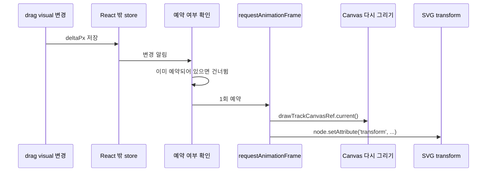

## 1. 들어가며

타임라인에서 리전을 드래그할 때 화면이 뚝뚝 끊기는 문제가 있었다. 처음에는 캔버스에 그리는 데이터가 많아서 생기는 문제라고 생각했다. 하지만 React DevTools Profiler와 Chrome Performance로 확인해 보니, 단순히 Canvas draw 비용만의 문제는 아니었다. 드래그 중 React commit은 105회 발생했고, canvas clearRect는 104회, drawImage는 25,300회 호출됐다. 같은 드래그 구간에서 메인 스레드 busy time은 1,524ms였다. 이 수치는 드래그 중 React와 Canvas가 모두 자주 깨어나고 있었다는 사실을 보여줬다. 결론부터 적으면, 드래그 중 매번 React를 깨우던 경로를 줄이고, Canvas 다시 그리기와 SVG 위치 이동처럼 직접 처리할 수 있는 작업은 React 밖에서 처리하도록 분리했다. React commit은 React가 계산한 결과를 실제 DOM에 반영하는 단계를 말한다. 이 글에서는 드래그 중 React가 실제 화면 반영 단계까지 몇 번 들어왔는지를 보는 지표로 사용했다.

출처: React 공식 문서 - Render and Commit

## 2. 드래그 중 발생한 두 가지 비용

증상은 하나였지만, 내부에서 발생한 비용은 크게 두 가지로 나눌 수 있었다. 첫 번째는 Canvas를 다시 그리는 비용이었다. 리전 변경 신호가 짧은 시간 안에 여러 번 발생하는데, 기존 구조에서는 각 신호가 다시 그리기로 이어졌다. 같은 프레임 안에서 캔버스를 여러 번 그려도 사용자는 마지막 결과만 보게 된다. 따라서 중간에 실행된 draw는 화면에 보이지 않는 중복 작업에 가까웠다. 두 번째는 React 리렌더 비용이었다. 리전 드래그 중 임시 위치나 Canvas 갱신처럼 React 렌더 결과가 꼭 필요하지 않은 값도 React state 경로를 거치고 있었다. 그 결과 드래그 중 신호가 빠르게 들어올 때마다 React가 리렌더되고, 일부 컴포넌트가 거의 매 프레임 깨어났다. 초기 흐름을 단순화하면 다음과 같았다.

```text
regionChanged 또는 drag visual 변경
→ React state 업데이트
→ React 리렌더
→ useEffect 또는 렌더 결과를 통해 Canvas / SVG 갱신
```

여기서 문제는 React가 잘못 동작했다는 것이 아니다. React가 반드시 맡지 않아도 되는 잦은 시각 업데이트까지 React 경로에 연결되어 있었다는 점이 문제였다.

## 3. 병목 지점 확인

컴포넌트 단위로 commit 수와 actualDuration을 확인했다. actualDuration은 해당 업데이트에서 React 트리와 하위 컴포넌트를 렌더링하는 데 걸린 시간이다.

| 컴포넌트                     | commit 수 | 총 actualDuration |
| ---------------------------- | --------- | ----------------- |
| TrackRowComponent            | 105       | 489ms             |
| TrackContextMenu             | 105       | 439ms             |
| TrackRegionSvgLayerComponent | 104       | 203ms             |

세 컴포넌트가 드래그 내내 거의 매 프레임 리렌더되고 있었다. 특히 TrackRegionSvgLayerComponent가 104회 리렌더된다는 점이 눈에 띄었다. 이 컴포넌트는 드래그 중 임시 위치를 표시하는 drag visual 값을 useSyncExternalStore로 구독하고 있었다. useSyncExternalStore 자체가 문제는 아니었다. 이 훅은 React 바깥의 외부 store 값을 React 컴포넌트에서 읽고 구독할 때 사용하는 API다. 문제는 그 store 값이 React 렌더 결과에 반드시 반영되어야 하는 값이었는가였다. 드래그 중 임시 위치는 실제로 SVG 노드의 transform 속성만 바꾸면 되는 값이었다. 즉, React 트리 전체를 다시 계산하지 않고도 표현할 수 있는 시각 상태였다.

## 4. 여러 리전 신호를 한 번의 그리기로 묶기

먼저 regionChanged, regionAdded, regionRemoved 같은 리전 신호를 한 번의 그리기로 묶었다. 여기서 requestAnimationFrame(rAF)은 브라우저가 다음 화면을 그리기 직전에 콜백을 실행하도록 예약하는 기능이다. 예를 들어 마우스를 한 번 움직이는 동안 리전 변경 신호가 여러 번 올 수 있다. 하지만 브라우저 화면은 프레임 단위로 갱신된다. 그래서 같은 프레임 안에서 들어온 여러 신호를 모두 즉시 그리지 않고, 다음 화면 갱신 직전에 한 번만 그리도록 예약했다. 핵심은 “이미 그리기가 예약되어 있는지”를 저장하는 값이었다. 이미 예약되어 있으면 새 예약을 만들지 않고 바로 빠져나온다.

```ts
const scheduleSignalRedraw = () => {
  if (signalRafRef.current) return; // 이미 예약되어 있으면 건너뛴다

  signalRafRef.current = requestAnimationFrame(() => {
    signalRafRef.current = 0;
    drawTrackCanvasRef.current?.();
  });
};

playlist.regionAdded.connect(scheduleSignalRedraw);
playlist.regionRemoved.connect(scheduleSignalRedraw);
playlist.regionChanged.connect(scheduleSignalRedraw);
```

이 구조는 같은 프레임 안의 여러 신호를 하나의 다시 그리기 예약으로 묶는다. 정확히 말하면 이벤트 발생 자체를 줄이는 것은 아니다. 이벤트가 여러 번 발생하더라도 실제 Canvas 다시 그리기를 프레임당 최대 1회로 제한하는 것이다.

## 5. React state만 줄여서는 부족했던 이유

처음에는 rAF 안에서 setRegionVersion을 호출하는 방식으로 접근했다. 이 방식은 React state 업데이트를 프레임당 한 번으로 줄이는 데는 도움이 됐다.

```ts
const bump = () => {
  if (rafPendingRef.current) return; // 이미 예약되어 있으면 건너뛴다

  rafPendingRef.current = requestAnimationFrame(() => {
    rafPendingRef.current = 0;
    setRegionVersion(v => v + 1);
  });
};
```

하지만 이 구조는 여전히 React 리렌더를 유발했다.

```text
regionChanged
→ rAF
→ setRegionVersion
→ React 리렌더
→ drawTrackCanvas 재생성
→ useEffect
→ Canvas 다시 그리기
```

이 지점에서 문제를 다시 나눠야 했다. rAF로 여러 신호를 한 번으로 묶는 것과 React 리렌더를 제거하는 것은 별개의 문제였다. 전자는 중복 draw를 줄이는 문제이고, 후자는 Canvas 작업을 React 렌더 사이클에서 분리하는 문제였다.

## 6. Canvas 다시 그리기를 React 밖에서 직접 실행하기

Canvas는 React DOM이 아니다. React가 DOM을 계산한 뒤 그 결과를 반영하는 방식과 달리, Canvas는 canvas.getContext('2d')로 얻은 context에 명령형 API를 호출해 그린다. 그래서 리전 신호에서 React state를 업데이트하지 않고, 최신 drawTrackCanvas 함수를 따로 보관한 뒤 직접 호출하도록 바꿨다. 여기서 ref는 React 리렌더와 상관없이 값을 보관할 때 쓰는 상자처럼 생각하면 된다.

```ts
const drawTrackCanvasRef = useRef<(() => void) | null>(null);

useEffect(() => {
  drawTrackCanvasRef.current = drawTrackCanvas;
}, [drawTrackCanvas]);
```

그리고 리전 신호는 이 보관된 함수를 rAF 안에서 호출한다.

```ts
const scheduleSignalRedraw = () => {
  if (signalRafRef.current) return; // 이미 예약되어 있으면 건너뛴다

  signalRafRef.current = requestAnimationFrame(() => {
    signalRafRef.current = 0;
    drawTrackCanvasRef.current?.();
  });
};
```

여기서 신경 써야 했던 부분은 오래된 함수가 실행되는 문제였다. 보관해 둔 함수가 예전 drawTrackCanvas라면 현재 props나 viewport 상태와 맞지 않는 draw가 실행될 수 있다. 그래서 drawTrackCanvas가 재생성될 때마다 보관된 함수를 최신 함수로 바꿔 줬다. 이 변경으로 React가 레이아웃이나 props 변경을 처리하는 경로와, 리전 신호가 Canvas를 직접 갱신하는 경로가 분리됐다.

## 7. drag visual을 React 밖으로 꺼내기

다음으로 drag visual 경로를 정리했다. 여기서 drag visual은 드래그 중에만 보여주는 임시 위치 표시다. 기존에는 이 임시 위치 값이 useSyncExternalStore를 통해 React 컴포넌트에 전달됐다. 이 값이 바뀔 때마다 TrackRegionSvgLayerComponent가 리렌더됐다. 변경 전 흐름은 다음과 같았다.

```text
drag visual 변경
→ useSyncExternalStore
→ React 리렌더
→ SVG / Canvas 갱신
```

하지만 drag visual은 실제 리전 위치가 확정된 값이 아니었다. 드래그 중 사용자에게 보여주기 위한 임시 시각 상태였다. SVG 쪽에서는 노드의 transform만 바꾸면 됐고, Canvas 쪽에서는 다시 그리기만 예약하면 됐다. 그래서 drag visual 변경도 “다음 화면 갱신 직전에 한 번만 실행하는 직접 갱신 경로”에 연결했다.

```text
drag visual 변경
→ store가 변경 알림을 보냄
→ 이미 예약되어 있으면 건너뜀
→ Canvas drawTrackCanvasRef.current()
→ SVG node.setAttribute('transform', ...)
→ React commit 없음
```

SVG는 각 노드를 Map에 보관하고, 필요한 노드에만 직접 setAttribute를 호출하도록 바꿨다. 여기서 Map은 리전 id와 실제 SVG DOM 노드를 연결해 두는 저장소다.

```ts
const segmentGroupRefs = useRef(new Map<string, SVGGElement>());

const applyDragVisualSnapshot = useCallback(() => {
  const snapshot = getRegionDragVisualSnapshot();

  segmentGroupRefs.current.forEach((node, segmentId) => {
    const deltaPx = regionIdIsInDragVisual(segmentId, snapshot) ? snapshot.deltaPx : 0;

    if (deltaPx !== 0) {
      node.setAttribute('transform', `translate(${deltaPx} 0)`);
    } else {
      node.removeAttribute('transform');
    }
  });
}, []);
```

이때 오래된 DOM 참조가 남지 않도록, 노드가 생기면 Map에 추가하고 노드가 사라지면 Map에서 제거했다. 이 처리를 하지 않으면 리전이 삭제된 뒤에도 Map이 오래된 노드를 들고 있을 수 있다.

## 8. 변경 후 구조

변경 후 드래그 중 시각 업데이트 흐름은 다음과 같이 정리됐다.

```text
mousemove
→ regionDragVisualStore.set(deltaPx)
→ store가 변경 알림을 보냄
→ 이미 예약되어 있으면 건너뜀
→ requestAnimationFrame
→ canvas.drawTrackCanvasRef.current()
→ svg node.setAttribute('transform', ...)
→ React commit 없음
```

React가 완전히 사라진 것은 아니다. 실제 리전 위치가 확정되거나 레이아웃과 props가 바뀌는 경우에는 React가 여전히 필요하다. 바뀐 것은 드래그 중 자주 발생하는 임시 시각 업데이트를 React state 경로에서 분리했다는 점이다.



## 9. 변경 결과

동일 시나리오를 3회 반복 측정한 뒤 중앙값으로 비교했다.

| 지표                      | 변경 전 | 변경 후 | 변화 |
| ------------------------- | ------- | ------- | ---- |
| React commit 수           | 105     | 101     | -4%  |
| React actualDuration 평균 | 2.87ms  | 1.98ms  | -31% |
| canvas clearRect          | 104     | 55      | -47% |
| canvas drawImage          | 25,300  | 12,903  | -49% |
| 메인 스레드 busy time     | 1,524ms | 1,325ms | -13% |

측정된 사실은 Canvas draw 호출 수와 React 렌더 비용이 줄었다는 것이다. 여기서 draw 호출은 Canvas를 다시 그리기 위해 실행한 함수 호출을 뜻한다. 이 결과는 드래그 중 불필요한 React 경유와 중복 Canvas 다시 그리기가 줄었다는 해석과 일치한다. 다만 React commit 수는 105회에서 101회로만 줄었다. 따라서 이번 변경으로 React commit 자체가 크게 줄었다고 말하기는 어렵다. 남은 commit은 다른 경로에서 발생하고 있었고, 특히 TrackContextMenu가 각 row에 마운트되어 row 리렌더 비용을 키우는 문제가 남아 있었다.

## 10. 남은 작업

이번 작업으로 드래그 중 React 개입과 Canvas 다시 그리기 호출은 줄었다. 하지만 전체 병목이 모두 제거된 것은 아니었다. 남은 문제 중 하나는 TrackContextMenu였다. 각 row에 메뉴가 마운트되어 있어 row가 리렌더될 때 메뉴 서브트리까지 함께 영향을 받았다. 이 구조를 공유 메뉴 구조로 바꾸면 row 단위 비용을 더 줄일 수 있을 것으로 보인다. 또 다른 후보는 드래그 확장 값처럼 아직 React state 경로를 거치는 값이다. 이 값도 드래그 중 자주 바뀌면서 React 렌더 결과가 반드시 필요하지 않다면, 같은 원칙으로 직접 갱신 경로를 고려할 수 있다. 다만 모든 값을 React 밖으로 꺼내는 것이 정답은 아니다. React가 관리해야 하는 상태와 명령형으로 처리할 수 있는 임시 시각 상태를 구분하는 것이 더 중요하다.

## 11. 마치며

이번 작업에서 가장 중요했던 점은 “React를 쓰지 말자”가 아니었다. React가 필요한 작업과 필요하지 않은 작업을 구분하는 것이었다. Canvas 다시 그리기와 SVG 위치 이동처럼 직접 처리할 수 있는 드래그 중 시각 업데이트는 React 렌더 사이클을 매번 거치지 않아도 된다. 반대로 실제 데이터가 확정되거나 레이아웃이 바뀌는 작업은 React가 관리하는 편이 자연스럽다. 처음에는 캔버스가 무거운 문제라고만 봤다. 하지만 측정하고 경로를 따라가 보니, 드래그 중 자주 발생하는 신호가 React 경로와 Canvas 다시 그리기 경로를 반복해서 깨우는 구조가 더 중요한 문제였다. 이번 수정은 그 경계를 다시 그은 작업이었다. 다음에 비슷한 문제를 만나면 먼저 “이 값이 React 렌더 결과에 반드시 필요한가”를 확인할 것 같다. 필요하지 않은 잦은 시각 업데이트라면, 처음부터 React 경로와 직접 갱신 경로를 나눠 설계하는 편이 더 안정적일 수 있다.

## 참고

- React 공식 문서 - Render and Commit
- React 공식 문서 - `<Profiler>`
- React 공식 문서 - useSyncExternalStore
- React 공식 문서 - Manipulating the DOM with Refs
- MDN - requestAnimationFrame()
- MDN - Main thread
