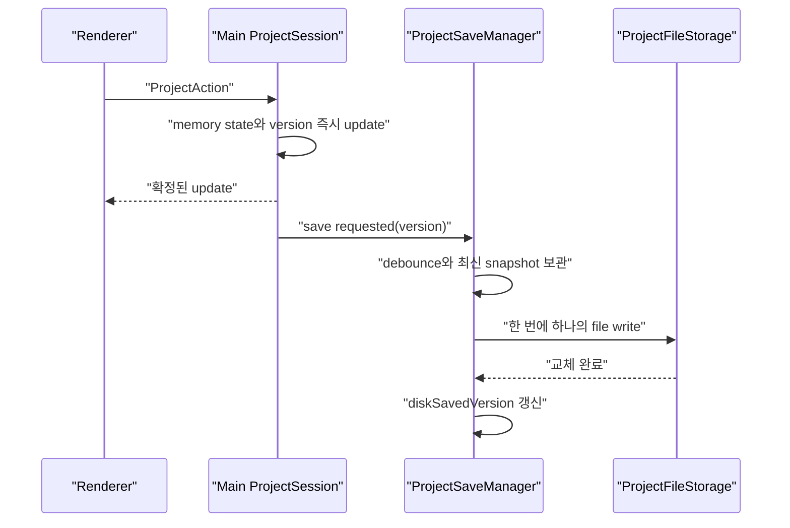

<details>
<summary>목차 펼쳐보기</summary>

- [1. 들어가며](#1-들어가며)
- [2. 저장 책임 분리](#2-저장-책임-분리)
- [3. 기본 자동저장 흐름](#3-기본-자동저장-흐름)
- [4. 실시간 저장의 두 의미](#4-실시간-저장의-두-의미)
- [5. 안전한 파일 교체](#5-안전한-파일-교체)
- [6. 충돌과 오래된 비동기 결과](#6-충돌과-오래된-비동기-결과)
- [7. 장애 복구](#7-장애-복구)
- [8. 성능 확인](#8-성능-확인)
- [9. 최소 구현](#9-최소-구현)
- [10. 마치며](#10-마치며)

</details>

[이전 글: Part 4. 흩어진 Undo/Redo를 Main History로 통합하기](/posts/electron-main-process-undo-redo)

## 1. 들어가며

기존 Renderer `SaveController`는 여러 Store를 읽고 프로젝트 문서를 조립하고 debounce timer를 관리하고 파일 저장을 요청하고 UI 상태까지 바꿨다. Main에 `ProjectDocument` SSOT를 두면 이 책임을 다시 나눌 수 있다.

결론부터 적으면, **자동저장 시점과 파일 쓰기는 Main `ProjectSaveManager`가 담당하고 Renderer `SaveController`는 저장 버튼과 저장 상태 표시만 담당한다**. 기본안은 Main memory에 즉시 반영하고 디스크에는 debounce 후 저장하는 방식이다.

단 이 방식은 모든 action이 즉시 디스크에 기록된다는 뜻이 아니다. 제품이 요구하는 데이터 손실 허용 시간을 먼저 정해야 한다.

## 2. 저장 책임 분리

### 2-1. Renderer SaveController

Renderer는 사용자와 가까운 역할만 가진다.

- 저장 버튼 클릭 처리
- Save As 경로 선택 UI 요청
- `saving`, `saved`, `error` 상태 표시
- 실패 안내와 재시도 버튼
- 앱 종료 전 저장 확인 UI

Renderer는 여러 Store를 다시 모아 `ProjectDocument`를 만들지 않는다.

### 2-2. Main ProjectSaveManager

Main은 최신 문서와 실제 저장 상태를 알고 있다.

- 문서 update 구독
- debounce timer
- 프로젝트별로 한 번에 하나의 파일 쓰기 실행
- 저장 중 새 update가 오면 최신 snapshot 보관
- `diskSavedVersion` 갱신
- 수동 저장과 자동저장의 중복 쓰기 방지
- 앱 종료 전 `flush`

### 2-3. ProjectFileStorage

실제 파일 API 호출은 별도 `ProjectFileStorage`로 둔다.

- JSON 직렬화
- temp file 쓰기
- project file 교체
- backup과 recovery file 읽기
- 파일 형식 version 확인

이 분리로 `ProjectSaveManager`는 fake storage를 주입해 timer와 version 동작을 테스트할 수 있다.

## 3. 기본 자동저장 흐름



### 3-1. 한 번에 하나만 쓰기

같은 project file에 두 번의 비동기 쓰기가 동시에 실행되면 완료 순서가 요청 순서와 달라질 수 있다. 그래서 프로젝트별 파일 쓰기는 **queued sequential execution**, 즉 앞선 쓰기가 끝난 뒤 다음 쓰기를 시작하는 방식으로 제한한다.

이것을 모든 action의 전역 순차 처리와 혼동하지 않는다. Main memory의 state update는 즉시 실행하고 디스크 쓰기만 한 번에 하나씩 실행한다.

### 3-2. 최신 snapshot만 유지

version 10을 저장하는 동안 11, 12, 13이 들어오면 11과 12를 각각 파일로 만들 필요는 없다. 현재 쓰기가 끝난 뒤 최신 version 13을 저장한다. 중간 snapshot을 합치는 것이 아니라 **아직 저장하지 않은 최신 snapshot으로 교체**하는 방식이다.

### 3-3. 저장 완료 version

`projectFileVersion`은 Main memory의 현재 version이다. `diskSavedVersion`은 project file 교체가 끝난 version이다.

```ts
const isDirty = projectFileVersion !== diskSavedVersion;
```

version 10 저장이 끝났을 때 Main이 이미 version 13이면 saved 상태로 표시하지 않는다. `diskSavedVersion`만 10으로 바꾸고 다음 저장을 계속한다.

## 4. 실시간 저장의 두 의미

"변경되는 모든 내용은 실시간으로 local PC에 저장한다"는 요구사항은 두 가지로 해석될 수 있었다.

| 방식 | action 응답 | 장점 | 비용 |
| --- | --- | --- | --- |
| memory 즉시 반영과 disk debounce | Main memory update 후 응답 | 입력 지연이 작고 중복 쓰기를 줄인다. | debounce 구간에서 앱 전체가 비정상 종료되면 최근 변경을 잃을 수 있다. |
| disk 기록 후 응답 | 복구용 변경 기록 또는 project file 쓰기 후 응답 | 응답한 action의 disk 기록 범위를 더 강하게 설명할 수 있다. | 입력 지연과 파일 쓰기 횟수와 복구 로직이 늘어난다. |

### 4-1. 기본 선택

현재는 허용 가능한 데이터 손실 시간이 정해지지 않았다. 따라서 기본 구현안은 memory 즉시 반영과 짧은 disk debounce다. 이것을 "모든 변경이 즉시 디스크에 보장된다"고 표현하면 안 된다.

### 4-2. 더 강한 보장이 필요할 때

모든 action 응답 전에 local disk 기록이 필요하다면 다음 대안을 검토한다.

1. 직렬화 가능한 action을 복구용 변경 기록 파일에 추가한다.
2. 파일 쓰기 완료 후 action 응답을 보낸다.
3. 앱 시작 시 마지막 snapshot 위에 변경 기록을 다시 적용한다.
4. 일정 시점에 최신 snapshot file로 합치고 이전 기록을 정리한다.

이 경우 action의 queued sequential execution과 파일 flush 정책이 필요하다. Node.js 파일 API의 callback이나 Promise가 resolve되었다는 사실과 물리 장치까지 동기화되었다는 보장도 구분해야 한다. `fsPromises.writeFile`과 `filehandle.sync()`는 다른 단계다. [Node.js File System](https://nodejs.org/api/fs.html)

어느 수준을 선택할지는 제품 정책과 측정값이 있어야 결정할 수 있다.

## 5. 안전한 파일 교체

project file을 바로 덮어쓰는 대신 다음 순서를 사용한다.

1. 같은 프로젝트 폴더의 temp file에 비동기로 쓴다.
2. 쓰기 성공 후 기존 정상 파일을 backup으로 보존한다.
3. temp file을 project file 경로로 교체한다.
4. 교체가 성공한 뒤 `diskSavedVersion`을 갱신한다.
5. 실패하면 dirty 상태를 유지하고 temp file을 정리한다.

이 방식은 쓰기 도중 기존 정상 파일까지 손상될 위험을 줄인다. 모든 운영체제와 파일 시스템에서 완전한 원자성을 보장한다고 단정할 수는 없다. 교체 동작과 권한 오류와 잠금 방식은 Windows와 macOS에서 따로 검증해야 한다.

### 5-1. 새 프로젝트

아직 사용자가 경로를 정하지 않은 새 프로젝트는 앱 전용 recovery 폴더에 저장한다. Save As가 성공하면 정식 경로를 기록하고 recovery file을 정리한다.

### 5-2. 종료 전 flush

정상 종료 요청에서는 debounce timer를 취소하고 pending 최신 snapshot 저장을 기다린다. 프로세스 강제 종료와 전원 손실에는 이 흐름이 실행되지 않을 수 있으므로 recovery 정책을 별도로 둔다.

## 6. 충돌과 오래된 비동기 결과

### 6-1. 같은 row 수정

Main이 도착한 action 순서대로 적용하면 마지막 update가 최종값이 된다. 이 규칙은 순서를 정할 뿐 같은 SRT row를 두 창이 서로 다른 의도로 바꾼 충돌을 알려주지는 않는다.

충돌을 확인하려면 action에 `baseItemVersion`을 넣는다.

```ts
interface ChangeSrtTextAction {
  type: 'srt/textChanged';
  rowId: string;
  baseItemVersion: number;
  text: string;
}
```

현재 item version과 다르면 Main은 action을 거절하고 최신 row를 돌려줄 수 있다. 자동 merge UI까지 제공할지는 별도 제품 결정이다.

### 6-2. 늦게 도착한 작업

TTS 생성이나 waveform 분석처럼 오래 걸리는 작업은 시작한 프로젝트가 이미 닫힌 뒤 끝날 수 있다. 결과에 다음 값을 포함한다.

- `projectSessionKey`
- 대상 `itemId`
- 시작 시점의 `baseItemVersion`

Main은 결과를 적용하기 직전에 현재 값과 비교한다. 일치하지 않으면 오래된 결과로 판단하고 버린다. 취소 가능한 작업은 `AbortSignal`도 사용하지만 취소 요청만으로 결과 적용 검증을 대체하지 않는다.

## 7. 장애 복구

| 상황 | 처리 |
| --- | --- |
| Renderer 종료 | Main session과 저장은 유지하고 해당 구독만 정리한다. |
| 새 Renderer 시작 | Main의 최신 snapshot으로 초기화한다. |
| 파일 쓰기 실패 | dirty 유지, error 표시, 재시도 가능 상태로 둔다. |
| temp file만 남음 | 시작 시 정상 파일과 version을 비교해 정리하거나 복구 후보로 제시한다. |
| Main 비정상 종료 | 마지막 정상 project file과 recovery file을 확인한다. |

복구 파일을 자동으로 덮어쓸지 사용자에게 선택하게 할지는 데이터 중요도에 따라 정한다. 현재 설계에서는 더 최신인 recovery 후보가 있음을 알리고 선택하게 하는 쪽을 우선한다.

## 8. 성능 확인

Main에 SSOT를 둔다고 무거운 작업까지 Main에서 실행하면 안 된다. 다음 값을 먼저 측정한다.

- action 요청부터 Renderer 화면 반영까지의 시간
- Main event loop 지연
- patch와 snapshot의 IPC payload 크기
- 대표 프로젝트의 파일 저장 시간
- TanStack Query cache 갱신과 component 리렌더 범위
- typing과 pointer move와 playhead event 빈도

CPU 사용이 큰 작업이 Main 응답성을 실제로 해친다고 확인되면 Worker나 Electron Utility Process로 분리한다. Electron은 Utility Process를 CPU 집약적이거나 장애 가능성이 큰 작업에 사용할 수 있다고 설명한다. [Electron Process Model](https://www.electronjs.org/docs/latest/tutorial/process-model#the-utility-process)

## 9. 최소 구현

아래 예제는 파일 쓰기를 한 번에 하나만 실행하고 쓰는 동안 들어온 요청 중 최신 snapshot을 다음 대상으로 남긴다.

```ts
// project-save-manager.ts
interface ProjectSnapshot {
  version: number;
  content: string;
}

interface ProjectFileStorage {
  write(snapshot: ProjectSnapshot): Promise<void>;
}

export class ProjectSaveManager {
  #isSaving = false;
  #pendingSnapshot: ProjectSnapshot | null = null;
  #diskSavedVersion = 0;

  constructor(private readonly storage: ProjectFileStorage) {}

  requestSave(snapshot: ProjectSnapshot): void {
    this.#pendingSnapshot = snapshot;
    void this.#drain();
  }

  getDiskSavedVersion(): number {
    return this.#diskSavedVersion;
  }

  async #drain(): Promise<void> {
    if (this.#isSaving) {
      return;
    }

    this.#isSaving = true;

    try {
      while (this.#pendingSnapshot != null) {
        const snapshot = this.#pendingSnapshot;
        this.#pendingSnapshot = null;
        await this.storage.write(snapshot);
        this.#diskSavedVersion = snapshot.version;
      }
    } finally {
      this.#isSaving = false;
    }
  }
}
```

실제 구현은 쓰기 실패 시 pending snapshot을 보존하고 error 상태를 발행해야 한다. debounce는 `requestSave` 앞에 두고 `flush`는 timer를 건너뛰어 최신 snapshot을 바로 저장한다.

## 10. 마치며

자동저장을 Main으로 옮기는 것만으로 저장 보장이 자동으로 강해지지는 않았다. memory update와 disk write와 device sync는 서로 다른 완료 지점이다.

이번 설계에서 가장 중요한 태도는 "실시간"이라는 표현을 구현 방식으로 바로 번역하지 않는 것이었다. 먼저 어느 실패까지 막아야 하는지 정해야 한다. 다음 글에서는 이 구조를 기존 앱에 한 번에 갈아엎지 않고 옮기는 순서와 검증 기준을 정리한다.

[다음 글: Part 6. Main SSOT로 점진적으로 이관하기](/posts/electron-main-process-migration)

---

## 참고

**Node.js와 Electron 공식 문서**

- [Node.js File System](https://nodejs.org/api/fs.html)
- [Electron Process Model](https://www.electronjs.org/docs/latest/tutorial/process-model)
- [Electron Performance](https://www.electronjs.org/docs/latest/tutorial/performance)
