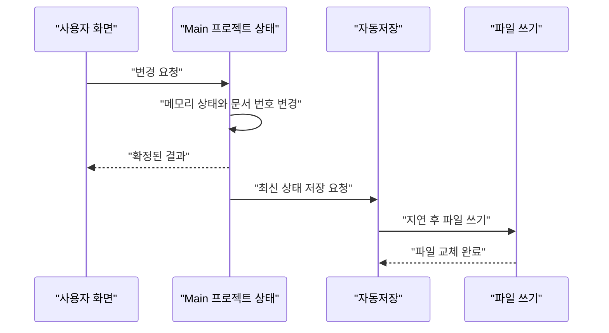

목차 펼쳐보기

- [1. 실시간 저장이라는 말부터 다시 정의했다](#1-실시간-저장이라는-말부터-다시-정의했다)
- [2. 화면과 저장의 책임을 나눴다](#2-화면과-저장의-책임을-나눴다)
- [3. 메모리는 즉시 바꾸고 파일은 뒤에서 저장한다](#3-메모리는-즉시-바꾸고-파일은-뒤에서-저장한다)
- [4. 파일 쓰기는 하나씩 실행하고 최신 상태만 남긴다](#4-파일-쓰기는-하나씩-실행하고-최신-상태만-남긴다)
- [5. 저장 완료를 세 단계로 구분했다](#5-저장-완료를-세-단계로-구분했다)
- [6. 정상 파일을 지키면서 복구 가능성을 남긴다](#6-정상-파일을-지키면서-복구-가능성을-남긴다)
- [7. 마치며](#7-마치며)

[이전 글: Part 3. Undo/Redo를 하나의 문서 이력으로 통합하기](/posts/electron-main-process-undo-redo)

## 1. 실시간 저장이라는 말부터 다시 정의했다

“변경 내용을 실시간으로 로컬 PC에 저장한다”는 요구사항은 명확해 보였다. 하지만 실제로는 서로 다른 완료 지점을 포함하고 있었다.

1. Main의 메모리에 변경이 반영됨
2. 프로젝트 파일 쓰기가 끝남
3. 운영체제가 저장 장치에 데이터를 동기화함

세 단계는 같은 의미가 아니다. 메모리에 반영한 뒤 바로 응답하면 입력은 빠르지만, 파일 저장 전 앱이 비정상 종료될 때 최근 변경을 잃을 수 있다.

그래서 먼저 제품이 허용할 수 있는 데이터 손실 시간을 정해야 했다. 자동저장 구현만으로 보장 수준이 자동으로 결정되지는 않는다.

## 2. 화면과 저장의 책임을 나눴다

기존 저장 코드는 여러 화면 상태를 모아 프로젝트 문서를 만들고, 저장 시점과 UI 상태까지 함께 관리했다. Main이 프로젝트의 최종 상태를 가지면서 이 책임을 나눌 수 있었다.

각 창은 사용자와 가까운 역할만 맡는다.

- 저장과 다른 이름으로 저장 요청
- 저장 중, 저장 완료와 실패 표시
- 실패 안내와 재시도
- 종료 전 저장 확인

Main은 실제 저장 상태를 관리한다.

- 최신 프로젝트 상태와 문서 번호
- 자동저장 시점
- 진행 중인 파일 쓰기
- 마지막으로 저장된 문서 번호
- 재시도와 종료 전 저장

파일 API 호출은 다시 별도 계층으로 분리한다. JSON 변환, 임시 파일 쓰기, 파일 교체와 복구 파일 검증을 자동저장 시점 결정과 섞지 않는다.

## 3. 메모리는 즉시 바꾸고 파일은 뒤에서 저장한다

기본 흐름은 다음과 같다.

Main의 메모리 상태는 변경 요청을 처리할 때 바로 바꾼다. 디스크 쓰기는 입력마다 실행하지 않고 짧게 지연해 중복 작업을 줄인다.

이 방식은 “모든 변경이 즉시 디스크에 기록된다”는 뜻이 아니다. 파일 저장 전 비정상 종료가 발생하면 지연 구간의 변경을 잃을 수 있다.

## 4. 파일 쓰기는 하나씩 실행하고 최신 상태만 남긴다

같은 프로젝트 파일에 여러 비동기 쓰기를 동시에 실행하면 완료 순서가 요청 순서와 달라질 수 있다. 따라서 프로젝트마다 파일 쓰기는 한 번에 하나만 실행한다.

문서 번호 10을 저장하는 동안 11, 12, 13이 들어왔다고 가정해 보자. 11과 12를 모두 파일로 만들 필요는 없다. 현재 쓰기가 끝난 뒤 대기 중인 가장 최신 상태인 13만 저장한다.

이 동작은 다음 두 규칙의 조합이다.

- 프로젝트별 순차 쓰기
- 대기 중인 상태를 최신 값 하나로 합치기

편집이 계속되면 debounce가 계속 밀릴 수 있다. 따라서 실제 정책에서는 최대 지연 시간인 `maxWait` 또는 주기적 checkpoint 중 하나를 함께 정해야 한다.

마지막 저장 문서 번호도 따로 기록한다. 문서 번호 10 저장이 끝났을 때 현재 메모리가 13이라면 화면에 “모두 저장됨”을 표시하면 안 된다. 마지막 저장 번호만 10으로 바꾸고 13 저장을 이어간다.

파일 쓰기 순서를 제한하는 이유

Node.js 문서는 같은 파일에 여러 `writeFile` 작업을 완료 대기 없이 실행하는 것이 안전하지 않다고 설명한다. 이 글의 순차 쓰기는 모든 사용자 변경을 하나의 비동기 Queue에 넣는다는 뜻이 아니다.

프로젝트 상태 변경은 Main 메모리에서 짧게 끝낸다. 순서를 제한하는 대상은 같은 프로젝트 파일에 대한 쓰기 작업뿐이다.

- [Node.js File System](https://nodejs.org/api/fs.html)

## 5. 저장 완료를 세 단계로 구분했다

| 완료 지점                  | 의미                             | 남는 위험                                      |
| -------------------------- | -------------------------------- | ---------------------------------------------- |
| 메모리 반영                | Main이 변경을 확정했다.          | Main 비정상 종료 시 잃을 수 있다.              |
| 파일 쓰기 완료             | 파일 API가 성공했다.             | 장치 동기화 전 전원 손실 가능성이 남는다.      |
| 저장 장치 동기화 요청 완료 | 파일 descriptor의 sync가 끝났다. | 정확한 보장은 운영체제와 장치에 따라 달라진다. |

기본안은 메모리에 즉시 반영하고 파일에는 짧은 지연 후 저장하는 방식이다. 더 강한 보장이 필요하다면 변경 요청에 응답하기 전에 복구 기록을 파일에 남기는 방식을 검토할 수 있다.

더 강한 저장 보장이 필요한 경우

모든 변경을 디스크에서 복구해야 한다면 다음 구조를 검토한다.

1. 직렬화 가능한 변경 요청을 복구 기록에 추가한다.
2. 필요한 동기화 작업이 끝난 뒤 요청에 응답한다.
3. 앱 시작 시 마지막 정상 프로젝트 위에 복구 기록을 다시 적용한다.
4. 일정 시점에 최신 프로젝트 파일로 합치고 이전 기록을 정리한다.

이 경우 요청 식별자와 재적용 규칙이 필요하다. 같은 기록을 두 번 읽어도 중복 변경이 발생하지 않도록 만들어야 한다.

Node.js의 `writeFile` 완료와 `FileHandle.sync()` 완료는 다른 단계다. 사용할 수 있는 `flush` 옵션과 정확한 동작은 앱이 사용하는 Electron에 포함된 Node.js 버전을 기준으로 확인해야 한다.

## 6. 정상 파일을 지키면서 복구 가능성을 남긴다

프로젝트 파일을 바로 덮어쓰지 않고 같은 폴더의 임시 파일을 사용한다.

1. 확정된 프로젝트 상태를 임시 파일에 쓴다.
2. 임시 파일의 JSON, 프로젝트 식별자, 문서 번호와 파일 형식을 검증한다.
3. 선택한 보장 수준에 따라 임시 파일을 동기화한다.
4. 정상 파일을 보존할 backup 정책을 적용한 뒤 임시 파일을 프로젝트 경로로 교체한다.
5. 교체까지 성공한 뒤 마지막 저장 문서 번호를 갱신한다.
6. 실패하면 dirty 상태를 유지하고 재시도할 수 있게 한다.

이 방식은 쓰기 도중 기존 정상 파일까지 손상될 위험을 줄인다. 모든 운영체제와 파일 시스템에서 파일 교체의 완전한 원자성을 보장한다는 뜻은 아니다.

운영체제와 복구 시 확인할 항목

- Windows와 macOS에서 기존 파일 교체 동작이 같은지
- 파일 잠금, 권한 오류와 백신 프로그램 간섭을 어떻게 처리할지
- temp file, backup과 정상 파일 중 어느 것이 최신이고 유효한지
- JSON parse뿐 아니라 schema와 프로젝트 식별자가 올바른지
- 같은 프로젝트를 여러 앱 인스턴스가 동시에 열 수 있는지
- 외부 프로그램이 프로젝트 파일을 바꿨을 때 어떻게 감지할지

파일의 문서 번호만 크다고 정상 복구 파일로 판단할 수는 없다. 파일 형식과 내용 검증을 함께 통과해야 한다.

새 프로젝트와 종료 전 저장

아직 정식 경로가 없는 새 프로젝트는 앱 전용 복구 폴더에 저장한다. 다른 이름으로 저장이 성공하면 정식 경로를 기록하고 복구 파일을 정리한다.

정상 종료 요청에서는 debounce timer를 취소하고 대기 중인 최신 상태의 저장을 기다린다. Electron 종료 이벤트에서 비동기 저장을 기다리려면 종료를 한 번 보류하고, 저장 완료 뒤 다시 종료하는 제어가 필요하다.

강제 종료나 전원 손실에는 이 흐름이 실행되지 않을 수 있으므로 복구 파일 정책을 별도로 둔다.

## 7. 마치며

자동저장을 Main으로 옮긴다고 저장 보장이 저절로 강해지는 것은 아니다. 메모리 반영, 파일 쓰기와 저장 장치 동기화는 서로 다른 완료 지점이다.

> “실시간”을 구현 방식으로 바로 바꾸기 전에, 어느 실패까지 복구해야 하는지 먼저 정해야 한다.

다음 글에서는 이 설계가 해결해야 할 가설과 아직 측정하지 못한 비용을 분리한다.

[다음 글: Part 5. Main SSOT 설계의 검증 계획과 선택 비용](/posts/electron-main-process-migration)
