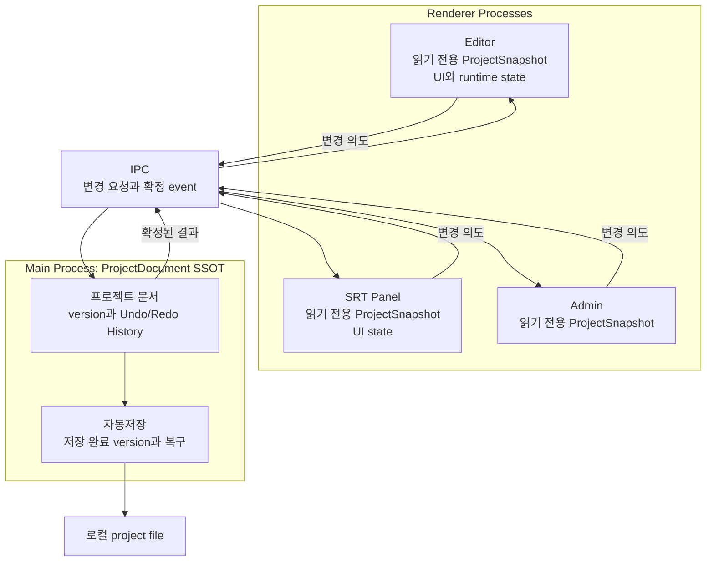

목차 펼쳐보기

- [1. 들어가며](#1-들어가며)
- [2. 검증해야 할 가설](#2-검증해야-할-가설)
  - [2-1. 상태 정합성](#2-1-상태-정합성)
  - [2-2. Undo와 Redo](#2-2-undo와-redo)
  - [2-3. 자동저장과 복구](#2-3-자동저장과-복구)
  - [2-4. 성능](#2-4-성능)
- [3. 선택의 비용](#3-선택의-비용)
  - [3-1. 줄이려는 위험](#3-1-줄이려는-위험)
  - [3-2. 새로 생기는 복잡성](#3-2-새로-생기는-복잡성)
- [4. 이 설계가 적합한 조건](#4-이-설계가-적합한-조건)
- [5. 다시 검토할 조건](#5-다시-검토할-조건)
- [6. 아직 결정하지 못한 부분](#6-아직-결정하지-못한-부분)
- [7. 최종 구조](#7-최종-구조)
- [8. 처음 질문에 대한 답](#8-처음-질문에-대한-답)
  - [8-1. 프로젝트 SSOT](#8-1-프로젝트-ssot)
  - [8-2. Renderer의 상태](#8-2-renderer의-상태)
  - [8-3. 자동저장](#8-3-자동저장)
  - [8-4. Undo와 Redo](#8-4-undo와-redo)
  - [8-5. 일반 IPC와 MessagePort](#8-5-일반-ipc와-messageport)
- [9. 마치며](#9-마치며)

시리즈 전체 글 바로가기

1. [Part 0. Main Process SSOT 시리즈를 시작하며](/posts/electron-main-process-ssot-series-guide)
2. [Part 1. Electron 멀티 윈도우에서 저장 결과가 달라진 이유](/posts/electron-multi-window-state-ssot)
3. [Part 2. Main Process에 ProjectDocument SSOT를 둔 이유](/posts/electron-main-process-project-ssot)
4. [Part 3. Renderer가 Main의 확정 상태를 받는 방법](/posts/electron-main-process-renderer-sync)
5. [Part 4. 흩어진 Undo/Redo를 Main History로 통합하기](/posts/electron-main-process-undo-redo)
6. [Part 5. 자동저장의 책임과 디스크 저장 보장](/posts/electron-main-process-autosave)
7. [Part 6. Main SSOT 설계를 검증하고 선택의 비용 정리하기](/posts/electron-main-process-migration)

[이전 글: Part 5. 자동저장의 책임과 디스크 저장 보장](/posts/electron-main-process-autosave)

## 1. 들어가며

앞선 글까지 Main에 `ProjectDocument`의 SSOT를 두고, Renderer에는 읽기 전용 복사본과 UI state만 두는 구조를 정리했다. 하지만 구조가 논리적으로 자연스럽다는 이유만으로 실제 문제를 해결한다고 단정할 수는 없다.

확인된 사실은 여러 Renderer가 별도 실행 환경이며 같은 JavaScript Store를 자동으로 공유하지 않는다는 점이다. Electron 공식 문서에서도 각 `BrowserWindow`가 별도 Renderer Process를 가진다고 설명한다. [Electron Process Model](https://www.electronjs.org/docs/latest/tutorial/process-model)

반면 Main SSOT가 이 편집기에서 충분한 응답성과 복구 수준을 제공하는지는 아직 측정 전이다. 따라서 마지막 글에서는 구현 순서보다 **무엇을 검증해야 이 선택을 유지할 수 있는가**를 정리한다.

## 2. 검증해야 할 가설

### 2-1. 상태 정합성

첫 번째 가설은 Main이 확정한 version을 모든 Renderer가 따라가면 창마다 다른 프로젝트 값이 남는 위험을 줄일 수 있다는 것이다.

다음 상황을 확인해야 한다.

- Editor에서 바꾼 SRT가 열린 SRT Panel과 Admin에 같은 version으로 반영되는가
- 요청 응답과 event가 중복되어도 한 번만 적용되는가
- 중간 event를 놓치면 전체 snapshot으로 복구되는가
- 새 창이 다른 Renderer가 아니라 Main의 최신 snapshot으로 시작하는가

이 검증이 통과해야 “Main이 최종값을 정한다”는 규칙이 실제 화면에서도 유지된다고 말할 수 있다.

### 2-2. Undo와 Redo

두 번째 가설은 Undo/Redo History가 Main 문서에 속하면 어느 창에서 실행해도 같은 결과를 만들 수 있다는 것이다.

확인할 대상은 다음과 같다.

- Undo와 Redo가 새 project version을 만드는가
- 모든 열린 Renderer가 같은 결과를 받는가
- 한 번의 drag나 split이 사용자 의도대로 한 History 항목이 되는가
- 문서에서 사라졌지만 History가 참조하는 asset이 너무 일찍 삭제되지 않는가
- Renderer의 AudioEngine이 Main 문서와 같은 구조로 갱신되는가

여기서 Main이 복원하는 것은 직렬화 가능한 문서다. `AudioBuffer`와 Timeline 실행 객체는 Renderer가 확정된 문서를 보고 다시 맞춘다.

### 2-3. 자동저장과 복구

세 번째 가설은 Main이 최신 문서와 저장 완료 version을 함께 관리하면 저장 상태를 더 정확하게 표시할 수 있다는 것이다.

다음 실패 조건을 확인해야 한다.

- 저장 중 새 변경이 들어와도 마지막 snapshot이 디스크에 남는가
- 파일 쓰기 실패 후 dirty 상태와 재시도 가능 상태가 유지되는가
- 정상 종료 전에 아직 저장하지 않은 snapshot을 처리하는가
- 비정상 종료 뒤 정상 project file과 recovery 후보를 구분할 수 있는가

memory 반영, 파일 쓰기 완료, 저장 장치 동기화는 서로 다른 완료 지점이다. 어떤 지점까지 보장할지는 제품 정책으로 정해야 한다. Node.js 문서에서도 파일 쓰기 API와 파일 동기화 API를 별도로 제공한다. [Node.js File System](https://nodejs.org/api/fs.html)

### 2-4. 성능

Main SSOT는 저장 가능한 변경을 IPC로 전달한다. 따라서 다음 값을 같은 대표 프로젝트에서 측정해야 한다.

- 사용자 입력부터 화면 반영까지의 시간
- Main event loop 지연
- patch와 전체 snapshot의 payload 크기
- 자동저장 시간
- cache 갱신 후 리렌더되는 component 범위

현재 측정값이 없으므로 성능 개선을 주장할 수는 없다. 측정 결과 Main의 응답성이 나빠진다면 CPU 사용이 큰 작업을 Worker나 Utility Process로 분리하거나 snapshot 전송 범위를 줄여야 한다. Electron은 Utility Process를 CPU 집약적이거나 장애 가능성이 큰 작업의 분리 수단으로 설명한다. [Electron Process Model](https://www.electronjs.org/docs/latest/tutorial/process-model#the-utility-process)

## 3. 선택의 비용

### 3-1. 줄이려는 위험

- 편집 state와 저장 state가 서로 다른 Store를 보는 위험
- 창마다 Undo/Redo 결과가 달라지는 위험
- 새 창이 이전 project version으로 시작하는 위험
- Renderer 종료와 함께 자동저장 책임이 사라지는 위험

이 항목은 설계가 줄이려는 위험이다. 실제 감소 폭은 검증 전이므로 수치로 표현하지 않는다.

### 3-2. 새로 생기는 복잡성

- 저장 가능한 모든 변경이 IPC 경계를 지난다.
- 요청과 event의 중복, 순서 역전, 누락을 version으로 처리해야 한다.
- Renderer의 문서 복사본과 UI state를 구분해야 한다.
- 문서 변경을 AudioEngine 같은 실행 객체에 반영하는 동기화 계층이 필요하다.
- 자동저장의 완료 지점과 복구 정책을 명시해야 한다.

SSOT는 복잡성을 없애지 않는다. **최종값 결정과 복구 규칙이 보이는 위치로 복잡성을 옮긴다.**

## 4. 이 설계가 적합한 조건

다음 조건을 함께 만족한다면 Main SSOT는 이 편집기에 적합한 후보라고 판단했다.

1. 여러 Renderer가 같은 로컬 프로젝트 문서를 편집한다.
2. 프로젝트 파일 저장은 Main의 파일 시스템 접근을 거친다.
3. 프로젝트 문서는 직렬화 가능한 값으로 표현할 수 있다.
4. Main의 state update는 짧고 동기적으로 끝낼 수 있다.
5. 무거운 미디어 작업은 Main의 상태 변경 경로와 분리할 수 있다.

이 판단은 모든 Electron 앱에 적용되는 일반 결론이 아니다. 하나의 Renderer만 사용하거나 서버가 이미 최종 상태를 관리한다면 다른 구조가 더 단순할 수 있다.

## 5. 다시 검토할 조건

다음 결과가 확인되면 현재 선택을 다시 비교해야 한다.

- IPC 지연이 입력 경험의 허용 범위를 넘는다.
- 전체 snapshot 복구 비용이 대표 프로젝트에서 너무 크다.
- patch 종류가 지나치게 늘어 변경 규칙을 유지하기 어렵다.
- Renderer runtime을 다시 맞추는 시간이 길어 편집을 방해한다.
- Main 내부 구독이 복잡해져 private field만으로 상태 흐름을 추적하기 어렵다.

마지막 조건에서는 Vanilla Zustand 같은 Main 전용 Store를 다시 비교할 수 있다. 현재는 필요한 기능이 없어 선택하지 않았을 뿐, 사용 자체를 배제한 것은 아니다.

## 6. 아직 결정하지 못한 부분

현재 근거만으로 확정할 수 없는 항목도 남아 있다.

1. 자동저장이 허용할 수 있는 데이터 손실 시간
2. 모든 action을 별도 복구 기록에 남길 필요가 있는지
3. 같은 SRT row의 충돌을 거절할지 마지막 입력으로 덮을지
4. 앱 재시작 뒤 Undo/Redo History를 복원할지
5. History가 asset을 보존하는 기간
6. 입력 지연과 Main event loop 지연의 허용 기준

이 값은 기술 구조만으로 정할 수 없다. 제품 정책과 실제 측정값이 필요하다.

## 7. 최종 구조

Renderer의 cache는 화면을 그리기 위한 복사본이다. 프로젝트의 최종값을 직접 확정하지 않는다. Zustand는 selection, modal, drag preview처럼 해당 Renderer에만 필요한 상태에 사용한다.

## 8. 처음 질문에 대한 답

### 8-1. 프로젝트 SSOT

직렬화 가능한 `ProjectDocument`, version, Undo/Redo History는 Main에 둔다. Main의 `ProjectSession`은 private field만으로 시작해도 충분하다. Main 내부 selector 구독이나 middleware 필요가 확인될 때 Vanilla Zustand를 다시 비교한다.

### 8-2. Renderer의 상태

TanStack Query Cache에는 Main에서 받은 읽기 전용 `ProjectSnapshot`을 둔다. Zustand에는 UI와 runtime state만 둔다. `useSyncExternalStore`는 값의 저장소가 아니라 외부 저장소와 React render를 연결하는 Hook이다. [React useSyncExternalStore](https://react.dev/reference/react/useSyncExternalStore)

### 8-3. 자동저장

Main이 변경을 감지하고 최신 snapshot을 저장한다. Renderer는 저장 버튼과 저장 상태 표시를 담당한다. “실시간 저장”이 memory 반영인지 disk 기록 완료인지 먼저 정의해야 한다.

### 8-4. Undo와 Redo

Main은 문서의 forward patch와 inverse patch를 기억한다. Renderer는 확정된 문서 변경 결과를 AudioEngine에 반영한다. 따라서 Undo/Redo와 자동저장이 같은 프로젝트 문서를 본다.

### 8-5. 일반 IPC와 MessagePort

저장 가능한 변경과 낮은 빈도의 UI event는 일반 IPC를 우선한다. 연속 playhead처럼 저장하지 않는 고빈도 event는 실제 병목이 측정된 뒤 MessagePort를 검토한다. MessagePort는 지속적인 message 흐름을 제공하지만 연결 수명주기와 오류 처리도 필요하다. [Electron MessagePorts](https://www.electronjs.org/docs/latest/tutorial/message-ports)

## 9. 마치며

처음 문제는 Store가 여러 개라는 사실 자체가 아니었다. 같은 프로젝트의 최종값을 여러 위치가 각각 결정하고 있다는 점이었다.

Main SSOT는 이 권한을 한곳에 모은다. Renderer에는 화면 표시용 복사본과 UI state를 남기고, Undo/Redo와 자동저장은 Main의 같은 문서를 기준으로 움직인다.

이 구조가 최적이라는 결론은 아직 조건부다. 상태 정합성, 복구, 응답 시간을 실제로 검증해야 한다. 좋은 설계는 복잡하지 않은 설계가 아니라 **선택 근거와 실패 조건을 설명하고, 측정 결과에 따라 다시 바꿀 수 있는 설계**라고 생각한다.

[시리즈 처음부터 읽기: Part 0. Main Process SSOT 시리즈를 시작하며](/posts/electron-main-process-ssot-series-guide)

---

## 참고

**Electron 공식 문서**

- [Process Model](https://www.electronjs.org/docs/latest/tutorial/process-model)
- [Inter-Process Communication](https://www.electronjs.org/docs/latest/tutorial/ipc)
- [MessagePorts in Electron](https://www.electronjs.org/docs/latest/tutorial/message-ports)

**Node.js와 React 공식 문서**

- [Node.js File System](https://nodejs.org/api/fs.html)
- [React useSyncExternalStore](https://react.dev/reference/react/useSyncExternalStore)
