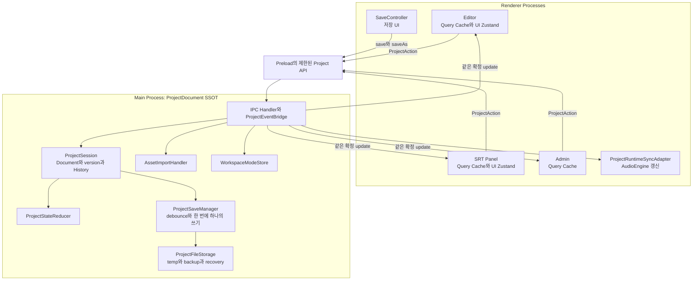

<details>
<summary>목차 펼쳐보기</summary>

- [1. 들어가며](#1-들어가며)
- [2. 이관 원칙](#2-이관-원칙)
- [3. 네 단계 이관](#3-네-단계-이관)
- [4. PR 분리](#4-pr-분리)
- [5. 검증 계획](#5-검증-계획)
- [6. 선택의 비용](#6-선택의-비용)
- [7. 조건부 최적성](#7-조건부-최적성)
- [8. 남은 결정](#8-남은-결정)
- [9. 최종 구조](#9-최종-구조)
- [10. 처음 질문에 대한 답](#10-처음-질문에-대한-답)
- [11. 마치며](#11-마치며)

</details>

[이전 글: Part 5. 자동저장의 책임과 디스크 저장 보장](/posts/electron-main-process-autosave)

## 1. 들어가며

설계가 정리되어도 기존 Renderer Store와 Undo/Redo와 자동저장을 한 PR에서 모두 제거할 수는 없었다. 아직 Main으로 옮기지 않은 기능의 상태가 저장에서 빠질 수 있고 같은 기능에 두 History가 생길 수 있다.

결론부터 적으면, **기반 타입과 Main 흐름을 먼저 추가한 뒤 SRT부터 기능별로 변경 권한을 옮기고 마지막에 기존 Store와 저장 코드를 제거한다**. 각 단계는 독립적으로 build와 test가 통과해야 한다.

이 글의 "해결"은 구현 완료 후 측정된 결과가 아니다. 현재 근거로 설계가 줄이려는 위험을 뜻한다. 실제 효과는 아래 검증 계획으로 확인해야 한다.

## 2. 이관 원칙

### 2-1. 기능별 전환

프로젝트 전체를 한 번에 바꾸지 않는다. SRT text, SRT time range, Timeline 배치, split처럼 변경 단위를 나눈다.

각 기능은 어느 한 시점부터 다음 규칙을 따른다.

- 전환 전: 기존 Renderer Store와 History가 변경 권한을 가진다.
- 전환 후: Main `ProjectSession`만 변경 권한을 가진다.

같은 기능에 두 변경 경로를 동시에 열어 두지 않는다.

### 2-2. 읽기와 쓰기 분리

처음에는 Main snapshot을 읽는 화면을 추가하되 기존 쓰기 경로를 유지할 수 있다. 하지만 쓰기 경로 전환 시점에는 feature flag 하나로 기존 path와 Main action path 중 하나만 활성화한다.

### 2-3. 제거는 마지막

새 경로가 검증되기 전에 기존 Store와 History를 삭제하지 않는다. 반대로 전환이 끝난 기능의 이전 코드는 오래 유지하지 않는다. 두 경로가 오래 공존하면 어떤 값이 원본인지 다시 불명확해진다.

## 3. 네 단계 이관

### 3-1. 1단계: 타입과 순수 reducer

먼저 Electron과 React에 의존하지 않는 타입을 만든다.

- `ProjectDocument`
- `ProjectSnapshot`
- `ProjectAction`
- `ProjectPatch`
- `ProjectUpdateResult`
- `ProjectHistoryEntry`

action별 reducer와 inverse patch를 단위 테스트한다. 이 단계에서는 기존 화면 동작을 바꾸지 않는다.

### 3-2. 2단계: Main 흐름

다음 구성요소를 추가한다.

- `ProjectSession`
- IPC Handler와 `ProjectEventBridge`
- 최초 구독 handshake
- `ProjectSaveManager`
- 비동기 `ProjectFileStorage`
- `AssetImportHandler`

Main state update와 file write를 분리하고 IPC 입력값을 검증한다. Renderer에 Electron API 전체를 노출하지 않고 action별 Preload API만 노출한다. Electron 공식 IPC guide도 `ipcRenderer.send` 전체를 직접 노출하지 말고 필요한 API만 제한하라고 안내한다. [Electron IPC](https://www.electronjs.org/docs/latest/tutorial/ipc)

### 3-3. 3단계: Renderer 소비 경로

SRT부터 다음 순서로 전환한다.

1. `ProjectEventAdapter`와 TanStack Query Cache 연결
2. SRT component가 `ProjectSnapshot`을 읽도록 변경
3. SRT 입력이 `ProjectAction`을 보내도록 변경
4. SRT Undo/Redo를 Main History로 전환
5. 기존 SRT Store의 프로젝트 원본과 History 제거

이후 Timeline 배치와 split을 같은 방식으로 옮긴다. AudioEngine이 필요한 기능은 `ProjectRuntimeSyncAdapter`를 함께 추가한다.

Renderer `SaveController`는 Main 자동저장이 안정된 뒤 저장 UI 역할만 남긴다.

### 3-4. 4단계: 기존 구조 정리

- Renderer의 프로젝트 자동저장 제거
- IndexedDB의 project document 원본 저장 제거
- 중복된 프로젝트 Zustand Store 제거
- 전환이 끝난 Renderer History 제거
- 사용하지 않는 asset 정리 정책 적용

UI Zustand와 runtime cache까지 제거하지 않는다. 삭제 기준은 "Zustand인가"가 아니라 "Main ProjectDocument와 같은 원본을 다시 소유하는가"다.

## 4. PR 분리

PR은 라인 수가 아니라 한 가지 변경 목적을 기준으로 나눈다.

### 4-1. 기반 타입 PR

- 공통 타입
- 순수 reducer
- forward patch와 inverse patch 테스트

기존 제품 동작은 바꾸지 않는다.

### 4-2. Main 흐름 PR

- `ProjectSession`
- IPC request와 event
- 구독 handshake
- `ProjectSaveManager`

Renderer의 기존 소비자는 아직 유지할 수 있다.

### 4-3. 기능별 전환 PR

- SRT read path와 action path 전환
- SRT Main History 전환
- Timeline read path와 action path 전환
- Timeline Runtime Sync Adapter

SRT와 Timeline은 검증 범위와 회귀 위험이 다르므로 별도 PR로 나눈다.

### 4-4. 정리 PR

- 사용하지 않는 Store와 History 삭제
- 이전 SaveController 로직 삭제
- 임시 feature flag 삭제

각 PR은 `test`, `typecheck`, `lint`, `build`가 통과해야 다음 PR의 base가 된다.

## 5. 검증 계획

### 5-1. 상태 일치

| 시나리오 | 기대 결과 |
| --- | --- |
| Editor에서 SRT 수정 | Main version이 한 번 증가하고 열린 모든 창이 같은 version을 가진다. |
| 요청 응답과 event 중복 | Renderer가 한 번만 적용한다. |
| 중간 version event 누락 | Renderer가 전체 snapshot을 다시 받아 복구한다. |
| 새 Script Panel 창 열기 | Main의 최신 snapshot으로 시작한다. |
| Admin 탭 진입 | 디스크 재조회 없이 Main 기준 최신 상태를 표시한다. |

### 5-2. Undo와 Redo

- 다른 창에서 실행한 Undo 결과가 모든 창에 반영되는지 확인한다.
- drag 한 번이 History entry 한 개가 되는지 확인한다.
- Main document와 AudioEngine region 구조를 비교한다.
- Undo가 참조하는 asset이 보존되는지 확인한다.
- 전환한 기능에 Renderer History가 남아 있지 않은지 확인한다.

### 5-3. 저장과 장애

- 자동저장과 수동 저장이 같은 파일에 동시에 쓰지 않는지 확인한다.
- 저장 중 새 version이 들어오면 최신 snapshot이 이어서 저장되는지 확인한다.
- 새 프로젝트가 recovery 폴더에 저장되는지 확인한다.
- 정상 종료 시 pending 저장을 flush하는지 확인한다.
- Renderer 강제 종료 후 Main session이 유지되는지 확인한다.
- 파일 쓰기 실패 후 dirty와 error 상태가 유지되는지 확인한다.
- 오래된 TTS 결과가 최신 item을 덮지 않는지 확인한다.

### 5-4. 성능

구조 변경 전과 후에 같은 대표 프로젝트로 측정한다.

- action 요청부터 화면 반영까지의 시간
- Main event loop 지연
- snapshot과 patch payload byte 크기
- project file 저장 시간
- SRT row 하나 수정 시 리렌더된 component 수

현재는 기준 수치가 없으므로 성능 개선을 주장할 수 없다. 먼저 기존값을 측정하고 제품 허용값을 정해야 한다.

### 5-5. version 규칙 테스트

아래 테스트는 중복과 정상 다음 version과 gap을 분리한다.

```ts
// project-version.test.ts
import { describe, expect, it } from 'vitest';

function decideUpdate(currentVersion: number, receivedVersion: number): 'ignore' | 'apply' | 'reload' {
  if (receivedVersion <= currentVersion) {
    return 'ignore';
  }

  if (receivedVersion === currentVersion + 1) {
    return 'apply';
  }

  return 'reload';
}

describe('project update version', () => {
  it.each([
    { current: 3, received: 3, expected: 'ignore' },
    { current: 3, received: 4, expected: 'apply' },
    { current: 3, received: 5, expected: 'reload' },
  ] as const)('$current -> $received uses $expected', ({ current, received, expected }) => {
    expect(decideUpdate(current, received)).toBe(expected);
  });
});
```

## 6. 선택의 비용

### 6-1. 줄이려는 위험

- 편집 state와 저장 state가 서로 다른 Store를 읽는 위험
- 창마다 Undo/Redo 결과가 달라지는 위험
- 새 창이 이전 디스크 version으로 시작하는 위험
- Renderer 종료와 함께 자동저장이 끊기는 위험

### 6-2. 새로 드는 비용

- 저장 가능한 모든 변경이 IPC를 거친다.
- type-safe patch 종류를 관리해야 한다.
- `ProjectRuntimeSyncAdapter`를 구현하고 검증해야 한다.
- 최초 구독 buffer와 version gap 복구가 필요하다.
- 이관 중 기존 경로와 새 경로를 함께 이해해야 한다.

SSOT를 Main으로 옮긴다고 복잡성이 사라지지는 않는다. 복잡성을 최종값 결정과 복구 규칙이 보이는 위치로 옮긴다.

## 7. 조건부 최적성

이 설계를 모든 Electron 앱의 최적 구조라고 말할 수는 없다. 다음 조건에서 이 프로젝트에 적합한 후보라고 판단했다.

1. 여러 Renderer가 같은 로컬 프로젝트 문서를 편집한다.
2. Main에는 직렬화 가능한 문서만 둔다.
3. Main state update는 짧고 동기적이다.
4. 무거운 작업은 비동기 I/O나 별도 process로 분리한다.
5. Renderer cache 갱신 비용이 허용 범위 안에 있다.

다음 측정 결과가 나오면 결정을 다시 검토한다.

- 큰 snapshot에서 TanStack Query structural sharing 비용이 크다.
- patch 수가 지나치게 늘어 유지보수가 어렵다.
- IPC latency가 입력 UX의 허용값을 넘는다.
- AudioEngine rebuild fallback 시간이 너무 길다.

이 경우 cache를 기능별 query로 나누거나 읽기 전용 Zustand를 비교할 수 있다. 단 query를 나누면 여러 조각의 version을 함께 맞추는 규칙이 추가된다.

## 8. 남은 결정

현재 증거만으로 확정할 수 없는 항목이다.

1. 자동저장이 허용하는 최대 데이터 손실 시간
2. action 응답 전 복구용 변경 기록이 필요한지 여부
3. 같은 SRT row의 충돌을 거절할지 merge UI를 제공할지 여부
4. 앱 재실행 후 History를 복원할지 여부
5. History와 asset의 보존 기간
6. action latency와 Main event loop 지연의 허용값

이 결정을 숨기고 구조를 완료된 답으로 표현하지 않는다. 제품 정책과 측정값이 생기면 문서를 갱신한다.

## 9. 최종 구조



## 10. 처음 질문에 대한 답

### 10-1. 프로젝트 문서의 SSOT

Main `ProjectSession`에 둔다. 단 Main에 모든 UI state를 두지는 않는다.

### 10-2. Renderer의 상태

TanStack Query Cache에 읽기 전용 `ProjectSnapshot`을 둔다. UI와 AudioEngine runtime state는 Renderer Zustand와 실행 객체에 남긴다.

### 10-3. 자동저장

Main `ProjectSaveManager`가 담당한다. Renderer `SaveController`는 저장 요청과 상태 표시를 담당한다.

### 10-4. Undo와 Redo

Main은 직렬화 가능한 document patch History를 관리한다. Renderer `ProjectRuntimeSyncAdapter`는 확정 결과를 AudioEngine에 반영한다.

### 10-5. 일반 IPC와 MessagePort

저장 가능한 변경과 낮은 빈도 event는 일반 IPC를 사용한다. 연속 playhead처럼 저장하지 않는 고빈도 event는 측정 후 MessagePort를 검토한다.

## 11. 마치며

이번 설계에서 가장 크게 배운 것은 Store를 한 곳에 모으는 방법이 아니었다. **상태마다 최종 변경 권한과 수명주기와 복구 기준을 따로 정하는 관점**이었다.

Main SSOT는 상태 복사본을 없애지 않는다. 복사본이 원본처럼 수정되는 일을 막는다. 자동저장을 Main으로 옮겨도 모든 disk write가 즉시 보장되지는 않는다. 보장 수준을 분리해서 말해야 한다. Undo/Redo를 Main으로 옮겨도 AudioEngine까지 Main에 둘 필요는 없다. 문서와 실행 상태를 나누면 된다.

좋은 구조는 가장 많은 기술을 넣은 구조가 아니라 어떤 조건에서 선택했고 어떤 측정에서 다시 바꿀지 설명할 수 있는 구조라는 것을 다시 확인했다.

[시리즈 처음부터 읽기: Part 1. Electron 멀티 윈도우에서 저장 결과가 달라진 이유](/posts/electron-multi-window-state-ssot)

---

## 참고

**Electron 공식 문서**

- [Process Model](https://www.electronjs.org/docs/latest/tutorial/process-model)
- [Inter-Process Communication](https://www.electronjs.org/docs/latest/tutorial/ipc)
- [MessagePorts in Electron](https://www.electronjs.org/docs/latest/tutorial/message-ports)
- [Electron Performance](https://www.electronjs.org/docs/latest/tutorial/performance)

**React와 상태 cache 공식 문서**

- [React useSyncExternalStore](https://react.dev/reference/react/useSyncExternalStore)
- [TanStack Query Overview](https://tanstack.com/query/latest/docs/framework/react/overview)
- [TanStack Query QueryClient](https://tanstack.com/query/latest/docs/reference/QueryClient)
