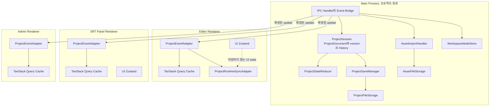

<details>
<summary>목차 펼쳐보기</summary>

- [1. 들어가며](#1-들어가며)
- [2. SSOT의 범위](#2-ssot의-범위)
- [3. SSOT 위치 비교](#3-ssot-위치-비교)
- [4. Class private field와 Vanilla Zustand 비교](#4-class-private-field와-vanilla-zustand-비교)
- [5. 상태 분류](#5-상태-분류)
- [6. Main과 Renderer의 책임](#6-main과-renderer의-책임)
- [7. 전체 구조](#7-전체-구조)
- [8. 최소 구현](#8-최소-구현)
- [9. 선택의 조건](#9-선택의-조건)
- [10. 마치며](#10-마치며)

</details>

[이전 글: Part 1. Electron 멀티 윈도우에서 저장 결과가 달라진 이유](/posts/electron-multi-window-state-ssot)

## 1. 들어가며

앞선 글에서 같은 프로젝트 값을 여러 Renderer Store가 각각 수정하고 있다는 문제를 확인했다. 이제 최종값을 정하는 위치를 선택해야 했다. 후보는 Renderer별 Store 유지, 특정 Renderer 지정, Main `ProjectSession` 세 가지였다.

결론부터 적으면, **직렬화 가능한 `ProjectDocument`와 version과 Undo/Redo History를 Main `ProjectSession`이 소유하도록 설계했다**. Main 내부에는 먼저 TypeScript Class의 private field를 사용한다. Vanilla Zustand는 현재 필요한 기능이 생겼을 때 다시 검토한다.

## 2. SSOT의 범위

### 2-1. 이 글의 정의

이 글에서 SSOT는 최종값을 확정하는 권한이 한 곳에 있다는 뜻이다. 값의 복사본이 한 벌만 존재한다는 뜻은 아니다.

- Main의 `ProjectDocument`: 최종 확정 상태
- Renderer의 `ProjectSnapshot`: 화면 표시용 읽기 전용 복사본
- 디스크의 `project.json`: 마지막으로 저장이 완료된 상태

디스크 파일은 저장 debounce 동안 Main memory보다 이전 version일 수 있다. 따라서 앱이 실행 중일 때 최신 상태의 기준은 Main memory다.

### 2-2. Main에 두는 상태

- 프로젝트 기본 정보
- SRT row
- Timeline item 배치
- asset 참조
- 프로젝트 version
- Undo/Redo History
- 현재 프로젝트 경로와 저장 상태

### 2-3. Main에 두지 않는 상태

- 모달 열림 여부
- hover와 focus
- 드래그 중인 임시 좌표
- 연속 playhead 위치
- DOM Node
- `AudioBuffer`와 AudioEngine 실행 객체

후자의 값들은 프로젝트 파일에 그대로 저장할 수 없거나 특정 Renderer의 화면과 실행 환경에만 필요하다.

## 3. SSOT 위치 비교

| 후보 | 장점 | 비용과 한계 |
| --- | --- | --- |
| Renderer별 Store 유지 | 기존 수정량이 작다. | 최종값 결정 규칙과 저장 전 조립이 계속 필요하다. |
| Editor Renderer 지정 | 웹 앱의 상위 Store와 비슷하다. | Editor가 닫히면 수명주기가 끊기고 Admin 중심 흐름이 복잡해진다. |
| Main `ProjectSession` | 창과 독립적인 수명주기와 로컬 파일 접근을 함께 가진다. | 모든 저장 가능한 변경이 IPC를 거친다. |

Electron 공식 문서에서 Main Process는 앱의 entry point이며 창과 앱 생명주기를 관리한다. 각 `BrowserWindow`는 별도 Renderer Process를 만든다. [Electron Process Model](https://www.electronjs.org/docs/latest/tutorial/process-model)

이 사실만으로 Main SSOT가 정답이 되지는 않는다. 이 프로젝트에서는 다음 조건이 함께 있었기 때문에 Main을 선택했다.

1. 여러 Renderer가 같은 프로젝트를 편집한다.
2. 프로젝트 파일 저장이 Main을 거친다.
3. Editor가 닫혀도 Script Panel이나 Admin이 남을 수 있다.
4. 저장과 Undo/Redo가 같은 문서를 사용해야 한다.

## 4. Class private field와 Vanilla Zustand 비교

<details>
<summary>상태 도구 선택 근거 펼쳐보기</summary>

### 4-1. 처음 고려한 구조

처음에는 `ProjectSession` Class 안에 Vanilla Zustand Store를 넣으려 했다. Zustand의 `createStore`는 React Hook 없이 `getState`, `setState`, `subscribe`를 제공한다. [Zustand createStore](https://zustand.docs.pmnd.rs/apis/create-store)

하지만 "Main에 React가 없다"는 사실은 Vanilla Zustand를 써야 하는 근거가 아니었다. 필요한 기능을 다시 적어 보았다.

- 현재 문서 읽기
- action으로 문서 변경
- version 증가
- History 기록
- 변경 결과 발행
- 자동저장 요청

이 기능은 Class의 private field와 method만으로 구현할 수 있었다.

### 4-2. private field 선택

`ProjectSession`이 이미 변경 method를 제공한다면 외부에서 `setState`를 직접 호출하게 할 이유가 없다. 오히려 setter가 두 개가 되면 변경 규칙을 우회할 수 있다.

| 기준 | Class private field | Class 안의 Vanilla Zustand |
| --- | --- | --- |
| 상태 은닉 | private로 강제 가능 | Store API 노출 범위를 따로 막아야 한다. |
| selector 구독 | 직접 구현 필요 | 기본 제공한다. |
| middleware | 직접 구현 필요 | 생태계를 사용할 수 있다. |
| 현재 요구사항 | 충분하다. | 기능이 겹친다. |

따라서 현재 설계에서는 private field를 선택했다. 이것은 Zustand가 부적합하다는 일반 결론이 아니다.

### 4-3. 다시 검토할 조건

다음 중 하나가 실제 요구사항이 되면 Vanilla Zustand를 다시 비교한다.

- Main 내부 여러 모듈이 서로 다른 selector로 상태를 구독한다.
- Store middleware가 직접 구현보다 단순하다.
- 상태 추적 도구가 필요하다.
- 성능 측정에서 selector 단위 구독이 필요하다고 확인된다.

</details>

## 5. 상태 분류

상태를 세 종류로 나누었다.

| 상태 | 위치 | 변경 권한 | 예시 |
| --- | --- | --- | --- |
| `ProjectDocument` | Main | Main만 가짐 | SRT, Timeline, asset 참조 |
| `ProjectSnapshot` | 각 Renderer cache | 읽기 전용 | 화면에 표시할 확정 프로젝트 |
| UI와 runtime state | 각 Renderer | 해당 Renderer | selection, drag preview, AudioEngine |

Renderer에 Zustand가 남는 이유도 여기서 분명해졌다. **화면 리렌더가 필요한 모든 상태가 아니라 Renderer만 알아도 되는 UI와 runtime 상태를 관리하기 위해서**다. Main의 프로젝트 원본을 다시 소유하기 위해 쓰는 것은 아니다.

## 6. Main과 Renderer의 책임

### 6-1. Main

- `ProjectSession`: action 검증과 state update와 version과 History
- `ProjectStateReducer`: 이전 문서와 action으로 다음 문서 계산
- `ProjectEventBridge`: 확정된 변경 결과를 열린 Renderer에 발행
- `ProjectSaveManager`: debounce와 저장 상태와 종료 전 flush
- `ProjectFileStorage`: project file 읽기와 쓰기와 교체
- `AssetImportHandler`: 로컬 미디어 복사 후 `AssetRef` 생성
- `WorkspaceModeStore`: Editor와 Studio의 동시 진입 방지

### 6-2. Renderer

- `ProjectEventAdapter`: Main event를 받아 cache 갱신
- TanStack Query Cache: `ProjectSnapshot` 읽기 전용 복사본
- `ProjectRuntimeSyncAdapter`: document 변경을 AudioEngine에 반영
- UI Zustand: selection과 modal과 drag preview
- `SaveController`: 저장 버튼과 저장 상태 UI
- `AssetImportController`: 파일 선택 UI와 import 요청

### 6-3. ProjectSession이 하지 않는 일

`ProjectSession`이 Main의 모든 일을 맡으면 다시 큰 Class가 된다. 다음 책임은 밖으로 뺐다.

- 파일 포맷과 실제 파일 쓰기
- debounce timer
- IPC 구독자 목록
- `AudioBuffer` 생성
- React cache 갱신

`ProjectSession`은 프로젝트 상태 변경 규칙에만 집중한다.

## 7. 전체 구조

색상을 직접 지정하지 않고 Mermaid 기본 theme를 사용했다. 밝은 화면과 어두운 화면에서 글자 대비를 theme가 결정하도록 하기 위해서다.



## 8. 최소 구현

<details>
<summary>최소 구현 코드 펼쳐보기</summary>

아래 예제는 SRT text 변경만 포함한 최소 TypeScript 코드다. reducer는 사이드이펙트가 없고 `ProjectSession`만 version과 event를 관리한다.

```ts
// project-session.ts
export interface ProjectDocument {
  rows: Record<string, { id: string; text: string }>;
}

export type ProjectAction = {
  type: 'srt/textChanged';
  rowId: string;
  text: string;
};

export interface ProjectUpdateResult {
  version: number;
  document: ProjectDocument;
}

export function applyProjectAction(document: ProjectDocument, action: ProjectAction): ProjectDocument {
  return {
    ...document,
    rows: {
      ...document.rows,
      [action.rowId]: {
        ...document.rows[action.rowId],
        text: action.text,
      },
    },
  };
}

export class ProjectSession {
  #document: ProjectDocument;
  #version = 0;

  constructor(document: ProjectDocument) {
    this.#document = document;
  }

  dispatch(action: ProjectAction): ProjectUpdateResult {
    this.#document = applyProjectAction(this.#document, action);
    this.#version += 1;

    return { version: this.#version, document: this.#document };
  }
}
```

순수 reducer는 다음처럼 검증할 수 있다.

```ts
// project-session.test.ts
import { expect, it } from 'vitest';
import { applyProjectAction } from './project-session';

it('changes only the selected SRT row', () => {
  const before = {
    rows: {
      a: { id: 'a', text: 'before' },
      b: { id: 'b', text: 'keep' },
    },
  };

  const after = applyProjectAction(before, {
    type: 'srt/textChanged',
    rowId: 'a',
    text: 'after',
  });

  expect(after.rows.a.text).toBe('after');
  expect(after.rows.b).toBe(before.rows.b);
});
```

실제 구현에서는 전체 document 대신 type-safe patch를 결과로 보낸다. 이 부분은 다음 글에서 다룬다.

</details>

## 9. 선택의 조건

이 설계는 다음 조건에서 적합하다고 판단했다.

1. Main에는 직렬화 가능한 프로젝트 문서만 둔다.
2. `dispatch`, `undo`, `redo`의 state update는 짧고 동기적으로 끝낸다.
3. 파일 I/O와 미디어 처리는 state update 밖에서 비동기로 실행한다.
4. Renderer는 Main의 확정 상태를 직접 수정하지 않는다.

Main에서 긴 동기 작업을 실행하면 앱 전체 응답성에 영향을 줄 수 있다. CPU 사용이 큰 작업은 측정 후 Worker나 Electron Utility Process로 분리해야 한다. Electron 문서도 Utility Process를 CPU 집약적이거나 장애 가능성이 큰 작업의 분리 수단으로 설명한다. [Electron Process Model](https://www.electronjs.org/docs/latest/tutorial/process-model#the-utility-process)

## 10. 마치며

이번 선택에서 중요했던 것은 상태 도구의 기능 수가 아니었다. 필요한 기능보다 도구가 더 많은지 먼저 확인했다. 현재 `ProjectSession`에는 Class private field가 충분했다.

동시에 Renderer의 Store를 모두 없애지 않았다. 프로젝트 원본과 UI state는 수명주기와 변경 권한이 다르기 때문이다. 다음 글에서는 Renderer가 Main의 확정 결과를 받아 화면을 갱신하는 방법을 정리한다.

[다음 글: Part 3. Renderer가 Main의 확정 상태를 받는 방법](/posts/electron-main-process-renderer-sync)

---

## 참고

**Electron 공식 문서**

- [Process Model](https://www.electronjs.org/docs/latest/tutorial/process-model)
- [Inter-Process Communication](https://www.electronjs.org/docs/latest/tutorial/ipc)

**상태 관리 공식 문서**

- [Zustand createStore](https://zustand.docs.pmnd.rs/apis/create-store)
