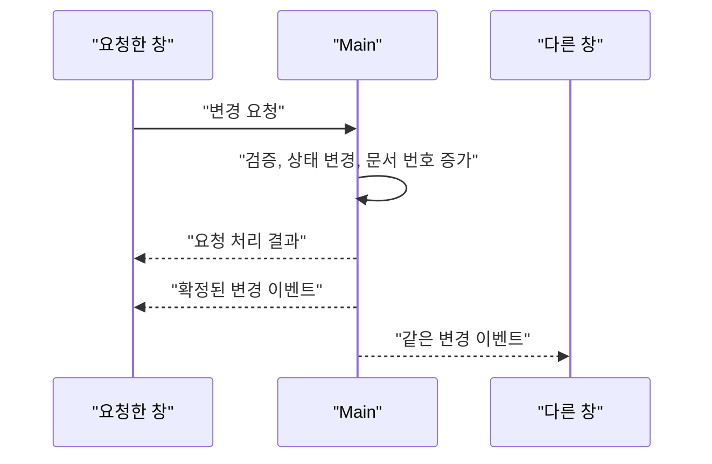

목차 펼쳐보기

- [1. 원본과 화면용 복사본을 구분했다](#1-원본과-화면용-복사본을-구분했다)
- [2. Main이 관리할 상태의 경계](#2-main이-관리할-상태의-경계)
- [3. Main을 선택한 이유](#3-main을-선택한-이유)
- [4. 변경 요청과 확정 결과](#4-변경-요청과-확정-결과)
- [5. 문서 번호로 누락을 찾는다](#5-문서-번호로-누락을-찾는다)
- [6. Main과 각 창의 책임](#6-main과-각-창의-책임)
- [7. 마치며](#7-마치며)

[이전 글: Part 1. Electron 멀티 윈도우에서 저장 결과가 달라진 이유](/posts/electron-multi-window-state-ssot)

## 1. 원본과 화면용 복사본을 구분했다

앞선 글에서 저장과 화면이 서로 다른 상태를 읽고 있다는 문제를 확인했다. 해결하려면 모든 창이 공유하는 프로젝트의 최종값을 한 곳에서 정해야 했다.

여기서 “한 곳”은 값의 복사본이 하나뿐이라는 뜻이 아니다. 각 창은 화면을 그리기 위해 프로젝트 값의 복사본을 가질 수 있다. 다만 복사본이 최종값을 직접 결정하지 않는다.

> Main이 프로젝트의 최종 상태를 정하고, 각 창은 그 결과를 받아 화면을 갱신한다.

이 글에서 사용하는 내부 이름

- 프로젝트 상태 관리자: ProjectSession
- 저장 가능한 프로젝트 상태: ProjectDocument
- 화면용 복사본: ProjectSnapshot
- 변경 요청: ProjectAction
- 확정된 변경 결과: ProjectUpdate

본문에서는 역할을 중심으로 설명하고, 내부 이름은 구현 경계를 구분할 때만 사용한다.

## 2. Main이 관리할 상태의 경계

Main에는 프로젝트 파일에 저장되는 값과 그 변경 이력만 둔다.

| 구분                      | 위치    | 예시                                           |
| ------------------------- | ------- | ---------------------------------------------- |
| 저장 가능한 프로젝트 상태 | Main    | 자막, Timeline 배치, asset 참조, 프로젝트 설정 |
| 화면용 복사본             | 각 창   | Main이 확정한 프로젝트 상태                    |
| UI와 실행 상태            | 해당 창 | 선택, 모달, 드래그 좌표, 재생 객체             |

오디오 버퍼나 Timeline 실행 객체는 Main으로 옮기지 않았다. 특정 창의 실행 환경에 속하고 프로젝트 파일에 그대로 저장할 수도 없기 때문이다.

이 경계를 먼저 정하니 Zustand나 TanStack Query를 어디에 쓸지도 단순해졌다. 도구가 상태의 소유권을 정하는 것이 아니라, 이미 정한 책임에 맞춰 도구를 배치했다.

## 3. Main을 선택한 이유

프로젝트의 최종 상태를 둘 위치로 세 가지를 비교했다.

| 후보               | 장점                                         | 한계                                           |
| ------------------ | -------------------------------------------- | ---------------------------------------------- |
| 각 창의 Store 유지 | 기존 코드 변경이 작다.                       | 저장 전 상태 조립과 충돌 규칙이 계속 필요하다. |
| 특정 편집 창       | 웹 앱의 상위 Store와 비슷하다.               | 그 창이 닫히면 상태 수명주기가 끊긴다.         |
| Main               | 창과 독립적으로 상태와 파일 저장을 관리한다. | 저장 가능한 변경이 IPC를 거친다.               |

이 프로젝트에는 다음 조건이 함께 있었다.

1. 여러 창이 같은 로컬 프로젝트를 편집한다.
2. 프로젝트 파일 저장은 Main의 파일 시스템 접근을 거친다.
3. 편집 창이 닫혀도 보조 패널이나 관리 화면이 남을 수 있다.
4. 저장과 Undo/Redo가 같은 프로젝트 상태를 사용해야 한다.

그래서 Main을 선택했다. Electron이 이 구조를 강제해서가 아니라, 이 앱의 창 수명주기와 저장 조건에 가장 잘 맞았기 때문이다.

Main과 Renderer의 도구 선택

Main의 프로젝트 상태 관리자는 별도 상태 라이브러리 없이 Class field와 method로 시작한다. 필요한 기능은 현재 상태 읽기, 변경 적용, 문서 번호 증가, 이력 기록과 결과 발행이다.

TypeScript의 `private`는 주로 컴파일 시점 접근을 제한한다. 런타임에서도 field 접근을 막아야 한다면 ECMAScript private field인 `#document`를 사용해야 한다.

각 창의 화면용 복사본은 기존 비동기 데이터 흐름을 재사용하기 위해 TanStack Query Cache에 둔다. 이때 query key에는 프로젝트 식별자를 포함하고, 자동 refetch, retry, `gcTime`은 Main 이벤트와 재연결 규칙에 맞게 명시한다. Cache 값은 직접 변경하지 않고 불변 갱신한다.

Main 내부에 selector 구독이나 middleware가 실제로 필요해지면 Vanilla Zustand를 다시 비교할 수 있다. 지금은 필요한 기능보다 도구가 더 많기 때문에 도입하지 않는다.

- [TanStack Query QueryClient](https://tanstack.com/query/latest/docs/reference/QueryClient)
- [TanStack Query Important Defaults](https://tanstack.com/query/latest/docs/framework/react/guides/important-defaults)

## 4. 변경 요청과 확정 결과

각 창은 수정한 전체 프로젝트를 보내지 않는다. “자막 문장을 바꾼다”처럼 사용자의 의도를 담은 변경 요청을 Main에 보낸다.

Main은 요청을 검증하고 프로젝트 상태를 바꾼다. 이후 새 문서 번호와 확정된 변경 결과를 모든 관련 창에 보낸다.

요청 응답은 성공 여부와 요청 식별자만 전달한다. 실제 화면 갱신은 요청한 창을 포함한 모든 창이 같은 이벤트 처리 경로를 사용한다. 이렇게 하면 요청 응답과 이벤트에 같은 변경 내용을 중복해서 적용하지 않아도 된다.

변경 결과의 세부 형식

확정된 변경 결과에는 최소한 다음 정보가 필요하다.

- 프로젝트 식별자
- 순서가 계속 증가하는 문서 번호
- 변경된 값

요청 식별자는 요청 재시도나 로그 연결에 사용할 수 있다. 문서 번호는 변경 적용 순서와 이벤트 누락을 판단한다. 두 값의 역할을 섞지 않는다.

평상시에는 변경된 부분만 보내고, 새 창을 열거나 이벤트 누락을 복구할 때는 전체 프로젝트 상태를 보낸다. 범용 문자열 경로보다 프로젝트 변경 종류가 드러나는 형태를 사용하면 잘못된 경로를 줄일 수 있다.

## 5. 문서 번호로 누락을 찾는다

각 창은 마지막으로 적용한 문서 번호를 기억한다. 현재 번호가 12라면 다음처럼 처리한다.

| 받은 문서 번호 | 처리                                              |
| -------------- | ------------------------------------------------- |
| 12 이하        | 이미 적용한 결과이므로 무시한다.                  |
| 13             | 변경을 적용한다.                                  |
| 14 이상        | 중간 이벤트를 놓쳤으므로 전체 상태를 다시 받는다. |

이 규칙은 중복, 순서 역전과 이벤트 누락을 다룬다. 두 창이 같은 자막을 서로 다른 의도로 수정한 의미적 충돌까지 해결하지는 않는다.

새 창이 이벤트를 놓치지 않는 초기화 순서

새 창은 다음 순서로 시작한다.

1. 창 내부의 이벤트 listener를 먼저 등록한다.
2. Main에서 구독 등록과 현재 전체 상태 읽기를 하나의 동기 handler에서 처리한다.
3. 초기화 중 들어온 이벤트는 잠시 보관한다.
4. 전체 상태보다 큰 문서 번호의 이벤트만 순서대로 적용한다.
5. 창이 닫히면 listener와 구독을 정리한다.

구독 등록과 현재 상태 읽기 사이에 비동기 작업이 들어가면 다시 빈틈이 생긴다. 이 구간은 Main에서 중간 `await` 없이 처리해야 한다.

충돌, 오래된 작업과 고빈도 이벤트

두 창이 같은 자막을 수정할 때 단순히 도착 순서대로 적용하면 마지막 요청이 최종값이 된다. 충돌을 사용자에게 알려야 한다면 요청에 편집을 시작한 시점의 항목 번호를 포함하고, 현재 번호와 다를 때 Main이 거절하도록 설계할 수 있다.

TTS 생성이나 waveform 분석처럼 오래 걸리는 작업은 시작한 프로젝트, 대상 항목과 당시 문서 번호를 결과에 함께 둔다. 결과 적용 직전에 현재 상태와 비교하면 이미 닫힌 프로젝트나 바뀐 항목에 오래된 결과를 적용하는 일을 막을 수 있다.

연속 playhead와 drag preview처럼 저장하지 않는 고빈도 값은 먼저 해당 창의 local state로 처리한다. 실제 병목을 측정한 뒤에만 MessagePort 같은 별도 통신 경로를 검토한다.

## 6. Main과 각 창의 책임

Main은 다음 책임을 가진다.

- 변경 요청을 검증하고 프로젝트 상태에 반영한다.
- 문서 번호와 Undo/Redo 이력을 갱신한다.
- 확정된 변경 결과를 모든 관련 창에 보낸다.
- 최신 프로젝트 상태의 저장을 요청한다.

각 창은 다음 책임을 가진다.

- Main에서 받은 화면용 복사본을 그린다.
- 사용자 입력을 변경 요청으로 바꿔 Main에 보낸다.
- 확정된 결과를 재생 객체 같은 실행 상태에 반영한다.
- 선택, 모달, 드래그처럼 해당 창에만 필요한 UI 상태를 관리한다.

프로젝트 상태 관리자는 파일 쓰기, debounce timer, 창 구독자 목록과 React Cache까지 직접 맡지 않는다. 상태 변경 규칙 외의 책임은 별도 경계로 나눈다.

## 7. 마치며

각 창에 프로젝트 복사본이 있다고 해서 최종 상태가 여러 개가 되는 것은 아니다. 중요한 것은 복사본의 개수가 아니라 누가 변경을 확정하는가이다.

Main이 상태를 확정하고, 각 창은 같은 이벤트와 문서 번호를 따라간다. 다음 글에서는 화면 실행 객체에 묶여 있던 Undo/Redo를 이 구조 위에서 하나의 문서 이력으로 바꾼 과정을 설명한다.

[다음 글: Part 3. Undo/Redo를 하나의 문서 이력으로 통합하기](/posts/electron-main-process-undo-redo)

---

## 참고

- [Electron Process Model](https://www.electronjs.org/docs/latest/tutorial/process-model)
- [Electron IPC](https://www.electronjs.org/docs/latest/tutorial/ipc)
- [Electron ipcRenderer](https://www.electronjs.org/docs/latest/api/ipc-renderer)
