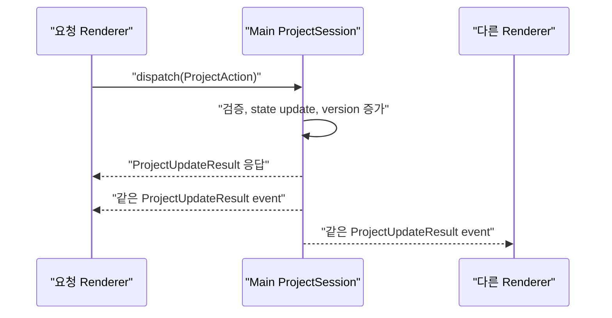

목차 펼쳐보기

- [1. 들어가며](#1-들어가며)
- [2. 읽기 전용 복사본](#2-읽기-전용-복사본)
  - [2-1. useSyncExternalStore가 값을 저장하는가](#2-1-usesyncexternalstore가-값을-저장하는가)
  - [2-2. 복사본과 두 번째 SSOT의 차이](#2-2-복사본과-두-번째-ssot의-차이)
- [3. Renderer cache 비교](#3-renderer-cache-비교)
  - [3-1. 기본값 조정](#3-1-기본값-조정)
- [4. 변경 요청과 확정 결과](#4-변경-요청과-확정-결과)
  - [4-1. 전체 흐름](#4-1-전체-흐름)
  - [4-2. 요청 Renderer도 event를 받는 이유](#4-2-요청-renderer도-event를-받는-이유)
  - [4-3. patch와 snapshot](#4-3-patch와-snapshot)
- [5. version 기반 동기화](#5-version-기반-동기화)
  - [5-1. 적용 규칙](#5-1-적용-규칙)
  - [5-2. 최초 구독의 빈틈](#5-2-최초-구독의-빈틈)
- [6. 탭과 창 초기화](#6-탭과-창-초기화)
  - [6-1. 탭 전환](#6-1-탭-전환)
  - [6-2. 새 창](#6-2-새-창)
  - [6-3. Editor와 Studio의 상호 배제](#6-3-editor와-studio의-상호-배제)
- [7. 임시 상태와 고빈도 event](#7-임시-상태와-고빈도-event)
  - [7-1. 일반 IPC와 MessagePort](#7-1-일반-ipc와-messageport)
- [8. 변경 순서 제어](#8-변경-순서-제어)
- [9. 마치며](#9-마치며)

시리즈 전체 글 바로가기

1. [Part 0. Main Process SSOT 시리즈를 시작하며](/posts/electron-main-process-ssot-series-guide)
2. [Part 1. Electron 멀티 윈도우에서 저장 결과가 달라진 이유](/posts/electron-multi-window-state-ssot)
3. [Part 2. Main Process에 ProjectDocument SSOT를 둔 이유](/posts/electron-main-process-project-ssot)
4. [Part 3. Renderer가 Main의 확정 상태를 받는 방법](/posts/electron-main-process-renderer-sync)
5. [Part 4. 흩어진 Undo/Redo를 Main History로 통합하기](/posts/electron-main-process-undo-redo)
6. [Part 5. 자동저장의 책임과 디스크 저장 보장](/posts/electron-main-process-autosave)
7. [Part 6. Main SSOT 설계를 검증하고 선택의 비용 정리하기](/posts/electron-main-process-migration)

[이전 글: Part 2. Main Process에 ProjectDocument SSOT를 둔 이유](/posts/electron-main-process-project-ssot)

## 1. 들어가며

Main에 원본을 두어도 Renderer에는 화면을 그릴 값이 필요하다. Main의 값을 React component가 매번 IPC로 읽는 방식은 render 흐름과 맞지 않는다. 각 Renderer에 읽기 전용 `ProjectSnapshot` 복사본을 두고 Main event가 올 때 갱신하는 편이 자연스러웠다.

결론부터 적으면, **Renderer의 `ProjectSnapshot`은 TanStack Query Cache에 저장하고 Main이 확정한 같은 `ProjectUpdateResult`를 요청 응답과 모든 창의 event에 사용한다**. `version`으로 중복을 무시하고 event 누락을 발견하면 전체 snapshot을 다시 읽는다.

## 2. 읽기 전용 복사본

### 2-1. useSyncExternalStore가 값을 저장하는가

React의 `useSyncExternalStore`는 외부 Store를 구독하는 Hook이다. 인자로 `subscribe`와 `getSnapshot`을 받는다. 값을 저장하는 공간 자체를 만들지는 않는다. [React useSyncExternalStore](https://react.dev/reference/react/useSyncExternalStore)

따라서 `useSyncExternalStore`만 사용하려면 snapshot을 보관할 별도 저장 공간이 필요하다. Hook은 그 저장 공간의 변경 알림을 React render로 연결한다.

### 2-2. 복사본과 두 번째 SSOT의 차이

Renderer cache는 Main의 값을 복사하지만 프로젝트 변경 권한은 없다.

- component는 cache를 읽는다.
- 사용자 입력은 `ProjectAction`으로 Main에 보낸다.
- Main의 확정 결과만 cache에 적용한다.
- Renderer가 임의로 확정값을 만들어 다른 창에 배포하지 않는다.

이 규칙이 지켜지면 복사본은 두 번째 SSOT가 아니다.

## 3. Renderer cache 비교

| 후보                                | 장점                                                                                  | 비용                                                                     |
| ----------------------------------- | ------------------------------------------------------------------------------------- | ------------------------------------------------------------------------ |
| 맞춤 Store와 `useSyncExternalStore` | 의존성이 없고 동작이 명시적이다.                                                      | selector와 version 처리와 개발 도구를 직접 만든다.                       |
| 읽기 전용 Zustand                   | selector 구독이 단순하다.                                                             | UI Zustand와 프로젝트 복사본의 용도를 이름과 API로 엄격히 구분해야 한다. |
| TanStack Query Cache                | 기존 query와 mutation 흐름을 재사용할 수 있고 `setQueryData`로 확정값을 넣을 수 있다. | 원격 요청용 기본값을 Electron local state에 맞게 조정해야 한다.          |

TanStack Query는 비동기 데이터의 가져오기와 cache 갱신을 제공한다. `queryClient.setQueryData`는 기존 cache 값을 동기적으로 갱신한다. [TanStack Query Overview](https://tanstack.com/query/latest/docs/framework/react/overview), [QueryClient](https://tanstack.com/query/latest/docs/reference/QueryClient)

이 프로젝트에는 이미 비동기 query 흐름이 있다는 가정으로 TanStack Query를 우선 선택했다. 다만 Electron Main은 HTTP 서버가 아니다. 자동 refetch가 정합성을 만들어 주는 것도 아니다. 정합성은 Main event와 version 규칙이 만든다.

### 3-1. 기본값 조정

TanStack Query의 기본값에는 stale query의 자동 refetch와 실패 query의 retry가 포함된다. local IPC cache에서는 focus 때마다 Main snapshot을 다시 가져올 이유가 없을 수 있다. 자동 refetch와 retry 여부는 Main event와 version 복구 규칙에 맞게 명시적으로 정한다. [TanStack Query Important Defaults](https://tanstack.com/query/latest/docs/framework/react/guides/important-defaults)

## 4. 변경 요청과 확정 결과

### 4-1. 전체 흐름

Renderer는 바뀐 전체 snapshot이 아니라 의도를 나타내는 `ProjectAction`을 보낸다.

Main은 action을 검증하고 state를 바꾼 뒤 `ProjectUpdateResult`를 만든다. 같은 결과를 요청 Renderer에 반환하고 열린 모든 Renderer에 event로 발행한다.

Electron은 `ipcRenderer.invoke`와 `ipcMain.handle`을 요청과 응답 패턴으로 안내한다. Main에서 Renderer로는 `webContents.send`를 사용할 수 있다. [Electron IPC](https://www.electronjs.org/docs/latest/tutorial/ipc)

### 4-2. 요청 Renderer도 event를 받는 이유

요청 Renderer만 응답을 적용하고 다른 Renderer만 event를 적용할 수도 있다. 하지만 경로가 두 개로 갈라진다. 요청 창을 포함한 모든 창이 같은 event 처리 함수를 사용하면 복구와 로깅이 단순해진다.

응답과 event가 모두 도착하므로 중복 가능성이 생긴다. `version`과 `actionId`로 한 번만 적용한다.

### 4-3. patch와 snapshot

매 변경마다 전체 프로젝트를 보내면 구현은 쉽지만 프로젝트가 커질수록 Structured Clone과 cache 갱신 비용이 늘어난다. 반대로 범용 JSON Patch를 바로 도입하면 path 문자열과 역변경 생성 규칙이 복잡해진다.

초기 설계는 두 가지를 함께 사용한다.

- 평상시: TypeScript union으로 정의한 type-safe patch
- 최초 구독과 event 누락 복구: 전체 `ProjectSnapshot`

## 5. version 기반 동기화

### 5-1. 적용 규칙

Renderer의 현재 version을 `12`라고 가정한다.

| 받은 version | 처리                                                 |
| ------------ | ---------------------------------------------------- |
| 12 이하      | 이미 적용한 결과이므로 무시한다.                     |
| 13           | patch를 적용한다.                                    |
| 14 이상      | 중간 event가 빠졌으므로 Main snapshot을 다시 읽는다. |

이 규칙은 중복과 순서 역전을 다룬다. 같은 SRT row를 두 창이 동시에 바꾸는 **의미적 충돌**까지 해결하지는 않는다.

### 5-2. 최초 구독의 빈틈

다음 순서에는 빈틈이 있다.

1. Renderer가 snapshot을 읽는다.
2. 다른 창이 상태를 바꾼다.
3. Renderer가 event listener를 등록한다.

2번 event를 놓칠 수 있다. 초기화 순서를 다음처럼 바꾼다.

1. Renderer가 local listener를 먼저 등록한다.
2. 초기화 중 들어오는 event를 buffer에 보관한다.
3. Main에 구독을 등록하고 현재 snapshot을 받는다.
4. snapshot보다 큰 version의 buffered event만 순서대로 적용한다.
5. 창이 닫힐 때 listener와 Main 구독을 정리한다.

이 handshake는 Electron이 자동 제공하는 기능이 아니라 앱에서 구현하는 동기화 규칙이다.

## 6. 탭과 창 초기화

### 6-1. 탭 전환

Admin 탭에 들어갈 때 디스크 파일을 다시 읽지 않는다. 자동저장이 debounce 중이면 디스크는 Main memory보다 이전 version일 수 있기 때문이다. 현재 Renderer의 Query Cache를 사용하고 version gap이 있으면 Main snapshot을 읽는다.

### 6-2. 새 창

새 Renderer는 위 handshake로 Main의 현재 snapshot을 받은 뒤 화면을 연다. 다른 Renderer의 Store를 복사하지 않는다.

### 6-3. Editor와 Studio의 상호 배제

Renderer별 route guard만으로는 다른 창의 현재 mode를 알 수 없다. Main이 현재 workspace mode를 확인하고 진입 요청을 허용하거나 거절한다. 이 값은 프로젝트 문서가 아니라 창 접근 규칙에 속한다.

## 7. 임시 상태와 고빈도 event

### 7-1. 일반 IPC와 MessagePort

region click과 특정 SRT row highlight는 event 빈도가 낮다. 일반 IPC로 충분하다. 연속 playhead와 drag preview처럼 매우 자주 바뀌고 저장하지 않는 값은 먼저 Renderer local state로 처리한다.

MessagePort는 지속적인 양방향 message 흐름을 만들 수 있다. 다만 연결 수명주기와 오류 처리가 추가된다. 측정 없이 클릭 event까지 MessagePort로 바꾸지 않는다. [Electron MessagePorts](https://www.electronjs.org/docs/latest/tutorial/message-ports)

문서에 반영할 drag는 pointer move마다 보내지 않고 drag가 끝났을 때 하나의 action으로 확정한다.

## 8. 변경 순서 제어

모든 action 앞에 전역 queue를 먼저 만들지는 않았다. `dispatch`, `undo`, `redo`가 Main에서 짧은 동기 state update로 끝나고 중간에 `await`가 없다면 한 callback 실행 중 다른 callback이 끼어들지 않는다. Node.js JavaScript callback은 event loop에서 실행된다. [Node.js Event Loop](https://nodejs.org/en/learn/asynchronous-work/event-loop-timers-and-nexttick)

단 다음 조건에서는 별도 제어가 필요하다.

- action 응답 전에 디스크 쓰기를 기다린다.
- 하나의 state update 중간에 비동기 작업이 들어간다.
- 오래 걸린 분석 결과가 나중에 도착한다.

오래 걸린 작업에는 시작 시점의 대상과 version을 함께 기록하고 결과를 적용하기 직전에 현재 값과 비교한다. 이 방식은 모든 action을 하나의 비동기 queue에 넣는 것이 아니라 오래된 결과를 거절하는 방식이다.

## 9. 마치며

Renderer cache를 둔다고 SSOT가 두 개가 되는 것은 아니었다. 중요한 기준은 복사본의 존재가 아니라 변경 권한이었다.

TanStack Query도 동기화 규칙을 대신하지 않는다. cache를 React에 연결하는 도구일 뿐이다. Main이 확정한 update와 version과 gap 복구가 여러 창의 상태를 맞춘다. 다음 글에서는 이 흐름 위에 Undo/Redo를 올리는 방법을 정리한다.

[다음 글: Part 4. 흩어진 Undo/Redo를 Main History로 통합하기](/posts/electron-main-process-undo-redo)

---

## 참고

**Electron 공식 문서**

- [Inter-Process Communication](https://www.electronjs.org/docs/latest/tutorial/ipc)
- [ipcRenderer](https://www.electronjs.org/docs/latest/api/ipc-renderer)
- [MessagePorts in Electron](https://www.electronjs.org/docs/latest/tutorial/message-ports)

**React와 TanStack Query 공식 문서**

- [React useSyncExternalStore](https://react.dev/reference/react/useSyncExternalStore)
- [TanStack Query Overview](https://tanstack.com/query/latest/docs/framework/react/overview)
- [TanStack Query QueryClient](https://tanstack.com/query/latest/docs/reference/QueryClient)
- [TanStack Query Important Defaults](https://tanstack.com/query/latest/docs/framework/react/guides/important-defaults)
