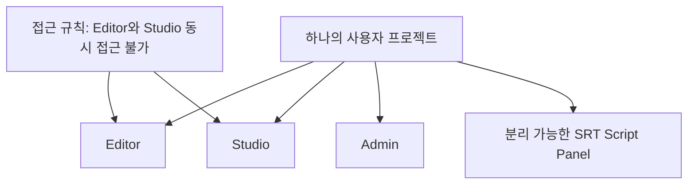
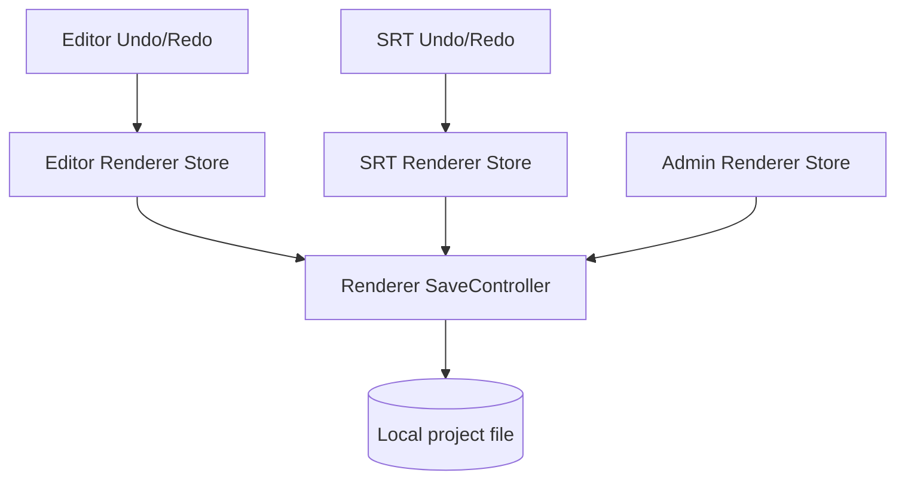
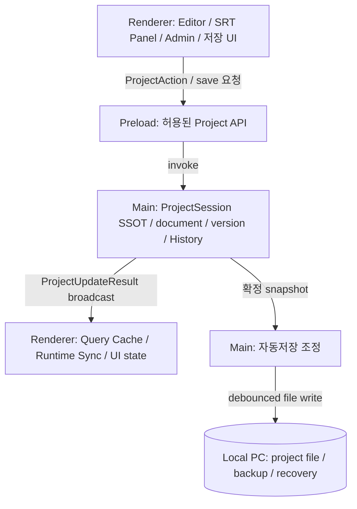

목차 펼쳐보기

- [1. 들어가며](#1-들어가며)
- [2. 제작 중인 편집기](#2-제작-중인-편집기)
  - [2-1. SRT에서 시작하는 데스크톱 편집기](#2-1-srt에서-시작하는-데스크톱-편집기)
  - [2-2. 프로젝트에 저장할 값](#2-2-프로젝트에-저장할-값)
- [3. 창과 탭의 조합](#3-창과-탭의-조합)
  - [3-1. 같은 프로젝트를 사용하는 화면](#3-1-같은-프로젝트를-사용하는-화면)
  - [3-2. 동시에 열릴 수 있는 조합](#3-2-동시에-열릴-수-있는-조합)
- [4. 문제가 발생한 상태 구조](#4-문제가-발생한-상태-구조)
  - [4-1. Renderer마다 별도 Store가 있었다](#4-1-renderer마다-별도-store가-있었다)
  - [4-2. 저장 시점에 문서를 다시 만들었다](#4-2-저장-시점에-문서를-다시-만들었다)
  - [4-3. 저장은 Main을 거쳐야 했다](#4-3-저장은-main을-거쳐야-했다)
- [5. 사용자가 겪은 문제](#5-사용자가-겪은-문제)
- [6. 먼저 알아둘 용어](#6-먼저-알아둘-용어)
  - [6-1. Main Process](#6-1-main-process)
  - [6-2. Renderer Process](#6-2-renderer-process)
  - [6-3. IPC](#6-3-ipc)
  - [6-4. Store](#6-4-store)
  - [6-5. Snapshot](#6-5-snapshot)
  - [6-6. SSOT](#6-6-ssot)
  - [6-7. History](#6-7-history)
- [7. 핵심 주장](#7-핵심-주장)
- [8. 전체 구조도](#8-전체-구조도)
- [9. 시리즈 목표](#9-시리즈-목표)
- [10. 시리즈 구성](#10-시리즈-구성)
- [11. 읽는 순서](#11-읽는-순서)
- [12. 아직 확정하지 않은 부분](#12-아직-확정하지-않은-부분)
- [13. 마치며](#13-마치며)

시리즈 전체 글 바로가기

1. [Part 0. Main Process SSOT 시리즈를 시작하며](/posts/electron-main-process-ssot-series-guide)
2. [Part 1. Electron 멀티 윈도우에서 저장 결과가 달라진 이유](/posts/electron-multi-window-state-ssot)
3. [Part 2. Main Process에 ProjectDocument SSOT를 둔 이유](/posts/electron-main-process-project-ssot)
4. [Part 3. Renderer가 Main의 확정 상태를 받는 방법](/posts/electron-main-process-renderer-sync)
5. [Part 4. 흩어진 Undo/Redo를 Main History로 통합하기](/posts/electron-main-process-undo-redo)
6. [Part 5. 자동저장의 책임과 디스크 저장 보장](/posts/electron-main-process-autosave)
7. [Part 6. Main SSOT 설계를 검증하고 선택의 비용 정리하기](/posts/electron-main-process-migration)

## 1. 들어가며

이 시리즈는 Electron으로 멀티미디어 편집기를 만들면서 겪은 상태 불일치 문제에서 시작했다. 화면에서는 SRT 문장이 바뀌었지만 저장한 프로젝트에는 이전 문장이 남았다. 한 창에서 실행한 Undo가 다른 창의 화면과 맞지 않는 경우도 있었다.

처음부터 Main Process와 Renderer Process의 상태 구조를 아는 독자라면 바로 문제를 이해할 수 있다. 하지만 이 편집기가 어떤 기능을 제공하고 어떤 창이 동시에 열리는지 모르면 "왜 Main에 SSOT가 필요한가"라는 결론부터 갑자기 등장한다.

그래서 Part 0에서는 구현보다 맥락을 먼저 설명한다.

1. 어떤 편집기를 만들고 있었는가?
2. 어떤 화면과 창이 같은 프로젝트를 사용했는가?
3. 어떤 상태 구조에서 문제가 나타났는가?
4. 이 시리즈가 어떤 질문에 답하려는가?

결론부터 적으면, **여러 창이 공유하고 프로젝트 파일에 저장할 `ProjectDocument`의 변경 권한을 Main Process 한 곳에 두는 설계**를 검토했다. 모든 state와 실행 객체를 Main으로 옮긴다는 뜻은 아니다.

## 2. 제작 중인 편집기

### 2-1. SRT에서 시작하는 데스크톱 편집기

이 프로젝트는 SRT script를 수정하고 그 내용을 바탕으로 TTS를 생성한 뒤 Studio 편집으로 이어가는 Electron 데스크톱 편집기다.

프로젝트 설명에서 확인된 핵심 기능은 다음과 같다.

- SRT row의 text와 time range 수정
- SRT를 기준으로 한 TTS 생성
- 생성 결과를 Studio 편집으로 연결
- Timeline과 region 편집
- 프로젝트를 사용자 local PC에 저장
- 저장한 프로젝트 다시 열기
- 편집 내용 Undo/Redo

이 글은 TTS 품질이나 Timeline 렌더링 방식을 다루지 않는다. 여러 화면이 공유하는 **저장 가능한 프로젝트 상태**를 어떻게 관리할지에 집중한다.

### 2-2. 프로젝트에 저장할 값

프로젝트 파일에는 다음과 같은 값이 들어간다.

- 프로젝트 기본 정보
- SRT row
- Timeline item과 region 배치 정보
- media asset 참조
- 편집 설정

반면 다음 값은 프로젝트 파일의 원본으로 취급하지 않는다.

- 현재 hover한 버튼
- 열린 modal
- drag 중인 임시 좌표
- 연속적으로 변하는 playhead 위치
- DOM Node
- `AudioBuffer`와 AudioEngine 실행 객체

이 구분이 중요한 이유는 간단하다. **저장할 프로젝트 상태와 현재 화면에서만 필요한 상태는 수명주기와 복원 방식이 다르기 때문**이다.

## 3. 창과 탭의 조합

### 3-1. 같은 프로젝트를 사용하는 화면

같은 프로젝트 내용을 사용하는 기능은 네 곳이었다.

| 화면 또는 기능   | 프로젝트 상태 사용 방식                              |
| ---------------- | ---------------------------------------------------- |
| 프로젝트 저장    | 최신 프로젝트 내용을 local file에 기록한다.          |
| SRT Script Panel | SRT row를 읽고 실시간으로 수정한다.                  |
| Editor           | SRT와 Timeline 편집 결과를 사용한다.                 |
| Admin            | 같은 프로젝트 내용을 읽고 변경 결과를 반영해야 한다. |

Studio도 프로젝트 편집 흐름에 참여한다. 다만 Editor와 Studio는 동시에 접근할 수 없다는 제품 규칙이 있었다.

### 3-2. 동시에 열릴 수 있는 조합

SRT Script Panel은 별도 창으로 분리할 수 있다. 따라서 다음 조합이 가능하다.

- Editor와 SRT Script Panel
- Admin과 SRT Script Panel
- Studio와 SRT Script Panel

반면 Editor와 Studio는 동시에 열리지 않는다.

이 규칙은 Editor와 Studio 사이의 동시 변경 가능성을 줄인다. 하지만 SRT Script Panel이 별도 창으로 열릴 수 있으므로 여러 Renderer의 상태 동기화 문제까지 없애지는 못한다.

위 그림은 구현 구조가 아니라 **제품이 요구하는 화면 관계**를 나타낸다.

## 4. 문제가 발생한 상태 구조

### 4-1. Renderer마다 별도 Store가 있었다

Electron 공식 문서에 따르면 각 `BrowserWindow`는 별도 Renderer Process에서 웹 페이지를 실행한다. 서로 다른 Renderer는 같은 JavaScript memory나 같은 Zustand Store instance를 직접 공유하지 않는다. [Electron Process Model](https://www.electronjs.org/docs/latest/tutorial/process-model)

기존 구조에는 Renderer별 Store가 있었다.

- Editor Store
- SRT Store
- Admin Store
- 기능별 Undo/Redo History

이 Store들은 같은 프로젝트의 일부 값을 각자 보관하고 변경했다.

### 4-2. 저장 시점에 문서를 다시 만들었다

기존 `SaveController`는 여러 Renderer Store의 값을 읽어 프로젝트 문서를 다시 조립했다. 문제는 화면에서 마지막으로 바뀐 값과 `SaveController`가 읽은 값이 항상 같은 version이라는 보장이 없었다는 점이다.

Store가 여러 개라는 사실만으로 문제가 발생했다고 단정할 수는 없다. 여러 Store가 있어도 변경 순서와 충돌 규칙이 정확하면 결과를 맞출 수 있다.

이 프로젝트에서 확인된 문제는 더 좁다.

> 같은 프로젝트 값을 여러 Store가 변경할 수 있었고 어느 Store의 값이 최종 확정값인지 정하는 규칙이 없었다.

### 4-3. 저장은 Main을 거쳐야 했다

Main Process는 Node.js 환경에서 실행된다. Electron 공식 문서 기준으로 Main은 Node.js API와 운영체제 기능을 사용할 수 있다. 각 Renderer는 Main과 IPC message를 주고받는다. [Electron Process Model](https://www.electronjs.org/docs/latest/tutorial/process-model), [Electron IPC](https://www.electronjs.org/docs/latest/tutorial/ipc)

이 프로젝트의 local project file 저장도 Main을 거친다. 따라서 Renderer가 최신 문서를 가지고 있더라도 최종 파일 쓰기는 Main에 요청해야 했다.

## 5. 사용자가 겪은 문제

처음 보는 독자의 관점에서 한 가지 흐름으로 다시 적어보면 다음과 같다.

1. 사용자가 분리된 SRT Script Panel에서 문장을 수정한다.
2. SRT Renderer Store에는 새 문장이 들어간다.
3. Editor Renderer Store에는 이전 문장이 남아 있을 수 있다.
4. 자동저장이 Editor Store를 기준으로 프로젝트 문서를 조립한다.
5. 화면에는 새 문장이 보이지만 project file에는 이전 문장이 저장된다.

3번과 4번이 항상 발생한다고 일반화할 수는 없다. 하지만 실제로 편집 값과 저장 값의 불일치가 관찰되었고 기존 구조에는 이를 막는 단일 version 규칙이 없었다.

Undo/Redo도 비슷했다.

- SRT History는 SRT Store를 변경했다.
- Timeline History는 `Region`과 AudioEngine 실행 객체를 변경했다.
- 저장은 여러 Store를 다시 읽었다.

따라서 Undo 결과와 다른 창의 화면과 저장 파일이 같은 상태를 기준으로 한다고 보장하기 어려웠다.

문제를 다음처럼 구분했다.

| 구분        | 확인한 내용                                                         |
| ----------- | ------------------------------------------------------------------- |
| 증상        | 편집한 값과 저장한 값이 달랐다.                                     |
| 직접 원인   | 저장이 사용자가 마지막으로 수정한 Store와 다른 값을 읽을 수 있었다. |
| 구조적 조건 | 프로젝트 값의 최종 변경 권한과 version이 한 곳에 모여 있지 않았다.  |

## 6. 먼저 알아둘 용어

### 6-1. Main Process

Electron 앱의 entry point다. 창과 앱 생명주기를 관리하며 Node.js API를 사용할 수 있다. [Electron Process Model](https://www.electronjs.org/docs/latest/tutorial/process-model)

### 6-2. Renderer Process

`BrowserWindow` 안의 웹 화면을 실행하는 Process다. React component와 Renderer Store와 AudioEngine이 이쪽에서 동작한다.

### 6-3. IPC

Inter-Process Communication의 약자다. Main과 Renderer가 개발자가 정의한 channel을 통해 message를 주고받는 방식이다. [Electron IPC](https://www.electronjs.org/docs/latest/tutorial/ipc)

### 6-4. Store

이 시리즈에서 Store는 JavaScript memory에 state를 보관하고 변경 알림을 제공하는 객체를 뜻한다. React `state` 전체를 뜻하지 않는다.

### 6-5. Snapshot

특정 version에서 확정된 프로젝트 상태의 읽기용 복사본이다. Renderer는 이 복사본을 화면에 표시한다.

### 6-6. SSOT

Single Source of Truth의 약자다. 이 시리즈에서는 **프로젝트의 최종 상태를 확정하는 변경 권한이 한 곳에 있다**는 의미로 사용한다.

값의 복사본이 하나만 존재한다는 뜻은 아니다. Main의 원본과 Renderer의 읽기용 snapshot과 마지막으로 저장된 disk file이 함께 존재할 수 있다.

### 6-7. History

Undo와 Redo를 위해 이전 변경과 다음 변경을 기억하는 상태다. 이 시리즈에서는 프로젝트 문서의 History와 AudioEngine 실행 객체의 복원을 구분한다.

## 7. 핵심 주장

이 시리즈의 핵심 주장은 다음과 같다.

> Main Process의 `ProjectSession`을 저장 가능한 `ProjectDocument`의 SSOT로 사용한다. 모든 저장 가능한 변경과 project version과 Undo/Redo History는 Main에서 확정한다.

Main에 두는 값은 직렬화 가능한 프로젝트 문서다.

- SRT row
- Timeline item
- asset 참조
- 프로젝트 설정
- version과 문서 History

Renderer에 남기는 값도 있다.

- 읽기 전용 `ProjectSnapshot` cache
- modal과 selection 같은 UI state
- drag preview와 playhead 같은 임시 state
- AudioEngine과 `AudioBuffer` 같은 실행 객체

즉 "모든 Store를 Main으로 이동한다"가 아니라 **프로젝트 문서의 최종 변경 권한을 Main으로 이동한다**는 설계다.

## 8. 전체 구조도

아래 그림은 현재 구현 완료 상태가 아니라 이 시리즈에서 제안하는 **목표 구조**다.

흐름은 다음과 같다.

1. Renderer는 사용자의 편집 의도를 `ProjectAction`으로 보낸다.
2. Main `ProjectSession`이 상태와 version과 History를 확정한다.
3. Main은 같은 `ProjectUpdateResult`를 열린 Renderer에 발행한다.
4. Renderer는 읽기용 cache와 AudioEngine runtime을 갱신한다.
5. Main의 자동저장은 확정된 snapshot을 local file에 저장한다.

일반 요청과 응답에는 Electron의 `invoke`와 `handle` pattern을 사용할 수 있다. Main에서 Renderer로 결과를 전달할 때는 Main의 `webContents.send`와 Renderer listener를 사용할 수 있다. [Electron IPC](https://www.electronjs.org/docs/latest/tutorial/ipc)

## 9. 시리즈 목표

이 시리즈의 목표는 다섯 가지다.

1. 편집 값과 저장 값이 달라진 증상과 구조적 조건을 구분한다.
2. Main Process를 `ProjectDocument` SSOT로 선택한 근거와 비용을 설명한다.
3. Renderer cache와 IPC event로 여러 창이 같은 version을 유지하는 방법을 정리한다.
4. 기능별로 흩어진 Undo/Redo와 자동저장의 책임을 다시 나눈다.
5. 이 설계가 해결해야 할 문제와 선택의 비용과 재검토 조건을 정리한다.

성능 개선 수치나 데이터 손실 감소율은 아직 측정하지 않았다. 따라서 이 시리즈는 성능 향상을 주장하지 않는다. 상태 불일치 위험을 줄이기 위한 설계와 검증 계획을 다룬다.

## 10. 시리즈 구성

| 글                                                                                 | 독자가 확인할 질문                              |
| ---------------------------------------------------------------------------------- | ----------------------------------------------- |
| Part 0. 현재 글                                                                    | 어떤 편집기에서 어떤 문제가 발생했는가?         |
| [Part 1. 저장 결과가 달라진 이유](/posts/electron-multi-window-state-ssot)         | 증상과 직접 원인과 구조적 조건은 무엇인가?      |
| [Part 2. Main Process에 SSOT를 둔 이유](/posts/electron-main-process-project-ssot) | 왜 Renderer가 아니라 Main인가?                  |
| [Part 3. Renderer 상태 동기화](/posts/electron-main-process-renderer-sync)         | Main의 확정 상태를 화면에 어떻게 반영하는가?    |
| [Part 4. Undo/Redo 통합](/posts/electron-main-process-undo-redo)                   | 실행 객체에 묶인 History를 어떻게 분리하는가?   |
| [Part 5. 자동저장](/posts/electron-main-process-autosave)                          | memory update와 disk write를 어떻게 구분하는가? |
| [Part 6. 설계 검증과 선택의 비용](/posts/electron-main-process-migration)          | 무엇을 검증하고 언제 다시 판단해야 하는가?      |

전체 시리즈 목차 펼쳐보기

**Part 0. 시리즈 안내와 편집기 맥락**

- [제작 중인 편집기](#2-제작-중인-편집기)
- [창과 탭의 조합](#3-창과-탭의-조합)
- [문제가 발생한 상태 구조](#4-문제가-발생한-상태-구조)
- [사용자가 겪은 문제](#5-사용자가-겪은-문제)
- [먼저 알아둘 용어](#6-먼저-알아둘-용어)
- [핵심 주장](#7-핵심-주장)
- [전체 구조도](#8-전체-구조도)

**Part 1. 문제와 원인**

- [관찰된 문제](/posts/electron-multi-window-state-ssot#2-관찰된-문제)
- [기존 상태 구조](/posts/electron-multi-window-state-ssot#3-기존-상태-구조)
- [원인 분리](/posts/electron-multi-window-state-ssot#4-원인-분리)
- [Electron의 프로세스 조건](/posts/electron-multi-window-state-ssot#5-electron의-프로세스-조건)
- [요구사항 재정의](/posts/electron-multi-window-state-ssot#6-요구사항-재정의)
- [설계 질문](/posts/electron-multi-window-state-ssot#7-설계-질문)

**Part 2. Main Process의 ProjectDocument SSOT**

- [SSOT의 범위](/posts/electron-main-process-project-ssot#2-ssot의-범위)
- [SSOT 위치 비교](/posts/electron-main-process-project-ssot#3-ssot-위치-비교)
- [Class private field와 Vanilla Zustand 비교](/posts/electron-main-process-project-ssot#4-class-private-field와-vanilla-zustand-비교)
- [상태 분류](/posts/electron-main-process-project-ssot#5-상태-분류)
- [Main과 Renderer의 책임](/posts/electron-main-process-project-ssot#6-main과-renderer의-책임)
- [전체 구조](/posts/electron-main-process-project-ssot#7-전체-구조)

**Part 3. Renderer 동기화**

- [읽기 전용 복사본](/posts/electron-main-process-renderer-sync#2-읽기-전용-복사본)
- [Renderer cache 비교](/posts/electron-main-process-renderer-sync#3-renderer-cache-비교)
- [변경 요청과 확정 결과](/posts/electron-main-process-renderer-sync#4-변경-요청과-확정-결과)
- [version 기반 동기화](/posts/electron-main-process-renderer-sync#5-version-기반-동기화)
- [탭과 창 초기화](/posts/electron-main-process-renderer-sync#6-탭과-창-초기화)
- [임시 상태와 고빈도 event](/posts/electron-main-process-renderer-sync#7-임시-상태와-고빈도-event)

**Part 4. Undo/Redo 통합**

- [기존 History의 한계](/posts/electron-main-process-undo-redo#2-기존-history의-한계)
- [문서 상태와 실행 상태 분리](/posts/electron-main-process-undo-redo#3-문서-상태와-실행-상태-분리)
- [History가 기억할 값](/posts/electron-main-process-undo-redo#4-history가-기억할-값)
- [Undo와 Redo 흐름](/posts/electron-main-process-undo-redo#5-undo와-redo-흐름)
- [Runtime 동기화](/posts/electron-main-process-undo-redo#6-runtime-동기화)
- [History와 asset 수명주기](/posts/electron-main-process-undo-redo#7-history와-asset-수명주기)

**Part 5. 자동저장과 복구**

- [저장 책임 분리](/posts/electron-main-process-autosave#2-저장-책임-분리)
- [기본 자동저장 흐름](/posts/electron-main-process-autosave#3-기본-자동저장-흐름)
- [실시간 저장의 두 의미](/posts/electron-main-process-autosave#4-실시간-저장의-두-의미)
- [안전한 파일 교체](/posts/electron-main-process-autosave#5-안전한-파일-교체)
- [충돌과 오래된 비동기 결과](/posts/electron-main-process-autosave#6-충돌과-오래된-비동기-결과)
- [장애 복구](/posts/electron-main-process-autosave#7-장애-복구)

**Part 6. 설계 검증과 선택의 비용**

- [검증해야 할 가설](/posts/electron-main-process-migration#2-검증해야-할-가설)
- [선택의 비용](/posts/electron-main-process-migration#3-선택의-비용)
- [이 설계가 적합한 조건](/posts/electron-main-process-migration#4-이-설계가-적합한-조건)
- [다시 검토할 조건](/posts/electron-main-process-migration#5-다시-검토할-조건)
- [아직 결정하지 못한 부분](/posts/electron-main-process-migration#6-아직-결정하지-못한-부분)
- [최종 구조](/posts/electron-main-process-migration#7-최종-구조)

## 11. 읽는 순서

처음 읽는다면 Part 0부터 순서대로 읽는 편이 가장 자연스럽다.

필요한 내용만 찾는다면 다음 순서를 사용할 수 있다.

- 문제 원인만 확인: Part 0과 Part 1
- 전체 구조와 Store 선택 확인: Part 2
- `useSyncExternalStore`와 TanStack Query 확인: Part 3
- Undo/Redo 설계 확인: Part 4
- 자동저장 보장 수준 확인: Part 5
- 설계 검증 기준과 트레이드오프 확인: Part 6

## 12. 아직 확정하지 않은 부분

현재 프로젝트 설명과 공식 문서만으로 결정할 수 없는 항목이 있다.

1. 자동저장이 허용하는 최대 데이터 손실 시간
2. action 응답 전에 disk write가 끝나야 하는지 여부
3. 같은 SRT row를 두 창에서 수정할 때의 충돌 정책
4. 앱을 다시 실행한 뒤 Undo/Redo History를 복원할지 여부
5. 대표 프로젝트에서 허용할 IPC latency와 저장 시간

이 항목은 설계 선택으로 숨기지 않는다. 제품 정책과 측정값이 필요하다.

## 13. 마치며

이 문제를 처음 마주했을 때는 Renderer 사이에 event를 더 많이 보내면 해결될 것이라고 생각했다. 하지만 화면의 값을 맞추는 것과 저장할 최종값을 정하는 것은 다른 문제였다.

이번 시리즈에서 가장 먼저 정한 것은 라이브러리가 아니었다. **같은 프로젝트 값을 누가 최종 확정하고 누가 읽기만 할 것인지 정하는 경계**였다.

다음 글에서는 실제로 관찰한 증상과 기존 Store 구조를 더 좁게 분석한다.

[다음 글: Part 1. Electron 멀티 윈도우에서 저장 결과가 달라진 이유](/posts/electron-multi-window-state-ssot)

---

## 참고

**Electron 공식 문서**

- [Process Model](https://www.electronjs.org/docs/latest/tutorial/process-model)
- [Inter-Process Communication](https://www.electronjs.org/docs/latest/tutorial/ipc)
- [ipcRenderer](https://www.electronjs.org/docs/latest/api/ipc-renderer)

**React와 상태 cache 공식 문서**

- [React useSyncExternalStore](https://react.dev/reference/react/useSyncExternalStore)
- [TanStack Query Overview](https://tanstack.com/query/latest/docs/framework/react/overview)
