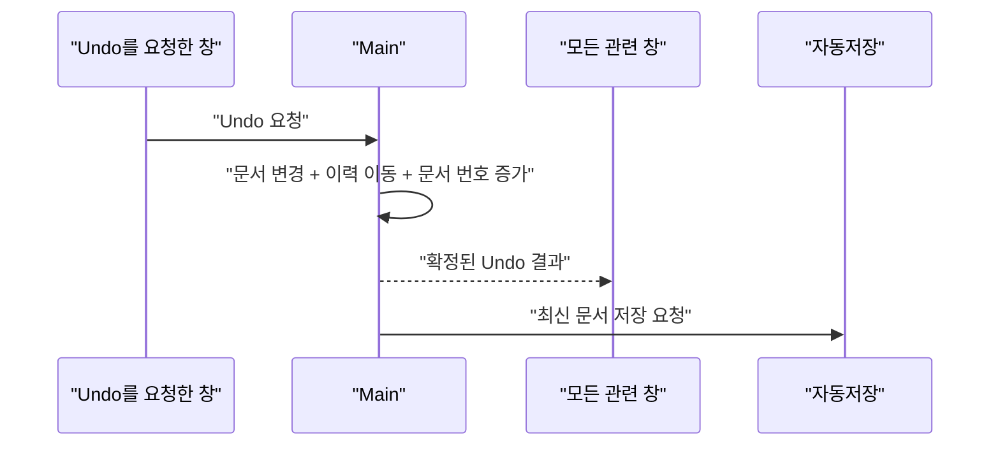

목차 펼쳐보기

- [1. Stack보다 먼저 복원 대상을 정했다](#1-stack보다-먼저-복원-대상을-정했다)
- [2. 문서 상태와 실행 상태를 나눴다](#2-문서-상태와-실행-상태를-나눴다)
- [3. 하나의 사용자 동작을 하나의 이력으로 기록한다](#3-하나의-사용자-동작을-하나의-이력으로-기록한다)
- [4. 상태와 이력을 먼저 확정한다](#4-상태와-이력을-먼저-확정한다)
- [5. 사용자가 느끼는 동작 단위로 묶는다](#5-사용자가-느끼는-동작-단위로-묶는다)
- [6. 마치며](#6-마치며)

[이전 글: Part 2. Main이 프로젝트 상태를 정하고 각 창에 전달하는 방법](/posts/electron-main-process-project-ssot)

## 1. Stack보다 먼저 복원 대상을 정했다

기존 Undo/Redo는 기능별로 나뉘어 있었다. 자막, Timeline과 Audio 편집 기능이 각자 이력을 가졌고, 일부 동작은 현재 창의 실행 객체를 직접 참조했다.

한 번의 사용자 동작이 자막과 Timeline을 함께 바꾸면 문제가 드러났다.

- 어느 이력을 먼저 되돌려야 하는가?
- 다른 창도 같은 결과를 어떻게 받는가?
- 프로젝트 파일에는 어떤 상태를 저장해야 하는가?

처음에는 여러 Stack을 하나로 합치면 된다고 생각했다. 하지만 Stack의 위치보다 중요한 것은 **무엇을 이전 상태로 복원할지**였다.

## 2. 문서 상태와 실행 상태를 나눴다

Undo/Redo가 다룰 값을 두 종류로 나눴다.

| 구분                  | 복원하는 곳 | 예시                                              |
| --------------------- | ----------- | ------------------------------------------------- |
| 저장 가능한 문서 상태 | Main        | 자막 문장과 시간, Timeline 배치, asset 참조       |
| 화면의 실행 상태      | 각 창       | 재생 객체, 오디오 버퍼, waveform cache, 선택 상태 |

Main은 저장 가능한 프로젝트 상태만 되돌린다. 각 창은 Main이 확정한 결과를 받아 화면과 실행 객체를 맞춘다.

이렇게 나누면 Undo/Redo와 자동저장이 같은 프로젝트 상태를 사용한다. 실행 객체를 Main에 보내거나 프로젝트 파일에 저장할 필요도 없다.

왜 실행 객체를 이력에 넣지 않았는가

기존 action 중에는 Renderer memory의 Session, Timeline Region과 AudioBuffer를 직접 참조하는 것이 있었다.

이 객체는 특정 창의 실행 환경에 속한다. Electron IPC는 Structured Clone Algorithm으로 값을 복제하므로 함수, DOM 객체와 일부 특수 객체를 그대로 보낼 수도 없다.

따라서 Main 이력에는 직렬화 가능한 값만 남기고, 실행 객체는 각 창에서 다시 맞추도록 경계를 정했다.

- [Electron ipcRenderer](https://www.electronjs.org/docs/latest/api/ipc-renderer)

## 3. 하나의 사용자 동작을 하나의 이력으로 기록한다

문서 이력의 한 항목은 두 값을 기억한다.

1. 변경을 다시 적용할 정보
2. 변경 전 상태로 되돌릴 정보

Redo는 첫 번째 값을 사용하고 Undo는 두 번째 값을 사용한다. 새 일반 변경이 들어오면 Redo 이력은 비운다.

중요한 규칙은 다음과 같다.

- Undo와 Redo도 새 문서 번호를 만든다.
- 어느 창에서 실행해도 모든 관련 창에 같은 결과를 보낸다.
- 저장은 Undo/Redo가 확정한 프로젝트 상태를 사용한다.

구현 용어와 검증 조건

구현에서는 다시 적용할 정보를 forward patch, 되돌릴 정보를 inverse patch라고 부른다. 이 patch는 문자열 경로보다 프로젝트 변경 종류가 드러나는 형태로 구분한다.

최소한 다음 조건을 테스트해야 한다.

- 이전 문서에 forward patch를 적용하면 다음 문서가 된다.
- 다음 문서에 inverse patch를 적용하면 이전 문서가 된다.
- Undo 뒤 Redo를 실행하면 같은 문서가 된다.
- 새 변경이 들어오면 기존 Redo 이력이 사라진다.

inverse patch는 변경 전 값을 알고 있는 Main에서 만든다. Renderer가 되돌릴 값을 직접 결정하지 않는다.

## 4. 상태와 이력을 먼저 확정한다

Undo 처리 순서는 다음과 같다.

1. 마지막 이력에서 되돌릴 정보를 읽는다.
2. 프로젝트 상태를 되돌린다.
3. 해당 이력을 Redo 쪽으로 옮긴다.
4. 문서 번호를 증가시킨다.
5. 여기까지 성공한 뒤 모든 창에 결과를 알리고 저장을 요청한다.

상태를 바꾼 뒤 이력을 옮기기 전에 이벤트부터 보내면 실패 시 내부 상태가 어긋날 수 있다. 문서, 이력과 문서 번호를 먼저 하나의 변경으로 확정하고, 알림과 저장은 그다음에 실행한다.

화면 실행 상태 반영에 실패했을 때

평상시에는 변경된 항목만 화면 실행 객체에 반영한다. 매 입력마다 전체 재생 상태를 다시 만들면 비용이 커질 수 있기 때문이다.

증분 반영에 실패하거나 현재 창의 문서 번호가 Main과 맞지 않으면 다음 순서로 복구한다.

1. Main에서 최신 전체 프로젝트 상태를 받는다.
2. 현재 실행 객체를 정리한다.
3. asset 참조를 기준으로 필요한 media를 다시 읽는다.
4. 최신 상태로 실행 객체를 다시 만든다.

이 복구는 느릴 수 있다. 실제 허용 시간은 대표 프로젝트에서 측정해야 한다.

## 5. 사용자가 느끼는 동작 단위로 묶는다

pointer 이동 100회를 Undo 100회로 만들면 사용자가 기대한 동작과 달라진다. 드래그 중간값은 화면에만 보여주고, 드래그가 끝났을 때 처음 값과 최종값을 하나의 이력으로 기록한다.

Split처럼 여러 항목을 함께 바꾸는 동작도 하나의 그룹으로 기록한다. 중간 변경만 이력에 들어가면 Undo 후 문서가 불완전해질 수 있기 때문이다.

> 이력의 단위는 코드가 실행된 횟수가 아니라 사용자가 완료했다고 느끼는 동작이다.

이력과 asset 수명주기

현재 문서에서 사라진 asset도 Undo 이력이 참조한다면 바로 삭제할 수 없다.

초기 정책은 다음과 같다.

1. 현재 문서, Undo 이력 또는 Redo 이력이 참조하는 asset은 유지한다.
2. 이력 길이에 상한을 둔다.
3. 오래된 이력을 제거한 뒤 어느 곳에서도 참조하지 않는 asset을 정리한다.
4. asset 정리는 편집 동작과 분리된 작업으로 실행한다.

asset 참조는 같은 경로의 파일이 교체되어도 과거 내용을 가리킬 수 있도록 안정적인 식별자를 가져야 한다. 앱 재시작 뒤 이력까지 복원한다면 이력 파일과 asset 보존 기간도 함께 정해야 한다.

## 6. 마치며

Undo/Redo 통합에서 어려운 부분은 Stack 구현이 아니었다. 저장할 문서 값과 현재 화면에서 실행 중인 객체를 구분하는 일이었다.

Main은 문서의 이전값과 다음값을 기억한다. 각 창은 확정된 문서에 맞춰 실행 상태를 갱신한다. 이 경계가 생기면서 저장과 Undo/Redo가 같은 프로젝트 상태를 보게 되었다.

[다음 글: Part 4. 자동저장의 완료 지점과 복구 전략](/posts/electron-main-process-autosave)
