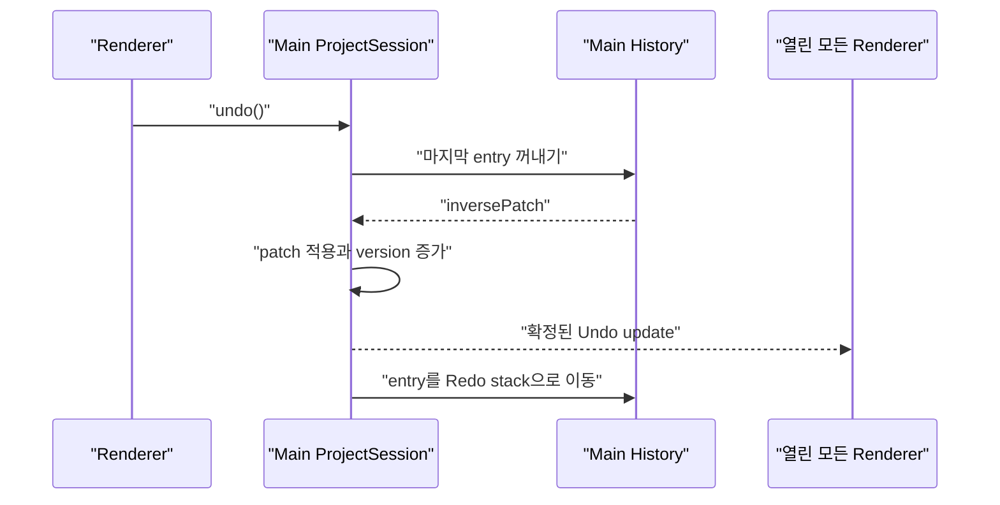
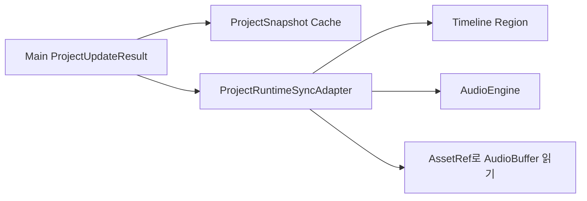

<details>
<summary>목차 펼쳐보기</summary>

- [1. 들어가며](#1-들어가며)
- [2. 기존 History의 한계](#2-기존-history의-한계)
- [3. 문서 상태와 실행 상태 분리](#3-문서-상태와-실행-상태-분리)
- [4. ProjectHistoryEntry](#4-projecthistoryentry)
- [5. Undo와 Redo 흐름](#5-undo와-redo-흐름)
- [6. Runtime 동기화](#6-runtime-동기화)
- [7. History와 asset 수명주기](#7-history와-asset-수명주기)
- [8. 점진적 History 이관](#8-점진적-history-이관)
- [9. 최소 구현](#9-최소-구현)
- [10. 마치며](#10-마치며)

</details>

[이전 글: Part 3. Renderer가 Main의 확정 상태를 받는 방법](/posts/electron-main-process-renderer-sync)

## 1. 들어가며

프로젝트 문서의 SSOT를 Main에 둔다고 기존 Undo/Redo를 그대로 옮길 수는 없었다. 기존 action은 Renderer의 `Session`, Timeline `Region`, `AudioBuffer` 같은 실행 객체를 직접 가지고 있었다. 이 객체는 프로젝트 파일에 저장할 수 없고 Electron IPC로 그대로 보낼 수도 없다.

결론부터 적으면, **Main History는 `ProjectDocument`의 forward patch와 inverse patch만 기억하고 Renderer의 `ProjectRuntimeSyncAdapter`가 같은 결과를 AudioEngine에 반영하도록 분리했다**.

## 2. 기존 History의 한계

### 2-1. 기능별 History

SRT와 Timeline과 Audio 편집 기능은 각각 별도의 History를 가지고 있었다. 한 사용자 동작이 SRT row와 Timeline region을 함께 바꾸면 어느 History를 먼저 되돌려야 하는지 분명하지 않았다.

### 2-2. live 객체 의존

기존 action은 다음과 비슷했다.

```ts
class SplitRegionAction {
  constructor(
    private readonly session: EditorSession,
    private readonly region: Region,
    private readonly previousBuffer: AudioBuffer,
  ) {}
}
```

이 객체는 현재 Renderer memory의 인스턴스와 연결되어 있다. `AudioBuffer`와 함수와 사용자 정의 class instance를 Main에 보내서 같은 의미로 복원할 수 있다고 가정할 수 없다. Electron `ipcRenderer` 문서는 IPC 인자가 Structured Clone Algorithm으로 직렬화되며 함수와 DOM 객체 등 일부 값은 복제할 수 없다고 설명한다. [Electron ipcRenderer](https://www.electronjs.org/docs/latest/api/ipc-renderer)

따라서 기존 action 객체를 Main에 전송하는 방식은 제외했다.

## 3. 문서 상태와 실행 상태 분리

Undo/Redo가 복원할 값을 두 층으로 나누었다.

### 3-1. Main이 복원하는 값

- SRT text와 time range
- Timeline item의 위치와 길이
- track 배치
- asset 참조
- 프로젝트 설정

모두 `ProjectDocument`에 들어가는 직렬화 가능한 값이다.

### 3-2. Renderer가 복원하는 값

- AudioEngine의 region 인스턴스
- `AudioBuffer`
- waveform cache
- 현재 selection과 focus

문서 변경의 최종 기준은 Main이다. Renderer 실행 객체는 Main update를 받아 같은 결과가 되도록 갱신한다. selection처럼 프로젝트 결과에 포함되지 않는 UI state는 별도 정책으로 유지하거나 초기화한다.

## 4. ProjectHistoryEntry

Main History의 최소 단위는 다음과 같다.

```ts
interface ProjectHistoryEntry {
  actionId: string;
  label: string;
  forwardPatch: ProjectPatch[];
  inversePatch: ProjectPatch[];
}
```

- `actionId`: 요청과 event 중복 확인에 사용하는 ID
- `label`: Undo UI에 표시할 이름
- `forwardPatch`: Redo 때 적용할 변경
- `inversePatch`: Undo 때 적용할 반대 변경

patch는 범용 문자열 path보다 프로젝트 타입에 맞춘 union으로 시작한다.

```ts
type ProjectPatch =
  | { type: 'srtRowReplaced'; row: SrtRow }
  | { type: 'timelineItemReplaced'; item: TimelineItem }
  | { type: 'timelineItemRemoved'; itemId: string };
```

이 방식은 patch 종류가 늘어날 때 코드를 추가해야 한다. 대신 TypeScript가 누락된 case를 확인할 수 있고 잘못된 문자열 path를 줄일 수 있다.

## 5. Undo와 Redo 흐름

### 5-1. 기본 규칙

1. 일반 action을 적용한다.
2. forward patch와 inverse patch를 한 entry로 Undo stack에 넣는다.
3. 새 일반 action이 들어오면 Redo stack을 비운다.
4. Undo는 inverse patch를 적용하고 entry를 Redo stack으로 옮긴다.
5. Redo는 forward patch를 적용하고 entry를 Undo stack으로 옮긴다.
6. Undo와 Redo도 새 project version을 만든다.
7. 결과를 모든 Renderer에 발행하고 자동저장을 요청한다.



Undo를 실행한 창만 바꾸지 않는다. Main 문서의 확정 결과가 바뀌었으므로 모든 열린 창이 같은 update를 받는다.

### 5-2. action group

pointer move 100회는 사용자가 의도한 Undo 100회가 아니다. drag 시작 시 이전값을 기록하고 drag 종료 시 최종값과 함께 한 entry를 만든다.

Split처럼 여러 item을 함께 바꾸는 동작도 하나의 action group으로 처리한다. 중간 patch 일부만 History에 들어가면 Undo 후 불완전한 문서가 될 수 있다.

## 6. Runtime 동기화

`ProjectRuntimeSyncAdapter`는 Main patch를 Renderer의 AudioEngine에 반영한다.



### 6-1. 증분 반영

일반적으로 patch에 포함된 item만 추가하거나 수정하거나 제거한다. 매 key 입력마다 AudioEngine 전체를 다시 만들면 비용이 커질 수 있기 때문이다.

### 6-2. 실패 시 복구

증분 반영이 실패하거나 Renderer의 현재 runtime version이 Main version과 맞지 않으면 다음 순서를 사용한다.

1. Main의 전체 snapshot을 다시 받는다.
2. 현재 AudioEngine runtime을 정리한다.
3. `AssetRef`를 기준으로 필요한 media를 다시 읽는다.
4. snapshot으로 runtime을 다시 만든다.

이 fallback은 느릴 수 있지만 불일치 상태를 계속 유지하는 것보다 안전하다. 실제 허용 시간은 대표 프로젝트로 측정해야 한다.

## 7. History와 asset 수명주기

Undo가 참조하는 asset을 현재 문서에서 사라졌다는 이유로 바로 지울 수 없다. Undo 후 다시 필요할 수 있기 때문이다.

초기 정책은 다음과 같다.

1. 현재 문서 또는 Undo/Redo History가 참조하는 asset은 유지한다.
2. History 길이에 상한을 둔다.
3. 오래된 History를 제거한 뒤 어느 곳에서도 참조하지 않는 asset을 정리한다.
4. asset 정리는 편집 action과 분리된 낮은 우선순위 작업으로 실행한다.

참조 횟수를 매번 관리하는 방법은 빠르지만 누락되면 잘못 삭제할 위험이 있다. 전체 참조를 다시 계산하는 방법은 단순하지만 프로젝트가 클수록 비용이 든다. 초기에는 안전한 전체 확인을 사용하고 측정 후 바꾼다.

앱을 다시 실행한 뒤 History까지 복원할지는 아직 미정이다. 복원한다면 asset 보존 기간과 History 파일 포맷도 함께 정해야 한다.

## 8. 점진적 History 이관

Undo/Redo를 한 번에 바꾸지 않는다. 기능별로 다음 순서를 반복한다.

1. 해당 기능의 순수 reducer를 만든다.
2. forward patch와 inverse patch 테스트를 작성한다.
3. Renderer Runtime Sync Adapter를 만든다.
4. reducer 결과와 runtime 결과가 같은 구조인지 검증한다.
5. 해당 기능의 Main History를 켠다.
6. 같은 기능의 기존 Renderer History를 끈다.

첫 대상은 실행 객체 의존이 비교적 적은 SRT text 변경으로 정했다. 이후 Timeline 배치와 split으로 넓힌다.

> 같은 기능에 Main History와 Renderer History를 동시에 활성화하지 않는다.

이중 History는 한 번의 사용자 입력을 두 번 기록하거나 서로 다른 순서로 Undo할 수 있다.

## 9. 최소 구현

아래 코드는 값 교체 patch만 포함한 최소 History다.

```ts
// project-history.ts
interface TextState {
  text: string;
}

interface TextPatch {
  text: string;
}

interface HistoryEntry {
  forwardPatch: TextPatch;
  inversePatch: TextPatch;
}

export class ProjectHistory {
  #undoStack: HistoryEntry[] = [];
  #redoStack: HistoryEntry[] = [];

  record(entry: HistoryEntry): void {
    this.#undoStack.push(entry);
    this.#redoStack = [];
  }

  undo(current: TextState): TextState {
    const entry = this.#undoStack.pop();
    if (entry == null) {
      return current;
    }

    this.#redoStack.push(entry);
    return { ...current, ...entry.inversePatch };
  }

  redo(current: TextState): TextState {
    const entry = this.#redoStack.pop();
    if (entry == null) {
      return current;
    }

    this.#undoStack.push(entry);
    return { ...current, ...entry.forwardPatch };
  }
}
```

동작을 한 가지씩 검증한다.

```ts
// project-history.test.ts
import { expect, it } from 'vitest';
import { ProjectHistory } from './project-history';

it('restores the previous text and can redo it', () => {
  const history = new ProjectHistory();
  history.record({
    forwardPatch: { text: 'after' },
    inversePatch: { text: 'before' },
  });

  const undone = history.undo({ text: 'after' });
  const redone = history.redo(undone);

  expect(undone.text).toBe('before');
  expect(redone.text).toBe('after');
});
```

## 10. 마치며

Undo/Redo 통합에서 가장 어려운 부분은 stack 자료구조가 아니었다. 프로젝트 파일에 들어갈 값과 현재 Renderer에서 실행 중인 객체를 구분하는 일이었다.

Main은 문서의 이전값과 다음값을 기억한다. Renderer는 그 결과로 AudioEngine을 맞춘다. 이 경계가 생기면 저장과 Undo/Redo가 같은 `ProjectDocument`를 보게 된다. 다음 글에서는 이 문서를 언제 어떻게 디스크에 저장할지 정리한다.

[다음 글: Part 5. 자동저장의 책임과 디스크 저장 보장](/posts/electron-main-process-autosave)

---

## 참고

**Electron 공식 문서**

- [ipcRenderer](https://www.electronjs.org/docs/latest/api/ipc-renderer)
- [Inter-Process Communication](https://www.electronjs.org/docs/latest/tutorial/ipc)
