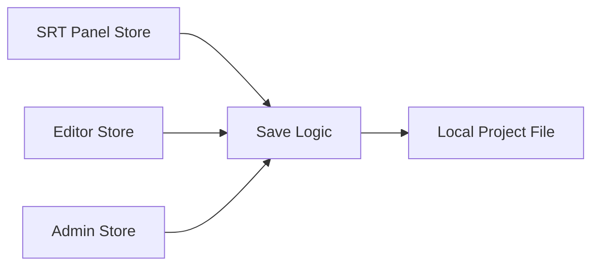
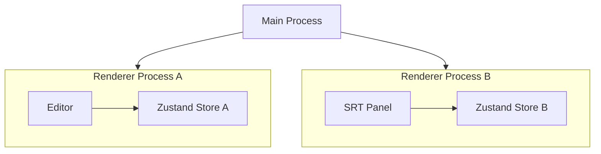
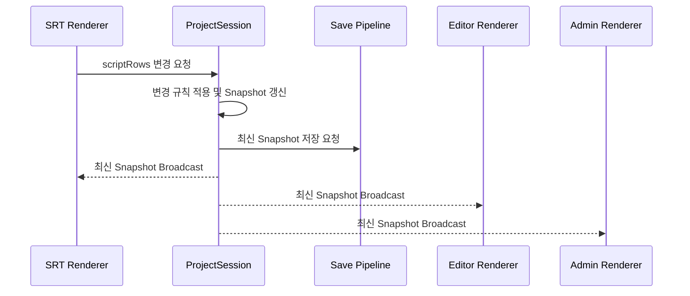
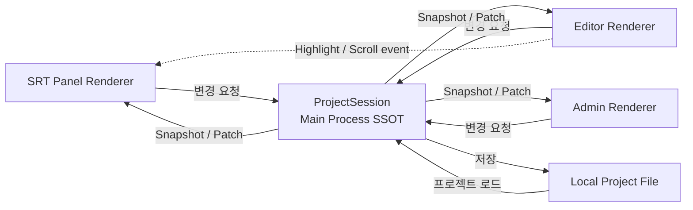

<details>
<summary>이 글의 목차 펼쳐보기</summary>

- [1. 같은 데이터를 보고 있다고 생각했다](#같은-데이터를-보고-있다고-생각했다)
- [2. Electron에서는 ‘전역’의 범위가 다르다](#electron에서는-전역-의-범위가-다르다)
- [3. SSOT는 복사본이 하나라는 뜻이 아니다](#ssot는-복사본이-하나라는-뜻이-아니다)
- [4. 공유 데이터를 둘 위치를 비교했다](#공유-데이터를-둘-위치를-비교했다)
  - [4-1. Renderer Store를 기준으로 삼는 방법](#renderer-store를-기준으로-삼는-방법)
  - [4-2. Local Project File을 기준으로 삼는 방법](#local-project-file을-기준으로-삼는-방법)
  - [4-3. Main Process를 기준으로 삼는 방법](#main-process를-기준으로-삼는-방법)
- [5. Main Process에 ProjectSession을 만들었다](#main-process에-projectsession을-만들었다)
- [6. Renderer는 값을 직접 확정하지 않는다](#renderer는-값을-직접-확정하지-않는다)
- [7. Renderer Store는 없어지는 것이 아니다](#renderer-store는-없어지는-것이-아니다)
- [8. 화면에 진입할 때 Snapshot을 다시 확인했다](#화면에-진입할-때-snapshot을-다시-확인했다)
- [9. 모든 동기화를 SSOT에 넣지는 않았다](#모든-동기화를-ssot에-넣지는-않았다)
- [10. 최종적으로 정리된 구조](#최종적으로-정리된-구조)
  - [10-1. Main Process](#main-process)
  - [10-2. Renderer](#renderer)
  - [10-3. MessagePort 또는 별도 IPC Channel](#messageport-또는-별도-ipc-channel)
- [11. 이 구조가 항상 정답은 아니다](#이-구조가-항상-정답은-아니다)
- [12. 상태 관리 도구보다 먼저 정해야 했던 것](#상태-관리-도구보다-먼저-정해야-했던-것)

</details>

SRT Script Panel에서 자막 한 줄을 수정했다.

화면에는 수정한 내용이 정상적으로 보였다. 그런데 다른 창으로 이동하자 수정 전 내용이 남아 있었다. 더 큰 문제는 프로젝트를 저장했을 때였다. 사용자가 보고 있는 값과 실제 파일에 저장되는 값이 달라질 수 있었다.

같은 프로젝트를 편집하고 있는데, 왜 창마다 서로 다른 값을 보고 있었을까?

처음에는 Zustand Store의 갱신이 누락됐거나 React 컴포넌트의 구독 범위가 잘못됐다고 생각했다. 코드를 확인한 결과, 같은 Store 모듈이 서로 다른 Renderer Process에서 각각 실행되고 있었고 프로젝트 데이터의 최종 확정 위치도 정해져 있지 않았다. 특정 상태 관리 라이브러리의 결함으로 확인된 문제는 아니었다.

이번 글에서는 Electron 멀티 윈도우 환경에서 여러 창이 공유하는 데이터를 어디에 두어야 하는지 고민하고, Main Process를 단일 진실 공급원(Single Source of Truth, SSOT)으로 삼아 데이터 동기화 구조를 설계한 과정을 소개한다.

## 1. 같은 데이터를 보고 있다고 생각했다

이번에 개발한 애플리케이션에서는 하나의 프로젝트 데이터를 여러 기능이 함께 사용했다.

- 프로젝트 저장
- SRT Script Panel
- Editor
- Admin

특히 SRT Script Panel은 별도의 창으로 분리할 수 있었다. Editor를 사용하면서 SRT Panel을 함께 열고, 자막 Row를 실시간으로 수정하는 형태였다.

따라서 사용자가 SRT Panel에서 내용을 수정하면 다음 대상이 모두 같은 확정값을 봐야 했다.

```text
SRT Panel에서 자막 수정
├─ Editor 화면에 반영
├─ Admin에서 확인
└─ 로컬 프로젝트 파일에 저장
```

하지만 처음의 구조에서는 각 화면이 자신의 Store에 프로젝트 데이터를 보관하고 있었다. 저장 로직은 이 Store들을 참조해 파일에 쓸 데이터를 만들었다.



Store의 이름과 타입은 같았지만, 실제 값은 독립적으로 변경됐다.

이 구조에서는 다음과 같은 상황이 발생할 수 있었다.

1. SRT Panel의 Store만 수정된다.
2. Editor Store에는 이전 값이 남아 있다.
3. 저장 로직이 Editor Store의 값을 참조한다.
4. 사용자가 방금 수정한 내용이 아닌 이전 값이 저장된다.

여기서 문제는 State나 Store가 많다는 점이 아니었다.

UI에는 여러 State가 존재할 수 있다. 선택된 메뉴, 모달의 열림 여부, 스크롤 위치처럼 화면마다 독립적으로 관리해도 되는 상태도 많다.

문제는 **동일한 프로젝트 데이터를 여러 Store가 각각 변경할 수 있었고, 어느 값을 최종 확정값으로 볼지 정하는 규칙이 없었다는 점**이었다.

## 2. Electron에서는 ‘전역’의 범위가 다르다

일반적인 React 웹 애플리케이션에서는 Zustand나 Redux Store 하나를 만들고 여러 컴포넌트가 이를 구독할 수 있다.

그래서 처음에는 Electron에서도 같은 방식이 가능하다고 생각했다.

```ts
const useProjectStore = create<ProjectState>(() => ({
  scriptRows: [],
}));
```

Editor와 SRT Panel에서 같은 Store를 import하면 같은 데이터를 보게 될 것처럼 느껴진다.

하지만 Electron의 멀티 윈도우 환경에서는 그렇지 않았다.

Electron 애플리케이션에는 하나의 Main Process가 있고, 각 `BrowserWindow`는 별도의 Renderer Process에서 웹 페이지를 실행한다. Main Process는 Node.js 환경에서 실행되며 창과 애플리케이션 생명주기를 관리한다. ([Electron][1])

즉, 창이 두 개라면 구조는 다음에 가깝다.



두 Renderer가 같은 Store 코드를 import하더라도, Store가 생성되는 JavaScript 메모리 공간은 서로 다르다.

결과적으로 다음 두 Store는 이름만 같을 뿐 같은 인스턴스가 아니다.

```text
Editor Renderer의 projectStore
SRT Renderer의 projectStore
```

웹 애플리케이션에서 말하는 ‘전역 Store’는 하나의 JavaScript 실행 환경 안에서 전역이다.

Electron 멀티 윈도우 환경에서는 Renderer Process가 나뉘기 때문에, **Renderer 내부의 전역 Store가 애플리케이션 전체의 전역 Store가 되지는 않는다.**

이 프로젝트에서 사용한 `ipcMain`과 `ipcRenderer` 기반 흐름에서는 Renderer 간 메시지를 Main Process가 중계했다. 다른 방법으로는 Main Process가 생성한 MessagePort 기반 채널을 각 Renderer에 전달할 수 있다. ([Electron][2])

이 지점에서 질문을 바꿔야 했다.

> 어떤 상태 관리 라이브러리를 사용할 것인가?

가 아니라,

> 여러 Renderer가 공유하는 데이터의 최신 값을 누가 결정할 것인가?

를 먼저 정해야 했다.

## 3. SSOT는 복사본이 하나라는 뜻이 아니다

SSOT를 설계한다고 하면 모든 데이터를 물리적으로 한 곳에만 보관해야 한다고 생각하기 쉽다.

하지만 Renderer가 화면을 그리려면 각 Renderer에도 데이터가 필요하다. Main Process에만 값을 두고 매 렌더링마다 IPC를 호출하는 구조는 불필요한 프로세스 간 통신을 늘린다.

이번 구조에서 SSOT는 다음과 같은 의미로 정의했다.

> **복사본이 하나뿐이라는 뜻이 아니라, 어떤 값이 최신인지 판단하고 변경을 확정하는 주체가 하나라는 뜻이다.**

Renderer에는 화면을 그리기 위한 데이터 복사본이 존재할 수 있다.

다만 Renderer의 값과 Main Process의 값이 다를 때는 Main Process의 값을 기준으로 맞춘다. 프로젝트 데이터를 변경하는 요청도 Main Process가 최종적으로 반영한다.

이를 기준으로 보면 각 계층의 역할이 명확해진다.

| 위치               | 역할                                                    |
| ------------------ | ------------------------------------------------------- |
| Main Process       | 최신 데이터 결정, 변경 규칙 적용, 저장 요청, Broadcast  |
| Renderer Store     | 화면을 그리기 위한 로컬 복사본                          |
| Local Project File | 애플리케이션 종료 후 데이터를 복구하기 위한 영속 저장소 |

실행 중인 세션에서는 Main Process가 최신 Snapshot의 기준이다.

애플리케이션을 다시 실행할 때는 Local Project File을 읽어 Main Process의 세션을 초기화한다. 이후 발생하는 변경은 다시 Main Process를 기준으로 처리한다.

## 4. 공유 데이터를 둘 위치를 비교했다

공유 데이터의 위치로 세 가지 선택지를 검토했다.

### 4-1. Renderer Store를 기준으로 삼는 방법

가장 먼저 떠올릴 수 있는 구조다.

Editor Renderer의 Store를 기준으로 두고 다른 창이 값을 요청하거나, 특정 Renderer를 대표 Store처럼 사용할 수 있다.

하지만 이 프로젝트에서는 몇 가지 문제가 있었다.

- 기준 Renderer가 닫히면 별도의 소유권 이전이나 복구 절차가 필요하다.
- 어떤 Renderer가 기준인지 애플리케이션 전체가 알아야 한다.
- 다른 Renderer가 기준 Renderer의 생명주기에 의존한다.
- 저장 시점에 어떤 Renderer의 값을 사용할지 다시 결정해야 한다.

특정 화면이 애플리케이션의 데이터 생명주기까지 책임지는 구조가 된다.

따라서 이 프로젝트에서는 Renderer를 UI 표현과 입력 처리에 집중시키기로 판단했다.

### 4-2. Local Project File을 기준으로 삼는 방법

모든 변경을 파일에 기록하고, 각 Renderer가 파일을 다시 읽는 방법도 생각할 수 있다.

파일은 영속적인 데이터이므로 기준처럼 보인다. 하지만 모든 변경을 파일에 쓴 뒤 Renderer가 다시 읽는 구조는 실시간 편집 중인 상태의 기준으로 사용하기에 비용이 컸다.

- 변경할 때마다 파일 쓰기와 읽기가 필요하다.
- 여러 변경이 연속으로 발생하면 파일 쓰기의 실행 순서를 관리해야 한다.
- 각 Renderer가 파일을 읽는 시점에 따라 서로 다른 값을 볼 수 있다.
- 파일 시스템 감시와 변경 출처 구분이 추가로 필요하다.

Local Project File은 데이터를 영구적으로 남기는 역할에는 적합하다. 이 프로젝트에서는 실행 중인 상태의 최종 확정 주체가 아니라 영속 저장소로 사용하기로 했다.

### 4-3. Main Process를 기준으로 삼는 방법

이 프로젝트의 Main Process는 이미 다음 책임을 가지고 있었다.

- `BrowserWindow` 관리
- Renderer와의 IPC 처리
- 로컬 프로젝트 파일 접근
- 프로젝트 저장
- 애플리케이션 생명주기 관리

여러 Renderer가 공유해야 하는 데이터는 Main Process가 중계하는 IPC를 거쳤고, 최종 저장도 Main Process에서 처리하고 있었다.

따라서 이번 요구사항에서는 Main Process를 공유 데이터의 SSOT로 두기로 했다.

다만 이것이 모든 Electron 애플리케이션에서 Main Process가 모든 상태를 가져야 한다는 의미는 아니다.

이번 프로젝트에는 다음 조건이 동시에 존재했다.

- 여러 Renderer가 동일한 데이터를 사용한다.
- 변경 내용이 로컬 파일에 저장돼야 한다.
- 저장되는 값과 화면에 표시되는 최신 값이 일치해야 한다.
- 분리된 창에서 같은 프로젝트 데이터를 변경할 수 있다.

이 조건과 기존 저장 구조를 함께 고려했을 때 Main Process가 적합하다고 판단했다.

## 5. Main Process에 ProjectSession을 만들었다

Main Process에는 React가 없다.

따라서 React Context나 Hook 기반 Store를 그대로 사용할 수는 없다. 하지만 Main Process에서도 현재 Snapshot을 보관하고 변경을 구독할 수 있는 저장소는 필요했다.

검토한 선택지는 다음과 같았다.

- Plain Object
- Class
- Vanilla Zustand

Plain Object만 사용해도 현재 값을 보관하는 것은 가능하다. 하지만 변경 규칙, 저장 요청, Renderer Broadcast, 외부 직접 수정 방지 같은 책임을 함께 관리하기 시작하면 코드가 여러 모듈로 흩어질 수 있었다.

Vanilla Zustand의 `createStore`는 React 없이 사용할 수 있으며 `getState`, `setState`, `subscribe` 등의 API를 제공한다. ([Zustand Documentation][3])

Class는 프로젝트 변경 규칙과 외부 공개 API를 캡슐화하는 데 사용했다.

그래서 `ProjectSession` Class 안에 Vanilla Zustand Store를 두는 구조를 선택했다.

```ts
import { createStore } from 'zustand/vanilla';

interface SrtRow {
  id: string;
  text: string;
}

interface ProjectSnapshot {
  revision: number;
  scriptRows: SrtRow[];
  projectName: string;
}

const INITIAL_PROJECT_SNAPSHOT: ProjectSnapshot = {
  revision: 0,
  scriptRows: [],
  projectName: '',
};

interface ProjectSessionDependencies {
  requestSave: (snapshot: ProjectSnapshot) => void;
  broadcastProjectChanged: (snapshot: ProjectSnapshot) => void;
}

class ProjectSession {
  private readonly store = createStore<ProjectSnapshot>()(() => INITIAL_PROJECT_SNAPSHOT);
  private readonly unsubscribe: () => void;

  constructor(private readonly dependencies: ProjectSessionDependencies) {
    this.unsubscribe = this.store.subscribe(snapshot => {
      const snapshotCopy = structuredClone(snapshot);
      this.dependencies.requestSave(snapshotCopy);
      this.dependencies.broadcastProjectChanged(snapshotCopy);
    });
  }

  getSnapshot(): ProjectSnapshot {
    return structuredClone(this.store.getState());
  }

  updateScriptRows(scriptRows: SrtRow[]): void {
    this.store.setState(state => ({
      revision: state.revision + 1,
      scriptRows,
    }));
  }

  updateProjectName(projectName: string): void {
    this.store.setState(state => ({
      revision: state.revision + 1,
      projectName,
    }));
  }

  dispose(): void {
    this.unsubscribe();
  }
}
```

예시 코드는 구조를 설명하기 위해 단순화했다. `setState`의 부분 갱신을 사용하므로 `scriptRows`를 바꿀 때 `projectName`은 유지되고, `projectName`을 바꿀 때 `scriptRows`는 유지된다.

이 구조에서 `ProjectSession`은 다음을 책임진다.

- 허용되는 프로젝트 변경 API
- 현재 Snapshot 조회
- 변경 순서와 Revision 관리
- 로컬 파일 저장 요청
- Renderer로 변경 내용 Broadcast

Vanilla Zustand는 다음 역할로 제한했다.

- 현재 Snapshot 보관
- `getState`
- `setState`
- `subscribe`

즉, Zustand를 애플리케이션 전체 아키텍처로 사용한 것이 아니다.

**Main Process 내부에서 현재 Snapshot을 보관하고 변경을 알리는 구현 도구로 사용했다.**

## 6. Renderer는 값을 직접 확정하지 않는다

이전에는 Renderer가 자신의 Store를 수정한 뒤 저장 로직이 그 Store를 참조했다.

새로운 구조에서는 데이터 흐름을 다음과 같이 변경했다.



Renderer는 “내가 가진 값이 최신 값이다”라고 선언하지 않는다.

대신 다음과 같은 변경 의도를 Main Process에 전달한다.

```ts
window.project.updateScriptRows(nextRows);
```

Main Process는 요청을 받아 변경 규칙을 적용하고, 자신의 Snapshot을 갱신한다.

Snapshot이 변경되면 저장을 요청하고 현재 열려 있는 Renderer에 최신 값을 Broadcast한다. 저장 요청 완료와 Broadcast 완료의 순서는 별도 정책으로 다룬다.

```text
Renderer의 사용자 입력
        ↓
Main Process에 변경 요청
        ↓
ProjectSession의 Snapshot 갱신
├─ 로컬 파일 저장 요청
└─ 각 Renderer에 최신 값 Broadcast
```

IPC API는 Renderer에 `ipcRenderer` 전체를 노출하기보다, Preload Script에서 필요한 기능만 제한적으로 감싼 API로 제공하는 편이 안전하다. Electron 공식 문서도 `ipcRenderer` 전체를 직접 노출하지 말고 필요한 API만 제공하라고 안내한다. ([Electron][4])

예를 들면 다음과 같다.

```ts
// preload.ts
import { contextBridge, ipcRenderer } from 'electron/renderer';
import type { IpcRendererEvent } from 'electron/renderer';
import type { ProjectSnapshot, SrtRow } from './project-types';

contextBridge.exposeInMainWorld('project', {
  getSnapshot: () => ipcRenderer.invoke('project:get-snapshot'),

  updateScriptRows: (scriptRows: SrtRow[]) => {
    ipcRenderer.send('project:update-script-rows', scriptRows);
  },

  onSnapshotChanged: (listener: (snapshot: ProjectSnapshot) => void) => {
    const handler = (_event: IpcRendererEvent, snapshot: ProjectSnapshot) => {
      listener(snapshot);
    };

    ipcRenderer.on('project:snapshot-changed', handler);

    return () => {
      ipcRenderer.removeListener('project:snapshot-changed', handler);
    };
  },
});
```

## 7. Renderer Store는 없어지는 것이 아니다

Main Process를 SSOT로 정했다고 해서 Renderer에서 상태 관리 도구를 제거한 것은 아니다.

Renderer가 Main Process에 있는 값을 매번 IPC로 조회하면서 화면을 그리면 프로세스 간 통신이 늘어난다. React 컴포넌트가 필요한 값만 구독하도록 하려면 Renderer 안에도 화면 렌더링용 Store가 있는 편이 편리하다.

따라서 Main Process에서 받은 Snapshot을 Renderer Store에 반영했다.

```ts
window.project.onSnapshotChanged(snapshot => {
  useProjectRendererStore.setState(snapshot);
});
```

컴포넌트는 필요한 Slice만 Selector로 구독한다.

```ts
const scriptRows = useProjectRendererStore(state => state.scriptRows);
```

여기서 Renderer Store의 역할이 중요하다.

Renderer Store는 프로젝트 데이터의 원본이 아니다.

**Main Process에서 전달받은 데이터를 화면에 표시하기 위한 로컬 복사본이다.**

따라서 Renderer Store의 값이 오래됐거나 Renderer가 새로 로드됐다면 Main Process의 Snapshot으로 다시 맞출 수 있다.

이 구조는 다음 두 가지 원칙을 동시에 만족한다.

- 공유 데이터의 최신 값은 Main Process가 결정한다.
- Renderer는 React 렌더링에 적합한 형태로 데이터를 구독한다.

Renderer에는 독립적인 UI 상태도 존재할 수 있다.

예를 들어 다음 상태는 해당 Renderer 안에서 관리해도 된다.

- 현재 열려 있는 Modal
- Hover 상태
- 입력 중인 검색어
- 임시 Filter
- Panel 크기

이런 값은 다른 창이나 프로젝트 파일과 공유할 필요가 없기 때문이다.

## 8. 화면에 진입할 때 Snapshot을 다시 확인했다

Broadcast만 구현하면 모든 동기화 문제가 해결될 것처럼 보이지만, 그렇지는 않았다.

Renderer가 항상 열려 있고 모든 변경 이벤트를 받는다는 보장이 없기 때문이다.

예를 들어 Admin 화면이 아직 열리지 않았거나 Renderer가 새로 로드됐다면 이전 Broadcast를 받을 수 없다.

그래서 화면 진입 시 다음 순서로 초기화했다.

1. Snapshot 변경 listener를 등록한다.
2. Main Process의 현재 Snapshot을 요청한다.
3. 응답과 event의 Revision을 비교해 최신 값만 반영한다.

조회보다 구독을 먼저 시작하면 구독 등록 전의 변경을 놓치는 구간을 줄일 수 있다. 다만 조회 응답보다 새 event가 먼저 도착할 수 있으므로 Revision 비교가 필요하다.

```ts
useEffect(() => {
  const unsubscribe = window.project.onSnapshotChanged(snapshot => {
    applySnapshot(snapshot);
  });

  void window.project.getSnapshot().then(snapshot => {
    applySnapshot(snapshot);
  });

  return unsubscribe;
}, []);
```

늦게 도착한 이전 Snapshot이 최신 값을 덮어쓰지 않도록 `revision`을 비교했다.

```ts
function applySnapshot(incomingSnapshot: ProjectSnapshot): void {
  const currentRevision = useProjectRendererStore.getState().revision;

  if (incomingSnapshot.revision < currentRevision) {
    return;
  }

  useProjectRendererStore.setState(incomingSnapshot);
}
```

Admin 탭 역시 진입 시 기존 Renderer State를 그대로 신뢰하지 않고 Main Process의 Snapshot을 다시 확인하도록 했다.

이는 모든 화면을 항상 실시간으로 유지하는 방식이라기보다, **화면이 활성화되는 시점에 현재 값을 다시 확인하는 방식**에 가깝다.

## 9. 모든 동기화를 SSOT에 넣지는 않았다

여러 창 사이에서 전달해야 하는 정보라고 해서 모두 프로젝트 Snapshot에 포함해야 하는 것은 아니다.

예를 들어 Editor에서 특정 Region을 클릭했을 때 다음 동작이 필요했다.

- 연결된 SRT Row를 Highlight한다.
- 해당 Row가 보이도록 스크롤한다.

이 정보는 프로젝트를 다시 열었을 때 복원할 필요가 없다.

사용자가 편집한 프로젝트 데이터가 아니라 현재 사용자 상호작용을 표현하는 일시적인 UI event이기 때문이다.

그래서 동기화 대상을 세 가지로 나눴다.

| 데이터 종류               | 예시                                 | 관리 위치                         |
| ------------------------- | ------------------------------------ | --------------------------------- |
| 저장되는 공유 데이터      | Script Row, 프로젝트 이름, 편집 결과 | Main Process의 ProjectSession     |
| Renderer 화면 상태        | Modal, Filter, Panel 크기            | 각 Renderer Store                 |
| 저장되지 않는 창 간 event | Highlight, Scroll, Selection 전달    | 별도 IPC 또는 MessagePort Channel |

저장할 필요가 없는 고빈도 event를 ProjectSession에 넣으면 프로젝트 Snapshot이 UI event까지 포함하게 된다.

그러면 Main Process가 데이터의 기준을 관리하는 역할뿐 아니라 모든 화면 상호작용을 중계하는 Event Bus 역할까지 맡게 된다.

이 프로젝트에서는 이런 event를 프로젝트 데이터 변경 경로와 분리했다.

Electron의 `MessageChannelMain`은 연결된 `MessagePortMain` 한 쌍을 만든다. Main Process가 각 Port를 서로 다른 Renderer에 전달하면 Renderer 간 전용 channel을 구성할 수 있다. ([Electron][5])

```text
Editor에서 Region 클릭
        ↓
MessagePort로 선택 event 전달
        ↓
SRT Panel에서 Row Highlight 및 Scroll
```

이 흐름은 ProjectSession의 Snapshot을 변경하지 않는다.

따라서 Highlight나 Scroll이 발생할 때마다 프로젝트가 저장되거나 모든 Renderer에 새로운 Snapshot이 Broadcast되지 않는다.

## 10. 최종적으로 정리된 구조

최종 구조는 다음과 같다.



이 구조에서 각 계층의 책임을 다음과 같이 나눴다.

### 10-1. Main Process

- 공유 데이터의 최신 값 결정
- 프로젝트 변경 규칙 적용
- 로컬 파일 저장
- Renderer에 Snapshot 또는 Patch 전달

### 10-2. Renderer

- 사용자 입력 처리
- Main Process에 변경 요청
- 전달받은 Snapshot을 Store에 반영
- 필요한 Slice만 구독해 화면 렌더링

### 10-3. MessagePort 또는 별도 IPC Channel

- 저장할 필요가 없는 일시적 event 전달
- Highlight, Scroll처럼 자주 발생하는 창 간 상호작용 처리

## 11. 이 구조가 항상 정답은 아니다

Main Process를 SSOT로 두면 데이터 흐름은 명확해지지만 고려해야 할 점도 있다.

Snapshot이 매우 크다면 매 변경마다 전체 Snapshot을 Broadcast하는 비용을 측정해야 한다. 문제가 확인되면 변경된 부분만 Patch로 전달하거나 Renderer가 필요한 데이터만 조회하도록 구조를 나눌 수 있다.

키 입력처럼 변경 빈도가 높다면 모든 변경마다 파일을 즉시 쓰는 방식의 저장 시간과 Main Process event loop 지연을 측정해야 한다. 메모리 Snapshot은 즉시 갱신하되 파일 쓰기는 앞선 쓰기가 끝난 뒤 다음 쓰기를 시작하는 queued sequential execution으로 제한하고, 아직 저장하지 않은 요청 중 최신 Snapshot만 남기는 방식을 검토할 수 있다.

여러 창에서 동일한 필드를 동시에 수정할 수 있다면 단순 Broadcast만으로는 충돌 정책을 정할 수 없다. Action에 `baseRevision`을 포함해 오래된 요청을 거절하거나 도메인별 병합 규칙을 별도로 설계해야 한다.

반대로 다음 조건이라면 Renderer Store만으로도 충분할 수 있다.

- 창이 하나뿐이다.
- 데이터가 다른 Renderer와 공유되지 않는다.
- 로컬 파일에 저장할 필요가 없다.
- Renderer가 종료될 때 사라져도 되는 UI 상태다.

중요한 것은 무조건 Main Process에 상태를 모으는 것이 아니다.

**데이터의 생명주기와 변경 권한을 기준으로 위치를 결정하는 것**이다.

## 12. 상태 관리 도구보다 먼저 정해야 했던 것

처음에는 어떤 상태 관리 도구를 사용해야 할지 고민했다.

Zustand를 계속 사용해도 되는지, Main Process에서는 Class나 Plain Object를 사용해야 하는지, Renderer끼리 Store를 동기화해야 하는지부터 생각했다.

하지만 문제를 따라가 보니 도구보다 먼저 결정해야 하는 것이 있었다.

> 여러 곳의 값이 다를 때, 어느 값을 진실로 볼 것인가?

Electron에서는 창이 늘어나면 해당 `BrowserWindow`의 Renderer Process도 별도로 생성된다. 따라서 한 Renderer 안의 전역 Store를 애플리케이션 전체의 전역 Store처럼 생각하면 화면마다 서로 다른 복사본을 최종값으로 취급할 수 있다.

이번 프로젝트에서는 공유되고 저장되어야 하는 데이터의 기준을 Main Process에 두었다.

Renderer는 Main Process의 Snapshot을 화면에 표시하기 위한 로컬 복사본을 가지며, 저장할 필요가 없는 UI event는 별도의 channel로 분리했다.

결국 이번 설계의 핵심은 상태를 무조건 한곳에 합치는 것이 아니었다.

**저장되는 데이터, 화면을 위한 상태, 순간적인 UI event의 책임을 서로 분리하고, 공유 데이터의 변경을 확정하는 주체를 하나로 정하는 것**이었다.

그리고 그 기준을 정하고 나니 Zustand, IPC, MessagePort가 각각 어디에서 어떤 역할을 해야 하는지도 자연스럽게 정리됐다.

---

## 참고

**Electron과 Zustand 공식 문서**

- [Electron Process Model][1]
- [Electron Inter-Process Communication][2]
- [Zustand createStore][3]
- [Electron Using Preload Scripts][4]
- [Electron MessageChannelMain][5]

[1]: https://www.electronjs.org/docs/latest/tutorial/process-model
[2]: https://www.electronjs.org/docs/latest/tutorial/ipc
[3]: https://zustand.docs.pmnd.rs/reference/apis/create-store
[4]: https://www.electronjs.org/docs/latest/tutorial/tutorial-preload
[5]: https://www.electronjs.org/docs/latest/api/message-channel-main
