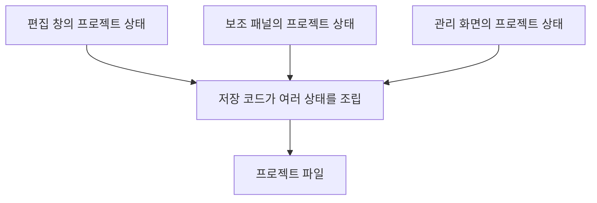
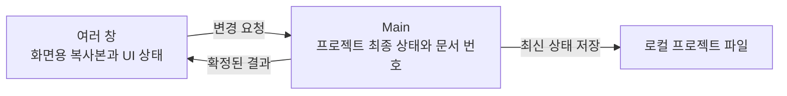

목차 펼쳐보기

- [1. 화면에서는 바뀌었는데 파일에는 남지 않았다](#1-화면에서는-바뀌었는데-파일에는-남지-않았다)
- [2. 처음에는 창 사이 통신을 의심했다](#2-처음에는-창-사이-통신을-의심했다)
- [3. 저장 흐름에서 확인한 문제](#3-저장-흐름에서-확인한-문제)
- [4. 증상과 원인을 분리했다](#4-증상과-원인을-분리했다)
- [5. 상태 관리보다 먼저 정한 규칙](#5-상태-관리보다-먼저-정한-규칙)
- [6. 하나의 상태 결정권으로 모으기](#6-하나의-상태-결정권으로-모으기)
- [7. 마치며](#7-마치며)

5편으로 줄인 시리즈 구성

1. 현재 글: 저장 결과가 달라진 원인
2. [Main이 프로젝트 상태를 정하고 각 창에 전달하는 방법](/posts/electron-main-process-project-ssot)
3. [Undo/Redo를 하나의 문서 이력으로 통합하기](/posts/electron-main-process-undo-redo)
4. [자동저장의 완료 지점과 복구 전략](/posts/electron-main-process-autosave)
5. [Main SSOT 설계의 검증 계획과 선택 비용](/posts/electron-main-process-migration)

## 1. 화면에서는 바뀌었는데 파일에는 남지 않았다

Electron 기반 편집기에서 여러 창이 같은 프로젝트를 사용했다. 한 창에서 자막을 수정하면 다른 창과 저장 파일에도 같은 결과가 반영되어야 했다.

실제 동작은 달랐다.

1. 보조 패널에서 문장을 수정했다.
2. 화면에는 수정한 문장이 보였다.
3. 프로젝트를 저장하고 다시 열면 이전 문장이 나타났다.

다른 창에서 Undo를 실행했을 때도 비슷했다. 문서는 되돌아갔지만 일부 창의 화면은 이전 상태를 계속 보여주었다.

편집기와 창 구성

편집기는 SRT, TTS, Timeline과 로컬 프로젝트 파일을 함께 다룬다.

- Editor와 Studio는 동시에 열 수 없다.
- SRT Script Panel은 별도 창으로 분리할 수 있다.
- Admin 화면도 같은 프로젝트 값을 읽는다.

Editor와 Studio를 동시에 막는 것만으로는 충분하지 않았다. 보조 패널과 Admin은 다른 창에서 같은 프로젝트를 계속 사용할 수 있기 때문이다.

## 2. 처음에는 창 사이 통신을 의심했다

처음에는 IPC 이벤트가 부족해서 생긴 문제라고 생각했다. 수정 이벤트를 다른 창에 더 자주 보내면 화면이 맞을 것처럼 보였다.

하지만 이 방법은 저장 문제를 설명하지 못했다. 화면끼리 값을 전달해도 저장기가 어느 값을 최종값으로 읽어야 하는지는 그대로 남았다.

그래서 이벤트 개수보다 먼저 다음 질문을 확인했다.

> 같은 프로젝트 값이 여러 곳에 있을 때, 어느 값이 최종값인가?

## 3. 저장 흐름에서 확인한 문제

각 창은 자체 상태 저장소를 가지고 있었다. 저장 코드는 여러 저장소를 읽어 하나의 프로젝트 파일을 다시 만들었다. Undo/Redo도 기능별 저장소와 화면의 실행 객체를 직접 바꾸었다.

코드를 따라가며 확인한 실행 경로는 단순했다. 사용자가 마지막으로 수정한 상태와 저장 코드가 읽은 상태가 달라질 수 있었다. 저장 코드는 값이 가장 최신인지 판별할 문서 번호도 가지고 있지 않았다.

Store가 여러 개라는 사실 자체가 문제는 아니다. 화면 선택값이나 재생 상태처럼 창마다 달라도 되는 값은 분리해도 된다. 문제가 된 조건은 **같은 프로젝트 값을 여러 위치가 수정하면서 최종값을 정하는 규칙이 없었다는 것**이다.

기존 내부 구현 이름

기존 Renderer에는 프로젝트 정보 Store, SRT Store, Timeline Store가 따로 있었다. Renderer의 SaveController가 이 값을 모아 프로젝트 문서를 만들었다.

이 글에서는 내부 Class와 Store 이름보다 역할을 중심으로 설명한다. 구체적인 이름은 구조를 이해하는 데 필요한 경우에만 사용한다.

## 4. 증상과 원인을 분리했다

| 구분                      | 확인한 내용                                                           |
| ------------------------- | --------------------------------------------------------------------- |
| 관찰한 증상               | 화면의 문장과 다시 연 프로젝트 파일의 문장이 달랐다.                  |
| 코드에서 확인한 실행 경로 | 저장 코드가 마지막 편집이 반영되지 않은 상태를 읽을 수 있었다.        |
| 구조적 조건               | 같은 프로젝트 값의 변경 권한과 문서 번호가 여러 위치에 흩어져 있었다. |

Renderer가 여러 개라는 사실만으로 불일치가 생기는 것은 아니다. 변경 순서, 충돌 처리, 저장 기준을 일관되게 구현하면 여러 상태도 맞출 수 있다. 당시 구조에는 그 규칙이 없었다.

따라서 원인의 범위를 “IPC 이벤트 누락”이 아니라 “프로젝트의 최종 상태를 정하는 위치가 없음”으로 좁혔다.

Electron의 프로세스 조건

Electron 앱에는 하나의 Main Process가 있고, 각 BrowserWindow의 웹 콘텐츠는 Renderer Process에서 실행된다. 서로 다른 Renderer는 같은 JavaScript Store 인스턴스를 직접 공유하지 않는다.

Renderer와 Main은 IPC로 값을 주고받는다. IPC 값에는 Structured Clone Algorithm이 적용되므로 함수, DOM 객체, 일부 실행 객체는 그대로 전송할 수 없다.

- [Electron Process Model](https://www.electronjs.org/docs/latest/tutorial/process-model)
- [Electron IPC](https://www.electronjs.org/docs/latest/tutorial/ipc)
- [Electron ipcRenderer](https://www.electronjs.org/docs/latest/api/ipc-renderer)

이 조건은 Main SSOT를 강제하지 않는다. 여러 창의 수명주기와 로컬 파일 저장을 함께 관리해야 했기 때문에 Main이 유력한 후보가 되었다.

## 5. 상태 관리보다 먼저 정한 규칙

상태 관리 라이브러리를 고르기 전에 필요한 동작부터 정리했다.

1. 어느 창에서 수정해도 모든 관련 창이 같은 확정 결과를 본다.
2. 새 창은 다른 창이 아니라 최신 프로젝트 상태에서 시작한다.
3. 저장과 Undo/Redo는 같은 프로젝트 상태를 기준으로 동작한다.
4. 창이 닫혀도 프로젝트 상태와 진행 중인 저장은 유지된다.

제품 정책이 더 필요한 항목

다음 항목은 기술 구조만으로 결정할 수 없다.

- 자동저장이 허용할 수 있는 최대 데이터 손실 시간
- 변경 응답 전에 디스크 기록까지 끝내야 하는지
- 두 창이 같은 자막을 수정할 때 나중 요청을 덮어쓸지 거절할지
- 앱을 다시 실행한 뒤에도 Undo/Redo 이력을 복원할지

이 시리즈에서는 확정된 설계와 제품 결정이 필요한 항목을 구분한다.

## 6. 하나의 상태 결정권으로 모으기

선택한 방향은 저장 가능한 프로젝트 상태의 변경 권한을 Main 한 곳에 두는 것이었다.

모든 상태를 Main으로 옮기는 것은 아니다.

- Main은 저장되는 프로젝트 값과 변경 이력을 정한다.
- 각 창은 화면용 복사본과 선택, 모달, 드래그 같은 UI 상태를 가진다.
- 오디오 재생 객체처럼 저장할 수 없는 실행 상태는 해당 창에 남긴다.

이 구조가 실제로 충분한지는 동기화, Undo/Redo, 자동저장과 복구를 각각 검증해야 한다. 다음 글에서는 Main이 상태를 정한 뒤 각 창에 같은 결과를 전달하는 흐름을 설명한다.

## 7. 마치며

처음에는 창 사이의 이벤트가 부족한 문제라고 생각했다. 코드를 따라가 보니 더 앞에 있는 문제가 보였다.

> 이벤트를 늘리기 전에, 같은 값을 누가 최종적으로 정하는지부터 정해야 했다.

[다음 글: Part 2. Main이 프로젝트 상태를 정하고 각 창에 전달하는 방법](/posts/electron-main-process-project-ssot)
