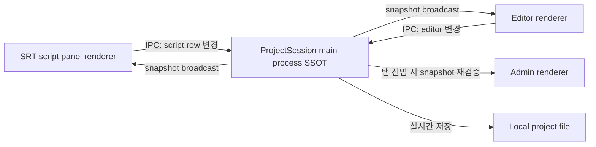

## 1. 분리된 창이 같은 상태를 공유하지 못하는 문제

이번에 실시간 변경 가능한 srt script panel을 바탕으로 TTS를 생성하여 바로 스튜디오에 연동하여 편집할 수 있는 멀티미디어 에디터를 제작하는 프로젝트를 하면서 일렉트론을 처음 사용해보았다. 그러던 중, 분리된 창에서 수정한 내용이 다른 창에 반영이 되지 않는 버그를 만났다. 일렉트론 앱의 특성과 여러 분리된 창들이 같은 상태를 공유하기 위해 SSOT를 어디에 둘 지 설계하였던 과정들을 공유해보려고 한다.

Electron 앱에서 프로젝트 저장, SRT script panel, editor 페이지, admin 페이지가 같은 프로젝트 데이터를 다루고 있었다. 문제는 이 데이터들이 하나의 단일 진실 공급원, 즉 **SSOT(Single Source of Truth)** 를 기준으로 움직이지 않았다는 점이다.

각 컴포넌트나 페이지가 서로 다른 store를 바라보면, 사용자가 편집한 내용과 실제로 저장되는 내용이 달라질 수 있다. 이 경우 문제의 직접 증상은 “편집한 값과 저장된 값의 불일치”이고, 원인은 “같은 도메인 데이터를 여러 상태 저장소가 독립적으로 보관한 구조”로 볼 수 있다.

여기서 중요한 점은 단순히 “state가 많아서” 문제가 생긴 것이 아니라는 것이다. state가 여러 개일 수는 있다. 문제는 **같은 데이터를 나타내는 상태가 여러곳에 분산되어있었다는 점**이다.

## 2. 공유되어야 하는 데이터

같은 프로젝트 데이터를 공유하는 기능은 크게 네 가지였다.

1. 프로젝트 저장
2. SRT script panel
3. editor 페이지
4. admin 페이지

특히 SRT script panel은 실시간으로 row data가 변경된다. 또 창 분리가 가능하기 때문에, editor 또는 admin 페이지와 동시에 열릴 수 있다. 따라서 SRT panel에서 변경한 내용은 현재 열려 있는 관련 탭과 실시간으로 맞아야 한다.

반면 editor와 studio 페이지는 동시에 접근할 수 없다는 규칙이 있었다. 이 제약은 동시 편집 충돌 가능성을 줄여주지만, 모든 동기화 문제를 제거하지는 않는다. SRT panel처럼 분리 가능한 창이 있기 때문이다.

또 하나의 중요한 규칙은, 변경되는 모든 내용이 실시간으로 사용자의 local PC에 저장되어야 한다는 점이었다.

## 3. Electron 구조가 상태 설계에 주는 제약

Electron은 main process와 renderer process로 나뉜다. 공식 문서 기준으로 main process는 앱의 entry point이고 Node.js 환경에서 실행된다. 따라서 로컬 파일 시스템 접근이나 프로젝트 저장 같은 작업은 main process에서 처리하는 것이 자연스럽다. renderer process는 각 `BrowserWindow`마다 별도로 생성되며, Chromium 기반의 웹 페이지처럼 동작한다. [Electron Process Model](https://www.electronjs.org/docs/latest/tutorial/process-model)

이 구조에서는 여러 renderer process가 같은 JavaScript 메모리나 같은 React store를 직접 공유하지 않는다. 즉, editor 창의 Zustand store와 SRT panel 창의 Zustand store는 같은 이름을 쓰더라도 같은 store 인스턴스가 아니다.

renderer 간 데이터를 주고받으려면 main process를 경유하는 IPC를 사용하거나, 더 지속적인 양방향 메시지 흐름이 필요할 때 `MessageChannelMain` / `MessagePortMain` 기반 channel을 열 수 있다. [Electron IPC](https://www.electronjs.org/docs/latest/tutorial/ipc), [MessageChannelMain](https://www.electronjs.org/docs/latest/api/message-channel-main)

## 4. 단일 진실 공급원은 어디에 두어야 하나

결정해야 할 핵심은 하나였다.

> 프로젝트의 단일 진실 공급원을 어디에 둘 것인가?

프로젝트 저장은 어차피 main process를 거쳐야 한다. 여러 renderer 창이 공유해야 하는 실시간 변경 데이터도 최종적으로 프로젝트 파일에 저장되어야 한다. 따라서 이 데이터 역시 main process를 지나야 한다.

그래서 결론은 main process에 프로젝트의 단일 진실 공급원을 두는 것이다.

이 결정은 “main process가 항상 모든 상태를 가져야 한다”는 일반 규칙이 아니다. 여기서는 다음 조건들이 동시에 있었기 때문에 main process가 적절했다.

1. 데이터가 로컬 프로젝트 파일에 저장되어야 한다.
2. 여러 renderer process가 같은 데이터를 공유해야 한다.
3. renderer process 간 메모리 store 공유가 불가능하다.
4. 저장 직전의 최신 snapshot과 화면에 표시되는 snapshot이 일치해야 한다.

이 관계를 흐름으로 정리하면 다음과 같다.



## 5. main process 내부 상태는 어떻게 관리할까

main process에는 React가 없다. 따라서 React `state`나 `context`는 사용할 수 없다. renderer UI 상태를 위한 Zustand hook도 그대로 쓸 수 없다.

대신 선택지는 세 가지 정도였다.

1. plain object
2. class
3. vanilla Zustand

plain object도 가능하지만, 단독으로 쓰면 상태 변경 감지, 외부 변경 차단, 저장 요청, broadcast 같은 동작을 체계적으로 묶기 어렵다.

vanilla Zustand는 React 없이도 `getState`, `setState`, `subscribe`를 제공한다. 현재 project snapshot을 보관하고 변경을 감지하기에 적합하다.

class는 프로젝트 변경 규칙과 외부 공개 API를 캡슐화하기에 적합하다. 예를 들어 저장 요청, renderer broadcast, private field를 통한 외부 직접 변경 방지 같은 책임을 class 안에 둘 수 있다.

그래서 구조는 `ProjectSession` class 안에 vanilla Zustand store를 두는 방식이 적절했다.

```ts
class ProjectSession {
  private readonly store = createStore<ProjectSnapshot>(() => initialProjectSnapshot);

  getSnapshot() {
    return this.store.getState();
  }

  updateScriptRows(rows: SrtRow[]) {
    this.store.setState({ scriptRows: rows });
  }

  subscribe() {
    return this.store.subscribe(snapshot => {
      this.saveProject(snapshot);
      this.broadcastProjectChanged(snapshot);
    });
  }

  private saveProject(snapshot: ProjectSnapshot) {
    // local PC에 프로젝트 저장
  }

  private broadcastProjectChanged(snapshot: ProjectSnapshot) {
    // 열려 있는 renderer process에 변경 알림
  }
}
```

이 구조에서 역할은 분리된다.

`ProjectSession`은 프로젝트 변경 규칙, 저장 요청, renderer broadcast를 관리한다. vanilla Zustand는 현재 프로젝트 snapshot을 보관하고 `getState`, `setState`, `subscribe`를 제공한다.

즉, Zustand를 “앱 전체 아키텍처”로 쓰는 것이 아니라, main process 내부의 snapshot store로 제한해서 사용하는 방식이다.  
(각 상태를 분리한 기준과 어떤 상태저장소를 써야할 지 선택하게 된 기준은 다음 글을 참고: [https://insight74278.tistory.com/62](https://insight74278.tistory.com/62))

## 6. renderer 화면은 어떻게 갱신할까

main process의 snapshot이 바뀌면 renderer 화면도 리렌더링되어야 한다. renderer 입장에서는 main에서 변경 이벤트를 listener로 받고, 그 값을 UI 상태에 반영해야 한다.

여기서 `useSyncExternalStore`를 직접 사용할 수도 있고, renderer 쪽 Zustand store에 반영할 수도 있다. 이 경우 여러 컴포넌트가 같은 데이터를 공유하고, 변경 범위가 일부일 때 해당 데이터만 사용하는 컴포넌트만 리렌더링되는 것이 중요했다.

따라서 renderer에서는 Zustand selector를 사용하는 편이 적합하다. main process에서 받은 snapshot 또는 patch를 renderer store에 반영하고, 각 컴포넌트는 필요한 slice만 selector로 구독한다.

```
const scriptRows = useProjectRendererStore(state => state.scriptRows);
```

이 방식은 “main process가 단일 진실 공급원을 가진다”는 규칙과 “renderer는 화면 렌더링에 필요한 state를 가진다”는 규칙을 분리한다.

## 7. admin 탭 진입 시에는 다시 불러오기

editor에서 변경한 SRT panel 내용이 admin 탭으로 이동했을 때도 맞아야 했다.

모든 탭을 항상 실시간 동기화할 수도 있다. 하지만 열려 있지 않거나 활성화되지 않은 화면까지 계속 sync하는 것은 비용 대비 이점이 작다. 또 main이 local project에 저장하기 전 admin 탭이 진입하면, admin이 오래된 renderer state를 기준으로 화면을 그릴 위험이 있다.

그래서 admin 탭 진입 시점에는 renderer의 기존 state를 신뢰하지 않고, main process의 project snapshot 또는 저장된 project document를 다시 불러오는 방식이 더 안전하다.

정확히 말하면 이것은 “실시간 동기화”가 아니라 **탭 활성화 시점의 snapshot 재검증**에 가깝다.

## 8. 예외적으로 저장하지 않는 동기화

모든 변경이 프로젝트에 저장되어야 하는 것은 아니다.

예를 들어 리전을 클릭했을 때 해당 SRT panel script row를 하이라이트하고 그 위치로 스크롤하는 기능은 사용자의 편집 데이터가 아니다. 이는 저장되어야 하는 프로젝트 상태가 아니라, 현재 상호작용을 위한 임시 UI 이벤트다.

이런 고빈도 임시 동기화는 main process의 project snapshot에 넣지 않는 편이 낫다. 대신 `MessagePort` 기반 channel을 열어 실시간 이벤트 stream처럼 전달할 수 있다.

여기서 구분이 중요하다.

- 프로젝트에 저장되어야 하는 데이터: `ProjectSession`의 snapshot으로 관리
- 저장할 필요 없는 고빈도 UI 이벤트: message port로 전달
- renderer 화면 렌더링 상태: renderer store에서 selector로 구독

## 9. 결론

이번 구조의 핵심은 “상태를 하나로 합친다”가 아니다.

정확히는 **프로젝트 데이터의 단일 진실 공급원을 main process에 두고, renderer process는 그 snapshot을 화면 렌더링에 필요한 형태로 구독한다**는 결정이다.

> 저장되어야 하는 데이터와 화면에서만 필요한 임시 이벤트를 분리해야, 동기화 구조가 단순해진다.

Electron에서는 여러 창이 각각 다른 renderer process로 동작한다. 그래서 renderer store를 전역 store처럼 생각하면 편집 내용과 저장 내용이 어긋날 수 있다. 프로젝트 저장, 실시간 변경 반영, 창 간 공유가 모두 필요한 데이터라면 main process에 `ProjectSession`을 두고 그 안에서 snapshot, 저장, broadcast 규칙을 함께 관리하는 편이 더 명확하다.
