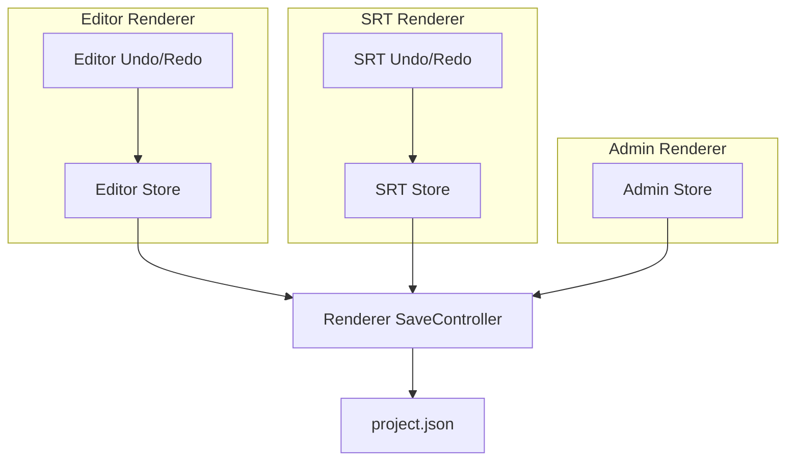
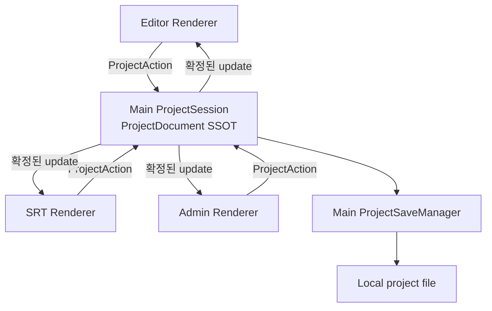

이 글의 목차 펼쳐보기

- [1. 들어가며](#1-들어가며)
- [2. 관찰된 문제](#2-관찰된-문제)
- [3. 기존 상태 구조](#3-기존-상태-구조)
- [4. 원인 분리](#4-원인-분리)
- [5. Electron의 프로세스 조건](#5-electron의-프로세스-조건)
- [6. 요구사항 재정의](#6-요구사항-재정의)
- [7. 설계 질문](#7-설계-질문)
- [8. 첫 번째 결론](#8-첫-번째-결론)
- [9. 마치며](#9-마치며)

## 1. 들어가며

SRT Script Panel과 Editor를 함께 제공하는 Electron 앱을 만들었다. Script Panel은 별도 창으로 분리할 수 있었다. Editor와 Admin은 같은 프로젝트 내용을 읽었다. 사용자가 어느 창에서 SRT row를 바꾸더라도 열려 있는 다른 창과 프로젝트 파일에 같은 결과가 반영되어야 했다.

하지만 실제 동작은 달랐다. 화면에서는 수정된 문장이 보였지만 저장 후 프로젝트를 다시 열면 이전 문장이 나타났다. Undo를 누른 창과 다른 창의 화면도 달라졌다. 처음에는 창 사이의 실시간 통신이 부족한 문제라고 생각했다. 코드를 따라가 보니 더 앞에 있는 문제가 보였다.

결론부터 적으면, **프로젝트 문서의 변경 권한과 Undo/Redo 이력을 Main Process의 `ProjectSession` 한 곳에 모으기로 했다**. Renderer에는 화면을 그리기 위한 읽기 전용 복사본과 UI 상태만 둔다. 이 결론에 도달한 과정과 선택의 비용을 여섯 편으로 나누어 정리한다.

### 시리즈 목표

이 시리즈의 목표는 세 가지다.

1. 편집한 값과 저장된 값이 달라진 구조적 이유를 설명한다.
2. Main Process를 프로젝트 문서의 단일 진실 공급원(Single Source of Truth, SSOT)으로 두는 설계를 검토한다.
3. Renderer 동기화, Undo/Redo, 자동저장, 점진적 이관까지 하나의 흐름으로 연결한다.

### 핵심 주장

> 모든 state를 Main으로 옮기는 것이 아니다. 여러 창이 공유하고 프로젝트 파일에 저장할 `ProjectDocument`의 변경 권한만 Main에 둔다.

이 글에서 SSOT는 "값이 메모리에 한 벌만 존재한다"는 뜻이 아니다. **어떤 값이 최종 확정값인지 결정하는 곳이 하나**라는 뜻으로 사용한다. Renderer에는 같은 값을 보여주기 위한 `ProjectSnapshot` 복사본이 존재할 수 있다.

### 시리즈 구성

1. 현재 글: 문제와 원인 분리
2. [Part 2. Main Process에 ProjectDocument SSOT를 둔 이유](/posts/electron-main-process-project-ssot)
3. [Part 3. Renderer가 Main의 확정 상태를 받는 방법](/posts/electron-main-process-renderer-sync)
4. [Part 4. 흩어진 Undo/Redo를 Main History로 통합하기](/posts/electron-main-process-undo-redo)
5. [Part 5. 자동저장의 책임과 디스크 저장 보장](/posts/electron-main-process-autosave)
6. [Part 6. Main SSOT로 점진적으로 이관하기](/posts/electron-main-process-migration)

전체 시리즈 목차 펼쳐보기

**Part 1. 문제와 원인**

- [관찰된 문제](#2-관찰된-문제)
- [기존 상태 구조](#3-기존-상태-구조)
- [원인 분리](#4-원인-분리)
- [Electron의 프로세스 조건](#5-electron의-프로세스-조건)
- [요구사항 재정의](#6-요구사항-재정의)
- [설계 질문](#7-설계-질문)

**Part 2. Main Process의 ProjectDocument SSOT**

- [SSOT의 범위](/posts/electron-main-process-project-ssot#2-ssot의-범위)
- [SSOT 위치 비교](/posts/electron-main-process-project-ssot#3-ssot-위치-비교)
- [Class private field와 Vanilla Zustand 비교](/posts/electron-main-process-project-ssot#4-class-private-field와-vanilla-zustand-비교)
- [상태 분류](/posts/electron-main-process-project-ssot#5-상태-분류)
- [Main과 Renderer의 책임](/posts/electron-main-process-project-ssot#6-main과-renderer의-책임)
- [전체 구조](/posts/electron-main-process-project-ssot#7-전체-구조)

**Part 3. Renderer 동기화**

- [읽기 전용 복사본](/posts/electron-main-process-renderer-sync#2-읽기-전용-복사본)
- [Renderer cache 비교](/posts/electron-main-process-renderer-sync#3-renderer-cache-비교)
- [변경 요청과 확정 결과](/posts/electron-main-process-renderer-sync#4-변경-요청과-확정-결과)
- [version 기반 동기화](/posts/electron-main-process-renderer-sync#5-version-기반-동기화)
- [탭과 창 초기화](/posts/electron-main-process-renderer-sync#6-탭과-창-초기화)
- [임시 상태와 미디어 파일](/posts/electron-main-process-renderer-sync#7-임시-상태와-미디어-파일)

**Part 4. Undo/Redo 통합**

- [기존 History의 한계](/posts/electron-main-process-undo-redo#2-기존-history의-한계)
- [문서 상태와 실행 상태 분리](/posts/electron-main-process-undo-redo#3-문서-상태와-실행-상태-분리)
- [ProjectHistoryEntry](/posts/electron-main-process-undo-redo#4-projecthistoryentry)
- [Undo와 Redo 흐름](/posts/electron-main-process-undo-redo#5-undo와-redo-흐름)
- [Runtime 동기화](/posts/electron-main-process-undo-redo#6-runtime-동기화)
- [점진적 History 이관](/posts/electron-main-process-undo-redo#8-점진적-history-이관)

**Part 5. 자동저장과 복구**

- [저장 책임 분리](/posts/electron-main-process-autosave#2-저장-책임-분리)
- [기본 자동저장 흐름](/posts/electron-main-process-autosave#3-기본-자동저장-흐름)
- [실시간 저장의 두 의미](/posts/electron-main-process-autosave#4-실시간-저장의-두-의미)
- [안전한 파일 교체](/posts/electron-main-process-autosave#5-안전한-파일-교체)
- [충돌과 오래된 비동기 결과](/posts/electron-main-process-autosave#6-충돌과-오래된-비동기-결과)
- [장애 복구](/posts/electron-main-process-autosave#7-장애-복구)

**Part 6. 점진적 이관과 검증**

- [이관 원칙](/posts/electron-main-process-migration#2-이관-원칙)
- [네 단계 이관](/posts/electron-main-process-migration#3-네-단계-이관)
- [PR 분리](/posts/electron-main-process-migration#4-pr-분리)
- [검증 계획](/posts/electron-main-process-migration#5-검증-계획)
- [선택의 비용](/posts/electron-main-process-migration#6-선택의-비용)
- [조건부 최적성](/posts/electron-main-process-migration#7-조건부-최적성)
- [남은 결정](/posts/electron-main-process-migration#8-남은-결정)

## 2. 관찰된 문제

### 2-1. 공유 대상

같은 프로젝트 데이터를 사용하는 기능은 네 곳이었다.

1. 프로젝트 저장
2. SRT Script Panel
3. Editor
4. Admin

SRT Script Panel은 row를 실시간으로 수정하고 별도 창으로 분리할 수 있었다. Editor와 Studio는 동시에 열 수 없지만 Script Panel은 어느 화면과도 함께 열릴 수 있었다. 따라서 Editor와 Studio의 상호 배제만으로는 상태 불일치를 막을 수 없었다.

### 2-2. 확인한 증상

- Script Panel에서 수정한 문장과 저장 파일의 문장이 달랐다.
- Editor에서 실행한 Undo가 다른 창의 현재 화면과 일치하지 않았다.
- 자동저장은 여러 Store를 읽어 `project.json`을 다시 조립했다.
- 탭을 바꿀 때 메모리의 최신 상태와 디스크의 이전 상태 중 무엇을 읽어야 하는지 불명확했다.

여기까지는 관찰된 **증상**이다. 이 증상만으로 IPC가 원인이라고 결론 내릴 수는 없었다.

## 3. 기존 상태 구조

각 Renderer는 자체 Zustand Store를 가지고 있었다. 프로젝트 정보 Store와 SRT Store와 Timeline Store가 별도로 존재했다. 자동저장은 이 Store들을 구독한 뒤 하나의 문서로 합쳤다. Undo/Redo도 기능별 action이 각 Store나 AudioEngine의 실행 객체를 직접 바꿨다.

Store가 여러 개라는 사실 자체는 문제가 아니다. UI 선택 상태와 재생 상태는 서로 다른 Store에 있어도 된다. 문제가 된 조건은 다음과 같다.

> 같은 프로젝트 값을 여러 Store가 각각 수정할 수 있었고 어느 Store의 값이 최종값인지 정하는 규칙이 없었다.

## 4. 원인 분리

문제를 증상과 직접 원인과 구조적 원인으로 나누었다.

| 구분 | 확인한 내용 |
| --- | --- |
| 증상 | 편집 화면과 저장 파일의 값이 달랐다. |
| 직접 원인 | 저장 시점에 읽은 Store가 사용자가 마지막으로 수정한 Store와 달랐다. |
| 구조적 원인 | 같은 프로젝트 값의 변경 권한이 여러 Renderer에 분산되어 있었다. |

Renderer Store 분산이 항상 불일치를 만든다고 말할 수는 없다. 모든 변경 순서와 충돌 규칙을 정확히 구현하면 맞출 수 있다. 다만 현재 구조에는 그 규칙이 없었고 저장과 Undo/Redo가 서로 다른 상태를 읽었다. 그래서 문제의 범위를 단순한 event 누락이 아니라 **프로젝트 문서의 최종 확정 위치 부재**로 좁혔다.

## 5. Electron의 프로세스 조건

### 5-1. 공식 문서에서 확인한 사실

Electron 앱에는 하나의 Main Process가 있다. Main은 Node.js 환경에서 실행되며 앱의 생명주기와 창을 관리한다. 각 `BrowserWindow`는 별도의 Renderer Process에서 웹 페이지를 실행한다. [Electron Process Model](https://www.electronjs.org/docs/latest/tutorial/process-model)

따라서 서로 다른 Renderer는 같은 JavaScript Store 인스턴스를 직접 공유하지 않는다. Renderer와 Main은 IPC channel을 통해 메시지를 주고받는다. 요청과 응답에는 `ipcRenderer.invoke`와 `ipcMain.handle` 조합을 사용할 수 있다. [Electron IPC](https://www.electronjs.org/docs/latest/tutorial/ipc)

IPC 전송값에는 Structured Clone Algorithm이 적용되며 함수와 DOM 객체처럼 복제할 수 없는 값은 전송할 수 없다. [Electron ipcRenderer](https://www.electronjs.org/docs/latest/api/ipc-renderer)

### 5-2. 여기서 내린 추론

프로젝트 파일 저장은 Node.js 파일 API를 사용할 수 있는 Main을 거친다. 여러 Renderer가 공유할 프로젝트 문서도 IPC를 거쳐야 한다. 그렇다면 저장 직전에 Renderer Store들을 다시 모으는 방식보다 Main이 최신 프로젝트 문서를 계속 보유하는 방식이 더 단순한 후보가 된다.

이것은 Electron이 Main SSOT를 강제한다는 뜻이 아니다. **Electron의 프로세스 구조와 이 앱의 로컬 저장 요구사항을 함께 놓았을 때 Main이 적합하다고 판단한 것**이다.

## 6. 요구사항 재정의

### 6-1. 확정 요구사항

1. 어느 창에서 SRT를 바꾸어도 열려 있는 모든 관련 창이 같은 확정 결과를 본다.
2. 새로 연 창은 Main의 최신 상태로 시작한다.
3. 프로젝트 저장과 Undo/Redo는 같은 `ProjectDocument`를 기준으로 동작한다.
4. Editor와 Studio의 동시 진입은 Main에서 막는다.
5. Renderer가 종료되어도 Main의 프로젝트 상태와 저장 작업은 유지된다.

### 6-2. 아직 확정하지 못한 요구사항

다음 항목은 제품 정책이 없어서 설계만으로 결정할 수 없었다.

- "실시간 저장"이 허용하는 최대 데이터 손실 시간
- action 응답 전에 디스크 쓰기까지 끝내야 하는지 여부
- 같은 SRT row를 두 창에서 수정할 때 충돌을 거절할지 합칠지 여부
- 앱을 다시 실행한 뒤에도 Undo/Redo 이력을 복원할지 여부

이 항목들은 이후 글에서도 **미정 조건**으로 표시한다.

## 7. 설계 질문

문제를 다섯 질문으로 줄였다.

1. 프로젝트 문서의 SSOT를 어디에 둘 것인가?
2. Renderer는 Main의 확정 상태를 어디에 보관할 것인가?
3. 자동저장은 Main과 Renderer 중 누가 책임질 것인가?
4. 실행 객체에 묶인 Undo/Redo를 어떻게 분리할 것인가?
5. 일반 IPC와 MessagePort는 각각 어떤 상태에 사용할 것인가?

이 질문들을 순서대로 풀면 Store 선택보다 먼저 상태의 소유권을 정할 수 있었다.

## 8. 첫 번째 결론

첫 번째 설계안은 다음과 같았다.

아직 답하지 않은 부분이 많다. `ProjectSession` 안에 Vanilla Zustand가 필요한지, Renderer cache로 TanStack Query를 써도 되는지, Undo/Redo가 AudioEngine을 어떻게 복원하는지, 자동저장이 어느 수준까지 디스크 저장을 보장하는지는 따로 검토해야 한다.

## 9. 마치며

이번 문제에서 가장 먼저 고쳐야 했던 것은 Store 라이브러리가 아니었다. **같은 값을 누가 최종 확정하는지 정하는 일**이었다.

실시간 event를 더 많이 보내면 화면은 잠시 맞아 보일 수 있다. 하지만 저장과 Undo/Redo가 다른 원본을 읽는다면 event 수를 늘려도 기준은 하나가 되지 않는다. 다음 글에서는 세 가지 SSOT 위치를 비교하고 Main `ProjectSession`을 선택한 근거를 정리한다.

[다음 글: Part 2. Main Process에 ProjectDocument SSOT를 둔 이유](/posts/electron-main-process-project-ssot)

---

## 참고

**Electron 공식 문서**

- [Process Model](https://www.electronjs.org/docs/latest/tutorial/process-model)
- [Inter-Process Communication](https://www.electronjs.org/docs/latest/tutorial/ipc)
- [ipcRenderer](https://www.electronjs.org/docs/latest/api/ipc-renderer)
