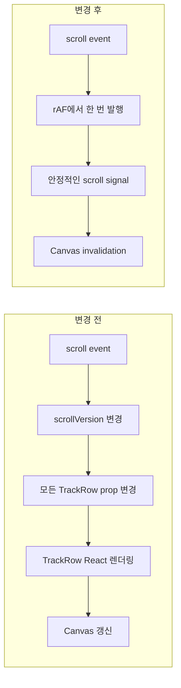

## [sort1] 1. 들어가며

한 번의 음성 생성으로 676개 오디오가 돌아오는 프로젝트를 처리하게 되었다. 생성 요청은 끝났지만 결과를 타임라인에 반영하는 동안 화면이 오래 멈추고 일부 내부 반영 작업이 실패했다. 반영이 끝난 뒤에는 겹침 처리 결과를 포함해 1,518개 Region이 남았고, Region이 500개를 넘으면 수평 스크롤과 편집 입력이 바로 반영되지 않았다.

두 증상은 서로 다른 기능처럼 보이지만 같은 대용량 오디오 처리 흐름에서 이어졌다.

```text
676개 오디오 생성
→ placement 상태와 IPC 반영
→ fetch·decode·waveform·Track·Region materialize
→ 겹침 처리 후 1,518개 Region 편집
```

여기서 `materialize`는 원격 오디오를 가져와 decode하고, waveform과 미디어 객체를 만든 뒤 Track과 Region으로 반영하는 전체 과정을 뜻한다. `Region`은 오디오 Source 전체가 아니라 타임라인에 배치된 시작·종료 시각을 가진 편집 단위다.

결론부터 적으면, **오디오 반영 단계에서는 상태 변경 횟수, 동시 실행 수, 바이트 복사, 비동기 결과의 commit 권한을 제한했다. 편집 단계에서는 Region 가시 범위 조회를 시간 인덱스로 바꾸고 Canvas 갱신을 React prop 경로에서 분리했다.**

676개 오디오 처리 시간은 15.58초에서 13.08초로 16.1% 단축됐고, 처리 중 Long Task 누적 시간은 2.24초에서 0.38초로 감소했다. 별도의 1,518개 Region 스크롤 측정에서는 Long Task 누적 시간이 4.42초에서 1.15초로 73.9% 감소했다. 반면 타임라인 측정의 메인 스레드 CPU 비율과 앱 전체 React commit 수는 줄지 않았다. 따라서 이 글에서는 어떤 비용을 줄였고 무엇이 남았는지 단계별로 구분해 정리한다.

## [sort1] 2. 오디오 반영은 materialize 전부터 느려지고 있었다

### [sort2] 2-1. 증가하는 placement 배열을 반복해서 IPC로 보냈다

기존 코드는 생성 결과를 순회하며 `addPlacement`를 호출했다. 각 호출은 새 항목 하나가 아니라 증가한 placement 전체 배열을 React state와 IPC에 다시 반영했다.

```text
1번째 호출 → placement 1개 전송
2번째 호출 → placement 2개 전송
...
676번째 호출 → placement 676개 전송
```

676번 호출에서 IPC로 전달한 누적 레코드 수는 다음과 같다.

```text
1 + 2 + ... + 676 = 228,826
```

React가 렌더링을 batching하더라도 updater 안에서 이미 실행한 IPC 호출은 없어지지 않는다. 따라서 이 병목은 React commit 수만 측정해서는 확인하기 어려웠다.

### [sort2] 2-2. 676개 materialize를 제한 없이 시작했다

placement가 저장되면 각 항목은 별도의 비동기 작업을 시작했다.

```ts
for (const placement of placements) {
  void placeAudioFromUrl(placement);
}
```

`Promise` 사용 자체가 문제는 아니었다. 동시에 실행할 작업의 상한이 없다는 점이 문제였다. 676개 placement가 들어오면 다음 단계가 한꺼번에 경쟁했다.

```text
원격 fetch
→ IPC byte 전달
→ decodeAudioData
→ waveform 계산
→ media store 갱신
→ Track·Region 생성
→ Region 겹침 처리
```

같은 placement의 중복 실행을 막는 Map은 있었지만 이는 중복 제거다. 전체 동시 실행 수를 제한하는 queue와는 역할이 다르다.

### [sort2] 2-3. 압축 바이트 복사와 오래된 비동기 결과가 남았다

원격 파일은 Main Process에서 `ArrayBuffer`로 읽고 `Uint8Array`로 Renderer에 전달했다. Renderer는 이를 다시 정확한 크기의 `ArrayBuffer`로 복사했고, decode 함수는 `File.arrayBuffer()`를 호출해 입력을 한 번 더 만들었다.

```text
Main response.arrayBuffer()
→ IPC Uint8Array
→ Renderer ArrayBuffer 전체 복사
→ File.arrayBuffer()
→ decodeAudioData()
```

Electron IPC 경계의 structured clone 비용까지 없앨 수는 없다. 제거할 수 있는 범위는 Renderer가 이미 받은 backing buffer를 decode 입력으로 다시 만드는 추가 복사였다.

또한 프로젝트 전환이나 placement 삭제 중 이미 시작된 fetch와 decode가 나중에 끝나면 오래된 결과가 현재 Session과 Store를 변경할 수 있었다. 동시 실행 수만 줄여서는 이 문제를 막을 수 없었다.

## [sort1] 3. Bulk IPC와 최대 4개 작업 큐로 반영 경로 제한하기

### [sort2] 3-1. placement를 한 번의 상태 변경으로 추가하기

생성 결과를 먼저 배열로 모은 뒤 `addPlacements`를 한 번 호출하도록 변경했다.

```ts
const createdPlacements = placementInputs.map(input => ({
  ...input,
  id: crypto.randomUUID(),
}));

const nextPlacements = [...placementsRef.current, ...createdPlacements];

placementsRef.current = nextPlacements;
setPlacements(nextPlacements);
window.api.srtWindow.setSessionState({
  placements: nextPlacements,
});
```

개별 추가 API는 제거하지 않았다. `addPlacement`가 내부에서 `addPlacements([placement])`를 호출하게 만들어 기존 호출부의 동작을 유지했다.

이 변경으로 676개 생성 시 placement 상태 변경과 IPC 호출은 676회에서 1회로 줄었다. 누적 전달 레코드도 228,826개에서 676개가 됐다.

### [sort2] 3-2. FIFO queue에서 최대 4개만 실행하기

모든 작업을 한 개씩 순차 실행하면 네트워크와 decode 자원을 충분히 쓰지 못할 수 있다. 반대로 676개를 모두 시작하면 CPU와 메모리가 동시에 경쟁한다. 먼저 들어온 작업부터 처리하는 FIFO(First In, First Out) queue에 동시 실행 상한을 두었다.

```ts
interface QueueEntry<T> {
  task: () => Promise<T>;
  resolve: (value: T) => void;
  reject: (reason: unknown) => void;
}

class BoundedAsyncQueue {
  private readonly waiting: Array<QueueEntry<unknown>> = [];
  private activeCount = 0;

  constructor(private readonly concurrency: number) {}

  enqueue<T>(task: () => Promise<T>): Promise<T> {
    return new Promise<T>((resolve, reject) => {
      this.waiting.push({ task, resolve, reject } as QueueEntry<unknown>);
      this.drain();
    });
  }

  private drain(): void {
    while (this.activeCount < this.concurrency) {
      const entry = this.waiting.shift();
      if (!entry) return;

      this.activeCount += 1;
      Promise.resolve()
        .then(entry.task)
        .then(entry.resolve, entry.reject)
        .finally(() => {
          this.activeCount -= 1;
          this.drain();
        });
    }
  }
}
```

오디오 경로에서는 동시 실행 수를 4로 설정했다.

```ts
const audioMaterializeQueue = new BoundedAsyncQueue(4);

for (const placement of placements) {
  void audioMaterializeQueue.enqueue(() => materialize(placement));
}
```

이는 Promise 기반 순차 실행이 아니다. 최대 4개까지 병행 실행하고 나머지는 FIFO 대기열에 둔다. `finally`에서 실행 슬롯을 반환하므로 성공과 실패 모두 다음 작업을 막지 않는다.

### [sort2] 3-3. 오래된 작업의 commit 권한 제거하기

각 placement에 증가하는 `epoch`을 부여했다. 작업이 시작할 때 받은 epoch이 최신일 때만 Session과 Store를 변경할 수 있다.

```ts
const epochs = new Map<string, number>();

function beginAttempt(placementId: string): number {
  const next = (epochs.get(placementId) ?? 0) + 1;
  epochs.set(placementId, next);
  return next;
}

async function enqueuePlacement(placement: Placement): Promise<void> {
  const epoch = beginAttempt(placement.id);

  await audioMaterializeQueue.enqueue(async () => {
    if (epochs.get(placement.id) !== epoch) return;
    const decoded = await fetchAndDecode(placement);
    if (epochs.get(placement.id) !== epoch) return;
    commitRegion(decoded);
  });
}
```

프로젝트 generation이 바뀌거나 placement가 삭제되면 epoch을 올린다. 이전 작업은 끝까지 실행될 수 있지만 현재 프로젝트를 변경할 권한은 잃는다. 이는 요청 취소가 아니라 오래된 비동기 결과의 commit을 거부하는 방식이다.

## [sort1] 4. IPC buffer를 decode 입력으로 재사용하기

IPC에서 받은 `Uint8Array`가 backing buffer 전체를 가리키면 그 `ArrayBuffer`를 그대로 decode 입력으로 사용한다. subarray처럼 일부 범위만 가리킬 때만 보이는 구간을 복사한다.

```ts
function toExactArrayBuffer(bytes: Uint8Array): ArrayBuffer {
  const usesWholeBuffer = bytes.byteOffset === 0 && bytes.byteLength === bytes.buffer.byteLength;

  if (bytes.buffer instanceof ArrayBuffer && usesWholeBuffer) {
    return bytes.buffer;
  }

  return bytes.slice().buffer as ArrayBuffer;
}
```

`decodeAudioData`가 입력 `ArrayBuffer`를 detach할 수 있으므로 저장과 재생에 필요한 `File` snapshot을 먼저 만든다.

```ts
const result = await window.api.remoteAudio.fetch(url);
const decodeBuffer = toExactArrayBuffer(result.bytes);

const file = new File([decodeBuffer], fileName, {
  type: result.mimeType,
});

const audioBuffer = await audioContext.decodeAudioData(decodeBuffer);
```

이 방식은 IPC 경계의 복사나 `File`이 유지할 snapshot까지 없애는 zero-copy가 아니다. Renderer에서 decode 입력을 만들기 위해 수행하던 추가 전체 복사만 제거한다.

Main Process의 fetch에는 30초 timeout과 128MiB 크기 상한도 추가했다. 끝나지 않는 요청이 queue의 실행 슬롯을 계속 차지하지 않게 하기 위한 제한이다.

실제 RR6 프로젝트의 676개 오디오 반영 결과는 다음과 같았다.

| 지표                | 변경 전 | 변경 후 |       변화 |
| ------------------- | ------: | ------: | ---------: |
| 처리 시간           | 15.58초 | 13.08초 | 16.1% 단축 |
| Long Task 누적      |  2.24초 |  0.38초 | 82.8% 감소 |
| 내부 반영 작업 오류 |    78건 |     0건 |  100% 감소 |
| Memory Peak         |  2.32GB |  2.12GB |  8.4% 감소 |

표시한 시간과 메모리는 반올림된 값이다. 이 측정은 Bulk IPC, 동시성 제한, stale commit 차단, buffer 재사용을 함께 적용한 결과다. 각 변경이 전체 개선율에서 차지한 비중은 이 측정만으로 분리할 수 없다.


이제 오디오 반영은 안정적으로 끝났지만 타임라인에는 1,518개 Region이 남았다. 다음 단계에서는 이 Region을 편집할 때 발생한 별도의 조회·렌더링 병목을 다룬다.

## [sort1] 5. Region 500개부터 편집이 어려웠던 이유

### [sort2] 5-1. 관찰된 증상과 확인된 반복 작업

사용자가 경험한 증상은 화면이 끊기고 입력이 바로 반영되지 않는 것이었다. 이 증상만으로는 원인을 확정할 수 없다. 같은 증상은 JavaScript 계산, React 렌더링, Canvas draw, 브라우저 페인트, 메모리 회수 등 여러 경로에서 발생할 수 있다.

코드에서 직접 확인한 반복 작업은 두 가지였다.

첫 번째는 Region 선형 조회였다. 기존 코드도 TanStack Virtual을 사용해 현재 가로 화면의 pixel 범위를 계산하고 있었다. 하지만 실제로 화면과 겹치는 Region을 고르는 단계에서는 각 트랙의 모든 Region에 `filter`를 실행했다.

```ts
const visibleSegments = segments.filter(segment => {
  const startX = segment.start * effectivePxPerSec;
  const endX = segment.end * effectivePxPerSec;

  return endX >= visibleRange.startPx && startX <= visibleRange.endPx;
});
```

두 번째는 스크롤 상태 전달 방식이었다. 부모 컴포넌트가 스크롤 프레임마다 `scrollVersion` 값을 증가시키고 이 값을 모든 TrackRow에 prop으로 전달했다.

```text
scroll event
→ requestAnimationFrame
→ setScrollVersion(version + 1)
→ 모든 TrackRow의 scrollVersion prop 변경
→ TrackRow 컴포넌트 다시 실행
→ Canvas 갱신
```

TrackRow는 `React.memo`로 감싸져 있었지만 비교 함수에 `scrollVersion`이 포함되어 있었다. 따라서 이 값이 바뀌면 memo는 렌더링을 건너뛸 수 없었다. [React 공식 문서](https://react.dev/reference/react/memo)도 `memo`는 props가 같을 때 렌더링을 건너뛸 수 있는 최적화이며, 항상 새 prop이 전달되면 효과가 없다고 설명한다.

### [sort2] 5-2. 이번 작업은 Track 가상화가 아니다

용어를 먼저 구분할 필요가 있다.

- **세로 트랙 가상화:** 현재 세로 화면과 overscan 범위에 들어온 TrackRow만 마운트한다.
- **Region 가시 범위 조회:** 이미 마운트된 TrackRow 안에서 현재 가로 시간 범위와 겹치는 Region만 고른다.
- **TrackRow 렌더링 격리:** 부모가 스크롤 상태를 갱신해도 TrackRow의 props가 같다면 컴포넌트 실행을 건너뛴다.

이번 작업은 두 번째와 세 번째에 해당한다. 모든 TrackRow는 계속 마운트되며, 스크롤 시 모든 TrackRow가 Canvas 갱신 신호를 받는다. 이 범위를 명확히 해야 측정 결과를 트랙 가상화의 효과로 잘못 설명하지 않을 수 있다.

## [sort1] 6. 전체 Region 순회를 시간 인덱스로 바꾸기

### [sort2] 6-1. 기존 수평 가상화에도 전체 순회가 남아 있었다

기존 Region 레이어는 가로 타임라인을 일정한 pixel chunk로 나누고, 현재 화면 주변의 chunk만 활성화했다. 이 구조는 전체 타임라인의 SVG 범위를 제한하는 데 도움이 됐다.

문제는 다음 단계였다. 활성 chunk의 시작과 끝을 구한 뒤에도 해당 트랙의 `segments` 전체를 순회하며 교차 여부를 검사했다.

```text
가로 virtualizer
→ 현재 화면과 overscan의 pixel 범위 계산
→ 해당 트랙의 모든 Region 순회
→ pixel 범위와 겹치는 Region 선택
```

즉, “보이는 범위를 알고 있다”와 “그 범위에 속한 데이터를 빠르게 찾는다”는 서로 다른 문제였다. 전자는 virtualizer가 처리했지만 후자는 여전히 `O(N)` 선형 조회였다.

### [sort2] 6-2. 시작 시간과 누적 최대 종료 시간을 함께 저장하기

Region은 `start`와 `end`를 가진 시간 구간이다. 우선 Region 목록이 바뀔 때 다음 인덱스를 한 번 생성했다.

```ts
interface TimelineSegmentInterval {
  start: number;
  end: number;
}

interface IndexedSegment<TSegment extends TimelineSegmentInterval> {
  segment: TSegment;
  start: number;
  end: number;
  originalIndex: number;
}

interface VisibleSegmentIndex<TSegment extends TimelineSegmentInterval> {
  sortedSegments: ReadonlyArray<IndexedSegment<TSegment>>;
  prefixMaxEnd: readonly number[];
}
```

`sortedSegments`는 Region을 시작 시간순으로 정렬한 배열이다. `originalIndex`는 조회 후 기존 렌더링 순서를 복원하기 위해 저장한다.

여기서 시작 시간만 정렬하면 충분해 보이지만, 긴 Region 때문에 문제가 생긴다.

```text
Region A: 0초 ───────────────────────── 100초
현재 화면:                         90초 ─ 95초
```

Region A는 화면보다 훨씬 먼저 시작했지만 현재 화면과 겹친다. 단순히 “화면 시작 시간과 가까운 Region부터 찾기”만 하면 이런 Region을 누락할 수 있다.

그래서 정렬된 각 위치까지 등장한 Region의 최대 종료 시간을 `prefixMaxEnd`에 저장했다.

```ts
const prefixMaxEnd: number[] = [];
let maximumEnd = Number.NEGATIVE_INFINITY;

for (const indexedSegment of sortedSegments) {
  maximumEnd = Math.max(maximumEnd, indexedSegment.end);
  prefixMaxEnd.push(maximumEnd);
}
```

예를 들어 종료 시간이 `[4, 100, 12, 30]`이라면 누적 최대 종료 시간은 `[4, 100, 100, 100]`이 된다. 이 배열을 사용하면 현재 화면 시작 시간까지 이어질 가능성이 있는 가장 이른 후보를 이진 탐색으로 찾을 수 있다.

인덱스 생성에는 정렬 때문에 `O(N log N)`이 필요하다. 하지만 `useMemo`로 Region 목록이 바뀔 때만 생성하고, 스크롤 중에는 같은 인덱스를 재사용한다.

```tsx
const segmentVisibilityIndex = useMemo(() => createVisibleSegmentIndex(segments), [segments]);
```

### [sort2] 6-3. 두 번의 이진 탐색으로 후보 구간 좁히기

현재 화면의 pixel 범위는 초 단위 시간 범위로 변환했다.

```tsx
const result = queryVisibleSegments(segmentVisibilityIndex, {
  start: visibleRange.startPx / effectivePxPerSec,
  end: visibleRange.endPx / effectivePxPerSec,
});
```

그 다음 두 번의 이진 탐색으로 후보 구간의 양 끝을 찾았다.

1. `prefixMaxEnd >= 화면 시작 시간`을 처음 만족하는 위치
2. `Region 시작 시간 > 화면 종료 시간`을 처음 만족하는 위치

```ts
const firstCandidateIndex = findFirstPrefixEndAtOrAfter(index.prefixMaxEnd, range.start);

const candidateEndIndex = findFirstSegmentStartingAfter(index.sortedSegments, range.end);
```

첫 번째 위치보다 앞에 있는 Region은 누적 최대 종료 시간도 화면 시작 시간보다 작다. 따라서 현재 화면까지 이어질 수 없다. 두 번째 위치부터는 Region이 화면 종료 시간 뒤에 시작한다. 따라서 현재 화면과 겹칠 수 없다.

두 위치 사이의 후보만 실제 교차 여부를 확인했다.

```ts
const visibleSegments: Array<IndexedSegment<TSegment>> = [];

for (let position = firstCandidateIndex; position < candidateEndIndex; position += 1) {
  const indexedSegment = index.sortedSegments[position];

  if (indexedSegment.end >= range.start) {
    visibleSegments.push(indexedSegment);
  }
}
```

후보 범위를 찾는 비용은 `O(log N)`, 후보를 검사하는 비용은 `O(K)`다. 여기서 `K`는 이진 탐색으로 좁힌 후보 수다. 실제 반환 전에 원래 순서를 복원하는 정렬이 있으므로 전체 함수의 비용을 단순히 `O(log N + K)`라고만 표현할 수는 없다. 반환 Region이 `V`개라면 순서 복원에 `O(V log V)`가 추가된다.

700개 Region을 15개 트랙에 분산한 synthetic benchmark에서 2,000개 화면 구간을 조회했다. 선형 조회는 1,400,000개 Region을 검사했고, 인덱스 조회가 검사한 후보는 20,798개였다. 후보 검사 횟수는 약 98.5% 감소했다. 이 값은 실제 사용자 체감 시간이 아니라 조회 알고리즘의 탐색 범위를 비교한 수치다.

### [sort2] 6-4. 입력 순서와 경계 조건 보존하기

성능만 개선하고 기존 렌더링 순서를 바꾸면 선택 표시나 겹침 순서가 달라질 수 있다. 그래서 조회 결과를 `originalIndex` 기준으로 다시 정렬한 뒤, 기존 선택 우선순위 정렬을 그대로 적용했다.

```ts
visibleSegments.sort((left, right) => left.originalIndex - right.originalIndex);

return visibleSegments.map(indexedSegment => indexedSegment.segment);
```

경계 조건도 기존 동작과 같게 유지했다.

```text
Region.end === viewport.start → 포함
Region.start === viewport.end → 포함
```

즉, 화면 경계에 정확히 닿은 Region도 보이는 것으로 판단한다. 별도 테스트에서 왼쪽 경계, 오른쪽 경계, 화면보다 먼저 시작한 긴 Region, 잘못된 시간 범위를 각각 검증했다.

## [sort1] 7. 스크롤과 TrackRow React 렌더링 분리하기

### [sort2] 7-1. 숫자 prop 하나가 memo를 무효화했다

TrackRow는 `React.memo`와 사용자 정의 비교 함수를 사용하고 있었다. 하지만 스크롤 프레임을 나타내는 `scrollVersion`이 비교 조건에 포함됐다.

```tsx
export const TrackRow = memo(TrackRowComponent, (previous, next) => {
  return (
    previous.trackId === next.trackId &&
    previous.height === next.height &&
    previous.scrollVersion === next.scrollVersion
  );
});
```

부모가 `scrollVersion`을 증가시키면 모든 TrackRow의 비교 결과가 `false`가 된다. TrackRow가 실제로 사용하는 트랙 데이터가 바뀌지 않아도 컴포넌트 함수가 다시 실행된다.

여기서 `memo` 자체가 잘못된 것은 아니다. React 공식 문서가 설명하듯 `memo`는 props가 같을 때 렌더링을 건너뛰는 최적화다. 매번 달라지는 값을 prop으로 전달하면 memo가 적용될 조건이 사라진다.

### [sort2] 7-2. 안정적인 신호 객체로 Canvas 갱신만 전달하기

스크롤할 때 TrackRow가 필요로 하는 것은 새로운 React 출력이 아니었다. Canvas가 새로운 가로 위치를 기준으로 다시 그려져야 한다는 알림이었다.

그래서 구독과 발행만 담당하는 작은 신호 객체를 만들었다.

```ts
type TimelineScrollFrameListener = () => void;

interface TimelineScrollFrameSignal {
  subscribe: (listener: TimelineScrollFrameListener) => () => void;
  emit: () => void;
}

function createTimelineScrollFrameSignal(): TimelineScrollFrameSignal {
  const listeners = new Set<TimelineScrollFrameListener>();

  return {
    subscribe: listener => {
      listeners.add(listener);
      return () => listeners.delete(listener);
    },
    emit: () => {
      for (const listener of listeners) {
        listener();
      }
    },
  };
}
```

부모에서는 `useMemo`로 이 객체를 한 번만 생성했다.

```tsx
const scrollFrameSignal = useMemo(() => createTimelineScrollFrameSignal(), []);
```

TrackRow는 숫자 `scrollVersion` 대신 참조가 유지되는 `scrollFrameSignal`을 prop으로 받는다. 각 TrackRow는 Effect에서 신호를 구독하고, 신호가 오면 Canvas invalidation만 요청한다.

```tsx
useEffect(() => {
  return scrollFrameSignal.subscribe(() => {
    invalidateTrackCanvas({
      reason: 'scroll-buffer',
      trackId: track.id,
    });
  });
}, [scrollFrameSignal, invalidateTrackCanvas, track.id]);
```

`React.memo` 비교 함수도 프레임 숫자가 아니라 신호 객체의 참조를 비교하도록 바꿨다.

```tsx
previous.scrollFrameSignal === next.scrollFrameSignal;
```

신호 객체는 계속 같은 참조를 유지한다. 따라서 스크롤만 발생했을 때 TrackRow의 prop은 바뀌지 않고, React는 TrackRow 컴포넌트 실행을 건너뛸 수 있다.

다만 부모의 React state를 전부 제거한 것은 아니다. 타임라인 언어 헤더처럼 `scrollVersion`을 사용하는 다른 화면은 기존 state를 계속 사용한다. 분리한 대상은 TrackRow 경로다.



### [sort2] 7-3. requestAnimationFrame으로 스크롤 이벤트 묶기

브라우저는 한 화면 프레임 사이에 여러 `scroll` 이벤트를 전달할 수 있다. 각 이벤트마다 신호를 발행하면 같은 프레임에 Canvas 갱신 요청이 중복될 수 있다.

그래서 이미 `requestAnimationFrame` 콜백이 예약되어 있으면 새 콜백을 만들지 않았다.

```tsx
onScroll={() => {
  const element = timelineScrollRef.current;
  if (!element) return;

  layout.viewport.setScrollX(element.scrollLeft);
  scrollXRef.current = element.scrollLeft;

  if (scrollRafRef.current) return;

  scrollRafRef.current = requestAnimationFrame(() => {
    scrollRafRef.current = 0;
    publishScrollFrame();
  });
}}
```

이 방식은 scroll event 자체를 줄이지 않는다. 같은 화면 프레임 안에서 들어온 여러 이벤트를 Canvas 갱신 신호 한 번으로 묶는다.

## [sort1] 8. 왜 세로 Track 가상화를 적용하지 않았나

세로 Track 가상화는 화면 밖 TrackRow를 마운트하지 않기 때문에 Track 수가 매우 많을 때 효과를 기대할 수 있다. 하지만 이 제품의 실제 프로젝트는 주로 10~15개 Track을 사용한다. 이 범위에서는 화면 밖으로 제거할 Track 수가 많지 않아 기대 효과가 작다고 판단했다.

반면 세로 가상화를 적용하려면 드래그, 선택 영역, Track 재정렬, 고정 Track, 서로 다른 Track 높이를 모두 가상화 좌표계와 맞춰야 한다. 일반적인 사용 범위에서 기대되는 이득보다 상호작용 좌표계와 lifecycle 변경 비용이 더 컸다.

그래서 실제로 반복 비용이 Region 수에 비례하던 두 경로를 더 작은 변경 범위로 먼저 줄였다.

| 선택지               | 얻는 점                                       | 비용과 한계                                               |
| -------------------- | --------------------------------------------- | --------------------------------------------------------- |
| 세로 TrackRow 가상화 | 화면 밖 TrackRow의 React·DOM·Canvas 비용 제거 | 드래그, 선택, 재정렬, 동적 높이 좌표계를 함께 변경해야 함 |
| Region 시간 인덱스   | 스크롤마다 전체 Region을 검사하는 비용 감소   | Region 목록 변경 시 인덱스를 다시 생성해야 함             |
| 스크롤 신호 분리     | TrackRow prop 변경 없이 Canvas 갱신 가능      | 모든 Track Canvas에 invalidation은 계속 전달됨            |

이 선택은 세로 가상화가 항상 불필요하다는 뜻이 아니다. 제품의 일반적인 Track 수가 10~15개를 넘어서는 사용 사례가 늘어나면 다시 측정해야 한다. 현재 조건에서는 Region 전체 순회와 TrackRow prop 변경이 더 직접적인 병목이었기 때문에 이 두 경로를 먼저 분리했다.

## [sort1] 9. Playwright와 Chrome Trace로 같은 동작 측정하기

### [sort2] 9-1. 실제 Electron Renderer에 연결하기

단위 benchmark만으로는 사용자가 느끼는 화면 버벅임을 설명하기 어렵다. 그래서 staging Electron 앱을 remote debugging port와 함께 실행하고, Playwright가 Chrome DevTools Protocol(CDP)로 기존 Renderer에 연결하도록 했다. Playwright의 [`connectOverCDP`](https://playwright.dev/docs/api/class-browsertype#browser-type-connect-over-cdp)는 실행 중인 Chromium 기반 브라우저에 CDP로 연결하는 API다.

```ts
const browser = await chromium.connectOverCDP('http://127.0.0.1:9222');

const context = browser.contexts()[0];
const page = context.pages()[0];
const cdp = await context.newCDPSession(page);
```

실제 프로젝트 JSON을 Generate한 결과를 고정 fixture로 저장했다. 최종 측정 조건은 다음과 같다.

```text
Track: 18개
Region: 1,518개
측정 시간: 10초
wheel 입력: 303회
입력 간격: 33ms
스크롤 거리: 480px
반복 횟수: 변경 전·후 각각 3회
대표값: 3회 중앙값
```

백그라운드 창에서는 Chromium이 timer와 animation frame을 제한할 수 있다. 측정 중 Electron 창을 활성 상태로 유지하고 두 버전 모두 같은 background throttling 해제 옵션을 적용했다.

### [sort2] 9-2. 사용자 반응성을 여러 지표로 나누기

“버벅인다”를 하나의 숫자로 표현하면 어떤 문제가 줄었는지 알기 어렵다. 그래서 다음 지표를 함께 측정했다.

**Long Task**

`PerformanceObserver`로 `longtask` entry를 수집했다. [Long Tasks API](https://www.w3.org/TR/longtasks-1/)는 UI thread를 오랫동안 점유해 입력 반응 같은 다른 중요한 작업을 막을 수 있는 task를 관찰하기 위한 API다.

```ts
const observer = new PerformanceObserver(list => {
  for (const entry of list.getEntries()) {
    longTasks.push({
      startTime: entry.startTime,
      duration: entry.duration,
    });
  }
});

observer.observe({ type: 'longtask' });
```

**입력 후 다음 animation frame까지 걸린 시간**

wheel event를 받은 시점과 다음 `requestAnimationFrame` 콜백의 차이를 기록했다. 이 값은 입력이 DOM에 도착한 뒤 다음 화면 갱신 기회를 얻기까지의 지연이다. 실제 pixel이 완전히 그려진 시점 전체를 의미하지는 않는다.

**wheel 입력 수신율**

CDP로 보낸 wheel 입력 수와 DOM에서 관찰한 wheel event 수를 비교했다. 이 차이는 Chromium의 event 병합과 누락을 구분하지 못한다. 따라서 이 글에서는 “사용자 입력 유실률”이 아니라 **DOM wheel 입력 수신율**이라고 부른다.

**React commit과 actualDuration**

React DevTools hook에서 commit 발생 시점과 root의 `actualDuration`을 기록했다. 이 값은 React가 보고한 렌더링 시간이며, 브라우저의 전체 메인 스레드 작업 시간을 의미하지 않는다.

**메인 스레드 CPU 비율**

[CDP Performance domain](https://chromedevtools.github.io/devtools-protocol/tot/Performance/)을 `threadTicks` 시간축으로 활성화하고, 측정 전후 `TaskDuration` 차이를 wall time으로 나눴다.

```ts
await cdp.send('Performance.enable', {
  timeDomain: 'threadTicks',
});
```

이 비율은 측정 구간에서 Renderer task가 실행된 시간의 비중을 비교하기 위한 값이다.

### [sort2] 9-3. Chrome Trace는 비교 수치가 아니라 원인 분석에 사용하기

Chrome Trace는 JavaScript 실행, input, frame, Blink rendering 같은 event를 시간순으로 저장한다. [CDP Tracing domain](https://chromedevtools.github.io/devtools-protocol/tot/Tracing/)의 `ReturnAsStream` 모드로 trace JSON을 파일에 기록했다.

```ts
await cdp.send('Tracing.start', {
  transferMode: 'ReturnAsStream',
  categories: ['toplevel', 'blink', 'devtools.timeline', 'input', 'v8'].join(','),
});
```

하지만 trace 수집은 실행 중인 앱에 추가 작업을 만든다. 실제 측정에서도 trace를 켠 실행은 절대 지표가 크게 달라졌고, 변경 전후 결과 방향도 반복 측정과 일치하지 않았다.

그래서 역할을 분리했다.

- **변경 전후 수치 비교:** trace를 끄고 각각 3회 실행한 중앙값
- **어떤 작업이 실행됐는지 분석:** trace를 켠 별도 실행

측정 도구가 측정 대상의 동작을 바꿀 수 있다는 점을 무시하면, 더 상세한 trace가 오히려 잘못된 결론을 만들 수 있다.

## [sort1] 10. 테스트로 경계와 렌더링 격리 검증하기

Region 시간 인덱스는 다음 동작을 단위 테스트로 확인했다.

- 화면 안에 완전히 포함된 Region 반환
- 화면보다 먼저 시작했지만 화면까지 이어지는 Region 반환
- 화면의 왼쪽·오른쪽 경계에 닿은 Region 포함
- 기존 입력 순서 유지
- 700개 Region에서 좁은 화면 범위의 후보만 검사

렌더링 격리 테스트에서는 15개 TrackRow를 마운트하고 부모를 240번 다시 렌더링하면서 스크롤 신호를 전달했다.

```text
최초 TrackRow 렌더링: 15회
240개 스크롤 프레임 후 TrackRow 렌더링: 15회
Canvas invalidation: 15 × 240 = 3,600회
```

이 테스트가 증명하는 범위는 “스크롤 신호만으로 TrackRow 컴포넌트 함수가 다시 실행되지 않는다”는 것이다. Canvas draw 비용이 줄었다는 사실이나 실제 화면의 frame rate까지 증명하지는 않는다. 그 부분은 실제 앱 측정으로 분리했다.

## [sort1] 11. 타임라인 측정 결과

### [sort2] 11-1. 긴 멈춤과 입력 수신율은 개선됐다

Chrome Trace를 끈 3회 측정의 중앙값은 다음과 같았다.

| 지표                   | 변경 전 | 변경 후 |       변화 |
| ---------------------- | ------: | ------: | ---------: |
| Long Task 횟수         |    74회 |    19회 | 74.3% 감소 |
| Long Task 누적 시간    | 4,418ms | 1,154ms | 73.9% 감소 |
| Long Task p95          |    82ms |    88ms |  7.3% 증가 |
| DOM wheel 입력 수신율  |   83.8% |   91.7% | 7.9%p 향상 |
| 입력 후 다음 frame p95 |  75.1ms |  71.2ms |  5.2% 단축 |
| 250ms 초과 frame gap   |     0회 |     0회 |       동일 |

긴 task의 횟수와 누적 시간은 크게 감소했다. DOM에서 관찰한 wheel 입력도 254회에서 278회로 늘었다. 이 결과는 긴 시간 동안 입력 처리를 막는 작업이 줄었다는 해석과 일치한다.

다만 남아 있는 Long Task의 p95는 82ms에서 88ms로 증가했다. 따라서 개별 Long Task의 꼬리 지연까지 개선됐다고 말할 수는 없다.

### [sort2] 11-2. CPU와 React 작업량은 개선되지 않았다

모든 지표가 좋아진 것은 아니었다.

| 지표                      | 변경 전 | 변경 후 |        변화 |
| ------------------------- | ------: | ------: | ----------: |
| 메인 스레드 CPU 비율      |   82.7% |   84.3% |  1.6%p 증가 |
| React commit              | 2,581회 | 2,950회 |  14.3% 증가 |
| React actualDuration 누적 | 2,875ms | 3,741ms |  30.1% 증가 |
| animation frame gap p95   | 100.2ms | 100.1ms | 사실상 동일 |

이 수치만 보면 전체 CPU 사용량과 React 작업량은 개선되지 않았다. 변경 후 DOM에서 수신한 wheel 입력이 더 많았고 React commit 증가도 함께 관찰됐다. 하지만 두 현상이 함께 발생했다는 사실만으로 입력 증가가 React commit 증가의 원인이라고 단정할 수는 없다.

확인할 수 있는 결론은 더 좁다.

> 전체 메인 스레드 사용량을 줄이지는 못했지만, 긴 시간 연속으로 메인 스레드를 막는 task의 누적 시간과 횟수는 감소했다.

이는 작업이 더 짧은 단위로 나뉘었을 가능성과 일치한다. 정확한 인과관계를 확인하려면 trace에서 남은 task의 call stack과 Canvas draw 구간을 추가로 분류해야 한다.

## [sort1] 12. 남은 한계와 다음 단계

이번 변경 뒤에도 다음 비용이 남아 있다.

첫째, 모든 TrackRow가 계속 마운트된다. 현재 일반적인 사용 범위인 10~15개 Track에서는 세로 가상화의 기대 효과가 작지만, 제품의 Track 수가 늘어나면 다시 검토해야 한다.

둘째, 스크롤 신호는 모든 TrackRow에 전달된다. React 컴포넌트 실행은 건너뛰지만 모든 Track Canvas가 invalidation 요청을 받는다. 화면 밖 Track Canvas까지 실제로 다시 그리는지 분리 측정해야 한다.

셋째, React commit과 actualDuration이 감소하지 않았다. TrackRow 외에 언어 헤더, Context, overlay, Region layer처럼 스크롤 상태를 구독하는 경로가 남아 있을 수 있다.

따라서 다음 순서로 확인하려고 한다.

1. Chrome Trace에서 남은 Long Task의 JavaScript call stack 분류
2. Track별 Canvas draw 횟수와 draw 시간 계측
3. 세로 화면 밖 Track Canvas invalidation 차단
4. Track 수 증가 시 세로 가상화의 손익 재측정

세로 가상화는 “성능 최적화니까 당연히 해야 하는 작업”이 아니다. Track 수, 동적 높이, 드래그와 선택 좌표계, Canvas lifecycle을 함께 고려했을 때 실제 이득이 변경 비용보다 큰지 측정한 뒤 결정해야 한다.

## [sort1] 13. 마치며

처음에는 오디오 생성 결과를 빨리 받으면 대용량 처리도 끝난다고 생각했다. 하지만 실제 사용자 흐름은 생성 이후에도 placement 저장, IPC 전송, fetch와 decode, waveform 생성, Region 반영과 편집까지 이어졌다. 한 단계의 병목을 줄여도 다음 단계가 그대로면 사용자가 느끼는 멈춤은 사라지지 않았다.

오디오 반영 단계에서는 **Bulk IPC로 상태 변경 횟수를 줄이고, 동시 실행 수와 오래된 작업의 commit 권한을 제한했으며, Renderer의 추가 buffer 복사를 제거했다.** 편집 단계에서는 **Region을 찾는 경로와 화면을 갱신하는 경로를 분리했다.** Region 조회에는 시간 인덱스를 사용했고, Canvas 갱신에는 참조가 안정적인 신호를 사용했다.

오디오 반영 시간, 오류, Long Task와 Memory Peak는 함께 감소했다. 타임라인에서도 Long Task 누적 시간과 입력 수신율은 개선됐지만 CPU와 React 작업량은 줄지 않았다. 이 수치를 구분해서 보는 것이 다음 최적화 방향을 고르는 데 더 도움이 됐다.

> 대용량 오디오 처리의 경계는 생성 API가 끝나는 시점이 아니라, 사용자가 결과를 타임라인에서 편집할 수 있는 시점까지다.

다음 단계에서는 모든 트랙에 전달되는 Canvas invalidation과 남아 있는 React commit 경로를 분리해 볼 예정이다.

## 참고

- [React 공식 문서: `memo`](https://react.dev/reference/react/memo)
- [W3C Long Tasks API](https://www.w3.org/TR/longtasks-1/)
- [Playwright 공식 문서: `connectOverCDP`](https://playwright.dev/docs/api/class-browsertype#browser-type-connect-over-cdp)
- [Chrome DevTools Protocol: Performance domain](https://chromedevtools.github.io/devtools-protocol/tot/Performance/)
- [Chrome DevTools Protocol: Tracing domain](https://chromedevtools.github.io/devtools-protocol/tot/Tracing/)
