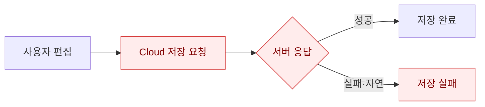
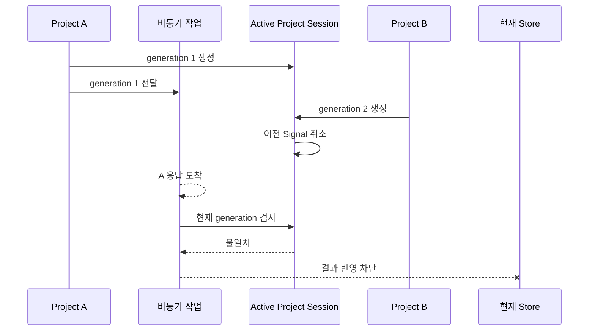

# 네트워크가 끊겨도 편집을 지키는 Local-first 저장 설계

영상 편집기는 타임라인뿐 아니라 영상, 음성, 이미지 원본까지 저장해야 한다. 처음에는 Cloud 응답을 기준으로 저장 성공 여부를 판단했다.

하지만 이 구조에서는 네트워크가 불안정하면 편집 내용까지 저장하지 못한 것처럼 보였다. 서버 응답을 기다리는 동안 프로젝트를 전환하면 이전 프로젝트의 늦은 응답이 현재 상태를 변경하는 문제도 발생했다.

그래서 저장의 기준을 다시 정의했다.

> 로컬 저장은 편집 상태를 보존하는 과정이고, Cloud Sync는 저장된 상태를 다른 환경으로 전달하는 과정이다.

## [sort1] 1. Cloud 응답에 의존한 저장의 문제

기존 저장 흐름은 다음과 같았다.



이 구조에는 세 가지 문제가 있었다.

- 네트워크가 끊기면 편집 상태를 보존할 수 없었다.
- 서버가 revision ID를 발급하기 전에는 저장 이력을 식별할 수 없었다.
- 프로젝트 전환 후 도착한 이전 응답이 현재 프로젝트 상태를 변경할 수 있었다.

Cloud 저장 성공과 사용자 편집 상태 보존을 하나의 결과로 관리한 것이 문제였다.

## [sort1] 2. 미디어 원본과 타임라인 문서를 분리했다

프로젝트 snapshot에 미디어 원본을 포함하면 저장할 때마다 같은 `Blob`이 반복된다. 큰 영상 파일 하나만 여러 번 저장돼도 IndexedDB 사용량이 빠르게 증가했다.

이를 해결하기 위해 IndexedDB를 두 영역으로 분리했다.

- `files`: 영상·음성·이미지의 실제 `Blob`
- `projects`: 타임라인, 미리보기 설정, 미디어 참조 정보

프로젝트 문서에는 원본 대신 참조만 저장한다.

```ts
interface MediaReference {
  localBlobId: string;
  fileId?: string;
  contentHash: string;
  mimeType: string;
  byteSize: number;
}
```

타임라인의 여러 클립이 같은 미디어를 사용해도 원본은 한 번만 저장한다. 새로고침 후에는 `localBlobId`로 IndexedDB의 파일을 찾고, 다른 기기에서는 `fileId`로 Cloud 파일을 복원한다.

이 구조로 프로젝트 snapshot 크기를 미디어 크기와 분리했다. 저장 이력이 늘어나도 같은 미디어 원본이 snapshot마다 반복되지 않는다.

## [sort1] 3. 로컬 저장과 Cloud Sync를 분리했다

저장 완료의 기준을 서버 응답에서 IndexedDB transaction 완료로 변경했다.


저장 순서는 다음과 같다.

1. 미디어 원본을 IndexedDB에 저장한다.
2. 클라이언트에서 revision UUID를 생성한다.
3. 현재 편집 상태를 revision snapshot으로 저장한다.
4. 전송할 revision을 Outbox에 `pending`으로 기록한다.
5. 로컬 저장 완료 상태를 표시한다.
6. Cloud Sync를 비동기로 실행한다.

Cloud Sync가 실패해도 이미 완료된 로컬 저장은 취소하지 않는다. 사용자는 네트워크 연결과 관계없이 편집을 계속할 수 있다.

화면에서도 로컬 저장과 Cloud 상태를 분리했다.

- `saved`: 로컬 저장 완료
- `syncing`: Cloud 전송 중
- `offline`: 네트워크 복구 대기
- `failed`: 재시도 가능한 오류
- `conflict`: 사용자 판단이 필요한 충돌

## [sort1] 4. Active Project 범위로 늦은 응답을 차단했다

프로젝트 A에서 비동기 작업을 시작한 뒤 프로젝트 B를 열면 A의 응답이 B보다 늦게 도착할 수 있다.

단순한 `localProjectId` 비교만으로는 충분하지 않았다. 같은 프로젝트를 다시 열거나 과거 revision을 복원한 경우에도 이전 작업을 구분해야 했기 때문이다.

프로젝트를 활성화할 때마다 새로운 `generation`을 만드는 Active Project Session을 도입했다.



모든 장시간 비동기 작업은 시작할 때 다음 값을 캡처한다.

- `generation`
- `localProjectId`
- `parentRevisionId`
- 작업에 필요한 미디어와 프로젝트 metadata

결과를 Store에 반영하기 직전에 generation을 다시 검사한다. 이전 Session의 결과라면 현재 화면에는 반영하지 않는다.

원래 프로젝트에 필요한 영속 metadata는 캡처한 `localProjectId`를 기준으로 저장한다. 이로써 이전 프로젝트의 응답이 현재 프로젝트의 ID, revision, 업로드 상태를 변경하는 경로를 차단했다.

## [sort1] 5. revision UUID를 클라이언트에서 생성했다

기존에는 Cloud 저장이 끝나야 서버가 발급한 `revisionId`를 알 수 있었다. 따라서 오프라인에서는 저장 시점별 이력을 식별하기 어려웠다.

이를 해결하기 위해 네트워크 요청 전에 클라이언트에서 UUID를 생성했다.

```ts
const revision = {
  revisionId: crypto.randomUUID(),
  localProjectId,
  parentRevisionId,
  snapshot,
  createdAt: Date.now(),
};
```

같은 revision UUID를 로컬 저장소와 서버에서 공통 식별자로 사용한다.

UUID는 revision의 식별자이고 저장 순서를 의미하지 않는다. revision 사이의 선후 관계는 `parentRevisionId`로 관리한다.

서버는 다음 규칙으로 중복 요청을 처리한다.

- 처음 받은 UUID라면 새 revision을 저장한다.
- 같은 UUID와 같은 내용이라면 기존 revision을 반환한다.
- 같은 UUID인데 내용이 다르면 `409 Conflict`를 반환한다.

서버가 저장을 완료한 뒤 응답만 유실돼도 같은 UUID로 안전하게 다시 전송할 수 있게 됐다.

## [sort1] 6. Single-flight로 중복 동기화를 막았다

로컬 저장은 Cloud Sync보다 빠르다. 편집이 계속되면 첫 번째 동기화가 끝나기 전에 새로운 저장이 발생할 수 있다.

프로젝트별 Single-flight를 적용해 같은 프로젝트의 Cloud Sync가 동시에 실행되지 않도록 했다.

여기서 Single-flight는 같은 `localProjectId`에 이미 동기화 작업이 실행 중이면 두 번째 작업을 시작하지 않는 제어 방식이다.

```ts
if (syncingProjects.has(localProjectId)) {
  projectsNeedingFollowUp.add(localProjectId);
  return syncingProjects.get(localProjectId);
}
```

진행 중에 새로운 revision이 생기면 후속 실행 대상으로 표시한다. 현재 작업이 끝난 뒤 Outbox를 다시 조회해 남은 revision을 순서대로 처리한다.

이를 통해 다음 문제를 줄였다.

- 같은 `parentRevisionId`를 기준으로 한 동시 요청
- 동일 미디어의 중복 업로드
- 동기화 상태의 실행 순서 역전
- 이전 응답이 최신 revision ID를 덮어쓰는 문제

Single-flight는 메모리에서 동시 실행을 제어하고, Outbox는 앱 종료 후에도 작업을 복구한다. 두 기능은 역할이 다르기 때문에 함께 사용했다.

## [sort1] 7. Outbox로 실패한 동기화를 복구했다

Cloud Sync 대상을 Promise에만 보관하면 앱을 닫는 순간 재시도 정보가 사라진다.

이를 해결하기 위해 IndexedDB에 영속 Outbox를 추가했다.

```ts
interface SyncOutboxEntry {
  revisionId: string;
  localProjectId: string;
  status: 'pending' | 'syncing' | 'conflict';
  attemptCount: number;
  nextAttemptAt: number;
}
```

Sync Worker는 다음 시점에 pending 항목을 확인한다.

- 로컬 저장 완료 후
- 앱 시작 후
- 네트워크 연결 복구 후
- 사용자 로그인 후
- 재시도 대기 시간이 지난 후

네트워크 오류, timeout, `429`, 일부 `5xx` 응답에는 지수 Backoff를 적용했다. 서버 ACK를 받은 revision만 Outbox에서 완료 처리한다.

인증이 만료되면 revision을 삭제하지 않고 pending 상태로 유지한다. 사용자가 다시 로그인하면 전송을 이어서 실행한다.

## [sort1] 8. 충돌에서는 자동 병합보다 보존을 우선했다

두 기기에서 같은 revision을 기준으로 오프라인 편집하면 서로 다른 후속 revision이 만들어질 수 있다.

```text
Remote R1
├─ Device A: R2
└─ Device B: R3
```

영상 타임라인은 시간 좌표, 배열 순서, 미디어 참조가 함께 변경된다. 단순한 Last-write-wins를 적용하면 한쪽 편집이 조용히 사라질 수 있다.

그래서 다음 충돌 정책을 적용했다.

1. `parentRevisionId`가 서버의 최신 revision과 다르면 충돌로 분류한다.
2. 로컬 draft와 Outbox revision은 삭제하지 않는다.
3. 서버의 최신 revision을 별도로 내려받는다.
4. 사용자에게 로컬본 유지, Cloud본 열기, 복제본 생성 옵션을 제공한다.

UUID는 같은 revision의 중복 저장을 막지만 서로 다른 revision을 자동 병합하지는 않는다. 식별 문제와 충돌 해결 문제를 분리해서 처리했다.

## [sort1] 9. 현재 한계

저장과 동기화 흐름을 분리했지만 다음 한계는 남아 있다.

- 타임라인 revision의 자동 병합은 지원하지 않는다.
- 인증 만료나 영구적인 `4xx` 오류는 자동 재시도만으로 해결할 수 없다.
- 브라우저 저장소가 사용자에 의해 삭제되면 아직 Cloud에 전송하지 못한 revision도 사라질 수 있다.
- 저장 공간이 부족하면 로컬 저장이 실패할 수 있으므로 별도의 용량 안내가 필요하다.
- 장기간 오프라인으로 여러 기기에서 편집하면 충돌 발생 자체는 막을 수 없다.

따라서 Local-first는 모든 상황에서 데이터 손실이 불가능하다는 뜻이 아니다. 네트워크 장애와 서버 지연이 현재 편집 상태의 보존을 직접 막지 않도록 저장 경계를 재설계했다는 의미다.

## [sort1] 10. 저장은 하나의 요청이 아니라 상태 전이였다

이번 개선을 통해 저장을 하나의 API 요청으로 보면 안 된다는 점을 알게 됐다.

로컬 저장, Outbox 등록, Cloud 전송, 서버 ACK는 서로 다른 상태 전이다. 각 단계에는 별도의 성공 조건과 복구 정책이 필요하다.

> Local-first의 핵심은 Cloud를 제거하는 것이 아니라, Cloud 장애가 현재 편집 상태의 보존 여부를 결정하지 못하게 만드는 것이다.

미디어 원본과 프로젝트 문서를 분리해 저장소 증가를 제한했다. Active Project 범위로 늦은 비동기 결과를 차단했다. 클라이언트 UUID, Single-flight, Outbox와 재시도를 연결해 오프라인 변경을 Cloud까지 안전하게 전달할 수 있는 흐름을 만들었다.

그 결과 사용자는 네트워크 응답을 기다리지 않고 편집을 이어갈 수 있고, 개발자는 로컬 저장 실패와 Cloud 동기화 실패를 서로 다른 문제로 추적할 수 있게 됐다.
