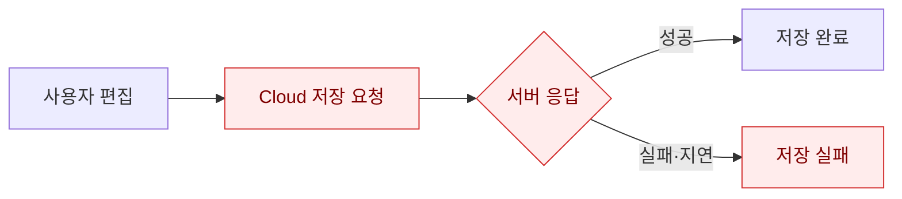
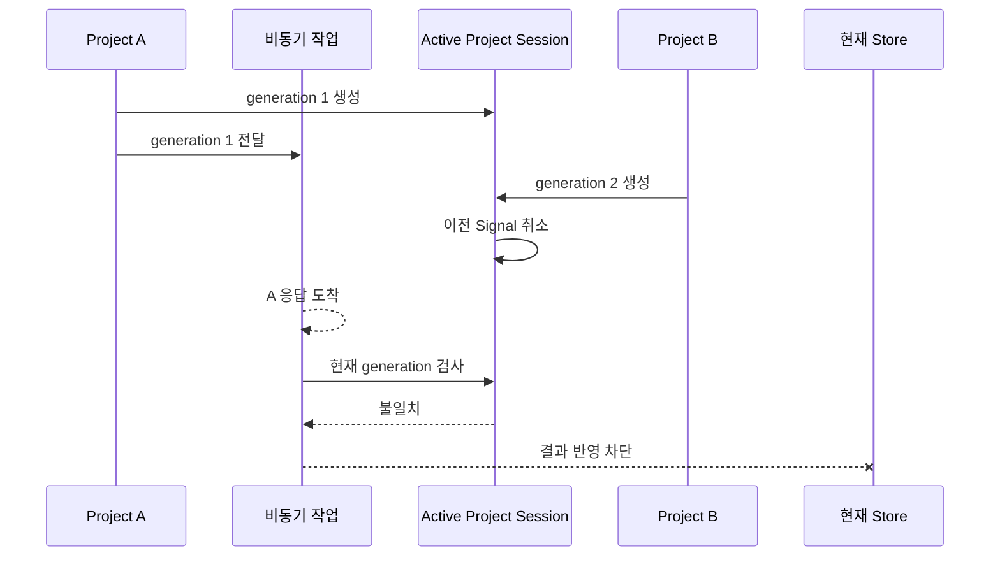

영상 편집기는 타임라인만 저장해서는 작업을 복원할 수 없습니다. 영상, 음성, 이미지 원본과 프로젝트 문서를 함께 보존해야 합니다.

처음에는 Cloud 저장 API의 응답을 기준으로 저장 성공 여부를 판단했습니다. 하지만 네트워크가 불안정하면 사용자의 편집 내용까지 저장하지 못한 것처럼 보였습니다. 서버 응답을 기다리는 동안 다른 프로젝트를 열면 이전 프로젝트의 늦은 응답이 현재 상태를 변경하는 문제도 발생했습니다.

Cloud에 전달하지 못한 상태와 사용자의 편집을 보존하지 못한 상태를 하나의 실패로 다루고 있었습니다.

그래서 저장의 기준부터 다시 정의했습니다.

> 로컬 저장은 현재 편집 상태를 보존하는 과정이고, Cloud Sync는 저장된 상태를 다른 환경으로 전달하는 과정이다.

## [sort1] 1. Cloud 저장이 실패하면 편집도 저장되지 않은 걸까

기존 저장 흐름은 다음과 같았습니다.



이 구조에서는 서로 다른 세 가지 문제가 모두 Cloud 응답에 묶여 있었습니다.

- 네트워크가 끊기면 현재 편집 상태를 보존할 수 없었습니다.
- 서버가 Revision ID를 발급하기 전에는 저장 이력을 식별할 수 없었습니다.
- 프로젝트 전환 후 도착한 이전 응답이 현재 프로젝트 상태를 변경할 수 있었습니다.

저장 요청 자체는 정상이어도 서버 응답이 늦으면 사용자는 저장이 끝날 때까지 기다려야 했습니다. 반대로 서버 전송에 실패하면 로컬에서 보존할 수 있는 편집 상태까지 함께 실패로 처리됐습니다.

문제는 Cloud 저장 성공과 현재 편집 상태 보존을 하나의 결과로 관리한 데 있었습니다.

따라서 해결해야 할 질문도 바뀌었습니다.

> 네트워크와 관계없이 현재 편집을 먼저 보존하려면 저장 경계를 어디에 둬야 할까?

## [sort1] 2. 왜 미디어 원본과 프로젝트 문서를 분리했을까

로컬 저장을 먼저 완료하려면 IndexedDB에 무엇을 어떤 단위로 기록할지도 정해야 했습니다.

프로젝트 Snapshot에 미디어 원본을 포함하면 저장할 때마다 같은 `Blob`이 반복됩니다. 큰 영상 파일 하나만 여러 번 저장해도 IndexedDB 사용량이 빠르게 증가했습니다.

그래서 IndexedDB를 두 영역으로 분리했습니다.

- `files`: 영상·음성·이미지의 실제 `Blob`
- `projects`: 타임라인, 미리보기 설정, 미디어 참조 정보

프로젝트 문서에는 미디어 원본 대신 참조 정보만 저장했습니다.

```ts
interface MediaReference {
  localBlobId: string;
  fileId?: string;
  contentHash: string;
  mimeType: string;
  byteSize: number;
}
```

타임라인의 여러 클립이 같은 미디어를 사용해도 원본 `Blob`은 한 번만 저장합니다. 새로고침 후에는 `localBlobId`로 IndexedDB의 파일을 찾고, 다른 기기에서는 `fileId`로 Cloud 파일을 복원합니다.

이 구조에서는 프로젝트 Snapshot의 크기가 미디어 원본 크기에 직접 비례하지 않습니다. Revision이 늘어나도 같은 미디어 원본을 Snapshot마다 다시 저장하지 않게 됐습니다.

## [sort1] 3. 저장 완료의 기준을 IndexedDB Transaction으로 옮겼다

다음으로 저장 완료의 기준을 서버 응답에서 IndexedDB Transaction 완료로 변경했습니다.


저장 순서는 다음과 같습니다.

1. 미디어 원본을 IndexedDB에 저장합니다.
2. 클라이언트에서 Revision UUID를 생성합니다.
3. 현재 편집 상태를 Revision Snapshot으로 저장합니다.
4. 전송할 Revision을 Outbox에 `pending`으로 기록합니다.
5. 로컬 저장 완료 상태를 표시합니다.
6. Cloud Sync를 비동기로 실행합니다.

여기서 `저장 완료`는 로컬 Transaction이 끝났다는 의미입니다. Cloud에 반영됐다는 뜻은 아닙니다.

Cloud Sync가 실패해도 이미 완료된 로컬 저장은 취소하지 않습니다. 사용자는 네트워크 연결 여부와 관계없이 로컬에 편집을 보존하고 다음 작업을 이어갈 수 있습니다.

화면에서도 로컬 저장 상태와 Cloud Sync 상태를 분리했습니다.

- `saved`: 로컬 저장 완료
- `syncing`: Cloud 전송 중
- `offline`: 네트워크 복구 대기
- `failed`: 재시도 가능한 오류
- `conflict`: 사용자 판단이 필요한 충돌

사용자는 현재 편집이 로컬에 보존됐는지와 다른 기기에 전달됐는지를 서로 다른 상태로 확인할 수 있게 됐습니다.

## [sort1] 4. 늦게 도착한 응답은 Active Project Session으로 차단했다

로컬 저장과 Cloud Sync를 분리해도 늦은 비동기 응답 문제는 남아 있었습니다.

프로젝트 A에서 비동기 작업을 시작한 뒤 프로젝트 B를 열면 A의 응답이 B보다 늦게 도착할 수 있습니다.

단순한 `localProjectId` 비교만으로는 충분하지 않았습니다. 같은 프로젝트를 다시 열거나 과거 Revision을 복원한 경우에도 이전 작업과 현재 작업을 구분해야 했기 때문입니다.

그래서 프로젝트를 활성화할 때마다 새로운 `generation`을 만드는 Active Project Session을 도입했습니다.



모든 장시간 비동기 작업은 시작할 때 다음 값을 캡처합니다.

- `generation`
- `localProjectId`
- `parentRevisionId`
- 작업에 필요한 미디어와 프로젝트 Metadata

이전 Signal을 취소하는 것만으로는 이미 진행된 작업의 응답이 도착하지 않는다고 보장할 수 없습니다. 따라서 결과를 Store에 반영하기 직전에 현재 `generation`을 다시 검사했습니다. 이전 Session에서 시작한 작업이라면 결과를 현재 화면에 반영하지 않습니다.

원래 프로젝트에 남겨야 하는 영속 Metadata는 작업 시작 시 캡처한 `localProjectId`를 기준으로 저장했습니다. 현재 프로젝트의 ID, Revision, 업로드 상태는 현재 Session과 일치하는 결과만 변경할 수 있도록 범위를 제한했습니다.

## [sort1] 5. 오프라인에서도 Revision을 식별할 수 있어야 했다

기존에는 Cloud 저장이 끝나야 서버가 발급한 `revisionId`를 알 수 있었습니다. 따라서 오프라인에서는 저장 시점별 이력을 식별하기 어려웠습니다.

이를 해결하기 위해 네트워크 요청 전에 클라이언트에서 UUID를 생성했습니다.

```ts
const revision = {
  revisionId: crypto.randomUUID(),
  localProjectId,
  parentRevisionId,
  snapshot,
  createdAt: Date.now(),
};
```

같은 Revision UUID를 로컬 저장소와 서버의 공통 식별자로 사용했습니다.

UUID는 Revision을 식별하지만 저장 순서를 나타내지는 않습니다. Revision 사이의 선후 관계는 `parentRevisionId`로 관리했습니다.

서버는 다음 규칙으로 중복 요청을 처리합니다.

- 처음 받은 UUID라면 새 Revision을 저장합니다.
- 같은 UUID와 같은 내용이라면 기존 Revision을 반환합니다.
- 같은 UUID인데 내용이 다르면 `409 Conflict`를 반환합니다.

서버가 저장을 완료한 뒤 응답만 유실된 경우에도 클라이언트는 같은 UUID로 다시 전송할 수 있습니다. 서버는 이를 새로운 Revision이 아니라 같은 저장 요청의 재시도로 식별합니다.

## [sort1] 6. 프로젝트 단위 Single-flight로 동시 Sync를 막았다

로컬 저장은 Cloud Sync보다 먼저 끝납니다. 편집이 계속되면 첫 번째 Sync가 끝나기 전에 새로운 Revision이 생길 수 있습니다.

이때 같은 프로젝트의 Cloud Sync를 동시에 실행하면 요청 완료 순서가 시작 순서와 달라질 수 있습니다.

그래서 프로젝트별 Single-flight를 적용했습니다. 여기서 Single-flight는 같은 `localProjectId`에 Sync가 실행 중이면 두 번째 실행을 시작하지 않는 제어 방식입니다.

```ts
if (syncingProjects.has(localProjectId)) {
  projectsNeedingFollowUp.add(localProjectId);
  return syncingProjects.get(localProjectId);
}
```

진행 중에 새로운 Revision이 생기면 후속 실행 대상으로 표시했습니다. 현재 작업이 끝난 뒤 Outbox를 다시 조회하고 남은 Revision을 순서대로 처리했습니다.

이 제어로 같은 `localProjectId`의 Cloud Sync가 프로세스 안에서 동시에 실행되는 경로를 차단했습니다. 그 결과 다음 문제가 발생할 위험을 줄였습니다.

- 같은 `parentRevisionId`를 기준으로 한 동시 요청
- 동일 미디어의 중복 업로드
- Sync 완료 순서의 역전
- 이전 응답이 최신 Revision ID를 덮어쓰는 문제

Single-flight는 현재 프로세스의 동시 실행만 제어합니다. 앱이 종료된 뒤에도 전송 대상을 기억하려면 별도의 영속 상태가 필요했습니다.

## [sort1] 7. Promise만으로는 실패한 Sync를 복구할 수 없었다

Cloud Sync 대상을 Promise에만 보관하면 앱을 닫는 순간 재시도 정보가 사라집니다.

그래서 IndexedDB에 영속 Outbox를 추가했습니다.

```ts
interface SyncOutboxEntry {
  revisionId: string;
  localProjectId: string;
  status: 'pending' | 'syncing' | 'conflict';
  attemptCount: number;
  nextAttemptAt: number;
}
```

Sync Worker는 다음 시점에 `pending` 항목을 확인합니다.

- 로컬 저장 완료 후
- 앱 시작 후
- 네트워크 연결 복구 후
- 사용자 로그인 후
- 재시도 대기 시간이 지난 후

네트워크 오류, Timeout, `429`, 일부 `5xx` 응답에는 지수 Backoff를 적용했습니다. 서버 ACK를 받은 Revision만 Outbox에서 완료 처리했습니다.

인증이 만료된 경우에는 Revision을 삭제하지 않고 `pending` 상태로 유지했습니다. 사용자가 다시 로그인하면 남아 있는 Revision의 전송을 이어서 실행합니다.

Single-flight와 Outbox는 같은 기능이 아닙니다. Single-flight는 현재 프로세스의 동시 실행을 제한하고, Outbox는 앱을 다시 실행한 뒤에도 미완료 작업을 복구합니다.

## [sort1] 8. 충돌에서는 자동 병합보다 양쪽 보존을 우선했다

두 기기에서 같은 Revision을 기준으로 오프라인 편집하면 서로 다른 후속 Revision이 만들어질 수 있습니다.

```text
Remote R1
├─ Device A: R2
└─ Device B: R3
```

영상 타임라인에서는 시간 좌표, 배열 순서, 미디어 참조가 함께 변경됩니다. 이 데이터에 단순한 Last Write Wins를 적용하면 한쪽 편집이 별도 확인 없이 사라질 수 있습니다.

자동 병합의 정확성을 보장할 수 없었기 때문에 다음 충돌 정책을 적용했습니다.

1. `parentRevisionId`가 서버의 최신 Revision과 다르면 충돌로 분류합니다.
2. 로컬 Draft와 Outbox Revision은 삭제하지 않습니다.
3. 서버의 최신 Revision을 별도로 내려받습니다.
4. 사용자에게 로컬본 유지, Cloud본 열기, 복제본 생성 옵션을 제공합니다.

UUID는 같은 Revision의 중복 저장을 식별할 뿐, 서로 다른 Revision을 자동으로 병합하지는 않습니다. 중복 요청 식별과 충돌 해결을 서로 다른 문제로 나눠 처리했습니다.

## [sort1] 9. Local-first가 해결하지 않는 문제도 남아 있다

로컬 저장과 Cloud Sync를 분리했다고 해서 모든 데이터 손실 가능성이 사라지는 것은 아닙니다.

현재 구조에는 다음 한계가 남아 있습니다.

- 타임라인 Revision의 자동 병합은 지원하지 않습니다.
- 인증 만료나 영구적인 `4xx` 오류는 자동 재시도만으로 해결할 수 없습니다.
- 사용자가 브라우저 저장소를 삭제하면 아직 Cloud에 전송하지 못한 Revision도 사라질 수 있습니다.
- 저장 공간이 부족하면 로컬 저장이 실패할 수 있으므로 별도의 용량 안내가 필요합니다.
- 장기간 오프라인 상태로 여러 기기에서 편집하면 충돌 발생 자체는 막을 수 없습니다.

따라서 이 글에서 Local-first는 모든 상황에서 데이터 손실을 방지한다는 의미가 아닙니다. 네트워크 장애와 서버 지연이 현재 편집 상태의 보존 여부를 직접 결정하지 않도록 저장 경계를 바꿨다는 의미입니다.

## [sort1] 10. 회고: 저장은 하나의 요청이 아니라 상태 전이였다

처음에는 저장을 Cloud API 요청 하나로 생각했습니다.

하지만 로컬 저장, Outbox 등록, Cloud 전송, 서버 ACK는 서로 다른 상태 전이였습니다. 각 단계에는 별도의 성공 조건과 복구 정책이 필요했습니다.

미디어 원본과 프로젝트 문서를 분리해 같은 `Blob`이 Revision마다 반복되는 경로를 제거했습니다. Active Project Session으로 현재 화면에 결과를 반영할 수 있는 비동기 작업의 범위를 정했습니다. 클라이언트 UUID, Single-flight, Outbox를 연결해 로컬에 보존한 Revision을 Cloud로 전달하고 실패 후 다시 시도할 수 있게 했습니다.

그 결과 사용자는 Cloud 응답을 기다리지 않고 로컬 저장이 끝난 시점부터 편집을 이어갈 수 있습니다. 개발 측면에서도 로컬 저장 실패와 Cloud Sync 실패를 서로 다른 상태로 추적할 수 있게 됐습니다.

이번 작업에서 가장 중요했던 변화는 저장 기술을 추가한 것이 아니었습니다.

저장이 완료됐다는 말의 의미를 먼저 정의하고, 현재 편집을 보존하는 책임과 다른 환경으로 전달하는 책임을 분리한 것이 핵심이었습니다.

> Local-first의 핵심은 Cloud를 제거하는 것이 아니라, Cloud 장애가 현재 편집 상태의 보존 여부를 결정하지 못하게 만드는 것이다.
