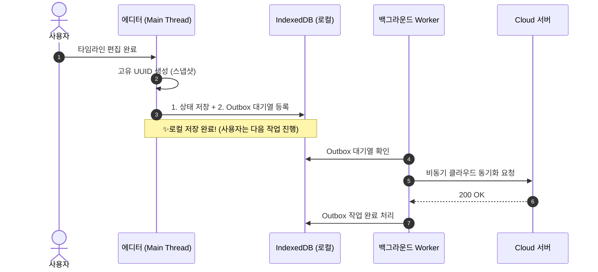

안녕하세요. 멀티미디어 에디터를 개발하고 있는 프론트엔드 개발자 김승진입니다.

이번 글에서는 웹 기반 미디어 에디터를 개발하며 마주했던 가장 치열한 고민, ‘저장’에 대한 이야기를 나누고자 합니다.

> "네트워크가 잠깐 끊겼는데, 1시간 동안 편집한 타임라인이 전부 날아갔어요."

사용자로부터 이런 피드백을 받았을 때의 아찔함, 프론트엔드 개발자라면 한 번쯤 경험해 보셨을 겁니다. 텍스트 몇 줄이 아니라 무거운 영상과 음성을 다루는 미디어 에디터에서 '저장 실패'는 곧 사용자의 거대한 상실감으로 이어집니다.

우리는 이 문제를 근본적으로 해결하기 위해, 서버가 허락해야만 저장이 완료되던 기존의 패러다임을 과감히 버리고 **클라이언트 주도의 Local-first 아키텍처**를 도입했습니다. 그 험난했지만 흥미로웠던 여정을 소개합니다.

---

## [sort1] 1. 저장, 꼭 서버의 허락을 받아야만 할까요?

기존 에디터의 저장 흐름은 아주 평범했습니다. 사용자가 편집을 멈추면 Cloud API를 호출하고, 서버가 `200 OK`를 내려주면 그제야 '저장 완료' 처리를 했죠. 하지만 이 평범함이 치명적인 사용자 경험(UX) 저하를 만들고 있었습니다.

1. **오프라인의 공포:** 네트워크가 잠깐이라도 끊기면, 공들여 작업한 상태를 내 PC에조차 남길 수 없었습니다.
2. **응답 대기 병목:** 서버가 새로운 버전(리비전) ID를 발급해 주기 전까지는 다음 편집을 이어갈 수 없어 작업 흐름이 끊겼습니다.
3. **엉켜버린 비동기 응답:** 네트워크가 느릴 때 사용자가 다른 프로젝트를 열면, 뒤늦게 도착한 이전 프로젝트의 응답이 현재 화면을 덮어씌우는 아찔한 데이터 오염 버그가 발생했습니다.

문제의 핵심은 단 하나였습니다.
'현재 편집 상태를 내 PC에 안전하게 보존하는 것'과 '그것을 클라우드에 동기화하는 것'이 너무 강하게 결합되어 있다는 점이었죠.

우리는 이 둘을 완벽하게 끊어내기로 했습니다.

## [sort1] 2. 로컬이 먼저다: Outbox 패턴의 도입

가장 먼저 저장의 1차 관문을 '서버 응답'에서 '브라우저의 IndexedDB 트랜잭션 완료'로 옮겼습니다. 백엔드 분들이 메시지 유실을 막기 위해 흔히 사용하는 **Outbox 패턴**을 프론트엔드 클라이언트에 그대로 가져온 것이죠.

```mermaid
sequenceDiagram
    autonumber

    actor User as 사용자
    participant Editor as 에디터 (Main Thread)
    participant IDB as IndexedDB (로컬)
    participant Worker as 백그라운드 Worker
    participant Cloud as Cloud 서버

    User->>Editor: 타임라인 편집 완료
    Editor->>Editor: 고유 UUID 생성 (스냅샷)
    Editor->>IDB: 1. 상태 저장 + 2. Outbox 대기열 등록
    Note over Editor,IDB: ✨로컬 저장 완료! (사용자는 다음 작업 진행)

    Worker->>IDB: Outbox 대기열 확인
    Worker->>Cloud: 비동기 클라우드 동기화 요청
    Cloud-->>Worker: 200 OK
    Worker->>IDB: Outbox 작업 완료 처리
```

이제 흐름은 이렇게 바뀝니다.
클라이언트가 스스로 고유한 식별자(UUID)를 만들어 현재 상태를 IndexedDB에 스냅샷으로 저장합니다. **이 시점에서 로컬 저장은 즉시 끝납니다.**
그리고 서버로 보내야 할 동기화 작업을 Outbox 테이블에 `pending` 상태로 조용히 적어둡니다. 그러면 백그라운드 Worker가 이 Outbox를 지켜보다가 비동기로 클라우드 동기화를 시도하죠.

이제 사용자는 네트워크가 끊기든, 서버가 아프든 상관없이 **0.1초 만에 저장을 완료하고 쾌적하게 다음 편집을 이어갈 수 있습니다.** UI 역시 '로컬 저장 완료'와 '클라우드 동기화 중'을 투명하게 나누어 보여주어 사용자의 불안감을 없앴습니다.

## [sort1] 3. 무거운 영상 파일, 스토리지 폭발을 막아라

로컬 저장을 0.1초 만에 빈번하게 할 수 있게 되자, 곧바로 성능 문제가 찾아왔습니다.
타임라인이 1픽셀만 바뀌어도 프로젝트를 통째로 저장하다 보니, 수백 MB짜리 미디어 원본 파일(Blob)까지 매번 IndexedDB에 덮어써지며 브라우저가 비명을 지르며 뻗어버린 것입니다.

이 무서운 I/O 병목을 피하기 위해, 우리는 데이터를 두 가지 영역으로 완전히 쪼갰습니다.

- **Files 영역:** 무거운 미디어 원본 파일 보관소 (**최초 1회만 저장**)
- **Projects 영역:** 타임라인, 이펙트 등 가벼운 메타데이터

프로젝트 영역에는 무거운 원본 파일 대신, 로컬 파일과 클라우드 파일을 모두 찾을 수 있는 참조 정보(Reference)만 가볍게 기록했습니다.
타임라인에서 영상을 아무리 잘게 자르고 수백 번 복제해도 실제 파일은 단 한 번만 저장되니, 스토리지 용량 문제와 저장 속도 지연을 깔끔하게 해결할 수 있었습니다.

## [sort1] 4. 얽히고설킨 비동기 작업, 교통정리 하기

저장과 동기화를 비동기로 찢어놓으니, 프론트엔드 환경 특유의 까다로운 동시성 문제들이 터져 나왔습니다. 우리는 안전한 동기화를 위해 두 가지 확실한 규칙을 세웠습니다.

**첫째, 중복 출발은 막는다 (Single-flight 패턴)**

로컬 저장은 찰나에 끝나지만 네트워크 동기화는 수 초가 걸립니다. 동기화가 안 끝났는데 사용자가 계속 편집하면, 같은 프로젝트에 대한 Sync 요청이 여러 개 겹쳐서 서버로 날아가는 문제가 생깁니다.
이를 막기 위해 특정 프로젝트가 **이미 동기화 중이라면, 후속 작업은 출발시키지 않고 대기열에 얌전히 올려두는 제어 로직**을 추가했습니다.

**둘째, 버스 떠난 응답은 미련 없이 버린다 (세션 기반 제어)**

가장 골치 아팠던 '이전 프로젝트의 늦은 네트워크 응답이 현재 화면을 덮어씌우는 문제'는 **세션 식별자**로 해결했습니다.
프로젝트를 열 때마다 새로운 Session ID를 발급합니다. 그리고 긴 비동기 작업이 끝난 후 스토어에 데이터를 반영하기 직전, 이렇게 묻습니다.

> _"너 출발할 때의 세션이랑, 지금 화면에 띄워진 세션이랑 같아?"_

만약 사용자가 이미 다른 화면으로 넘어갔다면, 그 늦게 도착한 응답은 데이터 오염을 막기 위해 미련 없이 폐기(Discard)합니다.

## [sort1] 5. 두 곳에서 동시에 편집했다면? (충돌 해결의 원칙)

완전한 Local-first 환경이 구축되니 새로운 시나리오가 열렸습니다. 집에서는 PC로, 밖에서는 노트북이나 태블릿으로 각각 오프라인 상태에서 같은 프로젝트를 편집할 수 있게 된 거죠. 두 기기가 모두 온라인이 되었을 때, 이 두 가지 버전은 필연적으로 충돌(Conflict)합니다.

보통은 최신 버전을 무조건 덮어씌우는 자동 병합(Last Write Wins)을 떠올리기 쉽습니다. 하지만 미디어 타임라인 데이터는 아주 미세한 시간 좌표 하나만 틀어져도 편집 흐름이 완전히 망가지는 아주 예민한 데이터입니다.

저희는 "사용자의 데이터는 1 byte도 함부로 유실되어서는 안 된다"는 대원칙을 세웠습니다.

서버와 로컬의 파생 버전이 다를 경우, 시스템이 섣불리 자동 병합을 시도하지 않습니다. 대신 로컬 버전도 살려두고 클라우드의 최신본도 별도로 내려받은 뒤, 사용자에게 명확히 묻습니다.

> _"기기 간 버전이 다릅니다. 현재 PC의 작업을 유지할까요, 아니면 클라우드의 최신 작업을 불러올까요?"_

시스템의 자의적인 판단으로 사용자의 노력을 날려버리지 않기 위해, 안전을 위한 명시적인 위임(Delegation)을 선택한 것입니다.

## [sort1] 6. 마치며: Local-first가 가져다준 진짜 변화

처음엔 그저 'API 호출 한 번'이라고 생각했던 저장이, 파고들수록 얼마나 복잡한 상태 전이의 연속인지 뼈저리게 느낀 프로젝트였습니다.

이번 아키텍처 개편을 통해 얻은 가장 값진 깨달음은 이것입니다.
Local-first의 본질은 그저 클라우드를 안 쓰겠다는 것이 아닙니다. 외부 네트워크의 장애가 '내 작업의 보존 여부'를 쥐고 흔들지 못하도록, **데이터에 대한 통제권을 온전히 클라이언트와 사용자에게 돌려주는 것**입니다.

이제 에디터 우측 상단에 와이파이가 끊겼다는 '오프라인' 아이콘이 떠도, 사용자는 더 이상 불안해하지 않고 묵묵히 자신의 창작을 이어갑니다.

사용자의 몰입을 방해하지 않는 단단한 에디터를 만들기 위한 저희의 딥다이브는 앞으로도 계속됩니다. 감사합니다.
