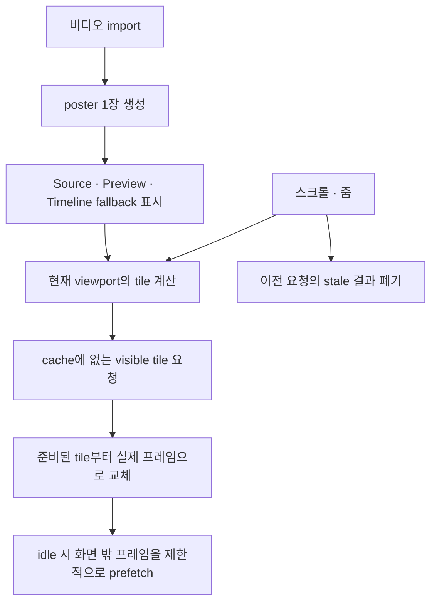

## [sort1] 1. 영상 길이와 첫 화면에 필요한 썸네일 수는 달랐다

Part 1에서는 대표 이미지 1장을 먼저 보여주고, 나머지 썸네일을 Web Worker에서 생성했다. 첫 화면과 전체 생성 시간을 분리한 뒤에도 한 가지 질문이 남았다.

> 나머지 썸네일은 몇 장을, 어떤 순서로 만들어야 할까?

기존 방식은 영상 길이를 기준으로 생성 개수를 정했다. 약 5초마다 1장을 계산하되, 최소 20장과 최대 60장 사이로 제한했다. 구현은 단순했지만 타임라인이 실제로 요구하는 프레임과 맞지 않았다.

타임라인은 영상 전체를 한 번에 그리지 않는다. 사용자가 현재 보고 있는 viewport 안에 여러 tile을 배치하고, 각 tile이 가리키는 timestamp의 이미지를 그린다. 따라서 다음 두 집합이 달라질 수 있다.

- 영상 전체에 균등하게 배치한 timestamp
- 현재 viewport의 각 tile에 필요한 timestamp

긴 영상에서는 차이가 더 커진다. 1시간 영상에서 초당 1장을 만들면 이론상 3,600장이 필요해 디코딩, 메모리, 저장 비용이 커진다. 반대로 60장으로 제한하면 비용은 줄지만 현재 viewport가 모두 채워진다는 보장은 없다. 이 예시는 구조적 상한 문제를 설명한 계산이며, 실제 메모리 사용량을 측정한 결과는 아니다.

그래서 질문을 바꿨다.

> 영상 전체에서 몇 장을 만들지가 아니라, 사용자가 지금 보는 tile을 어떻게 먼저 채울 것인가?

## [sort1] 2. 썸네일 작업을 세 가지 목적으로 나눴다

모든 이미지를 같은 우선순위로 만들 필요는 없었다. 역할과 완료 조건이 서로 달랐기 때문이다.

| 역할                          | 목적                                      | 우선순위  | 정확도 요구                              |
| ----------------------------- | ----------------------------------------- | --------- | ---------------------------------------- |
| poster                        | import 직후 빈 화면을 대신할 대표 이미지  | 가장 높음 | 특정 tile의 정확한 timestamp일 필요 없음 |
| visible tile                  | 현재 viewport에 표시할 실제 프레임        | 높음      | tile의 timestamp에 가까워야 함           |
| background thumbnail prefetch | 화면 밖에서 나중에 볼 수 있는 프레임 준비 | 낮음      | 제한적인 근사 허용 가능                  |

초기 글에서는 세 번째 작업을 `backfill`이라고 불렀다. 그러나 빈 데이터를 사후 보충하는 작업보다 **아직 보지 않은 구간을 미리 준비하는 작업**에 가까워, 여기서는 `background thumbnail prefetch`로 통일한다.

구조를 한 문장으로 줄이면 다음과 같다.

> 지금 필요한 이미지는 적게 먼저 만들고, 나중에 필요할 이미지는 상한을 두고 미리 만든다.

## [sort1] 3. poster와 실제 썸네일을 같은 캐시에 넣지 않았다

poster는 영상의 대표 이미지 한 장이다. Source 패널, Preview의 fallback, Timeline의 빈 tile에 공통으로 사용할 수 있다. import 직후 poster를 먼저 보여주면 사용자는 영상이 로드됐다는 피드백을 빠르게 받는다.

하지만 poster를 0초 썸네일처럼 저장하면 의미가 섞인다.

- poster: 실제 썸네일이 준비되기 전까지 보여주는 fallback
- thumbnail: 특정 timestamp에 대응하는 프레임

poster가 `thumbnailCache`에 들어가면 캐시는 “0초 프레임이 이미 있다”고 판단할 수 있다. 실제로는 poster가 정확한 0초 프레임이라는 보장이 없다. 그 결과 누락된 timestamp를 찾는 로직이 잘못된 결론을 내릴 수 있다.

그래서 저장 위치를 분리했다.

```text
posterCache
  영상 단위 대표 이미지
  timestamp 정확도 계약 없음

thumbnailCache
  timestamp별 실제 프레임
  visible tile과 prefetch 결과 저장
```

이 분리는 캐시를 두 개로 늘리는 비용이 있다. 대신 각 캐시가 어떤 이미지를 보유하는지 명확해지고, fallback 이미지 때문에 실제 프레임 생성이 생략되는 문제를 막을 수 있다.

## [sort1] 4. 초기 생성 기준을 duration에서 viewport로 옮겼다

현재 화면에 tile이 8개 보인다면 먼저 필요한 것은 영상 전체의 대표 프레임 60장이 아니라 그 8개 tile의 프레임이다. 좌우 스크롤을 고려해 소량의 preload 범위만 더할 수 있다.

```text
초기 요청
  현재 viewport의 visible tile
  + 왼쪽 preload 일부
  + 오른쪽 preload 일부
```

스크롤이나 줌이 발생하면 tile의 중심 timestamp를 다시 계산한다. 캐시에 없는 timestamp만 요청하고, 이미 준비된 이미지는 재사용한다.

이 방식의 직접적인 효과는 **첫 화면에 필요하지 않은 timestamp를 초기 요청에서 제외하는 것**이다. 전체 디코딩 비용이나 메모리가 실제로 얼마나 줄어드는지는 사용자의 스크롤 범위, 캐시 상한, 영상 길이에 따라 달라지므로 별도 측정이 필요하다.

## [sort1] 5. 한 가지 생성 경로를 모든 작업에 쓰지 않았다

Part 1의 소량·대량 측정 결과를 바탕으로 각 작업에 다른 경로를 배정했다.

| 작업                | 선택한 경로                                | 선택 근거                                 | 남은 불확실성                         |
| ------------------- | ------------------------------------------ | ----------------------------------------- | ------------------------------------- |
| poster 1장          | `HTMLVideoElement` seek                    | 초기 준비 비용이 작고 한 장을 빠르게 얻음 | 파일과 브라우저별 편차                |
| visible tile 소량   | seek/capture의 queued sequential execution | 생성 즉시 화면에 반영하기 쉬움            | 실제 편집 중 UI 지연은 별도 검증 필요 |
| background prefetch | Web Worker + WebCodecs                     | 많은 프레임을 메인 스레드 밖에서 처리     | Worker 메시지와 메모리 관리 비용      |

여기서 visible tile에 seek를 선택한 것은 당시의 **설계 판단**이다. Part 1의 10장 측정은 이 판단과 일치하지만, 실제 스크롤·줌 중의 응답성을 직접 증명하지는 않는다. 따라서 “visible tile에는 seek가 항상 더 낫다”고 일반화할 수 없다. Part 3에서 생성 경로와 UI 응답성을 다시 분리해 검증한다.

### [sort2] 5-1. 하나의 video element에서는 seek를 순서대로 실행했다

하나의 `HTMLVideoElement`에 여러 `currentTime` 변경을 동시에 요청하면 각 seek 완료 시점을 요청과 안정적으로 대응시키기 어렵다. 그래서 source별 queue에서 한 번에 하나씩 실행했다.

```text
target timestamp 설정
→ seek 완료 대기
→ canvas 또는 createImageBitmap으로 프레임 캡처
→ thumbnailCache 저장
→ canvas redraw
→ 다음 요청 실행
```

이 메커니즘은 data serialization이 아니라 **queued sequential execution**이다. 동시에 시작된 seek가 같은 video element의 상태를 덮어쓰지 않도록 실행 순서를 제한한다.

### [sort2] 5-2. prefetch에서는 정확도보다 처리 범위를 우선했다

당시 Worker 경로는 요청 timestamp와 가장 가까운 keyframe을 선택했다. 비디오의 non-keyframe은 주변 프레임 정보가 있어야 디코딩할 수 있으므로, keyframe만 고르면 요청한 시각과 실제 이미지 사이에 차이가 생길 수 있다.

예를 들어 12.3초를 요청했는데 keyframe이 10초와 15초에만 있다면 더 가까운 keyframe을 사용할 수 있다. 이 이미지는 정확한 12.3초 프레임이 아니다.

현재 보이는 tile에서는 이 차이가 장면 탐색을 방해할 수 있다. 반면 화면 밖 prefetch는 사용자가 보기 전에 대략적인 장면 정보를 준비하는 것이 목적이므로, 당시 설계에서는 이 근사를 허용했다.

## [sort1] 6. 우선순위만큼 늦게 도착한 결과 처리도 중요했다

viewport 기반 요청은 스크롤과 줌 때마다 달라진다. 생성이 시작된 뒤 사용자가 다른 구간으로 이동하면 이전 결과는 정상적으로 완료돼도 더 이상 현재 화면에 필요하지 않을 수 있다.

필요한 규칙은 다음과 같았다.

1. 캐시에 있는 timestamp는 다시 생성하지 않는다.
2. visible tile 요청을 background prefetch보다 먼저 처리한다.
3. 하나의 source에서 seek는 순서대로 실행한다.
4. viewport가 바뀌면 최신 요청을 우선한다.
5. 이전 viewport의 늦은 결과는 stale로 판단해 화면에 반영하지 않는다.
6. 파일 교체, undo, 프로젝트 전환 시 이전 source의 결과를 폐기한다.
7. visible 요청이 들어오면 background prefetch를 중단하거나 뒤로 미룬다.

`abort`와 stale result 검사는 역할이 다르다.

- `abort`: 더 이상 필요 없는 작업의 실행을 중단하도록 요청한다.
- stale result 검사: 취소가 늦었거나 불가능해 이미 도착한 결과를 현재 상태에 반영하지 않는다.

취소만으로 늦은 결과를 완전히 막을 수 있다고 가정하지 않았다. 최종 반영 직전에 현재 source와 viewport에 여전히 필요한 결과인지 다시 확인해야 했다.

## [sort1] 7. background prefetch에는 하한보다 상한이 중요했다

background prefetch는 필수 완료 작업이 아니다. 사용자가 보지 않을 수도 있는 구간을 준비하는 보조 작업이다. 따라서 “최소 몇 장을 만들어야 한다”보다 “한 번에 얼마나 많이 만들 수 있는가”를 먼저 제한했다.

```ts
const PREFETCH_INTERVAL_SECONDS = 10;
const MAX_PREFETCH_FRAMES_PER_VIDEO = 120;
const MAX_FRAMES_PER_PREFETCH_BATCH = 4;
const MAX_PREFETCH_WORK_MILLISECONDS = 100;
```

각 상한은 서로 다른 자원을 제한한다.

| 상한                  | 제한하려는 대상                      |
| --------------------- | ------------------------------------ |
| 영상당 최대 프레임 수 | 긴 영상의 누적 cache 크기            |
| batch당 프레임 수     | 한 번에 전달되는 `ImageBitmap` 수    |
| 한 번의 작업 시간     | background 작업이 계속 이어지는 시간 |

이 값들이 적절하다는 성능 측정은 당시 완료하지 못했다. 따라서 위 수치는 확정된 최적값이 아니라 **무제한 생성을 막기 위한 초기 정책값**이다.

## [sort1] 8. 최종 흐름은 사용자의 시선 순서를 따랐다



이 구조에서 각 저장소와 실행 경로의 책임은 다음과 같다.

| 구성             | 책임                                      |
| ---------------- | ----------------------------------------- |
| `posterCache`    | 영상 단위 fallback 이미지 보관            |
| `thumbnailCache` | timestamp 기반 프레임 보관                |
| IndexedDB        | 안정적인 파일 식별자를 기준으로 영속 저장 |
| seek queue       | visible tile 요청을 source별로 순차 실행  |
| Web Worker       | 화면 밖 프레임을 제한적으로 prefetch      |

## [sort1] 9. 초기 표시를 줄이는 대신 요청 관리가 복잡해졌다

새 구조는 첫 viewport와 관련 없는 프레임을 우선 생성하지 않는다. 하지만 공짜로 얻은 결과는 아니었다.

| 얻은 점                             | 새로 생긴 비용                                |
| ----------------------------------- | --------------------------------------------- |
| poster로 초기 빈 화면을 빠르게 대체 | poster와 thumbnail cache를 분리해야 함        |
| 현재 viewport를 우선 처리           | 스크롤·줌마다 누락 tile을 계산해야 함         |
| 화면 밖 작업을 낮은 우선순위로 분리 | 작업 중단과 재개 정책이 필요함                |
| 중복 생성을 피함                    | in-flight deduplication과 stale 검사가 필요함 |
| 긴 영상의 무제한 생성을 막음        | cache와 batch 상한을 조정해야 함              |

그리고 아직 두 질문이 남아 있었다.

1. Web Worker를 유지할 만큼 실제 UI 응답성 차이가 있는가?
2. prefetch의 cache와 batch 상한은 어느 수준이 적절한가?

Part 3에서는 첫 번째 질문을 전체 생성 시간이 아닌 UI 루프 지연 지표로 다시 검증한다.

## [sort1] 10. 생성 개수보다 우선순위를 먼저 정해야 했다

처음에는 영상 길이를 넣으면 적절한 썸네일 개수가 나오는 공식을 찾으려 했다. 하지만 타임라인에서 더 중요한 것은 개수보다 순서였다.

- poster는 정확한 timestamp보다 즉시성이 중요하다.
- visible tile은 현재 화면과의 관련성이 중요하다.
- background prefetch는 상한과 중단 가능성이 중요하다.

> 사용자가 지금 보는 것과 나중에 볼 수도 있는 것을 같은 완료 조건으로 처리하지 않는다.

이 기준을 세우자 썸네일 생성은 하나의 긴 작업이 아니라, 목적과 우선순위가 다른 세 작업으로 정리됐다.
