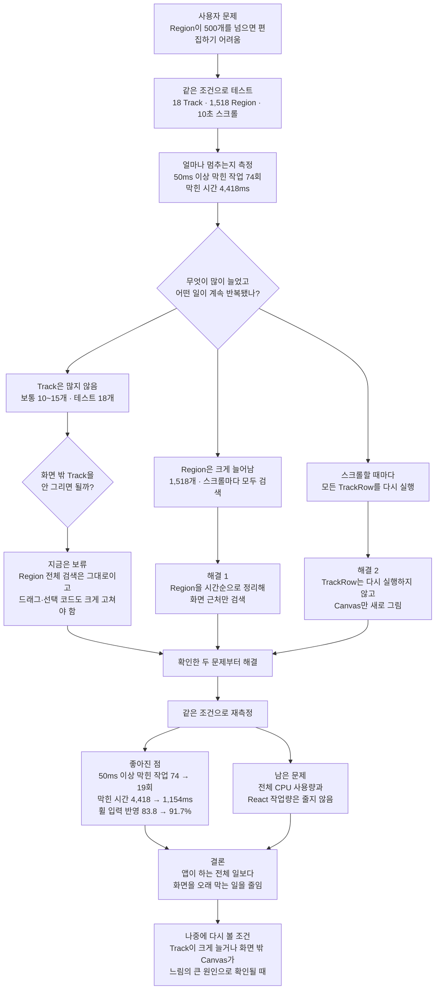

18개 Track과 1,518개 Region이 있는 타임라인은 스크롤과 편집이 너무 느렸습니다. 스크롤할 때마다 모든 Region을 찾고 모든 TrackRow를 다시 실행하고 있었습니다.

보통 Track은 10~15개였지만 Region은 1,518개까지 늘어났습니다. 그래서 화면 밖 Track을 없애기보다, 스크롤할 때 반복되는 Region 검색과 TrackRow 실행부터 줄였습니다.

변경 후 화면을 50ms 이상 막은 작업은 74회에서 19회로 줄었습니다. 막힌 시간도 4,418ms에서 1,154ms로 줄었습니다. 앱이 하는 전체 일은 줄지 않았지만, 화면을 오래 멈추게 하는 일은 줄었습니다.

이 글은 무엇을 먼저 최적화할지 결정한 근거를 설명합니다. 시간 인덱스와 Canvas 갱신 신호의 코드는 [상세 구현 글](/posts/timeline-performance-region-index-implementation)에서 다룹니다.

## [sort1] 판단 흐름 한눈에 보기



판단 기준은 단순했습니다. **실제로 많이 늘어난 것과 스크롤할 때마다 반복되는 일부터 줄였습니다.** 화면 밖 Track을 안 그리는 방법은 Region 전체 검색을 해결하지 못하고 드래그와 선택 코드도 크게 바꿔야 해서 나중으로 미뤘습니다.

## [sort1] 1. 문제 정의: Region 500개 이상에서 발생한 입력 지연

> “다중 트랙에서 Region이 500개를 넘으면 화면이 너무 버벅여서 편집하기 어려워요.”

Region은 타임라인에 배치된 시작·종료 시간을 가진 편집 단위입니다. 사용자는 Region이 500개를 넘으면 가로 스크롤과 편집 입력이 화면에 바로 반영되지 않는다고 제보했습니다.

실제 프로젝트 데이터로 18개 Track과 1,518개 Region을 만들었습니다. 동일한 가로 스크롤을 10초 동안 반복하자 Long Task가 74회 발생했고 누적 시간은 4,418ms였습니다.

처음에는 화면 밖 TrackRow를 제거하는 세로 Track 가상화를 검토했습니다. 그러나 많은 컴포넌트가 마운트됐다는 사실만으로 입력 지연의 원인을 특정할 수는 없었습니다.

같은 증상은 다음 작업과 모두 일치할 수 있습니다.

- JavaScript 계산
- React 컴포넌트 실행과 commit
- Canvas draw
- 브라우저 layout과 paint
- garbage collection(메모리 회수)

확인 범위를 다음과 같이 구분했습니다.

| 구분      | 내용                                                                   |
| --------- | ---------------------------------------------------------------------- |
| 확인 사실 | 스크롤 경로에서 Region 전체 조회와 TrackRow prop 변경이 반복됐습니다.  |
| 설계 판단 | 확인한 두 반복 경로를 세로 Track 가상화보다 먼저 줄이기로 했습니다.    |
| 미확인    | 두 반복 경로가 각 Long Task에 얼마나 기여했는지는 분리하지 못했습니다. |

하나의 task에 여러 종류의 작업이 포함될 수 있으므로 두 반복 경로를 모든 Long Task의 단일 원인으로 보지 않았습니다.

이번 작업의 목표를 다음과 같이 제한했습니다.

> 스크롤 경로에서 확인한 반복 비용을 줄이고, 같은 조건에서 Long Task와 입력 지표의 변화를 확인한다.

## [sort1] 2. 측정 기준: Long Task와 보조 지표

### [sort2] 2-1. 입력 지연을 확인하기 위해 Long Task를 측정했다

FPS는 화면 갱신 빈도를 보여 줍니다. 하지만 FPS만으로는 입력이 왜 늦었는지 또는 어떤 작업이 메인 스레드를 오래 점유했는지 구분하기 어렵습니다.

[W3C Long Tasks API](https://www.w3.org/TR/longtasks-1/)는 50ms 이상 UI thread를 점유하는 task를 보고합니다. 이런 task가 실행되는 동안에는 입력과 스크롤처럼 대기 중인 다른 작업도 늦게 실행될 수 있습니다.

사용자 제보의 핵심은 평균 frame 수가 아니라 입력이 바로 반영되지 않아 편집하기 어렵다는 점이었습니다. 그래서 Long Task를 중심 지표로 선택했습니다.

Long Task만으로 전체 작업량을 판단할 수는 없습니다. 긴 작업 하나가 짧은 작업 여러 개로 나뉘면 Long Task 지표는 좋아져도 전체 CPU 사용량은 줄지 않을 수 있습니다. 다음 보조 지표를 함께 기록했습니다.

| 지표                        | 확인할 내용                                                         |
| --------------------------- | ------------------------------------------------------------------- |
| Long Task 횟수·누적 시간    | 메인 스레드를 50ms 이상 점유한 task의 발생량                        |
| 입력 후 다음 frame p95      | DOM이 입력을 받은 뒤 다음 화면 갱신 기회까지 걸린 시간              |
| DOM wheel 입력 수신율       | 전송한 wheel 입력 중 DOM에서 관찰한 비율                            |
| 메인 스레드 CPU 비율        | 측정 구간에서 Renderer task가 실행된 시간의 비율                    |
| React commit·actualDuration | 앱 전체의 React commit 횟수와 Profiler가 기록한 actualDuration 합계 |

### [sort2] 2-2. 비교 측정과 실행 흐름 분석을 분리했다

실제 프로젝트 JSON을 고정 fixture로 저장하고 다음 조건에서 가로 스크롤을 반복했습니다.

```text
Track: 18개
Region: 1,518개
측정 시간: 10초
wheel 입력: 303회
입력 간격: 33ms
스크롤 거리: 480px
반복 횟수: 변경 전·후 각각 3회
대표값: 3회 중앙값
```

Playwright의 [`connectOverCDP`](https://playwright.dev/docs/api/class-browsertype#browser-type-connect-over-cdp)로 Electron Renderer에 연결했습니다.

Chrome Trace를 켜면 event 수집 작업이 측정 대상에 추가됐습니다. 실제 측정에서도 Trace를 켠 결과는 Trace를 끈 반복 측정과 절대값과 변화 방향이 달랐습니다.

측정 도구의 개입을 줄이기 위해 목적을 분리했습니다.

- **변경 전후 비교:** Trace를 끄고 3회 중앙값을 사용했습니다.
- **실행 흐름 분석:** [CDP Tracing](https://chromedevtools.github.io/devtools-protocol/tot/Tracing/)을 켠 별도 실행을 사용했습니다.
- **CPU 지표 수집:** [CDP Performance](https://chromedevtools.github.io/devtools-protocol/tot/Performance/)의 runtime metric을 사용했습니다.

Trace를 끈 실행은 안정적인 비교값을 제공하지만 함수별 실행 시간을 보여 주지 않습니다. Trace를 켠 실행은 call stack을 보여 주지만 수집 비용을 포함합니다. 두 목적을 한 번의 실행으로 측정하지 않았습니다.

## [sort1] 3. 코드에서 확인한 두 반복 경로

### [sort2] 3-1. 화면 범위 계산 뒤에도 Region 전체를 조회했다

기존 가로 virtualizer는 현재 화면과 overscan에 해당하는 시간 범위를 계산했습니다. 그러나 각 Track에서 이 범위와 겹치는 Region을 찾을 때는 전체 목록을 순회했습니다.

```text
가로 virtualizer
└─ 현재 화면의 시간 범위 계산

Region 조회
└─ 전체 목록에서 화면과 겹치는 Region 탐색
```

화면 범위를 계산하는 작업과 그 범위에 속한 데이터를 찾는 작업은 서로 다릅니다. 기존 구조는 첫 번째 작업만 줄이고 있었습니다.

실제 프로젝트의 Track은 주로 10~15개였고 측정 프로젝트는 18개였습니다. 반면 겹침 처리 뒤 Region은 1,518개까지 증가했습니다. 확인한 데이터에서는 Track보다 Region이 더 큰 증가 축이었습니다.

### [sort2] 3-2. Canvas 갱신 요청이 TrackRow 실행까지 유발했다

부모 컴포넌트는 Canvas를 다시 그리기 위해 스크롤마다 바뀌는 값을 모든 TrackRow에 prop으로 전달했습니다.

```text
scroll event
→ scroll prop 변경
→ 모든 TrackRow 실행
→ Canvas를 다시 그리도록 요청
```

TrackRow에는 이미 `React.memo`가 적용돼 있었습니다. 그러나 prop 값이 매번 바뀌었기 때문에 props가 같을 때 컴포넌트 실행을 건너뛰는 조건이 성립하지 않았습니다.

스크롤할 때 필요한 작업은 Canvas를 현재 가로 위치에 맞춰 다시 그리는 것이었습니다. Track 데이터와 JSX 구조는 바뀌지 않았습니다. React UI 계산과 Canvas 갱신 요청의 실행 조건이 달랐지만 같은 prop 경로에 묶여 있었습니다.

## [sort1] 4. 최적화 선택지와 판단 기준

먼저 적용할 방법을 네 가지 기준으로 비교했습니다.

1. 실제 데이터의 증가 축과 맞는가
2. 코드에서 확인한 반복 경로를 직접 줄이는가
3. 편집 상호작용의 변경 범위를 통제할 수 있는가
4. 단위 테스트와 실제 앱 측정으로 결과를 검증할 수 있는가

| 선택지                        | 직접 줄이는 작업                         | 얻는 점                             | 비용과 한계                                                 |
| ----------------------------- | ---------------------------------------- | ----------------------------------- | ----------------------------------------------------------- |
| 세로 Track 가상화             | 화면 밖 TrackRow의 React·DOM·Canvas 작업 | Track 수가 많을 때 마운트 수를 제한 | 드래그·선택·재정렬·동적 높이 좌표계와 생명주기를 함께 변경  |
| `React.memo` 비교 조건 변경   | 일부 TrackRow 실행                       | 기존 구조를 적게 변경               | Canvas 갱신을 전달할 별도 경로가 필요                       |
| Region 시간 인덱스            | 스크롤마다 실행되는 Region 전체 조회     | 화면과 겹칠 후보만 검사             | Region 변경 시 인덱스 재생성과 추가 메모리 필요             |
| React와 Canvas 갱신 경로 분리 | 스크롤 prop 변경으로 인한 TrackRow 실행  | React 실행 없이 Canvas 갱신 가능    | 명령형 구독 lifecycle이 생기며 모든 Canvas 갱신 요청은 남음 |

세로 Track 가상화는 Track 수가 많고 화면 밖 Canvas draw 비용이 클 때 유리합니다. 그러나 현재 측정 프로젝트에는 Track 18개와 Region 1,518개가 있었습니다. 화면 밖 TrackRow를 제거해도 각 Track 내부의 Region 전체 조회는 남습니다.

`React.memo`의 비교 조건만 바꾸면 TrackRow 실행을 일부 건너뛸 수 있습니다. 그러나 Canvas는 새 가로 위치를 기준으로 다시 그려야 합니다. 특정 prop을 무시하는 것만으로는 Canvas 갱신 시점을 전달할 수 없습니다.

Region 시간 인덱스와 Canvas 갱신 분리는 코드에서 확인한 두 반복 경로를 각각 줄입니다. 드래그 좌표계나 Track 생명주기 전체를 바꾸지 않고 적용할 수 있다는 점도 현재 조건과 맞았습니다.

## [sort1] 5. Region 인덱스와 Canvas 신호를 선택한 이유

### [sort2] 5-1. Region 조회 비용을 낮은 빈도의 경로로 옮겼다

가로 virtualizer가 화면 범위를 계산해도 해당 범위의 Region을 전체 목록에서 찾으면 조회 비용은 남습니다.

Region 시간 인덱스는 Region 목록이 바뀔 때 정렬된 데이터와 검색용 보조 데이터를 만듭니다. 스크롤 중에는 같은 인덱스에서 화면과 겹칠 후보만 조회합니다.

```text
상대적으로 낮은 빈도
└─ Region 추가·삭제·시간 변경
   └─ 시간 인덱스 생성

높은 빈도
└─ 가로 스크롤
   └─ 인덱스에서 화면 범위 후보 조회
```

이 선택은 비용을 제거하지 않습니다. 스크롤 조회 비용을 Region 목록 변경 시점으로 옮깁니다. Region 변경 시 정렬 비용이 생기고, 정렬된 목록과 보조 데이터만큼 메모리를 추가로 사용합니다.

700개 Region과 2,000개 화면 범위를 사용한 합성 벤치마크(synthetic benchmark)에서는 선형 조회가 1,400,000개 Region을 검사했고 인덱스 조회가 20,798개 후보를 검사했습니다. 후보 검사 횟수는 약 98.5% 감소했습니다.

이 수치는 알고리즘이 검사한 데이터 수입니다. 사용자 체감 시간이나 Long Task 개선율을 뜻하지 않습니다. 실제 반응성은 Electron 앱에서 별도로 측정했습니다.

### [sort2] 5-2. React UI 계산과 Canvas 갱신 요청을 분리했다

스크롤할 때 TrackRow의 JSX와 Track 데이터는 바뀌지 않았습니다. Canvas만 현재 가로 위치에 맞춰 다시 그려야 했습니다.

참조가 유지되는 신호 객체를 TrackRow에 전달하고, 스크롤할 때 Canvas 갱신 요청만 알리도록 바꿨습니다.

```text
변경 전

scroll prop 변경
→ TrackRow의 React 실행
→ Canvas 갱신 요청


변경 후

scroll signal
→ TrackRow의 구독 callback
→ Canvas 갱신 요청
```

이 구조는 React 렌더링을 제거하지 않습니다. 다른 prop, state, context가 바뀌면 TrackRow는 다시 실행됩니다. 스크롤 알림 때문에 발생하던 TrackRow 실행만 분리합니다.

대신 TrackRow가 신호를 구독하고 unmount할 때 해제해야 합니다. 구독 callback도 최신 Canvas draw 함수를 참조해야 합니다. React prop 경로를 줄이는 대신 명령형 구독 생명주기를 받아들였습니다.

### [sort2] 5-3. 세로 Track 가상화는 재검토 조건을 남겼다

세로 Track 가상화를 제외하지 않고 순서를 뒤로 미뤘습니다. 현재 확인한 반복 경로를 직접 줄이지 않고, 편집 좌표계와 Canvas 생명주기의 변경 범위가 더 컸기 때문입니다.

다음 조건에서는 세로 Track 가상화의 우선순위를 다시 판단해야 합니다.

- Track 수가 현재 일반 범위인 10~15개를 크게 넘어설 때
- 화면 밖 Track Canvas의 draw 시간이 주요 비용으로 측정될 때
- TrackRow 마운트 수가 메모리나 초기 진입 시간을 제한할 때
- 가상 좌표계 도입 비용보다 측정된 이득이 커질 때

## [sort1] 6. 검증 결과와 결론의 범위

Trace를 끄고 변경 전후를 각각 3회 실행한 중앙값은 다음과 같았습니다.

| 지표                   | 변경 전 | 변경 후 |       변화 |
| ---------------------- | ------: | ------: | ---------: |
| Long Task 횟수         |    74회 |    19회 | 74.3% 감소 |
| Long Task 누적 시간    | 4,418ms | 1,154ms | 73.9% 감소 |
| Long Task p95          |    82ms |    88ms |  7.3% 증가 |
| DOM wheel 입력 수신율  |   83.8% |   91.7% | 7.9%p 향상 |
| 입력 후 다음 frame p95 |  75.1ms |  71.2ms |  5.2% 단축 |

Long Task 횟수와 누적 시간은 감소했고 DOM에서 관찰한 wheel 입력은 늘었습니다. 이 결과는 메인 스레드를 긴 시간 연속으로 점유한 task가 줄었다는 해석과 일치합니다.

다음 지표는 개선되지 않았습니다.

| 지표                      | 변경 전 | 변경 후 |        변화 |
| ------------------------- | ------: | ------: | ----------: |
| 메인 스레드 CPU 비율      |   82.7% |   84.3% |  1.6%p 증가 |
| React commit              | 2,581회 | 2,950회 |  14.3% 증가 |
| React actualDuration 누적 | 2,875ms | 3,741ms |  30.1% 증가 |
| animation frame gap p95   | 100.2ms | 100.1ms | 사실상 동일 |

이 결과로는 전체 렌더링 비용이나 메인 스레드의 전체 작업량이 줄었다고 결론 내릴 수 없습니다. React 작업량이 감소했다고도 말할 수 없습니다.

두 변경을 함께 적용했기 때문에 각 변경의 기여도도 분리할 수 없습니다. 시간 인덱스와 Canvas 신호의 기여도를 구분하려면 각 변경만 적용한 상태를 따로 측정해야 합니다.

이번 측정으로 확인한 결론은 다음과 같습니다.

> 전체 CPU와 React 작업량은 줄지 않았지만, 메인 스레드를 50ms 이상 연속으로 점유한 task의 횟수와 누적 시간은 감소했습니다.

## [sort1] 7. 트레이드오프와 다음 검증 항목

| 선택                       | 새로 생긴 비용                             | 재검토 조건                                     |
| -------------------------- | ------------------------------------------ | ----------------------------------------------- |
| Region 시간 인덱스         | 인덱스 재생성 비용과 추가 메모리           | Region 변경이 조회보다 자주 발생할 때           |
| Canvas 갱신 신호           | 구독 등록·해제와 최신 callback 관리        | 구독 생명주기 오류나 상태 정합 문제가 발생할 때 |
| 세로 Track 가상화 보류     | 화면 밖 TrackRow와 Canvas 작업이 계속 남음 | 화면 밖 Canvas draw가 주요 비용으로 측정될 때   |
| 두 변경을 함께 적용한 측정 | 변경별 기여도를 분리할 수 없음             | 각 변경의 효과를 따로 판단해야 할 때            |

현재 구현은 모든 TrackRow를 마운트하고 모든 Track Canvas에 갱신 요청을 전달합니다. 남은 병목은 다음 순서로 확인합니다.

1. Chrome Trace에서 남은 Long Task의 JavaScript 호출 스택(call stack)을 분류합니다.
2. Track별 Canvas draw 횟수와 실행 시간을 측정합니다.
3. 화면 밖 Track Canvas 갱신 요청을 차단합니다.
4. Track 수가 증가한 조건에서 세로 가상화의 손익을 다시 측정합니다.
5. TrackRow 외에 스크롤 상태를 구독하는 React 경로를 확인합니다.

## [sort1] 8. 마치며

처음에는 항목이 많은 화면이라는 이유로 세로 Track 가상화를 먼저 검토했습니다. 실제 데이터를 확인하니 Track은 18개였고 Region은 1,518개였습니다. 코드에서는 Region 전체 조회와 스크롤 prop 변경이 반복되고 있었습니다.

이 근거를 바탕으로 Region 시간 인덱스와 Canvas 갱신 분리를 먼저 적용했습니다. 측정 결과 Long Task 횟수는 74.3%, 누적 시간은 73.9% 감소했습니다. 반면 CPU와 React 작업량은 줄지 않았습니다.

이번 작업에서 얻은 판단 기준은 다음 네 가지입니다.

1. 실제로 증가하는 데이터가 무엇인지 확인합니다.
2. 사용자 입력마다 반복되는 코드 경로를 찾습니다.
3. 선택한 방법이 해당 경로를 직접 줄이는지 확인합니다.
4. 개선되지 않은 지표로 결론의 범위를 제한합니다.

> 성능 최적화의 우선순위는 익숙한 기법이 아니라 데이터 규모와 실행 빈도를 기준으로 결정해야 합니다.

시간 인덱스, Canvas 신호와 경계 조건 테스트는 [상세 구현 글](/posts/timeline-performance-region-index-implementation)에서 이어집니다.

## 참고

- [React 공식 문서: `memo`](https://react.dev/reference/react/memo)
- [W3C Long Tasks API](https://www.w3.org/TR/longtasks-1/)
- [Playwright 공식 문서: `connectOverCDP`](https://playwright.dev/docs/api/class-browsertype#browser-type-connect-over-cdp)
- [Chrome DevTools Protocol: Performance domain](https://chromedevtools.github.io/devtools-protocol/tot/Performance/)
- [Chrome DevTools Protocol: Tracing domain](https://chromedevtools.github.io/devtools-protocol/tot/Tracing/)
