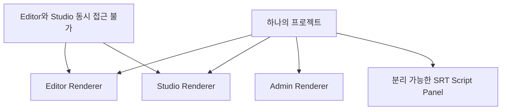
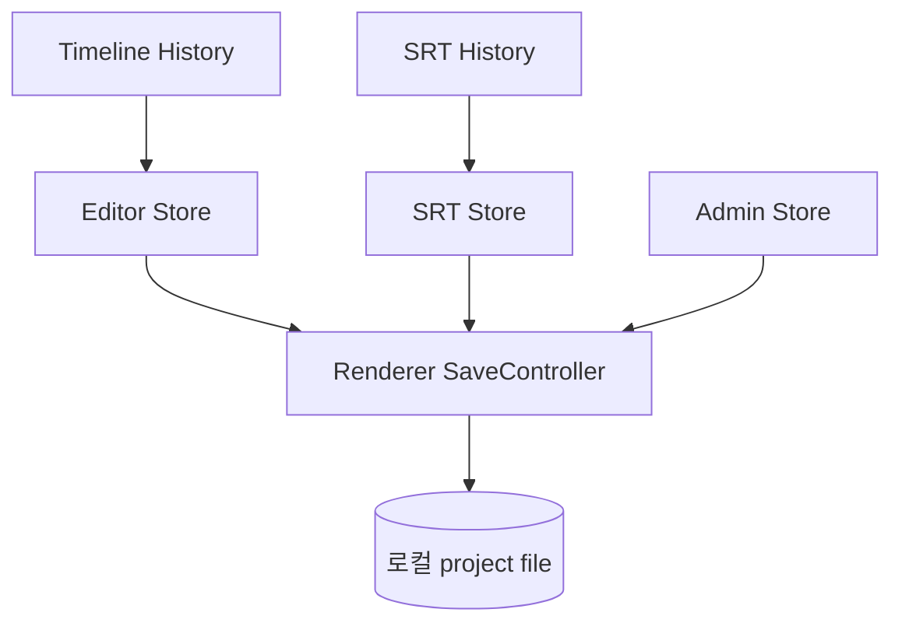
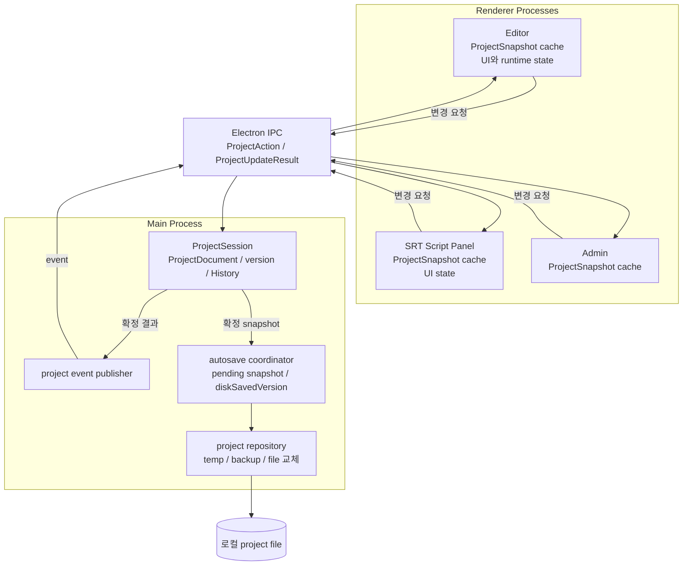
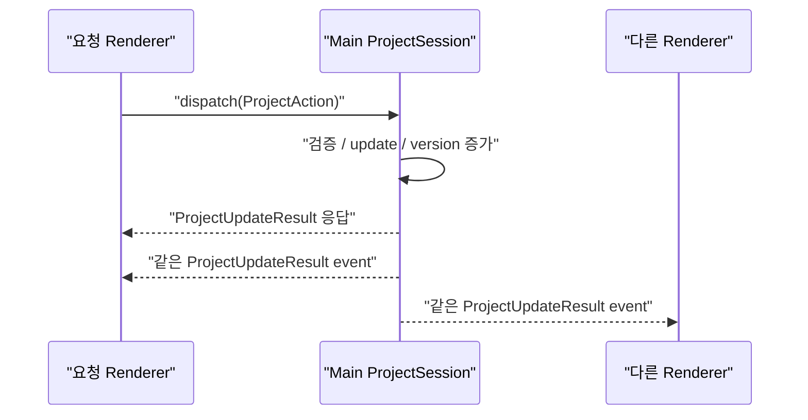
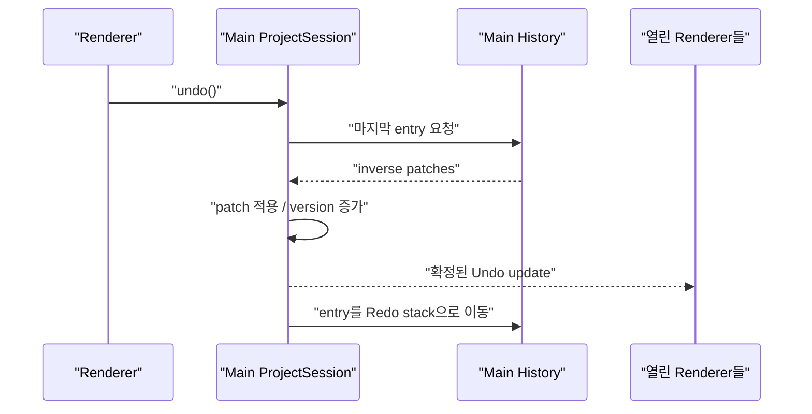
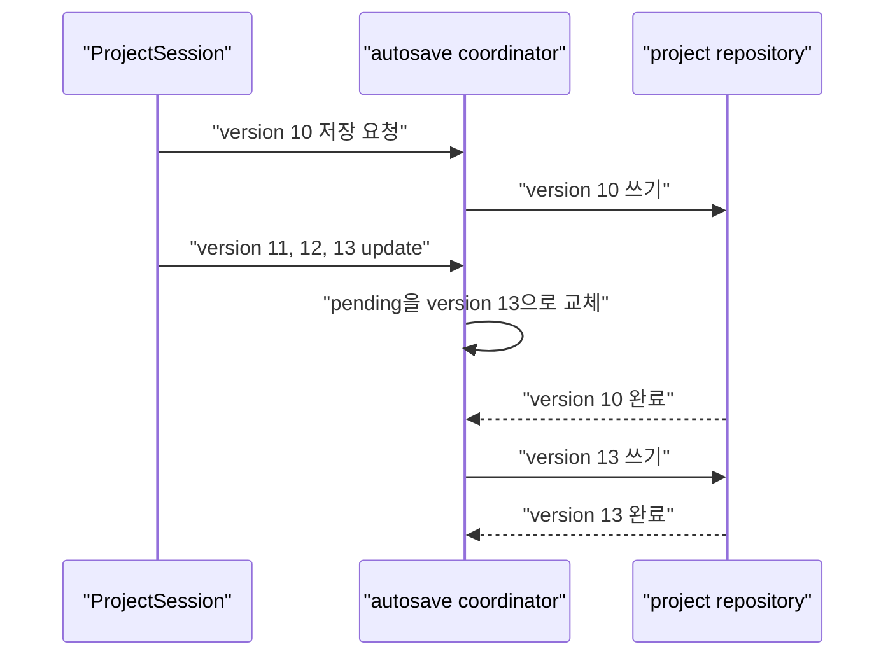

# Main Process에 SSOT를 둔 Electron 멀티 윈도우 편집기의 프로젝트 상태 설계

## 핵심 주장

> 여러 Renderer가 공유하고 프로젝트 파일에 저장할 `ProjectDocument`의 최종 변경 권한을 Main Process의 `ProjectSession`에 둔다.

이 글에서 Single Source of Truth(SSOT)는 값이 한 벌만 존재한다는 뜻이 아니다. Main의 `ProjectDocument`만 최종 상태를 확정하고, 각 Renderer의 `ProjectSnapshot`은 화면 표시를 위한 읽기 전용 cache로 사용한다는 뜻이다.

## 문서에서 구분할 내용

| 구분                     | 내용                                                                                                                                                                                               |
| ------------------------ | -------------------------------------------------------------------------------------------------------------------------------------------------------------------------------------------------- |
| 프로젝트에서 관찰한 사실 | 실무자가 스크립트를 수정한 뒤 자리를 비우고 돌아오면 수정 전 내용으로 돌아가는 문제가 보고되었다. 제공된 프로젝트 설명에 따르면 자동저장이 수정 전 값을 다시 저장하면서 최신 수정 내용을 덮어썼다. |
| 공식 문서로 확인한 사실  | 각 `BrowserWindow`는 별도 Renderer Process에서 실행되며, Main과 Renderer는 IPC message로 통신한다.                                                                                                 |
| 설계 판단                | 저장 가능한 프로젝트 상태, version, Undo/Redo History의 최종 변경 권한을 Main에 둔다.                                                                                                              |
| 미정 사항                | 자동저장 허용 손실 시간, 같은 항목의 동시 수정 규칙, History 영속화 여부, 성능 허용 기준은 제품 정책과 측정값이 필요하다.                                                                          |

## 국문 초록

이 글은 Electron 멀티 윈도우 편집기에서 스크립트 수정 내용이 자동저장 과정에서 수정 전 내용으로 되돌아간 문제를 다룬다. 실무진은 “스크립트 수정하고, 점심을 먹고 오면 수정 내용이 사라져 있어요!”라고 문제를 보고했다. 점심시간 자체가 원인은 아니다. 사용자가 자리를 비운 동안 자동저장이 실행되었고, 자동저장이 최신 편집값이 아닌 이전 값을 가진 Store를 기준으로 프로젝트 문서를 저장한 것이 제공된 설명에서 확인된 직접 원인이다.

기존 구조에서는 Editor, SRT Script Panel, Admin 등 여러 Renderer가 같은 프로젝트의 일부 상태를 각각 보관했다. 저장 시점에는 Renderer의 `SaveController`가 이 값들을 다시 모아 프로젝트 문서를 만들었다. 그러나 어느 Store가 최종값인지 정하는 공통 version과 변경 권한이 없었다. 기능별 Undo/Redo History도 서로 다른 상태와 실행 객체를 참조했다. 이 구조에서는 화면에 표시한 값, 자동저장이 읽은 값, Undo/Redo가 복원한 값이 같은 시점의 프로젝트라고 보장하기 어려웠다.

해결안은 저장 가능한 `ProjectDocument`의 최종 변경 권한을 Main Process의 `ProjectSession`으로 이동하는 것이다. 각 Renderer는 Main이 확정한 `ProjectSnapshot`을 TanStack Query Cache에 읽기 전용으로 보관한다. 사용자 입력은 `ProjectAction`으로 Main에 전달하고, Main은 변경을 검증한 뒤 version을 증가시키고 확정 결과를 모든 Renderer에 발행한다. Undo/Redo는 Main History에서 문서 patch를 적용하며, 자동저장은 같은 snapshot을 파일에 기록한다.

이 설계는 최종값을 결정하는 위치를 명확히 하여 편집값과 저장값이 달라질 위험을 줄이려는 구조다. 다만 모든 저장 가능한 변경이 IPC를 지나고, version 중복과 event 누락 복구가 필요하다는 비용이 생긴다. 성능과 복구 수준은 아직 측정 전이므로 이 구조를 최적이라고 단정하지 않는다. 상태 일치, 저장 실패, 비정상 종료, 응답 시간을 실제 시나리오로 검증해야 한다.

## 1. 서론

### 1.1. 연구 배경

대상 제품은 SRT script를 수정하고, 이를 기준으로 TTS를 생성한 뒤 Timeline과 media asset을 편집하는 Electron 데스크톱 편집기다. 사용자는 프로젝트를 로컬 PC에 저장하고 나중에 다시 열 수 있다. 따라서 화면에 보이는 편집 상태와 프로젝트 파일에 기록되는 상태가 같아야 한다.

프로젝트는 하나의 화면으로 끝나지 않는다. Editor, Studio, Admin이 있고 SRT Script Panel은 별도 창으로 분리할 수 있다. 이 화면들은 같은 프로젝트의 SRT row, Timeline item, asset 참조를 사용한다. 하나의 Renderer만 사용하는 웹 페이지와 달리, 여러 Renderer의 수명주기와 메모리 경계를 함께 고려해야 했다.

상태 불일치는 개발 도구에서만 발견된 문제가 아니었다. 실제 작업자가 스크립트를 편집한 뒤 자리를 비우고 돌아왔을 때 수정 내용이 사라지는 형태로 드러났다. 프로젝트 설명에서 전달된 보고는 다음과 같다.

> “스크립트 수정하고, 점심을 먹고 오면 수정 내용이 사라져 있어요!”

이 글에서는 이 현상을 **이전 snapshot 덮어쓰기**라고 부른다. 자동저장이 최신 version이 아닌 이전 snapshot을 저장해 최신 편집 내용을 덮는 현상을 뜻한다.

이 보고에서 직접 확인되는 내용은 시간이 지난 뒤 수정 전 문장이 다시 나타났다는 것이다. 편집 도구에서 이 문제는 단순한 화면 갱신 오류로 한정할 수 없다. 제공된 설명처럼 자동저장 결과까지 수정 전 값으로 바뀌었다면 프로젝트에 남는 작업 결과를 신뢰하기 어려워진다.

### 1.2. 문제 제기

제공된 프로젝트 설명에 따르면 직접 원인은 자동저장 과정에 있었다. 사용자가 수정한 스크립트와 다른 Renderer Store에 수정 전 값이 남아 있었고, 자동저장은 그 값을 기준으로 프로젝트 문서를 저장했다. 최신 편집값이 이전 값으로 덮어써지면서 사용자는 작업 내용을 잃었다.

여기서 인과관계를 구분해야 한다.

| 구분             | 내용                                                                                          |
| ---------------- | --------------------------------------------------------------------------------------------- |
| 관찰된 증상      | 스크립트 수정 후 시간이 지나면 수정 전 내용으로 돌아갔다.                                     |
| 자동저장 trigger | 사용자가 자리를 비운 사이 예약되거나 조건을 만족한 자동저장이 실행되었다.                     |
| 직접 원인        | 자동저장이 최신 편집값이 아닌 수정 전 값을 기준으로 프로젝트 내용을 저장했다.                 |
| 구조적 조건      | 같은 프로젝트 값을 여러 Store가 변경했지만 최종값을 정하는 공통 version과 변경 권한이 없었다. |

점심시간은 원인이 아니다. 자동저장이 실행될 만큼 시간이 지났다는 관찰 조건이다. 또한 Store가 여러 개라는 사실만으로 문제가 발생한다고 일반화할 수도 없다. 여러 Store가 있어도 변경 권한, version, 충돌 규칙이 명확하면 정합성을 유지할 수 있다. 이 프로젝트의 문제는 같은 프로젝트 값을 여러 Store가 최종값처럼 변경했고, 자동저장이 어느 값을 선택해야 하는지 정하는 규칙이 없었다는 점이다.

Undo/Redo도 같은 경계 문제를 가지고 있었다. SRT History는 SRT Store를 변경하고 Timeline History는 Region과 AudioEngine 실행 객체를 변경했다. 하나의 사용자 동작이 SRT와 Timeline을 함께 수정하면 어느 History가 전체 프로젝트의 이전 상태를 의미하는지 명확하지 않았다. 저장은 다시 여러 Store를 읽었으므로 Undo 결과와 저장 결과가 같은 상태라고 보장하기 어려웠다.

### 1.3. 연구 질문

이 문제를 Store 라이브러리 교체로만 접근하지 않고 상태의 변경 권한과 수명주기 문제로 다시 정의했다. 연구 질문은 다음 네 가지다.

1. 여러 Renderer가 공유하는 `ProjectDocument`의 최종 상태를 어디에서 확정할 것인가?
2. Main이 확정한 상태를 각 Renderer가 어떻게 같은 version으로 표시할 것인가?
3. 기능별 Undo/Redo와 자동저장을 어떻게 같은 `ProjectDocument` 흐름으로 통합할 것인가?
4. 이 구조가 새로 만드는 비용은 무엇이며 어떤 조건에서 다시 검토해야 하는가?

### 1.4. 핵심 주장

이 글의 주장은 모든 state를 Main으로 옮기자는 것이 아니다. 저장 가능하며 여러 창이 공유하는 `ProjectDocument`의 최종 변경 권한만 Main `ProjectSession`에 둔다.

Main은 프로젝트 문서, version, Undo/Redo History를 확정한다. Renderer는 Main에서 받은 읽기 전용 `ProjectSnapshot`으로 화면을 그린다. selection, modal, drag preview, playhead, AudioEngine처럼 특정 Renderer에서만 필요한 UI·runtime state는 각 Renderer에 남긴다. 자동저장은 Renderer Store를 다시 조립하지 않고 Main이 확정한 snapshot을 저장한다.

이 경계를 사용하면 저장과 Undo/Redo가 같은 문서를 기준으로 동작한다. 반대로 각 Renderer의 cache는 프로젝트의 최종값을 직접 확정할 수 없으므로 두 번째 SSOT가 되지 않는다.

### 1.5. 연구 범위

이 글은 다음 내용을 포함한다.

- `ProjectDocument`의 최종 변경 위치 비교
- Main과 Renderer의 상태 경계
- 변경 요청, 확정 결과, event 발행, version 복구
- TanStack Query Cache와 Renderer UI Store의 역할
- Undo/Redo History 통합
- 자동저장 책임과 저장 완료 지점
- 상태 일치, 복구, 성능 검증 기준

반면 PR 분리, 브랜치와 커밋 순서, 파일별 마이그레이션, 클래스의 private method 전체 목록은 다루지 않는다. 성능 측정값도 아직 제공되지 않았으므로 성능이 개선되었다고 주장하지 않는다.

## 2. 편집기 환경과 상태 불일치

### 2.1. 프로젝트 편집 흐름

사용자는 SRT row의 text와 time range를 수정한다. 수정한 script를 기준으로 TTS를 만들고, Studio 또는 Editor에서 Timeline item과 region을 편집한다. 프로젝트 파일에는 다시 열었을 때 같은 편집 결과를 복원할 수 있는 값이 들어가야 한다.

저장 대상은 프로젝트 정보, SRT row, Timeline 배치, asset 참조, 편집 설정이다. 반면 hover, focus, 열린 modal, drag 중인 임시 좌표, 연속 playhead 위치는 파일에 저장할 프로젝트 원본이 아니다. `AudioBuffer`, DOM Node, AudioEngine도 특정 실행 환경에 묶인 객체이므로 프로젝트 문서와 구분한다.

이 구분은 데이터 형식만의 문제가 아니다. 저장 가능한 상태는 창이 닫혀도 유지되어야 하고 앱을 다시 실행한 뒤 복원할 수 있어야 한다. UI·runtime state는 해당 Renderer가 존재하는 동안만 필요하거나 문서 상태를 바탕으로 다시 만들 수 있다.

### 2.2. 창과 탭의 접근 규칙

제품 규칙상 Editor와 Studio는 동시에 접근할 수 없다. 이 규칙은 두 화면이 같은 Timeline을 동시에 수정하는 경우를 줄인다. 그러나 SRT Script Panel은 별도 창으로 분리할 수 있으며 Editor 또는 Admin과 함께 열릴 수 있다. 따라서 Editor와 Studio의 상호 배제만으로 멀티 Renderer 상태 문제가 해결되지는 않는다.

가능한 조합을 단순화하면 다음과 같다.



SRT Script Panel에서 바꾼 내용은 현재 열려 있는 Editor나 Admin에 반영되어야 한다. 새로운 창이 열리면 다른 Renderer Store를 복사하는 것이 아니라 현재 프로젝트의 최신 확정 상태에서 시작해야 한다.

### 2.3. 공유하는 프로젝트 상태

이 글에서는 저장 가능한 프로젝트 상태를 `ProjectDocument`라고 부른다.

```ts
interface ProjectDocument {
  projectId: string;
  version: number;
  title: string;
  srtRows: SrtRow[];
  timelineItems: TimelineItem[];
  assetRefs: AssetRef[];
  editorSettings: EditorSettings;
}
```

각 Renderer가 화면에 표시하는 읽기 전용 복사본은 `ProjectSnapshot`이라고 부른다. 초기에는 `ProjectDocument`와 비슷한 모양일 수 있지만 의미가 다르다. `ProjectDocument`는 Main이 변경하는 원본이고 `ProjectSnapshot`은 특정 version의 확정 결과를 Renderer가 읽는 cache 값이다.

상태 위치와 변경 권한은 다음처럼 나눈다.

| 상태              | 위치              | 변경 권한        | 예시                                   |
| ----------------- | ----------------- | ---------------- | -------------------------------------- |
| `ProjectDocument` | Main              | Main만 가짐      | SRT, Timeline, asset 참조              |
| `ProjectSnapshot` | 각 Renderer cache | 읽기 전용        | 화면에 표시할 확정 프로젝트            |
| UI state          | 각 Renderer       | 해당 Renderer    | selection, modal, focus                |
| runtime state     | 각 Renderer       | 해당 Renderer    | AudioEngine, `AudioBuffer`, playhead   |
| `project.json`    | 로컬 파일         | Main의 저장 흐름 | 마지막으로 파일 교체가 완료된 snapshot |

### 2.4. 기존 상태 구조

기존 구조에는 Editor Store, SRT Store, Admin Store가 있었다. 각 Store는 같은 프로젝트의 일부 값을 보관하고 변경했다. Renderer `SaveController`는 저장 시점에 여러 Store를 읽어 프로젝트 문서를 다시 만들었다. SRT, Timeline, Audio의 Undo/Redo History도 기능별로 나뉘어 있었다.



이 구조에서 Store는 cache인지 원본인지 명확히 구분되지 않았다. 화면은 SRT Store의 최신 문장을 보여 주지만 자동저장은 Editor Store의 이전 문장을 읽을 수 있었다. 저장 과정이 성공해도 저장한 내용이 사용자의 최신 편집 결과라는 보장은 없었다.

### 2.5. 증상, 직접 원인, 구조적 조건

실무진의 보고는 문제의 사용자 영향을 보여 준다. 그러나 보고 문장만으로 내부 원인을 모두 증명할 수는 없다. 이 글은 사용자에게서 관찰한 증상과 제공된 프로젝트 분석에서 확인한 직접 원인, 그리고 그 원인을 허용한 구조적 조건을 구분한다.

1. 사용자가 SRT Script Panel에서 문장을 수정했다.
2. 수정한 Renderer Store에는 새 문장이 들어갔다.
3. 다른 Store에는 수정 전 문장이 남아 있었다.
4. 자동저장이 수정 전 값을 기준으로 프로젝트 내용을 저장했다.
5. 결과적으로 최신 수정 내용이 이전 내용으로 덮였다.

위 흐름에서 4번은 제공된 프로젝트 설명에 따른 직접 원인이다. 자동저장 interval, tab 이동, 파일 재로드 중 어느 동작이 화면에 이전 값을 다시 반영했는지는 현재 정보만으로 더 좁힐 수 없다. 그러나 최종 변경 권한과 version 규칙이 없었다는 구조에서는 어떤 Store가 오래된 값인지 판별하고 거절할 수 없었다.

## 3. 기술적 배경과 설계 요구사항

### 3.1. Electron Process Model

Electron 공식 문서에 따르면 앱에는 하나의 Main Process가 있고 Main은 Node.js 환경에서 실행된다. 각 `BrowserWindow`는 별도 Renderer Process에 웹 페이지를 로드한다. 창이 파괴되면 해당 Renderer Process도 종료된다. [Electron Process Model](https://www.electronjs.org/docs/latest/tutorial/process-model)

별도 process는 별도 JavaScript 실행 환경을 의미한다. 따라서 서로 다른 BrowserWindow의 React Context나 Zustand Store instance가 자동으로 하나가 되지 않는다. 이 사실이 Main SSOT를 필수로 만들지는 않지만, Renderer 간 상태 공유를 같은 브라우저 탭의 전역 변수처럼 다룰 수 없다는 제약을 만든다.

Main은 창과 앱 생명주기를 관리하며 Node.js API를 사용할 수 있다. 프로젝트의 로컬 파일 저장이 Main을 거치는 현재 조건과 결합하면 Main은 창보다 긴 project lifetime과 파일 쓰기를 함께 다룰 수 있는 후보가 된다. 다만 Main에서 무거운 동기 작업을 실행하면 앱 응답성에 영향을 줄 수 있으므로 문서 update는 짧게 유지해야 한다.

### 3.2. Electron IPC

Electron은 Main과 Renderer가 개발자가 정의한 channel에서 message를 주고받는 IPC 방식을 제공한다. Renderer에서 Main으로 값을 보내고 응답을 기다리는 경우 `ipcRenderer.invoke`와 `ipcMain.handle` 조합을 사용할 수 있다. Main에서 Renderer로 event를 보낼 때는 `webContents.send`를 사용할 수 있다. [Electron IPC](https://www.electronjs.org/docs/latest/tutorial/ipc)

공식 문서는 `ipcMain`과 `ipcRenderer`만으로 Renderer끼리 직접 message를 보내는 방법은 없다고 설명한다. Renderer 간 통신에는 Main을 중계자로 사용하거나 Main이 MessagePort를 전달하는 방법이 있다. 이 프로젝트에서는 저장 가능한 상태를 Main이 확정해야 하므로 document update는 Main을 거치는 일반 IPC가 자연스럽다.

IPC는 객체 참조를 공유하는 방식이 아니다. 전달 가능한 값의 제약이 있으므로 `AudioBuffer`, DOM Node, Electron 객체를 프로젝트 action에 직접 포함하지 않는다. IPC 경계를 지나는 값은 직렬화 가능한 `ProjectAction`, patch, snapshot으로 제한한다.

### 3.3. React 외부 Store 구독

React의 `useSyncExternalStore`는 React 외부 Store를 구독하는 Hook이다. `subscribe` 함수와 `getSnapshot` 함수를 받고, Store가 변경되면 snapshot을 다시 읽어 필요한 component를 렌더한다. 이 Hook 자체가 값을 보관하는 Store를 만들지는 않는다. [React `useSyncExternalStore`](https://react.dev/reference/react/useSyncExternalStore)

따라서 Main에서 event를 받는 listener만 `useSyncExternalStore`에 연결한다고 해서 snapshot 저장 문제가 해결되지는 않는다. 현재 snapshot을 보관하고 동일한 상태에서는 같은 snapshot 참조를 반환하는 외부 Store가 별도로 필요하다.

이 프로젝트는 Renderer의 비동기 cache로 TanStack Query를 선택하므로 `useSyncExternalStore`를 직접 구현할 필요가 없다. TanStack Query가 React 구독을 제공하고, component는 query key에 연결된 cache를 읽는다. 맞춤 external store를 만든다면 `useSyncExternalStore`가 후보가 될 수 있지만 두 방식을 동시에 프로젝트 snapshot의 주 Store로 사용할 이유는 없다.

### 3.4. TanStack Query Cache

TanStack Query 공식 문서는 mutation이 반환한 객체를 `queryClient.setQueryData`로 기존 query cache에 즉시 반영할 수 있다고 설명한다. cache update는 기존 객체를 직접 변경하지 않고 immutable 방식으로 수행해야 한다. [TanStack Query: Updates from Mutation Responses](https://tanstack.com/query/v5/docs/framework/react/guides/updates-from-mutation-responses)

이 기능은 Main이 반환한 `ProjectUpdateResult`를 Renderer의 `ProjectSnapshot` cache에 넣는 데 사용할 수 있다. 하지만 TanStack Query가 IPC transport가 되는 것은 아니다. Main과 Renderer 사이의 message 전달은 Electron IPC가 담당한다. TanStack Query는 Renderer에 도착한 확정 결과를 보관하고 React render와 연결한다.

또한 기본 refetch와 retry 규칙이 로컬 Main state에 그대로 맞는다고 가정하지 않는다. TanStack Query는 stale query의 자동 refetch와 실패 query의 retry 같은 기본값을 제공하므로 이 프로젝트의 IPC cache 규칙에 맞게 설정을 검토해야 한다. [TanStack Query: Important Defaults](https://tanstack.com/query/v5/docs/framework/react/guides/important-defaults) document 정합성은 Main event, project version, snapshot 복구 규칙이 만든다. focus 때마다 디스크 파일을 다시 읽는 식의 동작은 Main memory가 더 최신일 수 있는 자동저장 구조와 충돌할 수 있다.

### 3.5. 설계 요구사항

문제를 해결하려면 Store 개수를 줄이는 것보다 먼저 지켜야 할 규칙을 정해야 한다.

1. 저장 가능한 프로젝트 상태를 최종 확정하는 위치는 하나여야 한다.
2. 모든 저장 가능한 변경은 project version을 증가시켜야 한다.
3. 열린 Renderer는 Main이 확정한 같은 version을 따라야 한다.
4. Undo/Redo와 자동저장은 같은 `ProjectDocument`를 기준으로 실행되어야 한다.
5. 저장하지 않는 고빈도 UI state는 document update 경로와 분리해야 한다.
6. event 중복, 순서 역전, 누락 뒤에도 최신 snapshot으로 복구할 수 있어야 한다.
7. 저장 상태는 memory update와 file write 완료를 구분해 표시해야 한다.

이 요구사항은 어떤 라이브러리를 사용할지보다 먼저 적용된다. Zustand, TanStack Query, `useSyncExternalStore`는 각각 이 규칙을 구현하는 도구일 뿐 최종 변경 권한과 version 규칙을 자동으로 만들어 주지 않는다.

## 4. `ProjectDocument`의 최종 변경 위치 비교

### 4.1. Renderer별 Store 유지

첫 번째 선택지는 기존 Renderer별 Store를 유지하는 것이다. 현재 코드 변경 범위가 가장 작고 각 화면은 익숙한 React 상태 관리 방식을 계속 사용할 수 있다.

그러나 최종값을 고르는 문제는 남는다. 자동저장 전에 어느 Store를 우선할지, 창이 닫혔을 때 누가 프로젝트 상태를 유지할지, 서로 다른 History를 어떤 순서로 적용할지 별도 규칙이 필요하다. 상태를 Main에 두지 않아도 결국 version과 충돌 처리가 필요하므로 변경량이 작다는 장점은 장기적인 단순성을 보장하지 않는다.

### 4.2. 특정 Renderer를 기준 Store로 지정

두 번째 선택지는 Editor 같은 특정 Renderer를 기준 Store로 지정하는 것이다. 하나의 상위 React Store가 하위 component에 값을 공급하는 웹 앱 구조와 비슷하고, selector 기반 렌더링을 그대로 사용할 수 있다.

하지만 프로젝트 lifetime이 해당 창의 lifetime에 묶인다. Editor가 닫히고 Admin이나 분리된 SRT Script Panel만 남아 있는 경우 상태를 다시 인계해야 한다. Editor와 Studio의 접근 규칙, Admin 진입, 새 창 초기화도 기준 Renderer의 존재 여부에 의존한다. 저장은 여전히 Main을 거치므로 프로젝트 상태와 파일 쓰기 경계가 분리된다.

### 4.3. Main `ProjectSession`에서 확정

세 번째 선택지는 Main `ProjectSession`이 `ProjectDocument`를 소유하는 것이다. Main은 창의 생성과 종료보다 긴 앱 수명주기를 가지며 로컬 파일 저장 경로에도 접근한다. 이 위치에서 document update, version, History, 자동저장 대상을 같은 snapshot으로 묶을 수 있다.

비용은 명확하다. 모든 저장 가능한 변경이 IPC 경계를 지나야 한다. 요청 응답과 event가 중복될 수 있고 Renderer가 event를 놓칠 수도 있다. 따라서 version과 snapshot 복구 규칙을 직접 설계해야 한다. Main의 state update 경로에 무거운 처리를 넣지 않는 규칙도 필요하다.

### 4.4. 비교 기준

세 선택지를 다음 기준으로 비교했다.

| 기준                              | Renderer별 Store         | 특정 Renderer               | Main `ProjectSession`            |
| --------------------------------- | ------------------------ | --------------------------- | -------------------------------- |
| 창 종료와 독립된 project lifetime | 별도 조립 필요           | 기준 창에 의존              | 가능                             |
| 파일 저장과 같은 snapshot 사용    | 보장 규칙 필요           | Main 전달 시점 관리 필요    | 같은 snapshot 사용 가능          |
| Undo/Redo 최종 결과 확정          | 기능별 조정 필요         | 기준 Renderer에서 통합      | Main History에서 통합 가능       |
| IPC 비용                          | 저장과 창 동기화 때 발생 | 다른 창과 Main 접근 때 발생 | 저장 가능한 모든 update에서 발생 |
| version·복구 규칙                 | 필요                     | 필요                        | 필요하지만 적용 위치가 한 곳     |

이 비교에서 Main의 장점은 IPC가 없다는 것이 아니다. 어차피 여러 Renderer와 로컬 파일을 연결하려면 process 경계를 지나야 한다. Main을 선택하면 최종값 결정과 저장이 같은 snapshot을 사용하도록 만들 수 있다는 점이 핵심이다.

### 4.5. 선택 결과

이 편집기에서는 Main `ProjectSession`을 선택한다. 선택 근거는 다음 조건의 결합이다.

- 여러 Renderer가 같은 로컬 프로젝트를 편집한다.
- SRT Script Panel은 별도 창으로 분리할 수 있다.
- 프로젝트 파일 저장은 Main을 거친다.
- Editor가 프로젝트 전체 수명주기를 항상 대표하지 않는다.
- Undo/Redo와 자동저장이 같은 문서를 사용해야 한다.

이 결론은 모든 Electron 앱에 적용되는 일반 법칙이 아니다. 하나의 Renderer만 사용하거나 서버가 이미 최종 상태를 확정한다면 Main에 같은 책임을 둘 필요가 없을 수 있다.

## 5. Main SSOT와 Renderer 상태 경계

### 5.1. Main의 `ProjectDocument`

Main `ProjectSession`은 직렬화 가능한 프로젝트 상태를 private field로 보관한다. 외부 모듈은 document를 직접 수정하지 않고 `dispatch`, `undo`, `redo` 같은 제한된 API를 사용한다.

Main에 두는 값은 다음과 같다.

- 프로젝트 기본 정보와 현재 경로
- SRT row와 time range
- Timeline item 배치
- asset 참조
- 편집 설정
- project version
- Undo/Redo History
- 현재 version과 파일 저장 완료 version의 관계

Main의 문서는 앱 실행 중 최신 확정 상태다. 디스크의 `project.json`은 debounce 또는 파일 쓰기 중에는 이전 version일 수 있다. 따라서 탭 이동이나 새 창 초기화에서 디스크 파일을 최신 원본으로 다시 읽지 않는다.

### 5.2. Renderer의 `ProjectSnapshot`

Renderer에는 화면을 그릴 값이 필요하다. 매 render마다 IPC로 Main state를 읽는 대신 각 Renderer의 TanStack Query Cache에 읽기 전용 `ProjectSnapshot`을 보관한다.

읽기 전용이라는 말은 JavaScript 객체를 기술적으로 절대 변경할 수 없다는 뜻이 아니다. component와 UI action이 이 값을 프로젝트의 최종 상태로 확정하지 않는다는 API 규칙을 뜻한다. 사용자 입력은 `ProjectAction`으로 Main에 보내고 Main이 반환한 결과만 cache에 반영한다.

이 구조에서는 Main과 Renderer에 같은 모양의 값이 존재할 수 있다. 그러나 변경 권한은 Main에만 있으므로 SSOT가 두 개가 아니다. Renderer cache는 Main snapshot을 표시하기 위한 projection이다.

### 5.3. Renderer의 UI·runtime state

Renderer의 Zustand와 React state를 모두 없앨 필요는 없다. 다음 값은 Main 프로젝트 문서가 아니라 해당 화면의 상태다.

- 선택한 SRT row와 Timeline item
- 열린 modal과 panel 크기
- hover, focus, keyboard interaction
- drag 중인 preview 좌표
- 연속 playhead 위치
- AudioEngine, `AudioBuffer`, Timeline Region

이 값들은 해당 Renderer에서 변경하고 필요한 component만 다시 렌더한다. Renderer에 Zustand가 남는 이유는 화면 리렌더가 필요한 모든 값을 소유하기 위해서가 아니라, 해당 Renderer만 알아도 되는 UI·runtime state를 관리하기 위해서다.

### 5.4. `ProjectSession` private field와 Vanilla Zustand 비교

처음에는 Main에 React가 없으므로 Vanilla Zustand가 필요하다고 생각할 수 있다. 그러나 “React가 없다”는 사실은 Zustand를 선택하는 충분한 근거가 아니다. 먼저 Main에서 실제로 필요한 기능을 확인해야 한다.

- 현재 document 읽기
- action 검증과 적용
- version 증가
- History 기록
- 확정 결과 발행
- 자동저장 요청

이 기능은 `ProjectSession`의 private field와 method로 캡슐화할 수 있다. Vanilla Zustand의 `createStore`는 React 없이 `getState`, `setState`, `subscribe`를 제공하지만, 현재 요구사항에서는 `ProjectSession`의 API와 기능이 겹친다. [Zustand `createStore`](https://zustand.docs.pmnd.rs/reference/apis/create-store)

| 기준           | Class private field | Vanilla Zustand                   |
| -------------- | ------------------- | --------------------------------- |
| 외부 변경 차단 | private로 강제      | Store API 노출 범위를 별도로 제한 |
| selector 구독  | 직접 구현           | middleware로 제공 가능            |
| middleware     | 직접 구현           | 생태계 사용 가능                  |
| 현재 요구사항  | 충분함              | 기능이 겹침                       |

따라서 초기 구현은 private field를 사용한다. Main 내부 여러 모듈이 서로 다른 selector를 구독하거나 middleware와 상태 추적 기능이 필요해질 때 Vanilla Zustand를 다시 비교한다.

### 5.5. Main 내부 책임 분리

Main에 SSOT를 둔다고 `ProjectSession` 하나가 모든 일을 담당하면 다시 변경 이유가 너무 많은 Class가 된다. 책임은 다음처럼 나눈다.

| 역할                    | 책임                                                |
| ----------------------- | --------------------------------------------------- |
| `ProjectSession`        | action 검증, document update, version, History      |
| project event publisher | 열린 Renderer의 구독 관리와 확정 결과 발행          |
| autosave coordinator    | debounce, pending snapshot, 파일 쓰기 상태, `flush` |
| project repository      | JSON 변환, temp file, backup, project file 교체     |
| IPC handler             | preload에 노출할 API와 입력 검증 경계               |

`ProjectSession`은 파일 형식이나 React cache를 알지 않는다. autosave coordinator는 document를 임의로 수정하지 않는다. project repository는 언제 저장할지 결정하지 않고 전달받은 snapshot을 파일로 기록한다. 이 경계가 있어야 상태 규칙, 저장 정책, 파일 작업을 각각 검증할 수 있다.

### 5.6. 변경 요청 순서 처리

모든 변경 요청 앞에 전역 비동기 queue를 두는 것은 기본안이 아니다. `dispatch`, `undo`, `redo`가 Main에서 짧은 동기 state update로 끝나고 중간에 `await`가 없다면 하나의 callback이 document를 절반만 바꾼 상태에서 다른 callback으로 제어를 넘기지 않는다. Node.js 공식 문서는 event loop의 각 phase가 callback queue를 실행하며 poll queue의 callback을 동기적으로 처리한다고 설명한다. [Node.js Event Loop](https://nodejs.org/learn/asynchronous-work/event-loop-timers-and-nexttick)

별도 순서 제어가 필요한 부분은 구분한다.

- 파일 쓰기: 같은 project file에는 queued sequential execution 적용
- 오래 걸리는 TTS·분석 결과: 시작 project, item, version을 완료 시점에 재검증
- disk write 후에만 action 응답하는 정책: action queue 또는 recovery log 추가 검토

즉 document update와 file write를 같은 queue에 넣지 않는다. memory state는 즉시 확정하고 파일 쓰기만 한 번에 하나씩 실행하는 것이 기본안이다.

### 5.7. 전체 구조도

최종 상태 위치와 데이터 흐름은 다음과 같다.



이 그림에서 중요한 관계는 클래스 이름이 아니라 변경 권한이다. Renderer는 변경 의도를 보내고 Main은 확정 결과를 돌려준다. 자동저장은 Main이 확정한 snapshot만 받는다. 따라서 자동저장이 다른 Renderer Store에서 수정 전 스크립트를 다시 가져오는 경로를 제거할 수 있다.

## 6. Main과 Renderer의 상태 동기화

### 6.1. 변경 요청 모델

Renderer는 변경된 전체 snapshot을 Main에 보내지 않는다. 사용자의 변경 의도를 `ProjectAction`으로 보낸다. 요청에는 중복 확인을 위한 `actionId`, 사용자가 편집을 시작한 기준인 `baseVersion`, 변경 종류와 payload가 포함된다.

```ts
type ProjectAction =
  | {
      actionId: string;
      projectId: string;
      baseVersion: number;
      type: 'srt-row-text-updated';
      payload: { rowId: string; text: string };
    }
  | {
      actionId: string;
      projectId: string;
      baseVersion: number;
      type: 'timeline-item-moved';
      payload: { itemId: string; startTime: number };
    };
```

전체 snapshot 대신 action을 보내는 이유는 두 가지다. 첫째, Main이 어떤 변경을 허용할지 검증할 수 있다. 둘째, Undo/Redo에 필요한 forward patch와 inverse patch를 변경 종류에 맞게 만들 수 있다. 범용 문자열 path보다 변경 의미가 드러나는 TypeScript union을 사용하면 잘못된 대상이나 payload를 타입과 runtime validation으로 좁힐 수 있다.

`baseVersion`은 자동 merge를 제공하지 않는다. 요청자가 어떤 version을 보고 편집했는지 Main이 판단할 근거를 제공한다. 현재 version과 다를 때 요청을 거절할지, 항목별 version으로 더 좁게 비교할지, 마지막 도착 요청을 적용할지는 별도 충돌 정책이다.

### 6.2. Main의 변경 확정

Main은 action을 받으면 다음 순서로 처리한다.

1. 현재 열린 project와 요청의 `projectId`가 일치하는지 확인한다.
2. action type과 payload를 검증한다.
3. `baseVersion`과 현재 version을 비교해 충돌 정책을 적용한다.
4. `ProjectDocument`에 변경을 적용한다.
5. forward patch와 inverse patch를 History에 기록한다.
6. project version을 증가시킨다.
7. 확정된 patch와 version을 가진 `ProjectUpdateResult`를 만든다.
8. 결과 발행과 자동저장을 요청한다.

```ts
interface ProjectUpdateResult {
  projectId: string;
  actionId: string;
  previousVersion: number;
  version: number;
  patches: ProjectPatch[];
}
```

핵심은 version 증가와 History 기록과 document update가 하나의 동기 변경 단위 안에서 끝나는 것이다. 파일 쓰기나 TTS 생성처럼 `await`가 필요한 작업은 이 구간 밖으로 분리한다.

### 6.3. 요청 응답과 event 발행

Renderer는 `ipcRenderer.invoke`를 통해 action을 보내고 Main의 확정 결과를 직접 받을 수 있다. Main은 같은 `ProjectUpdateResult`를 열린 Renderer에 event로 발행한다. Electron 공식 문서의 요청·응답 pattern과 Main-to-Renderer pattern을 조합한 구조다. [Electron IPC](https://www.electronjs.org/docs/latest/tutorial/ipc)



요청 Renderer가 응답만 적용하고 다른 Renderer가 event만 적용하는 방법도 가능하다. 그러나 적용 경로가 둘로 나뉜다. 모든 Renderer가 같은 event 처리 함수를 사용하면 cache update와 runtime sync와 복구 logging을 한 경로로 모을 수 있다. 대신 요청 Renderer에는 응답과 event가 모두 도착할 수 있으므로 중복 적용을 막아야 한다.

응답은 요청 성공과 실패를 즉시 알려 주는 용도로 사용한다. 확정 결과 반영은 공통 update handler가 담당한다. handler는 `version`과 `actionId`를 확인하므로 응답을 먼저 적용했든 event를 먼저 적용했든 같은 결과를 한 번만 반영한다.

### 6.4. Renderer cache 갱신

Renderer는 mutation 응답과 Main event를 같은 함수로 처리한다. TanStack Query Cache에는 현재 `ProjectSnapshot`과 version을 보관한다.

```ts
function applyConfirmedUpdate(currentSnapshot: ProjectSnapshot, updateResult: ProjectUpdateResult): ProjectSnapshot {
  if (updateResult.version <= currentSnapshot.version) {
    return currentSnapshot;
  }

  return applyProjectPatches(currentSnapshot, updateResult);
}

queryClient.setQueryData<ProjectSnapshot>(['project', projectId], currentSnapshot =>
  currentSnapshot ? applyConfirmedUpdate(currentSnapshot, updateResult) : currentSnapshot
);
```

`setQueryData` 내부에서는 기존 cache 객체를 직접 수정하지 않는다. TanStack Query 공식 문서도 cache update를 immutable하게 수행하도록 안내한다. [TanStack Query: Updates from Mutation Responses](https://tanstack.com/query/v5/docs/framework/react/guides/updates-from-mutation-responses)

component는 필요한 query 값을 읽어 렌더한다. SRT row별 selector나 memoization 전략은 실제 리렌더 범위를 측정한 뒤 결정한다. TanStack Query를 사용한다고 모든 component가 자동으로 최소 범위만 렌더된다고 단정하지 않는다.

### 6.5. version 중복과 누락 복구

Renderer의 현재 version이 12일 때 update를 받았다고 가정한다.

| 받은 version | 처리                                                             |
| ------------ | ---------------------------------------------------------------- |
| 12 이하      | 이미 적용했거나 이전 결과이므로 무시한다.                        |
| 13           | 다음 update이므로 patch를 적용한다.                              |
| 14 이상      | 중간 event가 누락된 것으로 판단하고 Main snapshot을 다시 읽는다. |

이 규칙은 중복과 순서 역전을 처리한다. 같은 row를 서로 다른 의도로 수정한 의미적 충돌을 해결하지는 않는다. 의미적 충돌에는 `baseVersion`, item version, 사용자 안내 정책이 별도로 필요하다.

전체 snapshot 복구는 정상 update 경로보다 비용이 클 수 있다. 하지만 누락된 patch를 추측해 적용하는 것보다 확정 상태로 돌아가는 복구 경로가 분명하다. snapshot payload와 runtime 재구성 비용은 대표 프로젝트로 측정해야 한다.

### 6.6. 최초 구독과 새 창 초기화

snapshot을 먼저 읽고 event listener를 나중에 등록하면 그 사이에 발생한 update를 놓칠 수 있다. 초기화는 다음 순서를 사용한다.

1. Renderer가 local event listener를 먼저 등록한다.
2. 초기화 중 들어오는 event를 buffer에 임시 보관한다.
3. Main에 구독을 등록하고 현재 snapshot을 받는다.
4. snapshot version보다 큰 buffered event만 순서대로 적용한다.
5. version gap이 있으면 snapshot을 다시 요청한다.
6. 창을 닫을 때 local listener와 Main 구독을 정리한다.

이 handshake는 Electron이 자동으로 제공하는 정합성 기능이 아니다. 애플리케이션이 구현해야 하는 초기화 규칙이다. 새 창은 다른 Renderer의 Store를 복사하지 않고 Main의 현재 snapshot으로 시작한다.

### 6.7. 탭 전환과 화면 접근 규칙

처음에는 Admin 탭에 들어갈 때 project file을 다시 읽는 방법을 고려했다. 그러나 자동저장이 debounce 중이면 디스크 파일은 Main memory보다 이전 version일 수 있다. 점심시간 뒤 수정 전 내용으로 돌아간 문제처럼 이전 version의 파일을 다시 적용할 위험이 있다.

따라서 탭 전환에서는 현재 Renderer cache를 사용하고 version이 비어 있거나 gap이 확인될 때 Main snapshot을 읽는다. 디스크 파일은 앱 시작이나 명시적인 project open에서 복구 source로 사용한다. 앱 실행 중 최신 상태의 기준은 Main memory다.

Editor와 Studio의 상호 배제는 각 Renderer route guard만으로 보장하지 않는다. 서로 다른 창은 다른 Renderer이므로 Main이 현재 workspace mode를 확인하고 진입 요청을 허용하거나 거절한다. workspace mode는 프로젝트 파일에 저장할 문서 상태와 별도의 앱 접근 state로 관리할 수 있다.

### 6.8. 일반 IPC와 MessagePort의 경계

모든 실시간 event에 MessagePort가 필요한 것은 아니다. region click으로 SRT row를 highlight하고 scroll하는 동작은 사용자 클릭당 한 번 발생하는 낮은 빈도 event다. 일반 IPC로 충분할 가능성이 높다.

연속 playhead와 drag preview처럼 자주 바뀌며 저장하지 않는 값은 먼저 Renderer local state로 처리한다. 다른 Renderer에도 지속적으로 전달해야 하고 일반 IPC가 실제 병목으로 측정될 때 MessagePort를 검토한다. `MessageChannelMain`은 연결된 `MessagePortMain` 두 개를 만들고 Main이 port를 Renderer에 전달할 수 있다. [Electron `MessageChannelMain`](https://www.electronjs.org/docs/latest/api/message-channel-main)

MessagePort는 연결 수명주기, 창 종료, backpressure, 오류 처리를 추가한다. 따라서 “실시간”이라는 이유만으로 document update까지 MessagePort stream으로 바꾸지 않는다. document 변경은 version과 History와 자동저장을 거쳐야 하므로 일반 IPC의 명시적 요청·확정 흐름을 유지한다.

## 7. Undo/Redo History 통합

### 7.1. 기능별 History의 한계

기존에는 SRT, Timeline, Audio 편집 기능이 각각 History를 가지고 있었다. 한 사용자 동작이 SRT time range와 Timeline region을 함께 변경하면 어느 History를 먼저 되돌려야 하는지 명확하지 않았다. 각각의 stack이 성공해도 프로젝트 전체가 같은 과거 시점으로 돌아간다고 보장할 수 없었다.

또한 기존 action이 Renderer의 Session, Region, `AudioBuffer` 같은 실행 객체를 직접 참조했다. Electron IPC는 객체 참조를 process 사이에 그대로 공유하는 방식이 아니므로 이러한 action을 Main History로 그대로 옮길 수 없다. 프로젝트 파일로 저장할 수도 없다.

### 7.2. 문서 상태와 실행 상태 분리

Undo/Redo가 복원하는 값을 두 층으로 나눈다.

Main이 복원하는 값은 SRT text와 time range, Timeline item 위치와 길이, track 배치, asset 참조, 프로젝트 설정이다. 모두 `ProjectDocument`에 들어가는 직렬화 가능한 값이다.

Renderer가 맞추는 값은 AudioEngine region, `AudioBuffer`, waveform cache, selection과 focus다. Main은 실행 객체를 직접 복원하지 않는다. Renderer는 Main의 확정 document update를 받고 실행 객체를 증분 갱신하거나 전체 snapshot에서 다시 만든다.

selection과 focus는 사용자 경험에 따라 Undo에 포함할 수도 있고 제외할 수도 있다. 그러나 프로젝트 파일의 결과와 다른 수명주기를 가지므로 Main History에 자동으로 포함하지 않는다.

### 7.3. History entry

Main History의 한 entry는 Redo용 forward patch와 Undo용 inverse patch를 가진다.

```ts
interface HistoryEntry {
  actionId: string;
  label: string;
  forwardPatches: ProjectPatch[];
  inversePatches: ProjectPatch[];
}
```

일반 action을 적용할 때 변경 전 값을 알고 있으므로 inverse patch를 함께 만든다. Undo는 inverse patch를 적용하고 entry를 Redo stack으로 옮긴다. Redo는 forward patch를 적용하고 Undo stack으로 되돌린다. 새 일반 action이 들어오면 Redo stack을 비운다.

pointer move 100회는 사용자가 기대하는 Undo 100회가 아니다. drag 시작 시 이전값을 기록하고 drag 종료 시 최종값과 함께 하나의 action group을 만든다. split처럼 여러 item을 함께 변경하는 작업도 한 group으로 기록한다. 일부 patch만 History에 들어가면 Undo 뒤 문서가 불완전해질 수 있다.

### 7.4. Undo와 Redo의 확정 흐름

Undo와 Redo는 과거 snapshot으로 조용히 이동하는 local UI 기능이 아니다. Main `ProjectDocument`를 바꾸는 새로운 확정 update다.

1. Renderer가 `undo` 또는 `redo`를 요청한다.
2. Main이 해당 History entry를 꺼낸다.
3. inverse patch 또는 forward patch를 적용한다.
4. project version을 증가시킨다.
5. 확정 결과를 모든 Renderer에 발행한다.
6. 변경된 snapshot을 자동저장 대상으로 등록한다.



어느 창에서 Undo를 요청했는지는 프로젝트 결과를 제한하지 않는다. Main 문서가 바뀌었으므로 모든 열린 Renderer가 같은 version을 받는다.

### 7.5. Renderer runtime 복구

Renderer runtime sync는 Main patch를 AudioEngine과 Timeline 실행 객체에 반영한다. 평상시에는 변경된 item만 추가, 수정, 제거한다. key 입력마다 AudioEngine 전체를 다시 만드는 방식은 비용이 클 수 있으므로 기본 update는 증분 적용이다.

증분 적용이 실패하거나 runtime version과 project version이 맞지 않으면 다음 fallback을 사용한다.

1. Main의 전체 `ProjectSnapshot`을 다시 받는다.
2. 현재 AudioEngine runtime을 정리한다.
3. `AssetRef`를 기준으로 필요한 media를 다시 읽는다.
4. snapshot으로 runtime을 다시 만든다.

fallback은 느릴 수 있다. 그러나 document와 runtime이 다른 상태로 계속 편집되는 것보다 복구 기준이 분명하다. 실제 허용 시간은 대표 프로젝트에서 측정해야 한다.

### 7.6. History와 asset lifetime

현재 document에서 asset 참조가 사라졌다고 파일을 바로 삭제하면 Undo 뒤 복원할 수 없다. 삭제 가능 여부는 현재 document뿐 아니라 Undo/Redo History의 참조도 함께 확인해야 한다.

초기 정책은 다음과 같다.

1. 현재 document 또는 History가 참조하는 asset은 유지한다.
2. History 길이에 상한을 둔다.
3. 오래된 History entry를 제거한 뒤 어느 곳에서도 참조하지 않는 asset을 정리한다.
4. asset 정리는 편집 action과 분리된 낮은 우선순위 작업으로 실행한다.

앱을 다시 실행한 뒤 History를 복원할지는 아직 미정이다. 복원한다면 History file format, asset 보존 기간, document version 호환성을 함께 설계해야 한다.

## 8. 자동저장과 복구

### 8.1. Renderer `SaveController`의 역할

기존 `SaveController`는 여러 Renderer Store를 읽고 프로젝트 문서를 조립하고 debounce timer를 관리하고 Main에 파일 저장을 요청하고 UI 상태까지 바꿨다. 이 책임이 한곳에 모이면서 최신값 선택과 UI 표시와 파일 쓰기가 서로 영향을 주었다.

새 구조에서 Renderer `SaveController`는 사용자와 직접 상호작용하는 역할만 맡는다.

- 저장 버튼과 Save As 동작
- 경로 선택 UI 요청
- `saving`, `saved`, `error`, `dirty` 표시
- 저장 실패 안내와 재시도
- 종료 전 저장 확인과 `flush` 요청

Renderer는 여러 Store를 다시 모아 `ProjectDocument`를 만들지 않는다. 어떤 snapshot을 저장할지는 Main이 결정한다.

### 8.2. Main autosave coordinator의 역할

Main autosave coordinator는 `ProjectSession`이 확정한 update를 입력으로 받는다. 최신 document와 current version을 알고 있으므로 자동저장 대상이 어느 상태인지 판단할 수 있다.

주요 책임은 다음과 같다.

- document update 뒤 debounce timer 갱신
- 아직 저장하지 않은 최신 snapshot 유지
- project별 한 번에 하나의 file write 실행
- 자동저장과 수동 저장의 중복 조정
- `diskSavedVersion` 갱신
- 정상 종료 전 `flush`
- 실패 상태와 재시도 관리

project repository는 저장 시점 정책을 알지 않는다. autosave coordinator가 전달한 snapshot을 JSON으로 변환하고 temp file과 backup과 project file 교체를 수행한다.

### 8.3. 저장 완료 지점 구분

“변경되는 모든 내용을 실시간으로 로컬 PC에 저장한다”는 요구는 완료 지점을 구분해야 한다.

| 완료 지점          | 의미                                                   |
| ------------------ | ------------------------------------------------------ |
| Main memory update | `ProjectDocument`와 version에 변경이 반영됨            |
| project file 교체  | 새 snapshot을 담은 파일이 목표 경로에 교체됨           |
| 저장 장치 sync     | 운영체제 buffer를 저장 장치에 동기화하도록 요청한 단계 |

기본안은 Main memory에 즉시 반영하고 project file에는 짧은 debounce 뒤 기록하는 방식이다. 이 방식은 입력 응답을 파일 I/O와 분리하고 중복 쓰기를 줄인다. 대신 debounce 구간에서 Main이 비정상 종료되면 최근 변경이 project file에 없을 수 있다.

Node.js의 파일 쓰기와 file handle의 `sync`는 다른 API와 완료 지점을 가진다. Promise 기반 write가 완료되었다는 사실을 물리 장치까지 영구 기록되었다는 보장과 같은 의미로 사용하면 안 된다. [Node.js File System](https://nodejs.org/api/fs.html)

### 8.4. Debounce와 최신 snapshot 유지

typing마다 project file을 쓰면 같은 row의 중간 상태가 연속으로 저장된다. 자동저장은 변경 event를 debounce하고 마지막 update 이후 일정 시간이 지나면 저장을 시작한다. 정확한 debounce 시간은 사용자 손실 허용 시간과 대표 프로젝트의 저장 시간을 측정해 결정한다.

version 10을 저장하는 동안 11, 12, 13이 들어왔다고 가정한다. 11과 12를 각각 파일로 만들 필요는 없다. 현재 쓰기가 끝난 뒤 아직 저장하지 않은 최신 version 13을 저장한다. 이것은 snapshot을 합치는 merge가 아니라 pending snapshot 참조를 최신값으로 교체하는 coalescing이다.

### 8.5. 파일 쓰기의 queued sequential execution

같은 project file에 두 비동기 쓰기를 동시에 실행하면 완료 순서가 요청 순서와 다를 수 있다. 먼저 요청한 version 10이 나중에 끝나 version 13 파일을 다시 덮는 상황을 막아야 한다. 따라서 project별 file write는 앞선 쓰기가 끝난 뒤 다음 쓰기를 시작하는 queued sequential execution으로 제한한다.



이 queue는 모든 document action에 적용하지 않는다. 사용자의 memory update는 즉시 확정하고 disk write만 순차 실행한다. 이를 Promise 기반 작업 전체의 일반적인 “직렬화”라고 부르지 않고, 파일 쓰기의 queued sequential execution이라고 구체적으로 표현한다.

### 8.6. `diskSavedVersion`과 저장 UI

Main은 current version과 `diskSavedVersion`을 따로 관리한다. version 10 저장이 끝났을 때 current version이 이미 13이면 전체 프로젝트를 `saved`로 표시하지 않는다. `diskSavedVersion`을 10으로 갱신하고 pending version 13 저장을 계속한다.

저장 UI는 두 version과 진행 상태에서 계산할 수 있다.

| 조건                                                | 표시 상태         |
| --------------------------------------------------- | ----------------- |
| `currentVersion === diskSavedVersion`이고 쓰기 없음 | `saved`           |
| version이 다르고 timer 대기 중                      | `dirty`           |
| file write 실행 중                                  | `saving`          |
| 최근 file write 실패                                | `error`와 `dirty` |

Renderer가 local timer만 보고 저장 완료를 표시하면 Main의 실제 파일 쓰기 상태와 달라질 수 있다. 저장 상태도 Main에서 확정해 event로 전달한다.

### 8.7. 안전한 파일 교체와 복구

project file을 바로 덮어쓰는 대신 다음 순서를 사용한다.

1. 같은 프로젝트 폴더의 temp file에 비동기로 쓴다.
2. 쓰기 성공 뒤 기존 정상 파일을 backup 후보로 보존한다.
3. temp file을 project file 경로로 교체한다.
4. 교체가 성공한 뒤 `diskSavedVersion`을 갱신한다.
5. 실패하면 dirty 상태를 유지하고 재시도할 수 있게 한다.

이 방식은 쓰기 도중 기존 정상 파일까지 손상될 위험을 줄인다. 그러나 모든 운영체제와 파일 시스템에서 완전한 원자성을 보장한다고 단정하지 않는다. Windows와 macOS의 파일 교체, 권한, 잠금 동작을 각각 검증해야 한다.

정상 종료에서는 debounce timer를 취소하고 최신 pending snapshot 저장을 기다리는 `flush`를 실행한다. 강제 종료나 전원 손실에는 이 흐름이 실행되지 않을 수 있으므로 project file, backup, recovery file을 비교하는 시작 복구 절차가 필요하다.

### 8.8. 충돌과 늦은 비동기 결과

같은 SRT row를 두 Renderer가 수정하면 Main은 도착한 순서대로 적용할 수 있다. 그러나 마지막 도착 요청이 최종값이 된다는 규칙은 순서를 정할 뿐 사용자의 의도 충돌을 알려 주지 않는다.

변경 요청의 `baseVersion` 또는 item version이 현재 값과 다르면 Main이 요청을 거절하고 최신 row를 반환할 수 있다. 자동 merge UI를 제공할지 마지막 입력을 허용할지는 제품 정책이다. 현재 근거만으로 하나를 최적이라고 정할 수 없다.

TTS 생성이나 waveform 분석처럼 오래 걸리는 작업은 시작한 project가 닫힌 뒤 끝날 수 있다. 작업 시작 시 project ID, item ID, version을 기록하고 완료 결과를 적용하기 직전에 현재 값과 다시 비교한다. 취소 요청은 리소스 낭비를 줄일 수 있지만 늦은 결과 검증을 대체하지 않는다.

## 9. 검증 방법

현재 문서는 목표 구조를 설계한 결과다. 실제 구현의 상태 일치와 성능 측정값은 제공되지 않았다. 따라서 이 장의 내용은 검증 결과가 아니라 설계가 통과해야 할 검증 계획이다.

### 9.1. Renderer 상태 일치

첫 번째 검증은 원래 사용자 보고를 재현하는 것이다.

1. Editor와 분리된 SRT Script Panel을 같은 project로 연다.
2. SRT Script Panel에서 특정 row의 text를 수정한다.
3. 수정 결과의 project version을 기록한다.
4. 자동저장 debounce와 실제 file write가 끝날 때까지 기다린다.
5. Editor, SRT Script Panel, Admin의 같은 row와 version을 비교한다.
6. project를 닫고 다시 열어 저장된 text를 확인한다.

이 시나리오에서는 단순히 화면이 같은지만 확인하지 않는다. Main current version, 각 Renderer cache version, `diskSavedVersion`, 다시 연 project file의 version을 함께 기록해야 한다. 사용자가 점심을 먹고 돌아온 뒤 수정 내용이 사라졌던 문제는 시간이 지난 뒤 자동저장과 재표시가 끝난 상태까지 확인해야 재발 여부를 판단할 수 있다.

새 Renderer를 여는 시나리오도 필요하다. Editor에서 수정한 뒤 새로운 SRT Script Panel을 열었을 때 다른 Renderer Store의 복사본이 아니라 Main의 최신 snapshot으로 시작하는지 확인한다. Editor를 닫은 상태에서 Admin과 SRT Script Panel이 같은 project version을 유지하는지도 확인한다.

### 9.2. 중복과 event 누락 복구

요청 응답과 같은 event가 모두 도착하는 구조에서는 중복 처리가 정상 동작이어야 한다. 다음 조건을 검증한다.

- 응답을 먼저 적용하고 같은 version event를 나중에 받는다.
- event를 먼저 적용하고 같은 응답을 나중에 받는다.
- 동일한 `actionId`와 version의 event를 두 번 받는다.
- 현재 version보다 작은 이전 event가 늦게 도착한다.

모든 경우 document patch와 runtime update는 한 번만 반영되어야 한다.

event 누락은 의도적으로 version 13 전달을 건너뛰고 version 14를 전달해 검증한다. Renderer는 14 patch만 적용하지 않고 Main snapshot을 요청해야 한다. snapshot 복구 뒤 cache version과 Main version이 같아야 한다. 초기 구독 중 event가 발생하는 경우도 buffer와 snapshot 순서에 따라 누락 없이 복구되는지 확인한다.

### 9.3. Undo/Redo 일치

Undo/Redo 검증은 stack 크기보다 프로젝트 전체 결과를 확인해야 한다.

- SRT Script Panel에서 text를 수정하고 Editor에서 Undo를 요청한다.
- 모든 열린 Renderer가 같은 새 project version과 이전 text를 받는지 확인한다.
- 자동저장 뒤 project file에도 Undo 결과가 기록되는지 확인한다.
- Redo 뒤 다시 같은 결과와 새 version이 만들어지는지 확인한다.
- drag 중 여러 pointer event가 하나의 History entry로 기록되는지 확인한다.
- split처럼 복수 item을 바꾸는 action group이 일부만 되돌아가지 않는지 확인한다.

AudioEngine runtime도 함께 검증한다. Main document는 복원되었지만 Timeline Region이나 AudioEngine이 이전 구조로 남아 있으면 화면과 재생 결과가 달라질 수 있다. 증분 runtime update가 실패했을 때 전체 snapshot fallback이 실행되는지도 확인한다.

History가 asset을 참조하는 동안 파일이 삭제되지 않는지, History entry를 제거한 뒤 더 이상 참조되지 않는 asset만 정리되는지도 검증한다.

### 9.4. 자동저장과 장애 복구

자동저장은 정상 경로보다 실패 경로에서 책임 경계가 드러난다.

| 시나리오                                          | 기대 결과                                                           |
| ------------------------------------------------- | ------------------------------------------------------------------- |
| version 10 저장 중 11~13 update 발생              | 10 완료 뒤 최신 13을 저장하고 11·12의 중간 파일 쓰기는 생략한다.    |
| version 10 쓰기가 version 13보다 늦게 끝나는 상황 | 동시에 쓰지 않으므로 이전 version이 최신 파일을 덮지 않는다.        |
| 파일 권한 오류                                    | `diskSavedVersion`을 올리지 않고 dirty와 error 상태를 유지한다.     |
| 정상 종료 요청                                    | pending 최신 snapshot의 `flush`를 기다린다.                         |
| Main 강제 종료                                    | 마지막 정상 project file과 recovery 후보를 구분한다.                |
| temp file만 남음                                  | 정상 파일과 version을 비교해 복구 후보 또는 정리 대상으로 판단한다. |

복구 파일을 자동으로 project file에 덮을지 사용자에게 선택하게 할지는 별도 제품 정책이다. 현재 설계에서는 더 최신인 recovery 후보가 있음을 알리고 사용자가 선택하도록 하는 보수적인 흐름을 우선한다.

### 9.5. 성능 측정

Main SSOT는 저장 가능한 변경을 IPC로 전달하므로 응답 시간을 측정해야 한다.

- 사용자 입력부터 요청 전송까지의 시간
- Main이 action을 검증하고 version을 확정하는 시간
- 확정 event부터 Renderer 화면 반영까지의 시간
- Main event loop 지연
- patch와 전체 snapshot의 IPC payload 크기
- 대표 프로젝트의 JSON 변환과 file write 시간
- snapshot fallback 뒤 AudioEngine runtime 재구성 시간
- TanStack Query Cache update 뒤 다시 렌더된 component 범위

typing, drag 종료, region click, playhead처럼 event 특성이 다른 동작을 분리해 측정한다. 평균만 제시하지 않고 입력 지연의 상위 구간도 확인해야 한다. 다만 현재 측정값이 없으므로 이 문서에서는 성능이 개선되었다거나 특정 비율로 빨라졌다고 주장하지 않는다.

CPU 사용이 큰 작업 때문에 Main 응답성이 실제로 저하된다고 확인되면 Worker 또는 Electron Utility Process로 분리한다. Electron 공식 문서는 Utility Process를 CPU 집약적이거나 장애 가능성이 큰 작업의 분리 수단으로 설명한다. [Electron Process Model](https://www.electronjs.org/docs/latest/tutorial/process-model#the-utility-process)

## 10. 논의

### 10.1. 줄이려는 위험

Main SSOT가 직접 줄이려는 위험은 편집 state와 저장 state가 다른 값을 가리키는 상황이다. 사용자가 SRT Script Panel에서 수정한 결과가 Main에서 확정되기 때문에 자동저장도 같은 snapshot을 사용한다. 저장 시점에 다른 Renderer Store의 수정 전 내용을 다시 조립하지 않는다.

같은 기준은 Undo/Redo에도 적용된다. 어느 창에서 Undo를 요청하더라도 Main document의 새 version으로 확정하고 모든 Renderer와 자동저장이 같은 결과를 받는다. 새 창도 Main snapshot에서 시작하므로 이전 Renderer Store의 오래된 값을 복사할 위험을 줄인다.

이 항목은 설계가 줄이려는 위험이다. 실제 사고 발생률이나 데이터 손실 감소 폭은 측정하지 않았으므로 정량 효과로 표현할 수 없다.

### 10.2. 새로 생기는 비용

SSOT는 복잡성을 없애지 않는다. 기존에 여러 Store와 `SaveController`에 흩어져 있던 복잡성을 Main의 변경 규칙과 version protocol로 옮긴다.

- 모든 저장 가능한 변경이 IPC를 지난다.
- 요청 응답과 event의 중복을 처리해야 한다.
- event 순서 역전과 누락을 version으로 발견해야 한다.
- 새 Renderer의 초기 구독 handshake가 필요하다.
- `ProjectSnapshot` cache와 UI·runtime state의 경계를 유지해야 한다.
- document patch를 AudioEngine에 반영하는 runtime sync가 필요하다.
- 자동저장의 memory update와 file write 완료를 구분해야 한다.

이 비용은 숨길 수 없지만 적용 위치를 명확히 할 수 있다. 최종값 결정, History, 자동저장이 같은 `ProjectSession` version을 기준으로 동작하므로 문제를 재현하고 관찰할 지점이 한곳으로 모인다.

### 10.3. 적용 조건

이 설계는 다음 조건을 함께 만족하는 편집기에 적합한 후보다.

1. 여러 Renderer가 같은 로컬 프로젝트를 편집한다.
2. 프로젝트 파일 저장이 Main을 거친다.
3. 프로젝트 상태를 직렬화 가능한 값으로 표현할 수 있다.
4. Main의 document update를 짧고 동기적으로 유지할 수 있다.
5. 무거운 media 작업을 Main의 state update 경로와 분리할 수 있다.
6. Renderer cache를 읽기 전용 projection으로 제한할 수 있다.

이 조건이 하나라도 없다고 즉시 부적합한 것은 아니다. 다만 Main을 선택한 근거가 약해지므로 Renderer 중심 구조나 외부 서버 중심 구조와 다시 비교해야 한다.

### 10.4. 다시 검토할 조건

다음 결과가 확인되면 현재 선택을 다시 검토한다.

- IPC 왕복과 Main update가 입력 지연 허용 범위를 넘는다.
- 전체 snapshot 복구 비용이 대표 프로젝트에서 크다.
- patch 종류가 지나치게 늘어 변경 규칙을 유지하기 어렵다.
- Renderer runtime 재구성이 편집 흐름을 방해한다.
- Main 내부 여러 모듈의 selector 구독이 필요해 private field만으로 추적하기 어렵다.
- 하나의 Renderer만 사용하도록 제품 구조가 바뀐다.
- 외부 서버가 프로젝트의 최종 version과 충돌을 이미 관리한다.

Main 내부 selector 구독과 middleware 요구가 커지면 Vanilla Zustand를 다시 비교할 수 있다. 현재는 필요 기능보다 API가 겹쳐 선택하지 않은 것이며, Zustand가 일반적으로 부적합하다고 결론 내린 것은 아니다.

### 10.5. 아직 결정하지 못한 사항

현재 프로젝트 설명과 공식 문서만으로 결정할 수 없는 항목이 남아 있다.

1. 자동저장이 허용하는 최대 데이터 손실 시간
2. action 응답 전에 project file 또는 recovery log 쓰기를 완료해야 하는지 여부
3. 같은 SRT row의 동시 수정을 거절할지 마지막 입력으로 덮을지 여부
4. 앱을 다시 실행한 뒤 Undo/Redo History를 복원할지 여부
5. History가 asset을 보존할 기간과 최대 entry 수
6. 입력 응답 시간과 Main event loop 지연의 허용 기준
7. recovery 후보를 자동 적용할지 사용자에게 선택하게 할지 여부

이 항목은 기술 구조만으로 최적값을 찾을 수 없다. 데이터 중요도, 작업 빈도, 대표 프로젝트 크기, 사용자 기대를 제품 정책과 측정으로 결정해야 한다.

## 11. 결론

### 11.1. 연구 질문에 대한 답

첫 번째 질문인 최종 상태 위치에 대해서는 Main `ProjectSession`을 선택한다. 여러 Renderer가 공유하고 프로젝트 파일에 저장할 `ProjectDocument`의 최종 변경 권한, project version, Undo/Redo History를 Main에 둔다.

두 번째 질문인 화면 동기화에 대해서는 각 Renderer가 TanStack Query Cache에 읽기 전용 `ProjectSnapshot`을 보관하도록 한다. Renderer는 `ProjectAction`을 Main에 보내고 Main의 확정 결과만 cache에 반영한다. version으로 중복을 무시하고 gap이 발생하면 전체 snapshot으로 복구한다.

세 번째 질문인 Undo/Redo와 자동저장 통합에 대해서는 같은 Main document version을 기준으로 처리한다. Undo와 Redo도 새 확정 update가 되며 자동저장은 변경된 snapshot을 저장한다. Renderer 실행 객체는 document 결과를 받아 별도로 맞춘다.

네 번째 질문인 비용에 대해서는 IPC 왕복, version protocol, 초기 구독, runtime sync, 저장 복구가 새로 필요하다. 이 비용이 허용 가능한지는 상태 일치와 응답 시간 검증 뒤 판단해야 한다.

### 11.2. 핵심 설계 원칙

> SSOT의 핵심은 복사본을 없애는 것이 아니라 최종 변경 권한을 한 곳에 두는 것이다.

사용자가 수정한 스크립트가 점심시간 뒤 사라진 문제는 단순히 자동저장 timer가 잘못된 문제가 아니었다. 자동저장이 어느 Store를 최신값으로 믿어야 하는지 결정할 수 없는 구조가 문제를 허용했다. timer만 수정하거나 Renderer 간 event를 더 많이 보내면 같은 종류의 불일치가 다른 경로에서 다시 발생할 수 있다.

Main SSOT는 모든 state를 중앙으로 옮기지 않는다. 저장 가능한 document의 변경 권한만 Main에 두고, Renderer에는 읽기 전용 snapshot과 UI·runtime state를 남긴다. 이 경계가 있어야 저장, Undo/Redo, 새 창 초기화가 같은 version을 기준으로 동작한다.

### 11.3. 결론의 한계

이 결론은 프로젝트에서 제공된 증상과 구조 설명, 그리고 Electron·React·TanStack Query·Zustand 공식 문서에 근거한 설계 판단이다. 실제 구현에서 상태 일치, 복구 성공률, 입력 응답 시간을 측정한 결과는 아직 없다.

따라서 “최적의 설계”라고 단정하지 않는다. 이 편집기의 현재 조건에서 최종값 결정과 저장 경계를 가장 명확히 만드는 후보라고 판단한다. 검증 결과가 적용 조건을 충족하지 못하면 IPC payload, patch 범위, runtime sync, Main 내부 Store 도입 여부를 다시 비교해야 한다.

## 참고문헌

- [Electron Process Model](https://www.electronjs.org/docs/latest/tutorial/process-model)
- [Electron Inter-Process Communication](https://www.electronjs.org/docs/latest/tutorial/ipc)
- [Electron MessageChannelMain](https://www.electronjs.org/docs/latest/api/message-channel-main)
- [React `useSyncExternalStore`](https://react.dev/reference/react/useSyncExternalStore)
- [TanStack Query: Updates from Mutation Responses](https://tanstack.com/query/v5/docs/framework/react/guides/updates-from-mutation-responses)
- [TanStack Query: Important Defaults](https://tanstack.com/query/v5/docs/framework/react/guides/important-defaults)
- [Zustand `createStore`](https://zustand.docs.pmnd.rs/reference/apis/create-store)
- [Node.js File System](https://nodejs.org/api/fs.html)
- [Node.js Event Loop](https://nodejs.org/learn/asynchronous-work/event-loop-timers-and-nexttick)

## 부록

### A. 상태 위치와 변경 권한 표

| 상태              | 최신값을 확정하는 위치 | Renderer 변경 가능 여부 | 파일 저장 여부            |
| ----------------- | ---------------------- | ----------------------- | ------------------------- |
| `ProjectDocument` | Main `ProjectSession`  | 직접 변경 불가          | 저장 대상                 |
| `ProjectSnapshot` | Main 결과에서 파생     | 확정값 직접 변경 불가   | 별도 저장하지 않음        |
| UI state          | 해당 Renderer          | 가능                    | 저장하지 않음             |
| runtime state     | 해당 Renderer          | 가능                    | document에서 재구성       |
| `project.json`    | Main file write 결과   | 불가                    | 마지막 저장 완료 snapshot |

### B. 상태 동기화 시나리오

| 시나리오          | 판정 기준                                             |
| ----------------- | ----------------------------------------------------- |
| 정상 update       | Main과 모든 열린 Renderer가 같은 version을 가진다.    |
| 응답과 event 중복 | 같은 `actionId`와 version을 한 번만 적용한다.         |
| 이전 event 지연   | 현재 version 이하이면 무시한다.                       |
| version gap       | 전체 snapshot을 다시 읽는다.                          |
| 새 창 초기화      | 다른 Renderer가 아니라 Main snapshot에서 시작한다.    |
| 늦은 비동기 결과  | project, item, 시작 version이 다르면 적용하지 않는다. |

### C. 자동저장 실패 시나리오

| 시나리오                 | 기대 결과                                                           |
| ------------------------ | ------------------------------------------------------------------- |
| 저장 중 새 update        | 현재 쓰기 뒤 최신 pending snapshot을 저장한다.                      |
| 파일 쓰기 실패           | dirty와 error를 유지하고 재시도한다.                                |
| 정상 종료 전 `flush`     | 최신 pending version의 file write를 기다린다.                       |
| Main 비정상 종료         | project file, backup, recovery 후보를 비교한다.                     |
| 수정 뒤 장시간 자리 비움 | 자동저장 뒤에도 수정한 version이 Main, Renderer, file에서 유지된다. |
