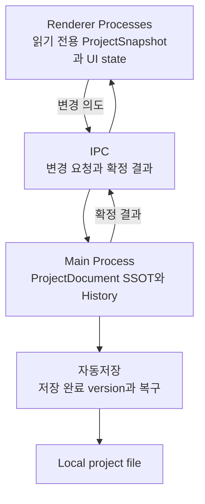

# 논문 목차 컨벤션

## 1. 목적

이 문서는 프론트엔드 상태 설계 사례를 논문형 목차로 정리하는 규칙을 정의한다.

논문 목차는 작업 일지를 시간순으로 옮기지 않는다. 다음 논리 순서를 사용한다.

> 문제 정의 → 확인 근거 → 환경 제약 → 선택지 비교 → 제안 구조 → 동작 원리 → 검증 기준 → 한계와 결론

## 2. 제목과 핵심 주장

제목은 기술, 환경, 해결하려는 문제를 함께 드러낸다.

```text
Main Process에 SSOT를 둔 Electron 멀티 윈도우 편집기 상태 설계
```

이 사례의 핵심 주장은 다음과 같이 고정한다.

> 여러 Renderer가 공유하고 프로젝트 파일에 저장할 ProjectDocument의 최종 변경 권한을 Main Process에 둔다.

`SSOT`는 복사본이 하나만 존재한다는 뜻으로 사용하지 않는다. Main의 `ProjectDocument`가 최종 상태를 확정하고 Renderer의 `ProjectSnapshot`은 화면 표시용 읽기 전용 복사본이라는 의미로 사용한다.

## 3. 번호 규칙

- 장: `1.`, `2.`, `3.`
- 절: `1.1.`, `1.2.`
- 항: `1.1.1.`, `1.1.2.`
- 번호 깊이는 세 단계까지만 사용한다.

```md
## 3. 상태 소유 위치 비교

### 3.1. Renderer별 Store 유지

### 3.2. 특정 Renderer를 기준으로 사용

### 3.3. Main Process에 ProjectDocument 배치
```

제목은 `검토`, `기타`, `구현`처럼 범위가 넓은 명사만 사용하지 않는다. 독자가 해당 절에서 확인할 내용을 드러낸다.

## 4. 전체 목차의 표준 구조

### 4.1. 서론

서론은 다음 내용을 포함한다.

1. 제작 중인 편집기의 기능과 창 구성
2. 관찰된 상태 불일치
3. 문제 범위
4. 핵심 질문
5. 제안 구조와 글의 범위

관찰된 증상과 구조적 원인을 같은 문장으로 단정하지 않는다.

### 4.2. 문제 환경과 확인 근거

다음 내용을 분리해 제시한다.

- 사용자가 관찰한 증상
- 기존 Renderer Store 구조
- 저장 시 프로젝트 문서를 조립하던 흐름
- 기능별 Undo/Redo History
- Electron 공식 문서로 확인한 프로세스 조건

이 장의 목적은 Main SSOT 결론을 미리 정당화하는 것이 아니라 문제의 범위를 좁히는 것이다.

### 4.3. 상태 소유 위치 비교

후보를 같은 기준으로 비교한다.

- Renderer별 Store 유지
- 특정 Renderer를 기준 Store로 지정
- Main Process의 `ProjectSession`에서 확정

비교 기준은 다음과 같다.

- 여러 창의 수명주기와 독립적인가
- local project file 저장과 같은 문서를 사용하는가
- Undo/Redo의 최종 결과를 한곳에서 확정할 수 있는가
- 모든 변경이 IPC를 지나는 비용을 감당할 수 있는가

### 4.4. Main SSOT와 Renderer 상태 경계

다음 세 상태를 구분한다.

| 상태               | 위치           | 변경 권한     |
| ------------------ | -------------- | ------------- |
| `ProjectDocument`  | Main Process   | Main만 가짐   |
| `ProjectSnapshot`  | Renderer cache | 읽기 전용     |
| UI와 runtime state | 각 Renderer    | 해당 Renderer |

Main에 React가 없다는 사실만으로 Vanilla Zustand가 필요하다고 결론 내리지 않는다. `ProjectSession`의 private field로 현재 요구사항을 충족할 수 있는지 먼저 검토한다. selector 구독이나 middleware 요구가 실제로 생길 때 Store 도입을 다시 비교한다.

### 4.5. Main과 Renderer의 상태 동기화

다음 흐름을 설명한다.

1. Renderer가 전체 snapshot이 아니라 변경 의도를 Main에 보낸다.
2. Main이 변경을 검증하고 version을 증가시킨다.
3. Main이 확정 결과를 열린 Renderer에 발행한다.
4. Renderer가 읽기 전용 cache를 갱신한다.
5. 중간 event가 누락되면 전체 snapshot으로 복구한다.

`useSyncExternalStore`는 저장소가 아니라 외부 저장소와 React render를 연결하는 Hook으로 정의한다. TanStack Query는 Renderer cache로 사용할 수 있지만 version 규칙과 event 누락 복구를 대신하지 않는다고 명시한다.

### 4.6. Undo와 Redo의 통합

Main History는 직렬화 가능한 문서 변경만 기억한다.

- forward patch
- inverse patch
- 하나의 사용자 동작을 나타내는 action group

`AudioBuffer`, Timeline Region, AudioEngine 같은 실행 객체는 Renderer에 남긴다. Renderer는 Main의 확정 결과를 받아 runtime을 갱신한다.

### 4.7. 자동저장과 복구

다음 완료 지점을 구분한다.

- Main memory에 변경 반영
- project file 쓰기 완료
- 저장 장치 동기화 완료

자동저장 장에서는 Renderer의 저장 UI와 Main의 저장 책임을 구분한다. 파일 쓰기는 한 번에 하나씩 실행하고, 쓰는 동안 들어온 변경 중 아직 저장하지 않은 최신 snapshot을 다음 저장 대상으로 유지하는 흐름을 설명한다.

`실시간 저장`이라는 표현만 사용하지 않는다. 어느 완료 지점을 보장하는지 명시한다.

### 4.8. 검증과 트레이드오프

검증 항목은 설계 구성요소가 아니라 실패 시나리오를 기준으로 작성한다.

- 두 Renderer가 같은 SRT row를 수정하는 경우
- 요청 응답과 event가 중복되는 경우
- 중간 version event가 누락되는 경우
- 저장 중 새 변경이 들어오는 경우
- Renderer 또는 Main이 비정상 종료되는 경우
- 오래 걸린 비동기 결과가 늦게 도착하는 경우

측정값이 없다면 성능 개선을 결과로 쓰지 않는다. 다음 항목을 검증 계획으로 남긴다.

- 입력부터 화면 반영까지의 시간
- Main event loop 지연
- patch와 snapshot의 payload 크기
- 자동저장 시간
- cache 갱신 후 리렌더 범위

### 4.9. 결론

결론은 다음 네 내용을 포함한다.

1. 처음 문제의 핵심
2. Main SSOT가 줄이려는 위험
3. 새로 생기는 IPC와 version 관리 비용
4. 설계를 다시 검토할 조건

`최적의 설계`라고 단정하지 않는다. 적용 조건과 아직 확인하지 못한 측정값을 함께 쓴다.

## 5. 이 사례의 표준 목차

```md
# Main Process에 SSOT를 둔 Electron 멀티 윈도우 편집기 상태 설계

## 1. 서론

### 1.1. 제작 중인 편집기의 특성

### 1.2. 관찰된 상태 불일치

### 1.3. 문제 범위와 핵심 질문

### 1.4. 제안 구조와 글의 범위

## 2. 문제 환경과 확인 근거

### 2.1. 여러 Renderer가 공유하는 프로젝트 상태

### 2.2. Renderer별 Store와 저장 흐름

### 2.3. 기능별 Undo/Redo History

### 2.4. Electron의 Main Process와 Renderer Process

### 2.5. 증상, 직접 원인, 구조적 조건의 구분

## 3. ProjectDocument의 상태 소유 위치 비교

### 3.1. Renderer별 Store 유지

### 3.2. 특정 Renderer를 기준으로 사용

### 3.3. Main Process에서 최종 상태 확정

### 3.4. Main SSOT 선택 근거와 비용

## 4. Main SSOT와 Renderer 상태 경계

### 4.1. Main의 ProjectDocument

### 4.2. Renderer의 읽기 전용 ProjectSnapshot

### 4.3. Renderer의 UI와 runtime state

### 4.4. ProjectSession private field와 Vanilla Zustand 비교

## 5. Main과 Renderer의 상태 동기화

### 5.1. 변경 요청과 확정 결과

### 5.2. TanStack Query Cache의 역할

### 5.3. useSyncExternalStore의 역할

### 5.4. version 중복과 event 누락 복구

### 5.5. 일반 IPC와 MessagePort의 적용 범위

## 6. Undo와 Redo의 통합

### 6.1. 기능별 History의 한계

### 6.2. 문서 상태와 실행 상태 분리

### 6.3. forward patch와 inverse patch

### 6.4. Renderer runtime 갱신

### 6.5. History와 asset 수명주기

## 7. 자동저장과 복구

### 7.1. Renderer의 저장 UI와 Main의 저장 책임

### 7.2. memory 반영과 disk write 완료

### 7.3. 파일 쓰기의 queued sequential execution

### 7.4. 최신 snapshot 저장

### 7.5. 정상 종료와 비정상 종료 복구

## 8. 검증과 트레이드오프

### 8.1. 여러 Renderer의 version 일치

### 8.2. Undo와 Redo 결과 일치

### 8.3. 자동저장과 recovery 검증

### 8.4. 응답 시간과 payload 측정

### 8.5. 선택의 비용과 재검토 조건

## 9. 결론

### 9.1. 핵심 판단

### 9.2. 적용 조건

### 9.3. 아직 결정하지 못한 부분
```

## 6. 포함할 내용과 제외할 내용

### 6.1. 포함할 내용

- 문제를 재현할 수 있는 환경과 증상
- 공식 문서로 확인한 Electron과 React 동작
- 선택지 비교 기준
- 상태 위치와 변경 권한
- version, History, 자동저장 규칙
- 실패 시나리오와 검증 항목
- 선택의 한계와 미정 조건

### 6.2. 제외할 내용

- PR 분리 계획
- 브랜치와 커밋 순서
- 파일별 마이그레이션 목록
- 클래스 method 전체 설명
- 검증되지 않은 성능 효과
- 논지와 관계없는 UI 구현 세부 사항

구현 순서가 논문의 평가 대상이라면 별도의 부록이나 구현 절로 분리한다. 핵심 목차에는 설계 판단에 필요한 내용만 남긴다.

## 7. 용어와 문장 규칙

- 프론트엔드와 Electron에서 사용하는 정확한 용어를 우선한다.
- 같은 개념은 글 전체에서 같은 이름으로 쓴다.
- 약어는 처음 나올 때 전체 이름과 이 글에서의 정의를 함께 쓴다.
- `state`, `Store`, `cache`, `snapshot`, `History`를 서로 바꾸어 쓰지 않는다.
- `원인`은 인과관계가 확인된 경우에만 사용한다.
- 측정 전에는 `개선했다`보다 `위험을 줄이도록 설계했다`라고 쓴다.

## 8. 다이어그램 규칙

논문의 전체 구조도는 다음 관계만 보여 준다.



- 역할과 데이터 흐름을 우선한다.
- 한 그림에 클래스와 method를 모두 넣지 않는다.
- 색상에만 의미를 의존하지 않는다.
- 본문에서 설명하지 않는 노드를 추가하지 않는다.

## 9. 확인 목록

- [ ] 제목에 환경, 기술, 해결 문제가 드러나는가
- [ ] 핵심 주장이 한 문장으로 고정되어 있는가
- [ ] 관찰 사실과 설계 판단을 분리했는가
- [ ] 후보 구조를 같은 기준으로 비교했는가
- [ ] Main state, Renderer cache, UI state의 변경 권한이 구분되는가
- [ ] Undo/Redo와 자동저장이 같은 ProjectDocument를 기준으로 설명되는가
- [ ] `실시간 저장`의 완료 지점을 구분했는가
- [ ] 성능 결과와 검증 계획을 구분했는가
- [ ] PR과 파일 단위 구현 절차가 핵심 목차에서 제외되었는가
- [ ] 결론에 적용 조건과 재검토 조건이 포함되어 있는가
